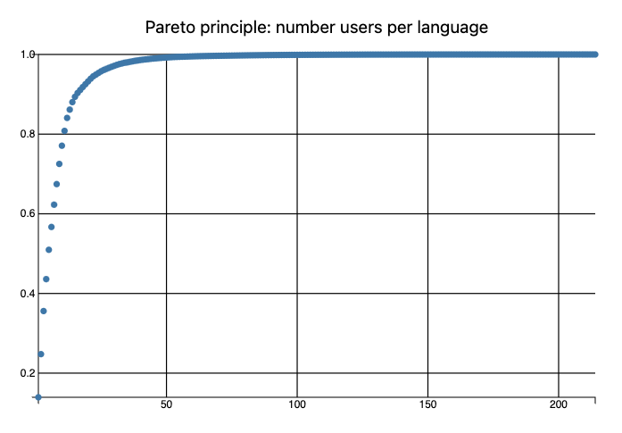

# Статистики върху възрастта на създателите на езици за програмиране

Антон Антонов   
[RakuForPrediction в WordPress](https://rakuforprediction.wordpress.com)   
[MathematicaForPrediction в WordPress](https://mathematicaforprediction.wordpress.com)   
Май 2024


## Въведение

В тази статия (и съответният [*тефтер*](https://github.com/antononcube/RakuForPrediction-blog/blob/main/Notebooks/Jupyter/Age-of-creation-for-programming-languages-stats.ipynb)) 
ние зареждаме таблица от данни характеризиращи създаването 
на различни езици за програмиране от страницата
["](https://pldb.io/index.html)**[P](https://pldb.io/index.html)**[rogramming ](https://pldb.io/index.html)**[L](https://pldb.io/index.html)**[anguage ](https://pldb.io/index.html)**[D](https://pldb.io/index.html)**[ata](https://pldb.io/index.html)**[B](https://pldb.io/index.html)**[ase"](https://pldb.io/index.html) 
и визуализираме няколко статистики върху тях.

Ние не разглеждаме тук източника на данните и не желаем особено да разсъждаваме твърде много върху данните. 
(Използвайки тези статистики и въобще.) 

Ние започнахме изчисленията по-долу, просто защто искахме да направим балонни графики (както 2D, така и 3D). 
Въпреки това, изкушени сме да кажем и обосновем твърдения като:

- Парето принципа е валиден, както обикновено.

- Създателите на езици са склонни да го правят повече от веднъж.

- Внимавайте за проявата на ["ефекта на втората система"](https://en.wikipedia.org/wiki/Second-system_effect).


### Справки

Ето референтни връзки с обяснения и връзки към файлове с данни:

- [Възрастта на създателите на езици за програмиране (pldb.io)](https://pldb.io/posts/ageAtCreation.html)

    - Кратка бележка за данните и свързаната статистика; предоставя връзка към [TSV файл](https://pldb.io/posts/age.tsv) с данните.

- [Възрастта на създателите на езици за програмиране (datawrapper.dwcdn.net)](https://datawrapper.dwcdn.net/rT0yG/1/)

    - "Просто графика"; предоставя връзка към CSV файл с данните.

- [Възрастта на създателите на езици за програмиране](https://www.reddit.com/r/programming/comments/1cw2ri4/the_ages_of_programming_language_creators/) (Reddit)

    - Връзки и дискусия.

- [Тефтер на Mathematica](https://community.wolfram.com/groups/-/m/t/3180327) със статистиките показани по-долу (на английски).

    - Въпреки, че започнахме изчисленията и графиките на Раку, ние решихме първо да направим пълна статия на Mathematica (или Wolfram Language).

------

## Подготовка


```raku
use Data::Importers;
use Data::Reshapers;
use Data::Summarizers;
use Data::TypeSystem;

use JavaScript::D3;
```

-----

## Зареждане на данни

Тук получаваме TSV файла:


```raku
my $url = "https://pldb.io/posts/age.tsv";
my @dsDataLines = data-import($url).lines.map({ $_.split("\t") })>>.Array;
deduce-type(@dsDataLines)
```
```
# Vector(Vector(Atom((Str)), 13), 216)
```

Правим таблицата от данни:

```raku
my @field-names = @dsDataLines.head.Array;
my @dsData = @dsDataLines.tail(*-2).map({ @field-names.Array Z=> $_.Array })>>.Hash;

deduce-type(@dsData)
```
```
# Vector(Assoc(Atom((Str)), Atom((Str)), 13), 214)
```

Превръщаме в цели числа стойностите на подходящи колони: 

```raku
@dsData = @dsData.map({
    $_<ageAtCreation> = $_<ageAtCreation>.UInt;
    $_<rank> = $_<rank>.Int;
    $_<pldbScore> = $_<pldbScore>.Int;
    $_<appeared> = $_<appeared>.Int;
    $_<numberOfUsersEstimate> = $_<numberOfUsersEstimate>.Int;
    $_<numberOfJobsEstimate> = $_<numberOfJobsEstimate>.Int;
    $_<foundationScore> = $_<foundationScore>.Int;
    $_<measurements> = $_<measurements>.Int;
    $_<inboundLinksCount> = $_<inboundLinksCount>.Int;
    $_
}).Array;

deduce-type(@dsData)
```
```
# Vector(Struct([ageAtCreation, appeared, creators, foundationScore, id, inboundLinksCount, measurements, name, numberOfJobsEstimate, numberOfUsersEstimate, pldbScore, rank, tags], [Int, Int, Str, Int, Str, Int, Int, Str, Int, Int, Int, Int, Str]), 214)
```

Показване на рекапитулация на таблицата:


```raku
sink records-summary(@dsData, max-tallies => 7, field-names => @field-names.sort[^7]);
sink records-summary(@dsData, max-tallies => 7, field-names => @field-names.sort[7..12]);
```
```
# +---------------------+-----------------------+------------------------+---------------------+--------------------+---------------------+---------------------+
# | ageAtCreation       | appeared              | creators               | foundationScore     | id                 | inboundLinksCount   | measurements        |
# +---------------------+-----------------------+------------------------+---------------------+--------------------+---------------------+---------------------+
# | Min    => 16        | Min    => 1948        | Niklaus Wirth   => 8   | Min    => 0         | b           => 1   | Min    => 0         | Min    => 6         |
# | 1st-Qu => 30        | 1st-Qu => 1978        | Breck Yunits    => 7   | 1st-Qu => 0         | speedcoding => 1   | 1st-Qu => 0         | 1st-Qu => 15        |
# | Mean   => 36.766355 | Mean   => 1993.009346 | John Backus     => 5   | Mean   => 30.303738 | bash        => 1   | Mean   => 31.794393 | Mean   => 31.570093 |
# | Median => 35        | Median => 1994.5      | Tim Berners-Lee => 4   | Median => 0         | flow-matic  => 1   | Median => 1         | Median => 24        |
# | 3rd-Qu => 42        | 3rd-Qu => 2008        | Chris Lattner   => 4   | 3rd-Qu => 8         | eiffel      => 1   | 3rd-Qu => 9         | 3rd-Qu => 41        |
# | Max    => 70        | Max    => 2023        | Larry Wall      => 4   | Max    => 970       | awk         => 1   | Max    => 980       | Max    => 116       |
# |                     |                       | Wes McKinney    => 3   |                     | colorforth  => 1   |                     |                     |
# |                     |                       | (Other)         => 179 |                     | (Other)     => 207 |                     |                     |
# +---------------------+-----------------------+------------------------+---------------------+--------------------+---------------------+---------------------+
# +---------------------+-----------------------+-------------------------+------------------------+---------------------+---------------------------+
# | name                | numberOfJobsEstimate  | numberOfUsersEstimate   | pldbScore              | rank                | tags                      |
# +---------------------+-----------------------+-------------------------+------------------------+---------------------+---------------------------+
# | Pascal       => 1   | Min    => 0           | Min    => 0             | Min    => 15930        | Min    => 2         | pl                 => 135 |
# | Magic Paper  => 1   | 1st-Qu => 0           | 1st-Qu => 176           | 1st-Qu => 20916        | 1st-Qu => 80        | dataNotation       => 9   |
# | CoffeeScript => 1   | Mean   => 7963.630841 | Mean   => 240720.794393 | Mean   => 22145.481308 | Mean   => 844.85514 | textMarkup         => 9   |
# | JQuery       => 1   | Median => 0           | Median => 1668          | Median => 22747.5      | Median => 350.5     | library            => 7   |
# | XML          => 1   | 3rd-Qu => 40          | 3rd-Qu => 13801         | 3rd-Qu => 23683        | 3rd-Qu => 1310      | grammarLanguage    => 6   |
# | Grammar      => 1   | Max    => 771996      | Max    => 7179119       | Max    => 24408        | Max    => 4820      | stylesheetLanguage => 4   |
# | Deno         => 1   |                       |                         |                        |                     | queryLanguage      => 4   |
# | (Other)      => 207 |                       |                         |                        |                     | (Other)            => 40  |
# +---------------------+-----------------------+-------------------------+------------------------+---------------------+---------------------------+
```

Списък от езици на фокус, който ще се използва в графиките по-долу:


```raku
my @focusLangs = ["C++", "Fortran", "Java", "Mathematica", "Perl 6", "Raku", "SQL", "Wolfram Language"];
```
```
# [C++ Fortran Java Mathematica Perl 6 Raku SQL Wolfram Language]
```

Тук намираме най-важните етикети ("tags") (използвани в графиките по-долу):


```raku
my @topTags = @dsData.map(*<tags>).&tally.sort({ $_.value }).reverse.head(7)>>.key;
```
```
# [pl textMarkup dataNotation library grammarLanguage stylesheetLanguage queryLanguage]
```

Тук добавяме колоната "група" въз основа на езици на фокус и най-важните етикети:


```raku
@dsData = @dsData.map({ 
    $_<group> = do if $_<name> ∈ @focusLangs { "focus" } elsif $_<tags> ∈ @topTags { $_<tags> } else { "other" };
    $_
});

deduce-type(@dsData)
```
```
# Vector(Struct([ageAtCreation, appeared, creators, foundationScore, group, id, inboundLinksCount, measurements, name, numberOfJobsEstimate, numberOfUsersEstimate, pldbScore, rank, tags], [Int, Int, Str, Int, Str, Str, Int, Int, Str, Int, Int, Int, Int, Str]), 214)
```

------

## Разпределения

Ето разпределенията на променливите/колоните:

- възраст при създаване ("ageAtCreation")

    - т.е. "На колко години е бил създателят?"

- година на поява ("appeared")

    - т.е. "През коя година езикът за програмиране е обявен?"


```raku, results=asis, eval=FALSE
#% js
my %opts = title-color => 'Silver', background => 'none', bins => 40, format => 'html', div-id => 'hist';
js-d3-histogram(@dsData.map(*<ageAtCreation>), title => 'Възраст при създаване', |%opts) 
~
js-d3-histogram(@dsData.map(*<appeared>), title => 'Появил се', |%opts)
```


Ето съответните Box-Whisker графики:


```raku, results=asis, eval=FALSE
#% js
my %opts = :horizontal, :outliers, title-color => 'Silver', stroke-color => 'White', background => 'none', width => 400, format => 'html', div-id => 'box';
js-d3-box-whisker-chart(@dsData.map(*<ageAtCreation>), title => 'Възраст при създаване', |%opts)
~
js-d3-box-whisker-chart(@dsData.map(*<appeared>), title => 'Появил се', |%opts)
```


Ето таблици на съответната статистика:


```raku
my @field-names = <ageAtCreation appeared>;
sink records-summary(select-columns(@dsData, @field-names), :@field-names)
```
```
# +---------------------+-----------------------+
# | ageAtCreation       | appeared              |
# +---------------------+-----------------------+
# | Min    => 16        | Min    => 1948        |
# | 1st-Qu => 30        | 1st-Qu => 1978        |
# | Mean   => 36.766355 | Mean   => 1993.009346 |
# | Median => 35        | Median => 1994.5      |
# | 3rd-Qu => 42        | 3rd-Qu => 2008        |
# | Max    => 70        | Max    => 2023        |
# +---------------------+-----------------------+
```

-----

## Проява на принципа на Парето

### Брой творения

Ето статистиката на принципа на Парето за броя на създадените (или само преименувани) езици за програмиране за всеки създател:


```raku
my %creations = @dsData.map(*<creators>).&tally;
my @paretoStats = pareto-principle-statistic(%creations);
@paretoStats.head(6)
```
```
# (Niklaus Wirth => 0.037383 Breck Yunits => 0.070093 John Backus => 0.093458 Chris Lattner => 0.11215 Larry Wall => 0.130841 Tim Berners-Lee => 0.149533)
```

Ето съответната графика:

```raku, results=asis, eval=FALSE
#% js
js-d3-list-plot( @paretoStats>>.value, 
    title => 'Принцип на Парето: брой езици на екип от създатели', 
    title-color => 'Silver',
    background => 'none', 
    :grid-lines,
    format => 'html',
    div-id => 'langPareto'
)
```


**Забележка:** Можем да видим, че ≈30% от създателите съответстват на ≈50% от езиците.


### Популярност

Очевидно е, че програмистите могат да използват повече от един език за програмиране. Въпреки това е интересно да се види графиката на 
Парето принципа за "умствения дял" на езиците въз основа на *оценките* на броя на потребителите.


```raku, results=asis, eval=FALSE
#% js
my %users = @dsData.map({ $_<name> => $_<numberOfUsersEstimate>.Int });
my @paretoStats = pareto-principle-statistic(%users);
say @paretoStats.head(8);

js-d3-list-plot( @paretoStats>>.value, 
    title => 'Принцип на Парето: брой потребители на език', 
    title-color => 'Silver',
    background => 'none', 
    :grid-lines,
    format => 'html',
    div-id => 'popPareto'
)
```



**Забележка:** Отново, графиката по-горе е "грешна" -- програмистите използват повече от един език за програмиране.


-----------

## Корелации

За да видим смислени корелации, (графики на двойки от колони), вземаме логаритми от колоните с големи стойности:


```raku
my @corColnames = <appeared ageAtCreation numberOfUsersEstimate numberOfJobsEstimate rank measurements>;
my @dsDataVar = select-columns(@dsData, @corColnames);
@dsDataVar = @dsDataVar.map({ 
    my %h = $_.clone; 
    %h<numberOfUsersEstimate> = log(%h<numberOfUsersEstimate> + 1, 10); 
    %h<numberOfJobsEstimate> = log(%h<numberOfJobsEstimate> + 1, 10);
    %h
}).Array;

deduce-type(@dsDataVar)

```
```
# Vector(Struct([ageAtCreation, appeared, measurements, numberOfJobsEstimate, numberOfUsersEstimate, rank], [Int, Int, Int, Num, Num, Int]), 214)
```

Тук правим декартово произведение на фокус-колоните и правим точкова графика за всяка двойка от това произведение:


```raku, results=asis, eval=FALSE
#% js
(@corColnames X @corColnames)>>.reverse>>.Array.map( -> $c {
    my @points = @dsDataVar.map({ %( x => $_{$c.head}, y => $_{$c.tail} ) });
    js-d3-list-plot( @points, width => 180, height => 180, x-label => $c.head, y-label => $c.tail, format => 'html', div-id => 'cor')
}).join("\n")
```

**Забележка:** Като се имат предвид имената на колоните и съответните очевидни интерпретации, можем да кажем, че по-силните корелации имат смисъл.

--------

## Балонна графика 2D

В този раздел правим информативна 2D балонна графика ("bubble chart") с динамични подсказки.

Тук правим масив от асоциации (речници) за балонната графика:


```raku
my @dsData2 = @dsData.map({
    %( x => $_<appeared>, y => $_<ageAtCreation>, z => log($_<numberOfUsersEstimate>, 10), group => $_<group>, label => "<b>{$_<name>}</b> от {$_<creators>}")
});

deduce-type(@dsData2)
```
```
# Vector(Struct([group, label, x, y, z], [Str, Str, Int, Int, Num]), 214)
```

Ето балонната графика:


```raku, results=asis, eval=FALSE
#% js
js-d3-bubble-chart(@dsData2, 
        z-range-min => 1,
        z-range-max => 16,
        title-color => 'Silver',
        title-font-size => 20,
        x-label => "появил се", 
        y-label => "lg(ранг)",
        title => 'Възраст при създаване',
        width => 1200,
        margins => { left => 60, bottom => 50, right => 200},
        background => 'none',
        :grid-lines,
        format => 'html',
        div-id => 'bubbleLang'
);
```


**Забележка:** Езикът за програмиране J е ясен аутсайдер поради възрастта на създателите му.

-------

## Следи от ефекта на втората система

В тази секция се опитваме -- и не успяваме -- да покажем, че колкото повече езици за програмиране прави един екип от създатели, толкова по-малко успешни са тези езици. 
(Може би, защото са по-тромави и страдат от [ефекта на втората система](https://en.wikipedia.org/wiki/Second-system_effect).)

**Забележка:** Този раздел е направен предимно "за забавление". Не е вярно, че всеко множество от езици на екип от създатели е съставен от сравними езици. 
Например, допълващи се езици могат да бъдат в едно и също множество. (Вижте HTTP, HTML, URL.) 
Някои множества са направени от един и същ език, но с различни имена. (Вижте Perl 6 и Raku, и Mathematica и Wolfram Language.) 
Също така, по-старите езици имат [предимството на първия ход](https://en.wikipedia.org/wiki/First-mover_advantage).

Създаване на асоциация на създатели към индекс:


```raku
my %creators = @dsData.map(*<creators>).&tally.pairs.grep(*.value > 1);
my %nameToIndex = %creators.keys.sort Z=> ^%creators.elems;
%nameToIndex.elems
```
```
# 40
```

Създаване на набор от данни за балонна графика с относителна популярност на екип от създатели:


```raku
my @nUsers = @dsData.grep({ %creators{$_<creators>}:exists });

@nUsers = |group-by(@nUsers, <creators>).map({ 

    my $m = max(1, $_.value.map(*<numberOfUsersEstimate>).max.sqrt);

    $_.value.map({ %( x => $_<appeared>, y => %nameToIndex{$_<creators>}, z => $_<numberOfUsersEstimate>.sqrt/$m, group => $_<creators>, label => "<b>{$_<name>}</b>" ) }) 
    
})>>.Array.flat;

@nUsers .= sort(*<group>);

deduce-type(@nUsers)
```
```
# Vector(Struct([group, label, x, y, z], [Str, Str, Int, Int, Num]), 110)
```

Ето съответната балонна графика:


```raku, results=asis, eval=FALSE
#% js
js-d3-bubble-chart(@nUsers, 
        z-range-min => 1,
        z-range-max => 16,
        title => 'Ефект на втората система',
        title-color => 'Silver',
        title-font-size => 20,
        x-label => "появил се",
        y-label => "създатели", 
        z-range-min => 3,
        z-range-max => 10,
        width => 1000,
        height => 900,
        margins => { left => 60, bottom => 50, right => 200},
        background => 'none',
        grid-lines => (Whatever, %nameToIndex.elems),
        opacity => 0.9,
        format => 'html',
        div-id => 'secondBubble'
);
```


От графиката по-горе *не можем* категорично да кажем, че:

> Най-новото творение на екип от създатели на езици за програмиране не е най-популярното творение на екипа.

Това твърдение обаче е валидно за доста случаи.


-------

## Справки

### Статии, тефтери

[AA1] Антон Антонов, ["Age at creation for programming languages stats"](https://mathematicaforprediction.wordpress.com/2024/05/22/age-at-creation-for-programming-languages-stats/), (2024), [MathematicaForPrediction в WordPress](https://mathematicaforprediction.wordpress.com).   
(Бг.: "Статистики върху възръста на създателите на програмни езици".)

[AAn1] Антон Антонов, ["Computational exploration for the ages of programming language creators dataset"](https://community.wolfram.com/groups/-/m/t/3180327), (2024), [Wolfram Community](https://community.wolfram.com).    
(Бг.: "Изчислително проучване за възрастта на създателите на езици за програмиране".)

### Пакети

[AAp1] Антон Антонов, [Data::Importers Raku пакет](https://github.com/antononcube/Raku-Data-Importers), (2024), [GitHub/antononcube](https://github.com/antononcube).

[AAp2] Антон Антонов, [Data::Reshapers Raku пакет](https://github.com/antononcube/Raku-Data-Reshapers), (2021-2024), [GitHub/antononcube](https://github.com/antononcube).

[AAp3] Антон Антонов, [Data::Summarizers Raku пакет](https://github.com/antononcube/Raku-Data-Summarizers), (2021-2023), [GitHub/antononcube](https://github.com/antononcube).

[AAp4] Антон Антонов, [JavaScript::D3 Raku пакет](https://github.com/antononcube/Raku-JavaScript-D3), (2022-2024), [GitHub/antononcube](https://github.com/antononcube).

[AAp5] Антон Антонов, [Jupyter::Chatbook Raku пакет](https://github.com/antononcube/Raku-Jupyter-Chatbook), (2023-2024), [GitHub/antononcube](https://github.com/antononcube).

### Видеоклипове

[AAv1] Антон Антонов, "Small dataset data analysis walkthrough (Raku)", (2024), [YouTube/@AAA4Prediction](https://www.youtube.com/@AAA4prediction).
