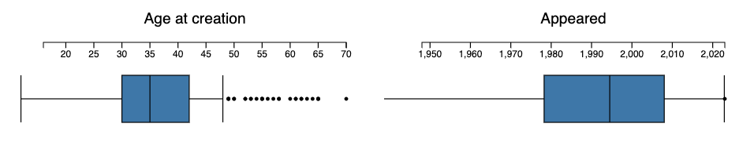

# Age at creation for programming languages stats

Anton Antonov   
[RakuForPrediction at WordPress](https://rakuforprediction.wordpress.com)   
[MathematicaForPrediction at WordPress](https://mathematicaforprediction.wordpress.com)   
May 2024


## Introduction

In this notebook we ingest programming languages creation data from ["](https://pldb.io/index.html)**[P](https://pldb.io/index.html)**[rogramming ](https://pldb.io/index.html)**[L](https://pldb.io/index.html)**[anguage ](https://pldb.io/index.html)**[D](https://pldb.io/index.html)**[ata](https://pldb.io/index.html)**[B](https://pldb.io/index.html)**[ase"](https://pldb.io/index.html) and visualize several statistics of it.

We do not examine the data source and we do not want to reason too much about the data using the stats. We started this notebook by just wanting to make the bubble charts (both 2D and 3D.) Nevertheless, we are tempted to say and justify statements like:

- Pareto holds, as usual.

- Language creators tend to do it more than once.

- Beware the [Second system effect](https://en.wikipedia.org/wiki/Second-system_effect).

### References

Here are reference links with explanations and links to dataset files:

- [The Ages of Programming Language Creators (pldb.io)](https://pldb.io/posts/ageAtCreation.html)

    - Short note about data and related statistics; provides a link to a [TSV file](https://pldb.io/posts/age.tsv) with the data.

- [The Ages of Programming Language Creators (datawrapper.dwcdn.net)](https://datawrapper.dwcdn.net/rT0yG/1/)

    - "Just a plot"; provides a link to a CSV file with the data.

- [The Ages of Programming Language Creators](https://www.reddit.com/r/programming/comments/1cw2ri4/the_ages_of_programming_language_creators/) (Reddit)

    - Link(s) and discussion.

------

## Setup


```raku
use Data::Importers;
use Data::Reshapers;
use Data::Summarizers;
use Data::TypeSystem;

use JavaScript::D3;
```

-----

## Data ingestion

Here we get the TSV file:

```raku
my $url = "https://pldb.io/posts/age.tsv";
my @dsDataLines = data-import($url).lines.map({ $_.split("\t") })>>.Array;
deduce-type(@dsDataLines)
```
```
# Vector(Vector(Atom((Str)), 13), 216)
```

Make the dataset:

```raku
my @field-names = @dsDataLines.head.Array;
my @dsData = @dsDataLines.tail(*-2).map({ @field-names.Array Z=> $_.Array })>>.Hash;

deduce-type(@dsData)
```
```
# Vector(Assoc(Atom((Str)), Atom((Str)), 13), 214)
```

Convert suitable column values to integers:

```raku
@dsData = @dsData.map({
    $_<ageAtCreation> = $_<ageAtCreation>.UInt;
    $_<rank> = $_<rank>.Int;
    $_<pldbScore> = $_<pldbScore>.Int;
    $_<appeared> = $_<appeared>.Int;
    $_<numberOfUsersEstimate> = $_<numberOfUsersEstimate>.Int;
    $_<numberOfJobsEstimate> = $_<numberOfJobsEstimate>.Int;
    $_<foundationScore> = $_<foundationScore>.Int;
    $_<measurements> = $_<measurements>.Int;
    $_<inboundLinksCount> = $_<inboundLinksCount>.Int;
    $_
}).Array;

deduce-type(@dsData)
```
```
# Vector(Struct([ageAtCreation, appeared, creators, foundationScore, id, inboundLinksCount, measurements, name, numberOfJobsEstimate, numberOfUsersEstimate, pldbScore, rank, tags], [Int, Int, Str, Int, Str, Int, Int, Str, Int, Int, Int, Int, Str]), 214)
```

Show summary:


```raku
sink records-summary(@dsData, max-tallies => 7, field-names => @field-names.sort[^7]);
sink records-summary(@dsData, max-tallies => 7, field-names => @field-names.sort[7..12]);
```
```
# +---------------------+-----------------------+-------------------------+---------------------+-----------------------+---------------------+---------------------+
# | ageAtCreation       | appeared              | creators                | foundationScore     | id                    | inboundLinksCount   | measurements        |
# +---------------------+-----------------------+-------------------------+---------------------+-----------------------+---------------------+---------------------+
# | Min    => 16        | Min    => 1948        | Niklaus Wirth    => 8   | Min    => 0         | python-for-s60 => 1   | Min    => 0         | Min    => 6         |
# | 1st-Qu => 30        | 1st-Qu => 1978        | Breck Yunits     => 7   | 1st-Qu => 0         | deno           => 1   | 1st-Qu => 0         | 1st-Qu => 15        |
# | Mean   => 36.766355 | Mean   => 1993.009346 | John Backus      => 5   | Mean   => 30.303738 | ampl           => 1   | Mean   => 31.794393 | Mean   => 31.570093 |
# | Median => 35        | Median => 1994.5      | Larry Wall       => 4   | Median => 0         | spidermonkey   => 1   | Median => 1         | Median => 24        |
# | 3rd-Qu => 42        | 3rd-Qu => 2008        | Tim Berners-Lee  => 4   | 3rd-Qu => 8         | c              => 1   | 3rd-Qu => 9         | 3rd-Qu => 41        |
# | Max    => 70        | Max    => 2023        | Chris Lattner    => 4   | Max    => 970       | utf-8          => 1   | Max    => 980       | Max    => 116       |
# |                     |                       | Anders Hejlsberg => 3   |                     | zuo            => 1   |                     |                     |
# |                     |                       | (Other)          => 179 |                     | (Other)        => 207 |                     |                     |
# +---------------------+-----------------------+-------------------------+---------------------+-----------------------+---------------------+---------------------+
# +---------------------+-----------------------+-------------------------+------------------------+---------------------+---------------------------+
# | name                | numberOfJobsEstimate  | numberOfUsersEstimate   | pldbScore              | rank                | tags                      |
# +---------------------+-----------------------+-------------------------+------------------------+---------------------+---------------------------+
# | lunar        => 1   | Min    => 0           | Min    => 0             | Min    => 15930        | Min    => 2         | pl                 => 135 |
# | Slideshow    => 1   | 1st-Qu => 0           | 1st-Qu => 176           | 1st-Qu => 20916        | 1st-Qu => 80        | textMarkup         => 9   |
# | FLOW-MATIC   => 1   | Mean   => 7963.630841 | Mean   => 240720.794393 | Mean   => 22145.481308 | Mean   => 844.85514 | dataNotation       => 9   |
# | Luna         => 1   | Median => 0           | Median => 1668          | Median => 22747.5      | Median => 350.5     | library            => 7   |
# | RFC          => 1   | 3rd-Qu => 40          | 3rd-Qu => 13801         | 3rd-Qu => 23683        | 3rd-Qu => 1310      | grammarLanguage    => 6   |
# | Go           => 1   | Max    => 771996      | Max    => 7179119       | Max    => 24408        | Max    => 4820      | stylesheetLanguage => 4   |
# | Apache Arrow => 1   |                       |                         |                        |                     | queryLanguage      => 4   |
# | (Other)      => 207 |                       |                         |                        |                     | (Other)            => 40  |
# +---------------------+-----------------------+-------------------------+------------------------+---------------------+---------------------------+
```

Focus languages to be used in the plots below:


```raku
my @focusLangs = ["C++", "Fortran", "Java", "Mathematica", "Perl 6", "Raku", "SQL", "Wolfram Language"];
```
```
# [C++ Fortran Java Mathematica Perl 6 Raku SQL Wolfram Language]
```

Here we find the most important tags (used in the plots below):


```raku
my @topTags = @dsData.map(*<tags>).&tally.sort({ $_.value }).reverse.head(7)>>.key;
```
```
# [pl dataNotation textMarkup library grammarLanguage queryLanguage stylesheetLanguage]
```

Here we add the column "group" based on the focus languages and most important tags:


```raku
@dsData = @dsData.map({ 
    $_<group> = do if $_<name> ∈ @focusLangs { "focus" } elsif $_<tags> ∈ @topTags { $_<tags> } else { "other" };
    $_
});

deduce-type(@dsData)
```
```
# Vector(Struct([ageAtCreation, appeared, creators, foundationScore, group, id, inboundLinksCount, measurements, name, numberOfJobsEstimate, numberOfUsersEstimate, pldbScore, rank, tags], [Int, Int, Str, Int, Str, Str, Int, Int, Str, Int, Int, Int, Int, Str]), 214)
```

------

## Distributions

Here are the distributions of the variables/columns:

- age at creation 

    - i.e. "How old was the creator?"

- appeared"

    - i.e. "In what year the programming language was proclaimed?"


```raku, results=asis, eval=FALSE
#% js
my %opts = title-color => 'Silver', background => 'none', bins => 40, format => 'html', div-id => 'hist';
js-d3-histogram(@dsData.map(*<ageAtCreation>), title => 'Age at creation', |%opts) 
~
js-d3-histogram(@dsData.map(*<appeared>), title => 'Appeared', |%opts)
```


Here are corresponding Box-Whisker plots:


```raku, results=asis, eval=FALSE
#% js
my %opts = :horizontal, :outliers, title-color => 'Silver', stroke-color => 'White', background => 'none', width => 400, format => 'html', div-id => 'box';
js-d3-box-whisker-chart(@dsData.map(*<ageAtCreation>), title => 'Age at creation', |%opts)
~
js-d3-box-whisker-chart(@dsData.map(*<appeared>), title => 'Appeared', |%opts)
```



Here are tables of the corresponding statistics:


```raku
my @field-names = <ageAtCreation appeared>;
sink records-summary(select-columns(@dsData, @field-names), :@field-names)
```
```
# +---------------------+-----------------------+
# | ageAtCreation       | appeared              |
# +---------------------+-----------------------+
# | Min    => 16        | Min    => 1948        |
# | 1st-Qu => 30        | 1st-Qu => 1978        |
# | Mean   => 36.766355 | Mean   => 1993.009346 |
# | Median => 35        | Median => 1994.5      |
# | 3rd-Qu => 42        | 3rd-Qu => 2008        |
# | Max    => 70        | Max    => 2023        |
# +---------------------+-----------------------+
```


## Pareto principle manifestation

### Number of creations

Here is the Pareto principle statistic for the number of created (or renamed) programming languages per creator:


```raku
my %creations = @dsData.map(*<creators>).&tally;
my @paretoStats = pareto-principle-statistic(%creations);
@paretoStats.head(6)
```
```
# (Niklaus Wirth => 0.037383 Breck Yunits => 0.070093 John Backus => 0.093458 Chris Lattner => 0.11215 Larry Wall => 0.130841 Tim Berners-Lee => 0.149533)
```

Here is the corresponding plot:


```raku, results=asis, eval=FALSE
#% js
js-d3-list-plot( @paretoStats>>.value, 
    title => 'Pareto principle: number languages per creators team', 
    title-color => 'Silver',
    background => 'none', 
    :grid-lines,
    format => 'html',
    div-id => 'langPareto'
)
```


**Remark:** We can see that ≈30% of the creators correspond to ≈50% of the languages.


### Popularity

Obviously, programmers can and do use more than one programming language. Nevertheless, it is interesting to see the Pareto principle plot for the languages "mind share" based on the number of users *estimates*.


```raku, results=asis, eval=FALSE
#% js
my %users = @dsData.map({ $_<name> => $_<numberOfUsersEstimate>.Int });
my @paretoStats = pareto-principle-statistic(%users);
say @paretoStats.head(8);

js-d3-list-plot( @paretoStats>>.value, 
    title => 'Pareto principle: number users per language', 
    title-color => 'Silver',
    background => 'none', 
    :grid-lines,
    format => 'html',
    div-id => 'popPareto'
)
```


**Remark:** Again, the plot above is "wrong" -- programmers use more than one programming language.


-----------

## Correlations

In order to see meaningful correlation, pairwise plots we take logarithms of the large value columns:


```raku
my @corColnames = <appeared ageAtCreation numberOfUsersEstimate numberOfJobsEstimate rank measurements>;
my @dsDataVar = select-columns(@dsData, @corColnames);
@dsDataVar = @dsDataVar.map({ 
    my %h = $_.clone; 
    %h<numberOfUsersEstimate> = log(%h<numberOfUsersEstimate> + 1, 10); 
    %h<numberOfJobsEstimate> = log(%h<numberOfJobsEstimate> + 1, 10);
    %h
}).Array;

deduce-type(@dsDataVar)

```
```
# Vector(Struct([ageAtCreation, appeared, measurements, numberOfJobsEstimate, numberOfUsersEstimate, rank], [Int, Int, Int, Num, Num, Int]), 214)
```

Here make a Cartesian product of the focus columns and make scatter points plot for each pair of that product:


```raku, results=asis, eval=FALSE
#% js
(@corColnames X @corColnames)>>.reverse>>.Array.map( -> $c {
    my @points = @dsDataVar.map({ %( x => $_{$c.head}, y => $_{$c.tail} ) });
    js-d3-list-plot( @points, width => 180, height => 180, x-label => $c.head, y-label => $c.tail, format => 'html', div-id => 'cor')
}).join("\n")
```

**Remark:** Given the names of the data columns and the corresponding obvious interpretations we can say that the stronger correlations make sense.

--------

## Bubble chart 2D

In this section we make an informative 2D bubble chart with (tooltips).

Here we make a dataset for the bubble chart:


```raku
my @dsData2 = @dsData.map({
    %( x => $_<appeared>, y => $_<ageAtCreation>, z => log($_<numberOfUsersEstimate>, 10), group => $_<group>, label => "<b>{$_<name>}</b> by {$_<creators>}")
});

deduce-type(@dsData2)
```
```
# Vector(Struct([group, label, x, y, z], [Str, Str, Int, Int, Num]), 214)
```

Here is the bubble chart:


```raku, results=asis, eval=FALSE
#% js
js-d3-bubble-chart(@dsData2, 
        z-range-min => 1,
        z-range-max => 16,
        title-color => 'Silver',
        title-font-size => 20,
        x-label => "appeared", 
        y-label => "lg(rank)",
        title => 'Age at creation',
        width => 1200,
        margins => { left => 60, bottom => 50, right => 200},
        background => 'none',
        :grid-lines,
        format => 'html',
        div-id => 'bubbleLang'
);
```


**Remark:** The programming language J is a clear outlier because of creators' ages.

-------

## Second system effect traces


In this section we try -- and fail -- to demonstrate that the more programming languages a team of creators makes the less successful those languages are. (Maybe, because they are more cumbersome and suffer the Second system effect?)

**Remark:** This section is mostly made "for fun." It is not true that each sets of languages per creators team is made of comparable languages. For example, complementary languages can be in the same set. (See, HTTP, HTML, URL.) Some sets are just made of the same language but with different names. (See, Perl 6 and Raku, and Mathematica and Wolfram Language.) Also, older languages would have the [First mover advantage](https://en.wikipedia.org/wiki/First-mover_advantage).

Make creators to index association:


```raku
my %creators = @dsData.map(*<creators>).&tally.pairs.grep(*.value > 1);
my %nameToIndex = %creators.keys.sort Z=> ^%creators.elems;
%nameToIndex.elems
```
```
# 40
```

Make a bubble chart dataset with relative popularity per creators team:


```raku
my @nUsers = @dsData.grep({ %creators{$_<creators>}:exists });

@nUsers = |group-by(@nUsers, <creators>).map({ 

    my $m = max(1, $_.value.map(*<numberOfUsersEstimate>).max.sqrt);

    $_.value.map({ %( x => $_<appeared>, y => %nameToIndex{$_<creators>}, z => $_<numberOfUsersEstimate>.sqrt/$m, group => $_<creators>, label => "<b>{$_<name>}</b>" ) }) 
    
})>>.Array.flat;

@nUsers .= sort(*<group>);

deduce-type(@nUsers)
```
```
# Vector(Struct([group, label, x, y, z], [Str, Str, Int, Int, Num]), 110)
```

Here is the corresponding bubble chart:


```raku, results=asis, eval=FALSE
#% js
js-d3-bubble-chart(@nUsers, 
        z-range-min => 1,
        z-range-max => 16,
        title => 'Second system effect',
        title-color => 'Silver',
        title-font-size => 20,
        x-label => "appeared",
        y-label => "creators", 
        z-range-min => 3,
        z-range-max => 10,
        width => 1000,
        height => 900,
        margins => { left => 60, bottom => 50, right => 200},
        background => 'none',
        grid-lines => (Whatever, %nameToIndex.elems),
        opacity => 0.9,
        format => 'html',
        div-id => 'secondBubble'
);
```


From the plot above we *cannot* decisively say that:

> The most recent creation of a team of programming language creators is not team's most popular creation.

That statement, though, does hold for a fair amount of cases.


-------

## References

### Articles, notebooks

[AA1] Anton Antonov, ["Age at creation for programming languages stats"](https://mathematicaforprediction.wordpress.com/2024/05/22/age-at-creation-for-programming-languages-stats/), (2024), [MathematicaForPrediction at WordPress](https://mathematicaforprediction.wordpress.com).

[AAn1] Anton Antonov, ["Computational exploration for the ages of programming language creators dataset"](https://community.wolfram.com/groups/-/m/t/3180327), (2024), [Wolfram Community](https://community.wolfram.com).

### Packages

[AAp1] Anton Antonov, [Data::Importers Raku package](https://github.com/antononcube/Raku-Data-Importers), (2024), [GitHub/antononcube](https://github.com/antononcube).

[AAp2] Anton Antonov, [Data::Reshapers Raku package](https://github.com/antononcube/Raku-Data-Reshapers), (2021-2024), [GitHub/antononcube](https://github.com/antononcube).

[AAp3] Anton Antonov, [Data::Summarizers Raku package](https://github.com/antononcube/Raku-Data-Summarizers), (2021-2023), [GitHub/antononcube](https://github.com/antononcube).

[AAp4] Anton Antonov, [JavaScript::D3 Raku package](https://github.com/antononcube/Raku-JavaScript-D3), (2022-2024), [GitHub/antononcube](https://github.com/antononcube).

[AAp5] Anton Antonov, [Jupyter::Chatbook Raku package](https://github.com/antononcube/Raku-Jupyter-Chatbook), (2023-2024), [GitHub/antononcube](https://github.com/antononcube).

### Videos

[AAv1] Anton Antonov, "Small dataset data analysis walkthrough (Raku)", (2024), [YouTube/@AAA4Prediction](https://www.youtube.com/@AAA4prediction).
