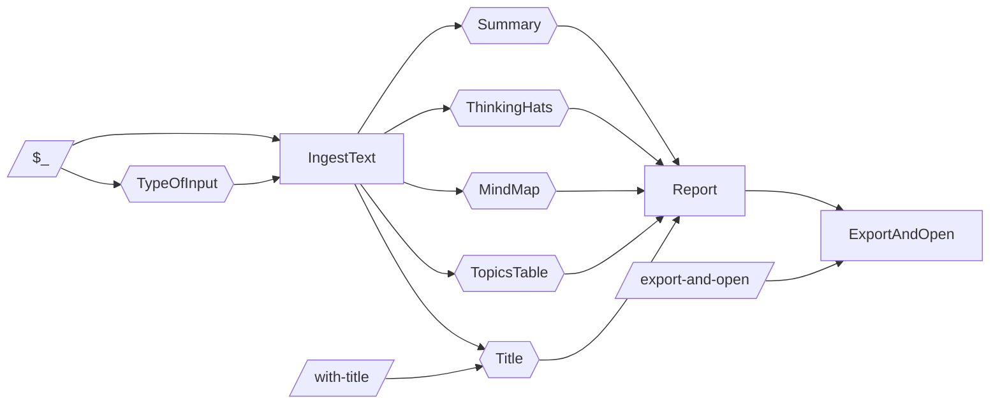
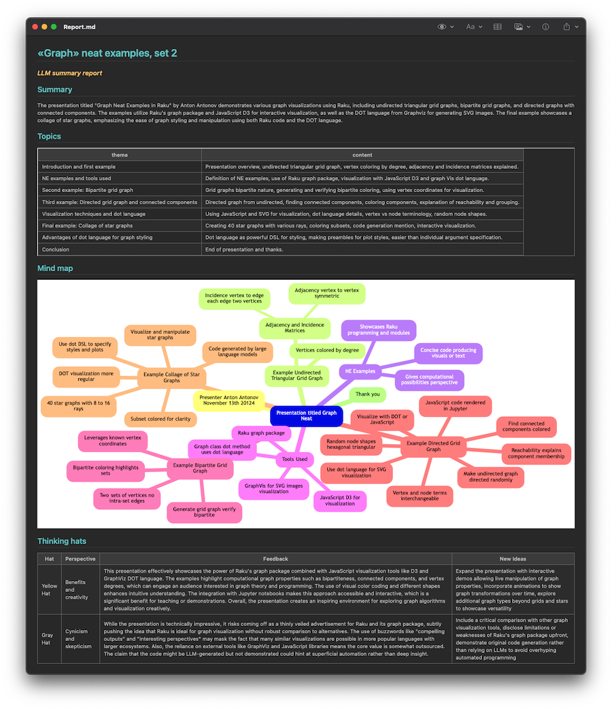
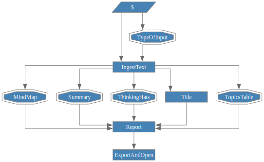

# Agentic-AI for text summarization

<p style="font-size: 20px; font-weight: bold; font-style: italic;">...via LLM-graph</p>

Anton Antonov   
September 2025  


----

## Introduction

One of the "standard" things to do with an Agentic Artificial Intelligence (AI) system is to summarize 
(large) texts using different Large Language Model (LLM) agents. 

This (computational Markdown) document illustrates how to specify an LLM graph for deriving comprehensive summaries of large texts.
The LLM graph is based on different LLM- and non-LLM functions .
The Raku package ["LLM::Graph"](https://raku.land/zef:antononcube/LLM::Graph) is used, [AAp1].

Using the LLM graph is an alternative to the Literate programming based solutions shown in [AA1, AAn1].

----

## Setup

Load the Raku packages needed for the computations below:

```raku
use LLM::Graph;
use LLM::Functions;
use LLM::Prompts;
use LLM::Tooling;
use Data::Importers;
use Data::Translators;
```

Define an LLM-access configuration:

```raku
sink my $conf41-mini = llm-configuration('ChatGPT', model => 'gpt-4.1-mini', temperature => 0.55, max-tokens => 4096);
```

----

## Procedure outline

For a given URL, file path, or text a comprehensive text summary document is prepared in the following steps
(executed in accordance to the graph below):

- User specifies an input argument (`$_` in the graph)
- LLM classifies the input as "URL", "FilePath", "Text", or "Other"
- The text is ingested 
    - If the obtained label is different than "Text" 
- Using asynchronous LLM computations different summaries are obtained
    - The title of the summary document can be user specified
    - Otherwise, it is LLM-deduced
- A report is compiled from all summaries
- The report is exported and opened
    - If that is user specified



In the graph:
- Parallelogram nodes represent user input
- Hexagonal nodes represent LLM calls
- Rectangular nodes represent deterministic computations


----

## LLM graph


Specify the LLM graph nodes:

```raku
sink my %rules =
TypeOfInput => sub ($_) {
        "Determine the input type of\n\n$_.\n\nThe result should be one of: 'Text', 'URL', 'FilePath', or 'Other'."  ~ 
        llm-prompt('NothingElse')('single string')
    },

IngestText =>  { eval-function => sub ($TypeOfInput, $_) { $TypeOfInput ~~ / URL | FilePath/ ?? data-import($_) !! $_} },

Title => { 
    eval-function => sub ($IngestText, $with-title = Whatever) { $with-title ~~ Str:D ?? $with-title !! llm-synthesize([llm-prompt("TitleSuggest")($IngestText, 'article'), "Short title with less that 6 words"]) },
},

Summary => sub ($IngestText) { llm-prompt("Summarize")() ~ "\n\n$IngestText" },

TopicsTable => sub ($IngestText) { llm-prompt("ThemeTableJSON")($IngestText, 'article', 20) },

ThinkingHats => sub ($IngestText) { llm-prompt("ThinkingHatsFeedback")($IngestText, <yellow grey>, format => 'HTML') },

MindMap => sub ($IngestText) { llm-prompt('MermaidDiagram')($IngestText) },

Report => { eval-function => 
    sub ($Title, $Summary, $TopicsTable, $MindMap, $ThinkingHats) { 
        [
            "# $Title",
            '### *LLM summary report*',
            '## Summary',
            $Summary,
            '## Topics',
            to-html(
                from-json($TopicsTable.subst(/ ^ '```json' | '```' $/):g),
                field-names => <theme content>,
                align => 'left'),
            "## Mind map",
            $MindMap,
            '## Thinking hats',
            $ThinkingHats.subst(/ ^ '```html' | '```' $/):g
        ].join("\n\n")
    } 
},

ExportAndOpen => {
    eval-function => sub ($Report) {
       spurt('./Report.md', $Report);
       shell "open ./Report.md" 
    },
    test-function => -> $export-and-open = True { $export-and-open ~~ Bool:D && $export-and-open || $export-and-open.Str.lc ∈ <true yes open> }
}
;
```

**Remark:** The LLM graph is specified with functions and prompts of the Raku packages "LLM::Functions", [AAp2], and "LLM::Prompts", [AAp3].

Make the graph:

```raku
my $gCombinedSummary = LLM::Graph.new(%rules, llm-evaluator => $conf41-mini, :async)
```
```
# LLM::Graph(size => 9, nodes => ExportAndOpen, IngestText, MindMap, Report, Summary, ThinkingHats, Title, TopicsTable, TypeOfInput)
```

----

## Full computation


URL and text statistics:

```raku
my $url = 'https://raw.githubusercontent.com/antononcube/RakuForPrediction-blog/refs/heads/main/Data/Graph-neat-examples-in-Raku-Set-2-YouTube.txt';
my $txtFocus = data-import($url);

text-stats($txtFocus)
```
```
# (chars => 5957 words => 1132 lines => 157)
```

**Remark:** The function `data-import` is provided by the Raku package "Data::Importers", [AAp4].

Computation:

```raku
$gCombinedSummary.eval({ '$_' => $url, with-title => '«Graph» neat examples, set 2' })
```
```
# LLM::Graph(size => 9, nodes => ExportAndOpen, IngestText, MindMap, Report, Summary, ThinkingHats, Title, TopicsTable, TypeOfInput)
```

**Remark:** Instead of deriving the title using an LLM, the title is specified as an argument.

After the LLM-graph evaluation on macOs the following window is shown (of the app [One Markdown](https://apps.apple.com/us/app/one-markdown/id1507139439)):



Here the corresponding graph is shown:

```raku, results=asis
#% html
$gCombinedSummary.dot(node-width => 1.2, theme => 'ortho'):svg
```




**Remark:** The node visualizations of the graph plot are chosen to communicate node functions.
- Double octagon: Sub spec for LLM execution
- Rectangular note: String spec for LLM execution
- Rectangle: Sub spec for Raku execution
- Parallepiped: Input argument

The summary document can be also embedded into the woven Markdown with the command and cell argument:

````
```raku, results=asis
$gCombinedSummary.nodes<Report><result>.subst(/'```html' | '```' $/):g
```
````


-----

## References


### Blog posts

[AA1] Anton Antonov,
["Parameterized Literate Programming"](https://rakuforprediction.wordpress.com/2025/06/21/parameterized-literate-programming/),
(2025),
[RakuForPrediction at WordPress](https://rakuforprediction.wordpress.com).

### Notebooks

[AAn1] Anton Antonov,
["LLM comprehensive summary template for large texts"](https://community.wolfram.com/groups/-/m/t/3448842),
(2025),
[Wolfram Community](https://community.wolfram.com).

### Packages

[AAp1] Anton Antonov,
[LLM::Graph, Raku package](https://github.com/antononcube/Raku-LLM-Graph),
(2025),
[GitHub/antononcube](https://github.com/antononcube).

[AAp2] Anton Antonov,
[LLM::Functions, Raku package](https://github.com/antononcube/Raku-LLM-Functions),
(2023-2025),
[GitHub/antononcube](https://github.com/antononcube).

[AAp3] Anton Antonov,
[LLM::Prompts, Raku package](https://github.com/antononcube/Raku-LLM-Prompts),
(2023-2025),
[GitHub/antononcube](https://github.com/antononcube).

[AAp4] Anton Antonov,
[Data::Importers, Raku package](https://github.com/antononcube/Raku-Data-Importers),
(2024-2025),
[GitHub/antononcube](https://github.com/antononcube).
