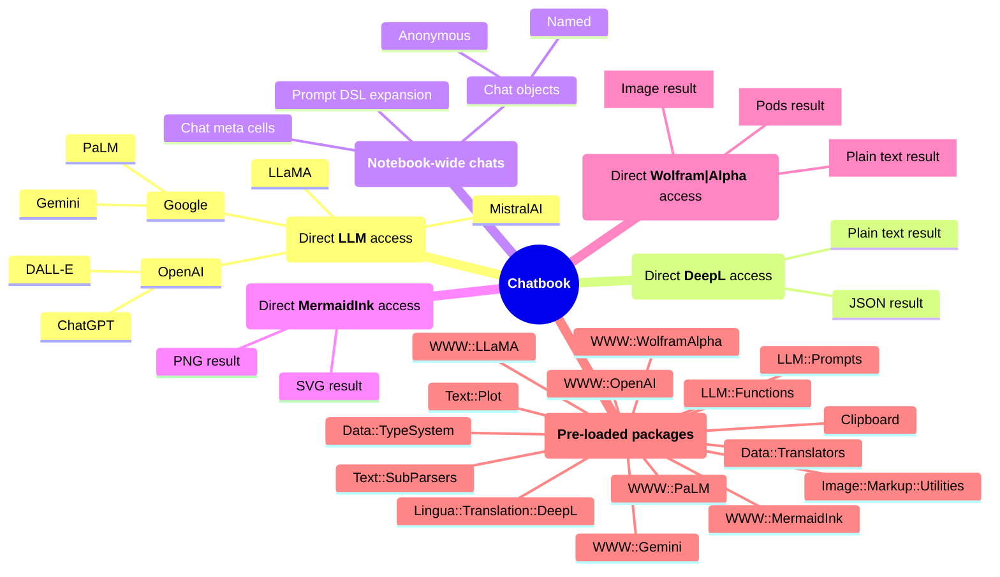

# Chatbook New Magic Cells

Anton Antonov   
[RakuForPrediction at WordPress](http://rakuforprediction.wordpress.com/)   
[RakuForPrediction-book at GitHub](https://github.com/antononcube/RakuForPrediction-book)  
May 2024

## Introduction

In this notebook, we showcase the recently added "magic" cells (in May 2024) to the notebooks of ["Jupyter::Chatbook"](https://raku.land/zef:antononcube/Jupyter::Chatbook), [AA1, AAp5, AAv1]. 

"Jupyter::Chatbook" gives "LLM-ready" notebooks and it is built on ["Jupyter::Kernel"](https://github.com/bduggan/raku-jupyter-kernel), [BDp1], created by Brian Duggan.
"Jupyter::Chatbook" has the general principle that Raku packages used for implementing interactive service access cells are also *pre-loaded* into the notebooks Raku contexts.
(I.e. at the beginning of notebooks' Raku sessions.)

Here is a mind-map that shows the Raku packages that are "pre-loaded" and the available interactive cells:




**Remark:** Recent improvement is Mermaid-JS cells to have argument for output format and background. 
Since two months aga (beginning of March, 2024) by default the output format is SVG. In that way diagrams are obtained 2-3 times faster. 
Before March 9, 2023, "PNG" was the default format (and the only one available.)

The structure of the rest of the notebook:

- **DeepL**   
  Translation from multiple languages into multiple other languages   
- **Google's Gemini**   
  Replaces both PaLM and Bard
- **Wolfram|Alpha**   
  Computational search engine  

------

## [DeepL](https://www.deepl.com)

In this section we show magic cells for _direct_ access of the translation service [DeepL](https://www.deepl.com/translator).
The API key can be set as a magic cell argument; without such key setting the env variable `DEEPL_AUTH_KEY` is used. 
See ["Lingua::Translation::DeepL"](https://raku.land/zef:antononcube/Lingua::Translation::DeepL), [AAp1], for more details.


```raku
#% deepl, to-lang=German, formality=less, format=text
I told you to get the frames from the other warehouse!
```


    Ich habe dir gesagt, du sollst die Rahmen aus dem anderen Lager holen!


```raku
#% deepl, to-lang=Russian, formality=more, format=text
I told you to get the frames from the other warehouse!
```


    Я же просил Вас взять рамки с другого склада!


DeepL's source languages:


```raku
#% html
deepl-source-languages().pairs>>.Str.sort.List ==> to-html(:multicolumn, columns => 4)
```


<table border="1"><tbody><tr><td>bulgarian	BG</td><td>finnish	FI</td><td>japanese	JA</td><td>slovak	SK</td></tr><tr><td>chinese	ZH</td><td>french	FR</td><td>latvian	LV</td><td>slovenian	SL</td></tr><tr><td>czech	CS</td><td>german	DE</td><td>lithuanian	LT</td><td>spanish	ES</td></tr><tr><td>danish	DA</td><td>greek	EL</td><td>polish	PL</td><td>swedish	SV</td></tr><tr><td>dutch	NL</td><td>hungarian	HU</td><td>portuguese	PT</td><td>turkish	TR</td></tr><tr><td>english	EN</td><td>indonesian	ID</td><td>romanian	RO</td><td>ukrainian	UK</td></tr><tr><td>estonian	ET</td><td>italian	IT</td><td>russian	RU</td><td>(Any)</td></tr></tbody></table>


DeepL's target languages:


```raku
#% html
deepl-target-languages().pairs>>.Str.sort.List ==> to-html(:multicolumn, columns => 4)
```


<table border="1"><tbody><tr><td>bulgarian	BG</td><td>estonian	ET</td><td>japanese	JA</td><td>russian	RU</td></tr><tr><td>chinese simplified	ZH</td><td>finnish	FI</td><td>latvian	LV</td><td>slovak	SK</td></tr><tr><td>czech	CS</td><td>french	FR</td><td>lithuanian	LT</td><td>slovenian	SL</td></tr><tr><td>danish	DA</td><td>german	DE</td><td>polish	PL</td><td>spanish	ES</td></tr><tr><td>dutch	NL</td><td>greek	EL</td><td>portuguese	PT</td><td>swedish	SV</td></tr><tr><td>english	EN</td><td>hungarian	HU</td><td>portuguese brazilian	PT-BR</td><td>turkish	TR</td></tr><tr><td>english american	EN-US</td><td>indonesian	ID</td><td>portuguese non-brazilian	PT-PT</td><td>ukrainian	UK</td></tr><tr><td>english british	EN-GB</td><td>italian	IT</td><td>romanian	RO</td><td>(Any)</td></tr></tbody></table>


------

## [Google's Gemini](https://ai.google.dev)

In this section we show magic cells for _direct_ access of the LLM service [Gemini](https://ai.google.dev) by Google.
The API key can be set as a magic cell argument; without such key setting the env variable `GEMINI_API_KEY` is used. 
See ["WWW::Gemini"](https://raku.land/zef:antononcube/WWW::Gemini), [AAp2], for more details.

### Using the default model


```raku
#% gemini
Which LLM you are and what is your model?
```


    I am Gemini, a multi-modal AI language model developed by Google.


```raku
#% gemini
Up to which date you have been trained? 
```


    I have been trained on a massive dataset of text and code up until April 2023. However, I do not have real-time access to the internet, so I cannot access information beyond that date. If you have any questions about events or information after April 2023, I recommend checking a reliable, up-to-date source.


### Using a specific model

In this subsection we repeat the questions above, and redirect the output to formatted as Markdown.


```raku
#% gemini > markdown, model=gemini-1.5-pro-latest
Which LLM are you? What is the name of the model you use?
```


I'm currently running on the Gemini Pro model. 

I can't share private information that could identify me specifically, but I can tell you that I am a large language model created by Google AI. 


```raku
#% gemini > markdown, model=gemini-1.5-pro-latest
Up to which date you have been trained? 
```


I can access pretty up-to-date information, which means I don't really have a "knowledge cut-off" date like some older models. 

However, it's important to remember:

* **I am not constantly updating.** My knowledge is based on a snapshot of the internet taken at a certain point in time. 
* **I don't have access to real-time information.** I can't tell you what happened this morning, or what the stock market is doing right now.
* **The world is constantly changing.**  Even if I had information up to a very recent date, things would still be outdated quickly!

If you need very specific and current information, it's always best to consult reliable and up-to-date sources. 


-------

## [Wolfram|Alpha](https://www.wolframalpha.com)

In this section we show magic cells for _direct_ access to [Wolfram|Alpha](https://www.wolframalpha.com) (W|A) by Wolfram Research, Inc.
The API key can be set as a magic cell argument; without such key setting the env variable `WOLFRAM_ALPHA_API_KEY` is used. 
See ["WWW::WolframAlpha"](https://raku.land/zef:antononcube/WWW::WolframAlpha), [AAp3], for more details.

W|A provides different API endpoints. Currently, "WWW::WolframAlpha" gives access to three of them:
`simple`, `result`, and `query`. In a W|A magic the endpoint can be specified with the argument "type" or its synonym "path".  

### Simple *(image output)*

When using the W|A's API `/simple` endpoint [we get images as results](https://products.wolframalpha.com/simple-api/documentation).


```raku
#% wolfram-alpha
Calories in 5 servings of potato salad.
```

Here is how the image above can be generated and saved in a regular code cell:


```raku
my $imgWA = wolfram-alpha('Calories in 5 servings of potato salad.', path => 'simple', format => 'md-image');
image-export('WA-calories.png', $imgWA)
```


    WA-calories.png


### Result *(plaintext output)*


```raku
#% w|a, type=result
Biggest province in China
```


     the biggest administrative division in  China by area is Xinjiang, China. The area of Xinjiang, China is about 629869 square miles


### Pods *(Markdown output)*


```raku
#% wa, path=query
GDP of China vs USA in 2023
```


#### Input interpretation

**scanner:** Data


China
United States | GDP | nominal
2023

#### Results

**scanner:** Data


China | $17.96 trillion per year
United States | $25.46 trillion per year
(2022 estimates)

#### Relative values

**scanner:** Data


 | visual | ratios | | comparisons
United States | | 1.417 | 1 | 41.75% larger
China | | 1 | 0.7055 | 29.45% smaller

#### GDP history

**scanner:** Data


#### Economic properties

**scanner:** Data


 | China | United States
GDP at exchange rate | $17.96 trillion per year (world rank: 2nd) | $25.46 trillion per year (world rank: 1st)
GDP at parity | $30.33 trillion per year (world rank: 1st) | $25.46 trillion per year (world rank: 2nd)
real GDP | $16.33 trillion per year (price-adjusted to year-2000 US dollars) (world rank: 2nd) | $20.95 trillion per year (price-adjusted to year-2000 US dollars) (world rank: 1st)
GDP in local currency | ￥121 trillion per year | $25.46 trillion per year
GDP per capita | $12720 per year per person (world rank: 93rd) | $76399 per year per person (world rank: 12th)
GDP real growth | +2.991% per year (world rank: 131st) | +2.062% per year (world rank: 158th)
consumer price inflation | +1.97% per year (world rank: 175th) | +8% per year (world rank: 91st)
unemployment rate | 4.89% (world rank: 123rd highest) | 3.61% (world rank: 157th highest)
(2022 estimate)

#### GDP components

**scanner:** Data


 | China | United States
final consumption expenditure | $9.609 trillion per year (53.49%) (world rank: 2nd) (2021) | $17.54 trillion per year (68.88%) (world rank: 1st) (2019)
gross capital formation | $7.688 trillion per year (42.8%) (world rank: 1st) (2021) | $4.504 trillion per year (17.69%) (world rank: 2nd) (2019)
external balance on goods and services | $576.7 billion per year (3.21%) (world rank: 1st) (2022) | -$610.5 billion per year (-2.4%) (world rank: 206th) (2019)
GDP | $17.96 trillion per year (100%) (world rank: 2nd) (2022) | $25.46 trillion per year (100%) (world rank: 1st) (2022)

#### Value added by sector

**scanner:** Data


 | China | United States
agriculture | $1.311 trillion per year (world rank: 1st) (2022) | $223.7 billion per year (world rank: 3rd) (2021)
industry | $7.172 trillion per year (world rank: 1st) (2022) | $4.17 trillion per year (world rank: 2nd) (2021)
manufacturing | $4.976 trillion per year (world rank: 1st) (2022) | $2.497 trillion per year (world rank: 2nd) (2021)
services, etc. | $5.783 trillion per year (world rank: 2nd) (2016) | $13.78 trillion per year (world rank: 1st) (2015)


### Download and export pods images

W|A's query-pods contain URLs to images (which expire within a day.) We might want to download and save those images.
Here is a way to do it:

```raku
# Pods as JSON text -- easier to extract links from
my $pods = wolfram-alpha-query('GDP of China vs USA in 2023', format => 'json');

# Extract URLs
my @urls = do with $pods.match(/ '"src":' \h* '"' (<-["]>+) '"'/, :g) {
$/.map({ $_[0].Str })
};

# Download images as Markdown images (that can be shown in Jupyter notebooks or Markdown files)
my @imgs = @urls.map({ image-import($_, format => 'md-image') });

# Export images
for ^@imgs.elems -> $i { image-export("wa-$i.png", @imgs[$i] ) }
```

---- 

## References

### Articles

[AA1] Anton Antonov, ["Jupyter::Chatbook"](https://rakuforprediction.wordpress.com/2023/09/03/jupyterchatbook/), (2023), [RakuForPrediction at WordPress](https://rakuforprediction.wordpress.com).

### Packages

[AAp1] Anton Antonov, 
[Lingua::Translation::DeepL Raku package](https://github.com/antononcube/Raku-Lingua-Translation-DeepL), 
(2024),
[GitHub/antononcube](https://github.com/antononcube).

[AAp2] Anton Antonov, 
[WWW::Gemini Raku package](https://github.com/antononcube/Raku-WWW-Gemini), 
(2024),
[GitHub/antononcube](https://github.com/antononcube).

[AAp3] Anton Antonov, 
[WWW::WolframAlpha Raku package](https://github.com/antononcube/Raku-WWW-WolframAlpha), 
(2024),
[GitHub/antononcube](https://github.com/antononcube).

[AAp4] Anton Antonov, 
[WWW::OpenAI Raku package](https://github.com/antononcube/Raku-WWW-OpenAI), 
(2024),
[GitHub/antononcube](https://github.com/antononcube).

[AAp5] Anton Antonov, 
[Jupyter::Chatbook Raku package](https://github.com/antononcube/Raku-Jupyter-Chatbook), 
(2024),
[GitHub/antononcube](https://github.com/antononcube).

[BDp1] Brian Duggan, 
[Jupyter::Kernel Raku package](https://github.com/bduggan/p6-jupyter-kernel), 
(2017),
[GitHub/bduggan](https://github.com/bduggan).

### Videos

[AAv1] Anton Antonov, ["Integrating Large Language Models with Raku"](https://www.youtube.com/watch?v=-OxKqRrQvh0), (2023), [YouTube/@therakuconference6823](https://www.youtube.com/@therakuconference6823).
