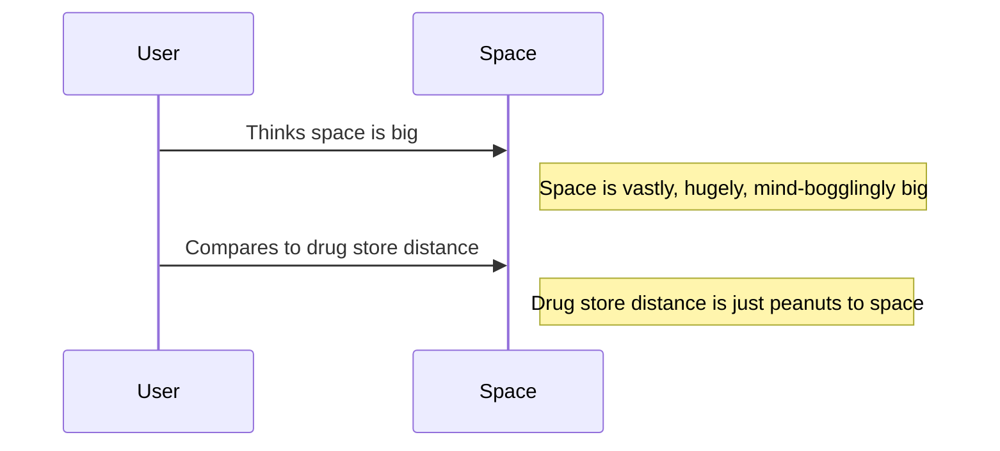
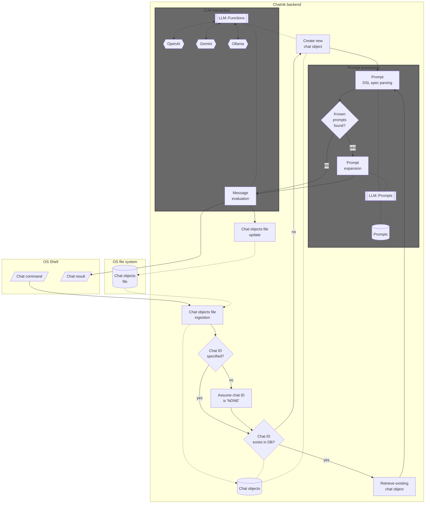
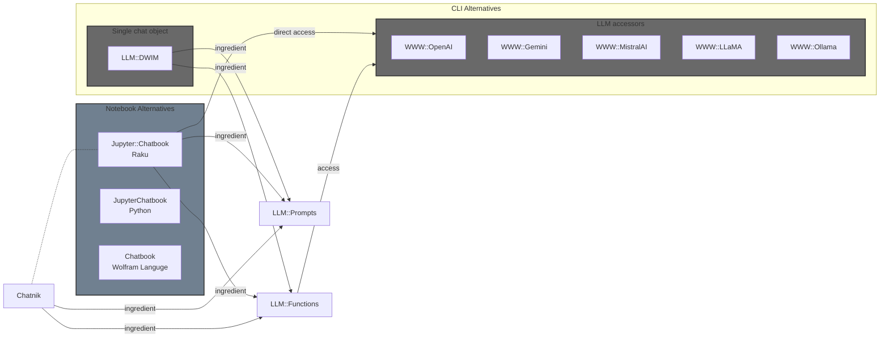

# Chatnik: LLM Host in the Shell -- Part 1: First Examples & Design Principles

## Introduction

["Chatnik"](https://raku.land/zef:antononcube/Chatnik) is a Raku package that provides Command Line Interface (CLI)
scripts for conversing with multiple, persistent Large Language Model (LLM) personas. 
Files of the host Operating System (OS) are used to maintain persistence.

Most importantly, "Chatnik" does not try to entrench users in its own user experience (loop) for interaction with LLMs.
Instead, it brings customizable LLM invocations and conversations into the Unix shell -- 
making them composable, integratable, and scriptable with existing workflows.

In other words, the tag line "LLM Host in the Shell" should be understood as "LLMs, not as an app -- but as a Unix shell primitive." 

Here are the most notable "Chatnik" features:

- Provides UNIX shell pipelining for LLM interactions
- Maintains a database of LLM chat objects
- Connects to multiple models across different LLM providers
- Offers access to a large repository of prompts
- Enables convenient retrieval of interaction history
- Includes management tools for the LLM chat object database
- Preprocesses prompts using a simple domain-specific language (DSL)
- Supports loading user-defined LLM personas from JSON files

**Remark:** "Chatnik" closely follows the LLM-chat objects interaction system of the Raku package ["Jupyter::Chatbook"](https://raku.land/zef:antononcube/Jupyter::Chatbook), [AAp3].
(Using OS shell instead of Jupyter notebooks.)

The rest of this document is organized as follows:

- Introductory examples
- Why make another LLM-CLI system?
- Architectural design
- Related and alternative packages

----

## Introductory examples

The examples in this section demonstrate how the CLI scripts `llm-chat` and `llm-chat-meta` -- provided by "Chatnik" -- 
are used to have multi-turn LLM conversations and compose Unix shell pipelines with LLM interaction messages.

**Remark:** Instead of `llm-chat` and `llm-chat-meta`, the CLI script `chatnik` can be used:
`chatnik` invokes `llm-chat`, and `chatnik meta` invokes `llm-chat-meta`.

**Remark:** The prompts used in the examples are provided by the Raku package ["LLM::Prompts"](https://raku.land/zef:antononcube/LLM::Prompts), [AAp2].
Since many of the prompts of that package have dedicated pages at the [Wolfram Prompt Repository (WPR)](https://resources.wolframcloud.com/PromptRepository/)
the examples use WPR reference links.

### Chat with Yoda

Here we create an LLM persona -- by naming it and "priming it" with a prompt -- and start interacting with it:

```shell
llm-chat --chat-id=yoda --prompt=@Yoda 'Hi! Who are you?'
```

Here we continue the conversation -- using the `-i` synonym of `--chat-id` and no-quotes message argument:

```shell
llm-chat -i=yoda How many students did you have
```

And continue the discussion some more: 

```shell
llm-chat -i=yoda 'Which student is the best?'
```

The example used the LLM persona ["Yoda"](https://resources.wolframcloud.com/PromptRepository/resources/Yoda).
(See more LLM personas [here](https://resources.wolframcloud.com/PromptRepository/category/personas?sortBy=Name).)

### Fortune-echo-limerick pipeline

Here we specify a pipeline for
1. Getting a fortune
2. Echoing it
3. Using the fortune to make a limerick


```
fortune | tee /dev/tty | llm-chat --prompt="Make a limerick from the given text:"
```

```text
Space is big.  You just won't believe how vastly, hugely, mind-bogglingly
big it is.  I mean, you may think it's a long way down the road to the
drug store, but that's just peanuts to space.
		-- The Hitchhiker's Guide to the Galaxy
		
There once was a space vast and wide,  
Whose scale no one could quite abide.  
Though the drug store seems near,  
Space’s size is sincere—  
Mind-bogglingly big can’t be denied!
```

**Remark:** In the shell command above, `llm-chat` created (or reused) a chat object with the default identifier "NONE". 

### Make a diagram from previous results

Here we use prompt expansion to request the creation of a [Mermaid-JS diagram](https://mermaid.js.org) via the
prompt ["CodeWriterX"](https://www.wolframcloud.com/obj/antononcube/DeployedResources/Prompt/CodeWriterX/):

```
llm-chat '!CodeWriterX|"Mermaid-JS code of the concepts"^'
```

````

````

Since the result is given in Markdown code fences we take the last message via the CLI script `llm-meta-chat`,
then use `sed` to remove the first and last lines, and then pass that text to the terminal 
Mermaid-JS visualizer [`mmdflux`](https://github.com/kevinswiber/mmdflux):

```
llm-chat-meta last-message | sed '1d; $d' | mmdflux
```

```text

┌──────┐                           ┌───────┐
│ User │                           │ Space │
└───┬──┘                           └───┬───┘
    │                                  │
    │─Thinks space is big─────────────>│
    │                                  │
    │                                  │ ┌──────────────────────────────────────────────┐
    │                                  │ │ Space is vastly, hugely, mind-bogglingly big │
    │                                  │ └──────────────────────────────────────────────┘
    │                                  │
    │─Compares to drug store distance─>│
    │                                  │
    │                                  │ ┌──────────────────────────────────────────────┐
    │                                  │ │ Drug store distance is just peanuts to space │
    │                                  │ └──────────────────────────────────────────────┘
    │                                  │
```

**Remark:** Since the result is usually given in Markdown code fences, we did not make a pipeline to plot the diagram.
We used two shell commands in order to observe the intermediate result.

**Remark:** The default object identifier for both `llm-chat` and `llm-chat-object` is "NONE".

### Copy-editing

Here is a very practical example --
this document was copy-edited with the prompt ["CopyEdit"](https://resources.wolframcloud.com/PromptRepository/resources/CopyEdit) 
using the following commands:

```
cat Chatnik-LLM-Host-in-the-Shell-Part-1.md | llm-chat -i=ce --prompt=@CopyEdit --model=gpt-5.4-mini --max-tokens=16384
llm-chat-meta -i=ce last-message > Chatnik-LLM-Host-in-the-Shell-Part-1_edited.md
open Chatnik-LLM-Host-in-the-Shell-Part-1_edited.md
```

(And, yes, the LLM copy-edited version was evaluated, and some edits were rejected.)

---

## Why make another LLM-CLI system?

### Some questions to answer

* Why do it?
* Why was it relatively easy to do?
* Why is it useful?

### Why do it?

Most LLM interfaces -- both "big" popular ones and those built by developers experimenting with LLMs -- default to an application-centric design: a closed interaction loop with implicit state. 
This pattern is convenient, but very limiting. It can be cynically seen as an intentional effort for user lock-in or just as an attempt to impose certain user-experience views.
It works against the "freedom enabling" Unix design principles. (Such as composability, transparency, and scriptability.)

With "Chatnik", instead of adapting workflows to fit an LLM application, LLM capabilities are brought into the shell as first-class primitives.
This enables reuse of existing tooling (pipes, redirects, scripts) and aligns LLM interaction with long-established UNIX practices.

### Why was it relatively easy to do?

"Chatnik" is a composition of existing capabilities rather than a ground-up implementation:

* Modern LLM providers (e.g., OpenAI, Google, Ollama) expose messy, non-uniform APIs that should be abstracted behind a single interface
* The Raku ecosystem already provides flexible text processing, DSL making and usage, and CLI tooling
* The "LLM::Functions" package encapsulates model interaction patterns, reducing knowledge of concrete APIs
* Persistence can be implemented with simple file-based storage, avoiding the need for complex infrastructure

**Remark:** Related to the last point above, the following quote is attributed to [Ken Thompson](https://en.wikiquote.org/wiki/Ken_Thompson) about UNIX:

> We have persistent objects, they're called files.

**Remark:** Less obnoxiously, instead of saying that LLM providers expose messy, non-uniform APIs, we can say that their APIs "are individually reasonable, but collectively inconsistent."
Because of the popularity of OpenAI's models, many LLM providers adhere to a degree with OpenAI's API.
Still, the APIs -- collectively -- have inconsistent schemas, authorization, streaming, tool-calling, roles, etc.

### Why is it useful?

"Chatnik" is useful because it places LLM capabilities in a natural manner into Unix shell workflows:

* LLM calls can be embedded into shell pipelines, enabling automation and chaining
* Conversations are persistent and inspectable via the file system
* Prompt reuse and DSL preprocessing reduce repetition and keep workflows clear
* Multiple providers can be used interchangeably without changing workflows
* Existing UNIX tools (e.g., `grep`, `awk`, `sed`) can be combined with LLM outputs
  * Also, additional "widgets", like Markdown viewers, Mermaid-JS renderers, etc. 

----

## Architectural design

The following flowchart summarizes the computational components and their interactions fairly well:



Here is a concise narration of the flow:

- A chat command is issued from the OS shell, triggering ingestion of the chat objects file into an in-memory chat database.

- If a chat ID is specified and exists, the corresponding chat object is retrieved; otherwise, a new chat object is created (with a default “NONE” ID if unspecified).

- The input is then processed through prompt parsing using a DSL. If known prompts are detected, they are expanded via the prompt repository; otherwise, the raw input proceeds directly.

- The resulting message is evaluated through "LLM::Functions", which mediates interaction with external providers such as OpenAI (ChatGPT), Google (Gemini), and Ollama.

- The evaluation produces a chat result returned to the shell, while the updated chat state is written back to the chat objects file, ensuring persistence.

### Expanded narration

**Chatnik is built around the principle that LLM interaction should behave like a native shell capability, not a siloed application.**   
A command issued in the OS shell is treated as the entry point into a composable pipeline, where LLM calls can participate alongside standard UNIX tools.

**State is externalized and file-backed, not hidden in process memory.**   
Chat sessions are represented as chat objects that are ingested from and persisted to the file system. 
This makes conversations durable, inspectable, and naturally versionable using existing OS tools.

**Chat identity is explicit but optional.**   
When a chat ID is provided, the corresponding conversation is resumed; when absent or unknown, a new chat object is created. 
This allows both ad-hoc interactions and long-lived conversational contexts without friction.

**Prompting is treated as a programmable layer.**   
Inputs are not passed directly to models; they are first parsed through a lightweight DSL. 
Known prompts are expanded from a prompt repository, enabling reuse, parameterization, and standardization of interactions.

**LLM invocation is abstracted but not obscured.**   
Evaluation is delegated to "LLM::Functions", which provides a uniform interface over multiple providers, including OpenAI (ChatGPT), Google (Gemini), and Ollama. 
This keeps provider choice flexible while preserving a consistent workflow.

**The system is designed for composability and integration.**   
Each stage—state ingestion, prompt processing, evaluation, and persistence—can be understood as part of a pipeline. 
This makes LLM interactions scriptable, chainable, and interoperable with existing command-line utilities.

**Persistence is a first-class outcome of every interaction.**  
Every evaluation both returns a result to the shell and updates the underlying chat object store, ensuring that conversational context evolves incrementally and reliably.

**In short.** To reiterate the point in the introduction, "Chatnik" treats LLMs as *shell-native, stateful, and programmable primitives* -- 
aligning conversational AI with the philosophy of UNIX pipelines rather than application-bound interfaces.

-----

## Related and alternative packages

In this section, we point to Raku packages that are both ingredients of, and alternatives to, "Chatnik".

### Main ingredients

The creation and interaction LLM-chat object functionalities are provided by ["LLM::Functions"](https://raku.land/zef:antononcube/LLM::Functions), [AAp1].

Prompt collection, prompt spec DSL, and related prompt expansion are provided by ["LLM::Prompts"](https://raku.land/zef:antononcube/LLM::Prompts), [AAp2].
The CLI script `llm-prompt` of "LLM::Prompts" can be used to examine, retrieve, and concretize prompts. 
For example, here it can be seen the full text of the function prompt "MermaidDiagram" with given arguments:

```
llm-prompt MermaidDiagram MYTEXT MY_DIAGRAM_TYPE
```

In some cases it is more convenient to use `llm-prompt` than prompt expansion. For example:

```
llm-chat "@CodeWriterX|Raku 2D random walk." | llm-chat -i=ch --prompt="$(llm-prompt CodeHighlighter --format=HTML)"
```

### Underlying and alternative

Access to LLMs is provided by the packages
["WWWW::OpenAI"](https://github.com/antononcube/Raku-WWW-OpenAI), 
["WWWW::Gemini"](https://github.com/antononcube/Raku-WWW-Gemini), 
["WWW::MistralAI"](https://github.com/antononcube/Raku-WWW-MistralAI),
["WWW::LLaMA"](https://github.com/antononcube/Raku-WWW-LLaMA),
["WWW::Ollama"](https://github.com/antononcube/Raku-WWW-Ollama).

Each of these packages has a corresponding CLI script that is an *alternative* to `llm-chat`:

| Package        | CLI                    |
|----------------|------------------------|
| WWW::OpenAI    | `openai-playground`    |
| WWW::Gemini    | `gemini-prompt`        |
| WWW::MistralAI | `mistralai-playground` |
| WWW::LLaMA     | `llama-playground`     |
| WWW::Ollama    | `ollama-client`        |


### Related alternatives

The package ["LLM::DWIM"](https://raku.land/zef:bduggan/LLM::DWIM), [BDp1], is similar in spirit to "Chatnik", and 
it is also based on the LLM packages "LLM::Functions", [AAp1], and "LLM::Prompts", [AAp2].

There are significant differences, however, in that "LLM::DWIM":
1. Has its own loop for the user-LLM chat
2. Does not use prompt expansion
3. Uses only one chat object
4. Although chat history is saved, no new chat objects are created with it

The Raku package ["Jupyter::Chatbook"](https://raku.land/zef:antononcube/Jupyter::Chatbook) uses the same evaluation
mechanisms as "Chatnik", but its interactive environment is a Jupyter notebook instead of an OS shell.
The Python package ["JupyterChatbook"](https://pypi.org/project/JupyterChatbook/) and the Wolfram Language paclet ["Chatbook"](https://resources.wolframcloud.com/PacletRepository/resources/Wolfram/Chatbook/)
are also notebook alternatives to "Chatnik".

### Summarizing graph

Here is a graph that summarizes the relationships:



----

## References

### Articles, blog posts

[AA1] Anton Antonov,
["Jupyter::Chatbook"](https://rakuforprediction.wordpress.com/2023/09/03/jupyterchatbook),
(2023),
[RakuForPrediction at WordPress](https://rakuforprediction.wordpress.com).

[AA2] Anton Antonov,
["Jupyter::Chatbook Cheatsheet"](https://rakuforprediction.wordpress.com/2026/03/14/jupyterchatbook-cheatsheet),
(2026),
[RakuForPrediction at WordPress](https://rakuforprediction.wordpress.com).

[AA3] Anton Antonov,
["Jupyter Chatbook Cheatsheet"](https://pythonforprediction.wordpress.com/2026/03/12/jupyter-chatbook-cheatsheet),
(2026),
[PythonForPrediction at WordPress](https://rakuforprediction.wordpress.com).

### Packages

[AAp1] Anton Antonov,
[LLM::Functions, Raku package](https://github.com/antononcube/Raku-LLM-Functions),
(2023-2026),
[GitHub/antononcube](https://github.com/antononcube).

[AAp2] Anton Antonov,
[LLM::Prompts, Raku package](https://github.com/antononcube/Raku-LLM-Prompts),
(2023-2025),
[GitHub/antononcube](https://github.com/antononcube).

[AAp3] Anton Antonov,
[Jupyter::Chatbook, Raku package](https://github.com/antononcube/Raku-Jupyter-Chatbook),
(2023-2026),
[GitHub/antononcube](https://github.com/antononcube).

[AAp4] Anton Antonov,
[Data::Translators, Raku package](https://github.com/antononcube/Raku-Data-Translators),
(2023-2026),
[GitHub/antononcube](https://github.com/antononcube).

[AAp5] Anton Antonov,
[JupyterChatbook, Python package](https://github.com/antononcube/Python-JupyterChatbook),
(2023-2026),
[GitHub/antononcube](https://github.com/antononcube).

[BDp1] Brian Duggan,
[LLM::DWIM, Raku package](https://github.com/bduggan/raku-llm-dwim),
(2024-2025),
[GitHub/bduggan](https://github.com/bduggan).

[CGp1] Connor Gray, et al.
[Chatbook, Wolfram Language paclet](https://resources.wolframcloud.com/PacletRepository/resources/Wolfram/Chatbook),
(2023-2024),
[Wolfram Language Paclet Repository](https://resources.wolframcloud.com/PacletRepository).

### Videos

[AAv1] Anton Antonov,
["Integrating Large Language Models with Raku"](https://youtu.be/-OxKqRrQvh0?si=5LEj8-Dtcxjn-0QR&t=548),
(2023),
[The Raku Conference 2023 at YouTube](https://www.youtube.com/@therakuconference6823).

