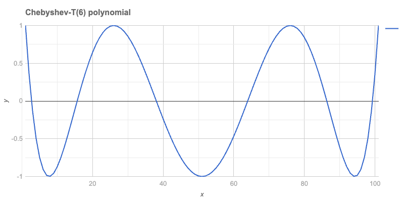
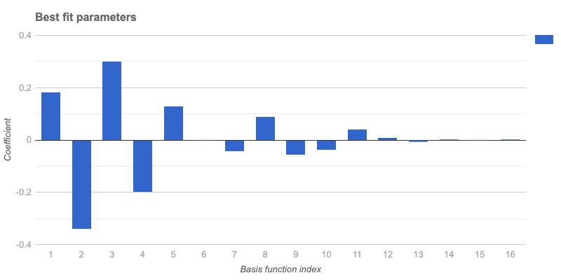
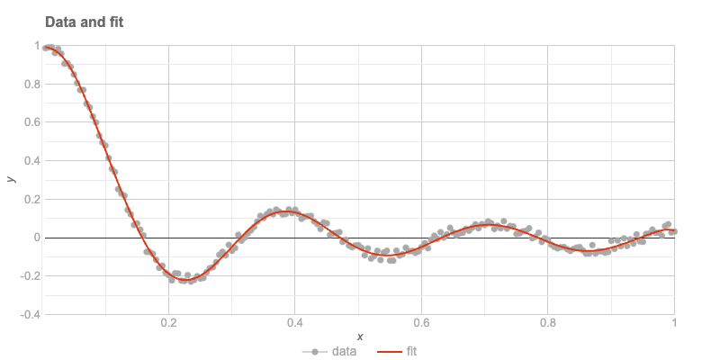

# Chebyshev Polynomials and Fitting Workflows

Anton Antonov  
June 2024   
December 2024

-----

## Introduction

This post explores the use of Chebyshev polynomials in regression and curve fitting workflows. It highlights various packages that facilitate these processes, providing insights into their features and applications.

- ["JavaScript::Google::Charts"](https://raku.land/zef:antononcube/JavaScript::Google::Charts): This package is instrumental for creating scatter plots and visualizing time series data.
- ["Math::Polynomial::Chebyshev"](https://raku.land/zef:antononcube/Math::Polynomial::Chebyshev): It offers a polynomial basis with recursive and trigonometric computation methods, ensuring exact integer results for numerators and denominators.
- ["Math::Fitting"](https://raku.land/zef:antononcube/Math::Fitting): This package supports linear regression using function bases, providing functors and allowing retrieval of multiple properties.
- ["Data::TypeSystem"](https://raku.land/zef:antononcube/Data::TypeSystem): It provides a summary of data types.
- ["Data::Summarizers"](https://raku.land/zef:antononcube/Data::Summarizers): This package summarizes data values.

### TL;DR

- Chebyshev polynomials can be computed exactly.
- The "Math::Fitting" package yields functors.
- Fitting utilizes a function basis.
- Matrix formulas facilitate the computation of the fit (linear regression).
- A real-life example is demonstrated using weather temperature data. For details, see the section before the last.

-----

## Setup

```raku
use Math::Matrix;
use Math::Polynomial::Chebyshev;
use Math::Fitting;

use Data::Reshapers;
use Data::Summarizers;
use Data::Generators;
use Data::Importers;
use Data::TypeSystem;

use JavaScript::D3;
use JavaScript::Google::Charts;
use Text::Plot;

use Hash::Merge;
```
```
# (Any)
```

### Google Charts

```raku
#% javascript
google.charts.load('current', {'packages':['corechart']});
google.charts.load('current', {'packages':['gauge']});
google.charts.load('current', {'packages':['wordtree']});
google.charts.load('current', {'packages':['geochart']});
google.charts.load('current', {'packages':['table']});
google.charts.load('current', {'packages':['line']});
google.charts.setOnLoadCallback(function() {
    console.log('Google Charts library loaded');
});

```
```
#ERROR: You can't adverb 'packages'
# Nil
```

#### Dark mode

```raku
my $format = 'html';
my $titleTextStyle = { color => 'Ivory', fontSize => 16 };
my $backgroundColor = '#1F1F1F';
my $legendTextStyle = { color => 'Silver' };
my $legend = { position => "none", textStyle => {fontSize => 14, color => 'Silver'} };

my $hAxis = { title => 'x', titleTextStyle => { color => 'Silver' }, textStyle => { color => 'Gray'}, logScale => False, format => 'decimal'};
my $vAxis = { title => 'y', titleTextStyle => { color => 'Silver' }, textStyle => { color => 'Gray'}, logScale => False, format => 'decimal'};

my $annotations = {textStyle => {color => 'Silver', fontSize => 10}};
my $chartArea = {left => 50, right => 50, top => 50, bottom => 50, width => '90%', height => '90%'};
```
```
# {bottom => 50, height => 90%, left => 50, right => 50, top => 50, width => 90%}
```

#### Light mode

```raku
my $format = 'html';
my $titleTextStyle = { color => 'DimGray', fontSize => 16 };
my $backgroundColor = 'White';
my $legendTextStyle = { color => 'DarkGray' };
my $legend = { position => "none", textStyle => {fontSize => 14, color => 'DarkGray'} };

my $hAxis = { title => 'x', titleTextStyle => { color => 'DimGray' }, textStyle => { color => 'DarkGray'}, logScale => False, format => 'decimal'};
my $vAxis = { title => 'y', titleTextStyle => { color => 'DimGray' }, textStyle => { color => 'DarkGray'}, logScale => False, format => 'decimal'};

my $annotations = {textStyle => {color => 'DarkGray', fontSize => 10}};
my $chartArea = {left => 50, right => 50, top => 50, bottom => 50, width => '90%', height => '90%'};
```
```
# {bottom => 50, height => 90%, left => 50, right => 50, top => 50, width => 90%}
```

-------

## Computation Granularity

This section discusses the computation of Chebyshev polynomials using different methods and their implications on precision.

The computation over Chebyshev polynomials is supported on the interval $[-1, 1]$. The recursive and trigonometric methods are compared to understand their impact on the precision of results.

```raku
<recursive trigonometric>
==> { .map({ $_ => chebyshev-t(3, 0.3, method => $_) }) }()
```
```
# (recursive => -0.792 trigonometric => -0.7920000000000003)
```

Here we compute polynomial values over a "dense enough" grid:

```raku
my $k = 12;
my $method = 'trig'; # 'trig'
my @x = (-1.0, -0.99 ... 1.0);
say '@x.elems : ', @x.elems;

my @data  = @x.map({ [$_, chebyshev-t($k, $_, :$method)]});
my @data1 = chebyshev-t($k, @x);

say deduce-type(@data);
say deduce-type(@data1);
```
```
# @x.elems : 201
# Vector(Tuple([Atom((Rat)), Atom((Numeric))]), 201)
# Vector((Any), 201)
```

Residuals with trigonometric and recursive methods are utilized to assess precision:

```raku
sink records-summary(@data.map(*.tail) <<->> @data1)
```
```
# +----------------------------------+
# | numerical                        |
# +----------------------------------+
# | Min    => -3.774758283725532e-15 |
# | Median => -3.469446951953614e-18 |
# | Max    => 3.4416913763379853e-15 |
# | Mean   => -8.803937402208662e-17 |
# | 3rd-Qu => 3.3306690738754696e-16 |
# | 1st-Qu => -6.661338147750939e-16 |
# +----------------------------------+
```

-----

## Precision

The exact Chebyshev polynomial values can be computed using `FatRat` numbers, ensuring high precision in numerical computations.

```raku
my $v = chebyshev-t(100, <1/4>.FatRat, method => 'recursive')
```
```
# 0.9908630290911637341902191815340830456
```

The numerator and denominator of the computed result are:

```raku
say $v.numerator;
say $v.denominator;
```
```
# 2512136227142750476878317151377
# 2535301200456458802993406410752
```

-----

## Plots

This section demonstrates plotting Chebyshev polynomials using [Google Charts](https://developers.google.com/chart) via the ["JavaScript::Google::Charts"](https://raku.land/zef:antononcube/JavaScript::Google::Charts) package.

### Single Polynomial

A single polynomial can be plotted using a [Line chart](https://developers.google.com/chart/interactive/docs/gallery/linechart):

```raku
my $n = 6;
my @data = chebyshev-t(6, (-1, -0.98 ... 1).List);
```
```
# [1 0.3604845076 -0.1315856097 -0.4953170862 -0.748302037 -0.906688 -0.9852465029 -0.9974401556 -0.9554882683 -0.8704309944 -0.752192 -0.6096396575 -0.4506467656 -0.2821487944 -0.1102006559 0.059968 0.223898964 0.3778531205 0.5187595756 0.6441662587 0.752192 0.8414800814 0.9111532626 0.9607702815 0.9902838292 1 0.9905392148 0.9627986207 0.9179159634 0.8572349358 0.782272 0.6946846843 0.5962413548 0.4887924613 0.3742432584 0.254528 0.1315856097 0.0073368248 -0.1163371848 -0.2376147231 -0.354752 -0.4661000888 -0.5701204091 -0.6653987348 -0.7506577285 -0.824768 -0.8867576914 -0.935820587 -0.9713227489 -0.992807678 -1 -0.992807678 -0.9713227489 -0.935820587 -0.8867576914 -0.824768 -0.7506577285 -0.6653987348 -0.5701204091 -0.4661000888 -0.354752 -0.2376147231 -0.1163371848 0.0073368248 0.1315856097 0.254528 0.3742432584 0.4887924613 0.5962413548 0.6946846843 0.782272 0.8572349358 0.9179159634 0.9627986207 0.9905392148 1 0.9902838292 0.9607702815 0.9111532626 0.8414800814 0.752192 0.6441662587 0.5187595756 0.3778531205 0.223898964 0.059968 -0.1102006559 -0.2821487944 -0.4506467656 -0.6096396575 -0.752192 -0.8704309944 -0.9554882683 -0.9974401556 -0.9852465029 -0.906688 -0.748302037 -0.4953170862 -0.1315856097 0.3604845076 ...]
```

```raku, eval=FALSE
#%html
js-google-charts('LineChart', @data, 
    title => "Chebyshev-T($n) polynomial", 
    :$titleTextStyle, :$backgroundColor, :$chartArea, :$hAxis, :$vAxis,
    width => 800, 
    div-id => 'poly1', :$format,
    :png-button)
```



### Basis

In fitting, bases of functions are crucial. The first eight Chebyshev-T polynomials are plotted to illustrate this.

```raku
my $n = 8;
my @data = (-1, -0.98 ... 1).map(-> $x { [x => $x, |(0..$n).map({ $_.Str => chebyshev-t($_, $x, :$method) }) ].Hash });

deduce-type(@data):tally;
```
```
# Tuple([Struct([0, 1, 2, 3, 4, 5, 6, 7, 8, x], [Num, Num, Num, Num, Num, Num, Num, Num, Num, Int]) => 1, Struct([0, 1, 2, 3, 4, 5, 6, 7, 8, x], [Num, Num, Num, Num, Num, Num, Num, Num, Num, Rat]) => 100], 101)
```

The plot with all eight functions is shown below:

```raku, eval=FALSE
#%html
js-google-charts('LineChart', @data,
    column-names => ['x', |(0..$n)».Str],
    title => "Chebyshev T polynomials, 0 .. $n",
    :$titleTextStyle,
    width => 800, 
    height => 400,
    :$backgroundColor, :$hAxis, :$vAxis,
    legend => merge-hash($legend, %(position => 'right')),
    chartArea => merge-hash($chartArea, %(right => 100)),
    format => 'html', 
    div-id => "cheb$n",
    :$format,
    :png-button)
```


-----

## Text Plot

Text plots provide a reliable method for visualizing data. The data is converted into a long form to facilitate plotting using ["Text::Plot"](https://raku.land/zef:antononcube/Text::Plot).

```raku
my @dataLong = to-long-format(@data, <x>).sort(*<Variable x>);
deduce-type(@dataLong):tally
```
```
# Tuple([Struct([Value, Variable, x], [Num, Str, Int]) => 9, Struct([Value, Variable, x], [Num, Str, Rat]) => 900], 909)
```

A sample of the data is provided:

```raku, result=asis
@dataLong.pick(10)
==> {.sort(*<Variable x>)}()
==> to-html(field-names => <Variable x Value>)
```
```
#ERROR: Undeclared routine:
#ERROR:     to-html used at line 4
# Nil
```

The text plot is presented here:

```raku, result=asis
my @chebInds = 1, 2, 3, 4;
my @dataLong3 = @dataLong.grep({ $_<Variable>.Int ∈ @chebInds }).classify(*<Variable>).map({ $_.key => $_.value.map(*<x Value>).Array }).sort(*.key)».value;
text-list-plot(@dataLong3, width => 100, height => 25, title => "Chebyshev T polynomials, 0 .. $n", x-label => (@chebInds >>~>> ' : ' Z~ <* □ ▽ ❍>).join(', '))
```
```
# Chebyshev T polynomials, 0 .. 8                                   
# +----+---------------------+---------------------+---------------------+---------------------+-----+      
# |                                                                                                  |      
# +    ❍                  ▽▽▽▽▽▽▽▽               ❍❍❍❍❍❍                                       *❍     +  1.00
# |     □              ▽▽▽        ▽▽▽         ❍❍❍      ❍❍❍                               ***** □     |      
# |      □□          ▽▽              ▽▽     ❍❍            ❍                          ****    □□▽     |      
# |     ❍  □        ▽▽                 ▽▽▽ ❍               ❍❍                   *****       □ ▽❍     |      
# |         □      ▽                     ❍❍▽                 ❍❍             *****          □         |      
# +          □□   ▽                     ❍  ▽▽                  ❍        ****             □□  ▽       +  0.50
# |      ❍    □  ▽                     ❍     ▽                  ❍  *****                □   ▽ ❍      |      
# |            ▽▽                    ❍❍       ▽▽               **❍*                    □             |      
# |       ❍      □□                 ❍           ▽▽        *****   ❍                  □□    ▽ ❍       |      
# |           ▽    □                ❍             ▽▽  *****        ❍                □     ▽          |      
# +        ❍  ▽     □□             ❍              *▽**              ❍             □□     ▽  ❍        +  0.00
# |          ▽       □□           ❍          *****  ▽▽               ❍          □□                   |      
# |         ❍          □□        ❍       ****         ▽▽              ❍        □□       ▽  ❍         |      
# |                      □□    ❍❍   *****               ▽              ❍❍    □□        ▽             |      
# |        ▽ ❍             □□ ❍ *****                    ▽▽              ❍ □□         ▽▽  ❍          |      
# +       ▽   ❍             *❍□*                          ▽▽             ❍□          ▽   ❍           + -0.50
# |                    ***** ❍ □□□                          ▽▽        □□□ ❍         ▽                |      
# |      ▽    ❍    ****    ❍❍     □□□                         ▽▽   □□□     ❍❍     ▽▽    ❍            |      
# |     ▽     *❍❍**      ❍❍         □□□□                        ▽▽□          ❍❍ ▽▽     ❍             |      
# |       *****  ❍     ❍❍               □□□□□             □□□□□□  ▽▽▽▽        ▽❍❍     ❍              |      
# +    ▽**        ❍❍❍❍❍                      □□□□□□□□□□□□□□           ▽▽▽▽▽▽▽▽  ❍❍❍❍❍❍               + -1.00
# |                                                                                                  |      
# +----+---------------------+---------------------+---------------------+---------------------+-----+      
#      -1.00                 -0.50                 0.00                  0.50                  1.00         
#                                      1 : *, 2 : □, 3 : ▽, 4 : ❍
```

-----

## Fitting

This section presents the generation of "measurements data" with noise and the fitting process using a function basis.

```raku
my @temptimelist = 0.1, 0.2 ... 20;
my @tempvaluelist = @temptimelist.map({ sin($_) / $_ }) Z+ (1..200).map({ (3.rand - 1.5) * 0.02 });
my @data1 = @temptimelist Z @tempvaluelist;
@data1 = @data1.deepmap({ .Num });

deduce-type(@data1)
```
```
# Vector(Vector(Atom((Numeric)), 2), 200)
```

Rescaling of x-coordinates is performed as follows:

```raku
my @data2 = @data1.map({ my @a = $_.clone; @a[0] = @a[0] / max(@temptimelist); @a });

deduce-type(@data2)
```
```
# Vector(Vector(Atom((Numeric)), 2), 200)
```

A summary of the data is provided:

```raku
sink records-summary(@data2)
```
```
# +--------------------------------+------------------+
# | 1                              | 0                |
# +--------------------------------+------------------+
# | Min    => -0.23490025110737495 | Min    => 0.005  |
# | 1st-Qu => -0.06252683902424944 | 1st-Qu => 0.2525 |
# | Mean   => 0.07305480087694105  | Mean   => 0.5025 |
# | Median => 0.006534388217040496 | Median => 0.5025 |
# | 3rd-Qu => 0.08182863322265621  | 3rd-Qu => 0.7525 |
# | Max    => 1.004696955736924    | Max    => 1      |
# +--------------------------------+------------------+
```

The data is plotted below:

```raku, eval=FALSE
#% html
js-google-charts("Scatter", @data2, 
    title => 'Measurements data with noise',
    :$backgroundColor, :$hAxis, :$vAxis,
    :$titleTextStyle, :$chartArea,
    width => 800, 
    div-id => 'data', :$format,
    :png-button)
```


A function to rescale from $[0, 1]$ to $[-1, 1]$ is defined:

```raku
my &rescale = { ($_ - 0.5) * 2 };
```
```
# -> ;; $_? is raw = OUTER::<$_> { #`(Block|3777901823264) ... }
```

The basis functions are listed:

```raku
my @basis = (^16).map({ chebyshev-t($_) o &rescale });
@basis.elems
```
```
# 16
```

**Remark:** The function composition operator `o` is utilized above. The argument is rescaled before computing the Chebyshev polynomial value.

A linear model fit is computed using these functions:

```raku
my &lm = linear-model-fit(@data2, :@basis)
```
```
# Math::Fitting::FittedModel(type => linear, data => (200, 2), response-index => 1, basis => 16)
```

The best fit parameters are:

```raku
&lm('BestFitParameters')
```
```
# [0.18032362128853602 -0.3401718507431129 0.29592808524509556 -0.1993034317021872 0.12550785516156415 0.002991249157669483 -0.05091268734645385 0.09171151919321457 -0.06505706928510284 -0.038716843132987996 0.03898027383897034 0.003806639669918629 -0.009612472400298316 -0.0003882968221338857 0.0018420298272567135 -0.002098725551797347]
```

The plot of these parameters is shown:

```raku, eval=FALSE
#% html
js-google-charts("Bar", &lm('BestFitParameters'), 
    :!horizontal,
    title => 'Best fit parameters',
    :$backgroundColor, 
    hAxis => merge-hash($hAxis, {title => 'Basis function index'}), 
    vAxis => merge-hash($hAxis, {title => 'Coefficient'}), 
    :$titleTextStyle, :$chartArea,
    width => 800, 
    div-id => 'bestFitParams', :$format,
    :png-button)
```



It is observed from the plot that using more than 12 basis functions does not improve the fit, as coefficients beyond the 12th index are very small.

The data and the fit are plotted after preparing the plot data:

```raku
my @fit = @data2.map(*.head)».&lm;
my @plotData = transpose([@data2.map(*.head).Array, @data2.map(*.tail).Array, @fit]);
@plotData = @plotData.map({ <x data fit>.Array Z=> $_.Array })».Hash;

deduce-type(@plotData)
```
```
# Vector(Assoc(Atom((Str)), Atom((Numeric)), 3), 200)
```

The plot is presented here:

```raku, eval=FALSE
#% html
js-google-charts('ComboChart', 
    @plotData, 
    title => 'Data and fit',
    column-names => <x data fit>,
    :$backgroundColor, :$titleTextStyle :$hAxis, :$vAxis,
    seriesType => 'scatter',
    series => {
        0 => {type => 'scatter', pointSize => 2, opacity => 0.1, color => 'Gray'},
        1 => {type => 'line'}
    },
    legend => merge-hash($legend, %(position => 'bottom')),
    :$chartArea,
    width => 800, 
    div-id => 'fit1', :$format,
    :png-button)
```



The residuals of the last fit are computed:

```raku
sink records-summary( (@fit <<->> @data2.map(*.tail))».abs )
```
```
# +----------------------------------+
# | numerical                        |
# +----------------------------------+
# | Median => 0.01230702029481336    |
# | 1st-Qu => 0.006665192347521196   |
# | Mean   => 0.013262283945826793   |
# | Max    => 0.034148423837399286   |
# | Min    => 2.6204697780897457e-05 |
# | 3rd-Qu => 0.018685760650682677   |
# +----------------------------------+
```

----

## Condition Number

The [Ordinary Least Squares (OLS)](https://en.wikipedia.org/wiki/Ordinary_least_squares) fit is computed using the formula:

$$
\beta = (X^T \cdot X)^{-1} \cdot X^T \cdot y
$$

The condition number of the "normal matrix" (or "Gram matrix") $X^T \cdot X$ is examined. The design matrix is obtained first:

```raku
my @a = &lm.design-matrix();
my $X = Math::Matrix.new(@a);
$X.size
```
```
# (200 16)
```

The Gram matrix is:

```raku
my $g = $X.transposed.dot-product($X);
$g.size
```
```
# (16 16)
```

The condition number of this matrix is:

```raku
$g.condition
```
```
# 88.55110861577737
```

It is concluded that the design matrix is suitable for use.

**Remark:** For a system of linear equations in matrix form $A x = b$, the condition number of $A$, $\kappa (A)$, is defined as the maximum ratio of the relative error in $x$ to the relative error in $b$.

**Remark:** Typically, if the condition number is $\kappa (A)=10^{d}$, up to $d$ digits of accuracy may be lost in addition to any loss caused by the numerical method (due to precision issues in arithmetic calculations).

**Remark:** A very "Raku-way" to define an ill-conditioned matrix is as "almost not of full rank" or "if its inverse does not exist."

-----

## Temperature Data

The entire workflow is repeated with real-life data, specifically weather temperature data for four consecutive years in Greenville, South Carolina, USA. This location is where the [Perl and Raku Conference 2025](https://www.perl.com/article/get-ready-for-the-2025-perl-and-raku-conference/) will be held.

The time series data is ingested:

```raku
my $url = 'https://raw.githubusercontent.com/antononcube/RakuForPrediction-blog/refs/heads/main/Data/dsTemperature-Greenville-SC-USA.csv';
my @dsTemperature = data-import($url, headers => 'auto');
@dsTemperature = @dsTemperature.deepmap({ $_ ~~ / ^ \d+ '-' / ?? DateTime.new($_) !! $_.Num });
deduce-type(@dsTemperature)
```
```
# Vector(Struct([AbsoluteTime, Date, Temperature], [Num, DateTime, Num]), 1462)
```

A summary of the data is shown:

```raku
sink records-summary(@dsTemperature, field-names => <Date AbsoluteTime Temperature>)
```
```
# +--------------------------------+----------------------+------------------------------+
# | Date                           | AbsoluteTime         | Temperature                  |
# +--------------------------------+----------------------+------------------------------+
# | Min    => 2018-01-01T00:00:37Z | Min    => 3723753600 | Min    => -5.72              |
# | 1st-Qu => 2019-01-01T00:00:37Z | 1st-Qu => 3755289600 | 1st-Qu => 10.5               |
# | Mean   => 2020-01-01T12:00:37Z | Mean   => 3786868800 | Mean   => 17.053549931600518 |
# | Median => 2020-01-01T12:00:37Z | Median => 3786868800 | Median => 17.94              |
# | 3rd-Qu => 2021-01-01T00:00:37Z | 3rd-Qu => 3818448000 | 3rd-Qu => 24.11              |
# | Max    => 2022-01-01T00:00:37Z | Max    => 3849984000 | Max    => 29.89              |
# +--------------------------------+----------------------+------------------------------+
```

The plot of the data is provided:

```raku, eval=FALSE
#% html
js-google-charts("Scatter", @dsTemperature.map(*<Date Temperature>), 
    title => 'Temperature of Greenville, SC, USA',
    :$backgroundColor,
    hAxis => merge-hash($hAxis, {title => 'Time', format => 'M/yy'}), 
    vAxis => merge-hash($hAxis, {title => 'Temperature, ℃'}), 
    :$titleTextStyle, :$chartArea,
    width => 1200, 
    height => 400, 
    div-id => 'tempData', :$format,
    :png-button)
```


The fit is performed with rescaling:

```raku
my ($min, $max) = @dsTemperature.map(*<AbsoluteTime>).Array.&{ (.min, .max) }();
```
```
# (3723753600 3849984000)
```

```raku
my &rescale-time = { -($max + $min) / ($max - $min) + (2 * $_) / ($max - $min)};
my @basis = (^16).map({ chebyshev-t($_) o &rescale-time });
@basis.elems
```
```
# 16
```

```raku
my &lm-temp = linear-model-fit(@dsTemperature.map(*<AbsoluteTime Temperature>), :@basis)
```
```
# Math::Fitting::FittedModel(type => linear, data => (1462, 2), response-index => 1, basis => 16)
```

The plot of the time series and the fit is presented:

```raku
my @fit = @dsTemperature.map(*<AbsoluteTime>)».&lm-temp;
my @plotData = transpose([@dsTemperature.map({ $_<AbsoluteTime> }).Array, @dsTemperature.map(*<Temperature>).Array, @fit]);
@plotData = @plotData.map({ <x data fit>.Array Z=> $_.Array })».Hash;

deduce-type(@plotData)
```
```
# Vector(Assoc(Atom((Str)), Atom((Numeric)), 3), 1462)
```

```raku, eval=FALSE
#% html

my @ticks = @dsTemperature.map({ %( v => $_<AbsoluteTime>, f => $_<Date>.Str.substr(^7)) })».Hash[0, 120 ... *];

js-google-charts('ComboChart', 
    @plotData,
    title => 'Temperature data and Least Squares fit',
    column-names => <x data fit>,
    :$backgroundColor, :$titleTextStyle,
    hAxis => merge-hash($hAxis, {title => 'Time', :@ticks, textPosition => 'in'}), 
    vAxis => merge-hash($hAxis, {title => 'Temperature, ℃'}), 
    seriesType => 'scatter',
    series => {
        0 => {type => 'scatter', pointSize => 3, opacity => 0.1, color => 'Gray'},
        1 => {type => 'line', lineWidth => 4}
    },
    legend => merge-hash($legend, %(position => 'bottom')),
    :$chartArea,
    width => 1200, 
    height => 400, 
    div-id => 'tempDataFit', :$format,
    :png-button)
```


-----

## Future Plans

The current capabilities of Raku in performing regression analysis for both educational and practical purposes have been demonstrated. 

Future plans include implementing computational frameworks for [Quantile Regression](https://en.wikipedia.org/wiki/Quantile_regression) in Raku. 
Additionally, the workflow code in this post can be generated using Large Language Models (LLMs), which will be explored soon.