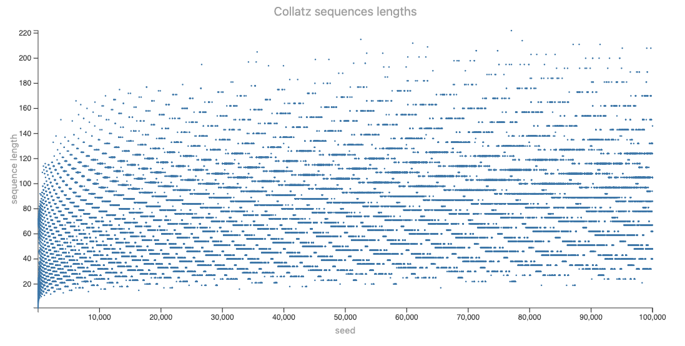
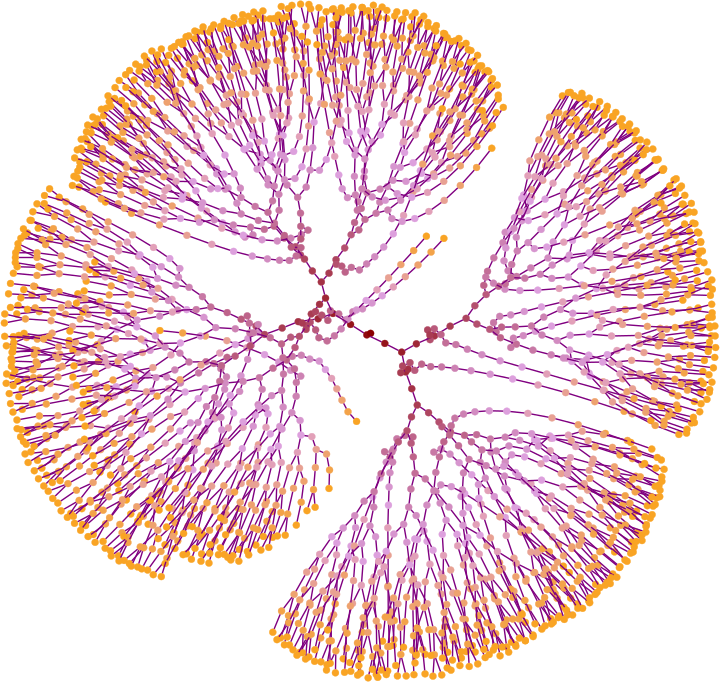

# Визуализации свързани с хипотезата на Колац

Антон Антонов   
[RakuForPrediction blog at WordPress](https://rakuforprediction.wordpress.com)   
Май 2025

-----

## Въведение

Този тефтер ("notebook") представя различни визуализации, свързани с [хипотезата на Колац](https://en.wikipedia.org/wiki/Collatz_conjecture), [WMW1, Wk1] използвайки Raku.

Хипотезата на Колац, известен, _нерешен_ математически проблем, поставя въпроса дали итеративното прилагане на две основни аритметични операции ще доведе всяко положително цяло число в крайна сметка до стойността 1.

В този тефтер ("notebook") се използва така наречената ["съкратена" версия](https://en.wikipedia.org/wiki/Collatz_conjecture#Statement_of_the_problem) на функцията на Колац:

$
f(n) = \left\{
\begin{array}{ll}
\frac{n}{2} & \text{ако } n \equiv 0 \pmod{2}, \\
\frac{3n + 1}{2} & \text{ако } n \equiv 1 \pmod{2}.
\end{array}
\right.
$

С тази функция многократно се формира редица, започвайки с произволно положително цяло число и приемайки резултата от всяка стъпка като вход за следващата.

***Хипотезата на Колац е:*** Този процес в крайна сметка ще достигне числото 1, независимо кое положително цяло число е избрано първоначално.

От гледна точка на Raku, процедури ("subs") за редиците на Колац се дефинират лесно. Визуализациите са направени с пакетите
["Graph"](https://raku.land/zef:antononcube/Graph), [AAp1],
["JavaScript::D3"](https://raku.land/zef:antononcube/JavaScript::D3), [AAp2], и
["Math::NumberTheory"](https://raku.land/zef:antononcube/Math::NumberTheory), [AAp3].

Има много статии, публикации в блогове и видео-доклади, посветени на визуализации на хипотезата на Колац. (Например, [KJR1, PZ1, Vv1]).

**Забележка:** Вземете предвид [предупрежденията във [Vv1]](https://youtu.be/094y1Z2wpJg?si=mb2daU4CW3y4gKWj&t=225) и на други места:

> Не работете по този [Колац] проблем! (Вместо това правете истинска математика.)

**Забележка:** Доста от визуализациите в този тефтер са базирани на "JavaScript::D3" и много приличат на визуализациите в [PZ1] 
-- [D3js](https://d3js.org) се използва и на двете места.

-----

## Настройка и предварителни дефиниции 

```raku
use Data::Reshapers;
use Data::Summarizers;
use Data::TypeSystem;
use Graph;
use JavaScript::D3;
use Math::NumberTheory;
```

```raku
#%javascript

require.config({
     paths: {
     d3: 'https://d3js.org/d3.v7.min'
}});

require(['d3'], function(d3) {
     console.log(d3);
});
```

```raku
my $background = 'none';
my $stroke-color = 'Ivory';
my $fill-color = 'none';
my $title-color = 'DarkGray';
```

```raku
sub darker-shades(Str $hex-color, Int $steps) {
    my @rgb = $hex-color.subst(/ ^ '#'/).comb(2).map({ :16($_) });
    my @shades;
    for 1..$steps -> $step {
        my @darker = @rgb.map({ ($_ * (1 - $step / ($steps + 1))).Int });
        @shades.push: '#' ~ @darker.map({ sprintf '%02X', $_ }).join;
    }
    return @shades;
}

#say darker-shades("#34495E", 5);
```

```raku
sub blend-colors(Str $color1, Str $color2, Int $steps) {
    my @rgb1 = $color1.subst(/ ^ '#'/).comb(2).map({ :16($_) });
    my @rgb2 = $color2.subst(/ ^ '#'/).comb(2).map({ :16($_) });
    my @blended;

    for ^$steps -> $step {
        my @blend = (@rgb1 Z @rgb2).map({
            ($_[0] + ($step / $steps) * ($_[1] - $_[0])).Int
        });
        @blended.push: '#' ~ @blend.map({ sprintf '%02X', $_ }).join;
    }
    
    return @blended;
}

#say blend-colors("#34495E", "#FFEBCD", 5);
```

----

## Дефиниция на функцията на Колац

Ето една процедура за съкратената версия на функцията на Колац:

```raku
sub collatz(UInt $n is copy, Int:D $max-steps = 1000) {
    return [] if $n == 0;
    my @sequence = $n;
    while $n != 1 && @sequence.elems < $max-steps {
        $n = ($n %% 2 ?? $n div 2 !! (3 * $n + 1) / 2).Int;
        @sequence.push: $n;
    }
    return @sequence;
}
```

Ето пример, използващ $26$ като _семе_ на редицата (т.е. начална стойност):

```raku
collatz(26)
```
```
# [26 13 20 10 5 8 4 2 1]
```

Следващото цяло число, $27$, произвежда много по-дълга редица:

```raku
collatz(27).elems
```
```
# 71
```

-----

## Прости визуализации

### Числа от редицата на Колац

Ето най-простата, информативна редица на Колац -- или [градушкови числа](https://mathworld.wolfram.com/HailstoneNumber.html) -- графика:

```raku, eval=FALSE
#% js
js-d3-list-line-plot(collatz(171), :$background, :$title-color, title => 'Градушкови числа на 171')
```


Нека направим многолинейна графика за подходящо избрано множество от семена.

```raku
my @data = (1..1_000).map({ collatz($_) }).grep({ 30 ≤ $_.elems ≤ 150 && $_.max ≤ 600 }).pick(10).sort(*.head).map({my $i = $_.head; $_.kv.map(-> $x, $y {%(group => $i, :$x, :$y )}).Array }).map(*.Slip).Array;

deduce-type(@data)
```
```
# Vector(Assoc(Atom((Str)), Atom((Int)), 3), 322)
```

```raku, eval=FALSE
#% js
js-d3-list-line-plot(@data.flat, :$background)
```


**Забележка:** Използването на просто семплиране като кодовия блок по-долу обикновено би довело до много неравномерни по дължина и максимална стойност редици.
Следователно, ние правим филтрирането по-горе.

```raku, eval=FALSE
my @data = (^100).pick(9).sort.map(-> $i {collatz($i).kv.map(-> $x, $y {%(group => $i, :$x, :$y )}).Array }).map(*.Slip).Array;
```


-----

## Разпределения

Ето редици на Колац и съответните им дължини и максимални стойности:

```raku
my $m = 100_000;
my @cSequences = (1..$m).map({ collatz($_) });
my @cLengths = @cSequences».elems;
my @cMaxes = @cSequences».max;

my @dsCollatz = (1...$m) Z @cLengths Z @cMaxes;
@dsCollatz = @dsCollatz.map({ <seed length max>.Array Z=> $_.Array })».Hash;

sink records-summary(@dsCollatz, field-names => <seed length max>)
```
```
# +-------------------+--------------------+------------------------+
# | seed              | length             | max                    |
# +-------------------+--------------------+------------------------+
# | Min    => 1       | Min    => 1        | Min    => 1            |
# | 1st-Qu => 25000.5 | 1st-Qu => 47       | 1st-Qu => 42272        |
# | Mean   => 50000.5 | Mean   => 72.88948 | Mean   => 320578.18243 |
# | Median => 50000.5 | Median => 68       | Median => 85292        |
# | 3rd-Qu => 75000.5 | 3rd-Qu => 97       | 3rd-Qu => 162980       |
# | Max    => 100000  | Max    => 222      | Max    => 785412368    |
# +-------------------+--------------------+------------------------+
```

Ето хистограми на разпределенията на дължините на редиците на Колац и максималните им стойности:

```raku, eval=FALSE
#% js
js-d3-histogram(
    @cLengths, 
    100,
    :$background,
    :600width, 
    :400height, 
    title => "Разпределение на дължините на редиците на Колац (до $m)",
    :$title-color
  )
~
js-d3-histogram(
    @cMaxes».log(10), 
    100,
    :$background,
    :600width, 
    :400height, 
    title => "Разпределение на lg(максимална стойност) на редиците на Колац (до $m)",
    :$title-color
  )
```


Ето точкова графика на семената срещу дължините на съответните редици:

```raku, eval=FALSE
#% js
js-d3-list-plot(
    @cLengths, 
    :$background, 
    :2point-size,
    :800width, 
    :400height, 
    title => 'Дължини на редиците на Колац',
    x-label => 'seed',
    y-label => 'дължина на редицата',
    :$title-color
  )
```



-------

## Вграждане в слънчогледови спирали

Определен концентричен шаблон се появява в графиките на спираловидното вграждане на дължините на редиците на Колац `mod 8`. 
(Използването на `mod 3` прави шаблона по-ясен.)
По същия начин, ясен спирален шаблон се вижда и за максималните стойности.

```raku, eval=FALSE
#% js
my @sunflowerLengths = sunflower-embedding(16_000, with => { collatz($_).elems mod 8 mod 3 + 1}):d;
my @sunflowerMaxes = sunflower-embedding(16_000, with => { collatz($_).max mod 8 mod 3 + 1}):d;

js-d3-list-plot(@sunflowerLengths, 
    background => 'none',
    point-size => 4,
    width => 500, height => 440, 
    :!axes, 
    :!legends,
    color-scheme => 'Observable10',
    margins => {:20top, :20bottom, :50left, :50right}
 )

~

js-d3-list-plot(@sunflowerMaxes, 
    background => 'none',
    point-size => 4,
    width => 500, height => 440, 
    :!axes, 
    :!legends,
    color-scheme => 'Observable10',
    margins => {:20top, :20bottom, :50left, :50right}
 )
```


----

## Малки графи

Дефиниция на процедура за [ръбовете на граф](https://en.wikipedia.org/wiki/Collatz_conjecture#Other_formulations_of_the_conjecture) 
представящ връзките между последователни цели числа в редиците на Колац:

```raku
proto sub collatz-edges(|) {*}

multi sub collatz-edges(Int:D $n) {
    ($n mod 3 == 2) ?? [$n => 2 * $n, $n => (2 * $n - 1) / 3] !! [$n => 2 * $n,]
}

multi sub collatz-edges(@edges where @edges.all ~~ Pair:D) {
    my @leafs = @edges».value.unique;
    @edges.append(@leafs.map({ collatz-edges($_.Int) }).flat)
}
```

За _дидактични_ цели нека извлечем ръбовете на един граф получен с определен _малък_ брой итерации:

```raku
my @edges = Pair.new(2, 4);

for ^12 { @edges = collatz-edges(@edges) }

deduce-type(@edges)
```
```
# Vector((Any), 536)
```

Създаване графа:

```raku
my $g = Graph.new(@edges.map({ $_.value.Str => $_.key.Str })):directed
```
```
# Graph(vertexes => 155, edges => 154, directed => True)
```

Начертаване на графа, използвайки подходящо разположение на върховете:

```raku, eval=FALSE
#% html
$g.dot(
    engine => 'dot',
    :$background,
    vertex-label-color => 'Gray',
    vertex-shape => 'ellipse',
    vertex-width => 0.8,
    vertex-height => 0.6,
    :24vertex-font-size,
    edge-thickness => 6,
    graph-size => 12
):svg
```


Пътищата на редицата на Колац могат лесно да бъдат проследени в графа-дърво.

-----

## Голям граф

Нека направим един по-голям, визуално завладяващ граф:

```raku
my $root = 64;
my @edges = Pair.new($root, 2 * $root);
for ^20 { @edges = collatz-edges(@edges) }
my $gBig = Graph.new(@edges.map({ $_.value.Str => $_.key.Str })):!directed;
```
```
# Graph(vertexes => 2581, edges => 2580, directed => False)
```

След това намираме дължините на пътя от корена до всеки връх, с цел да направим определено концентрично оцветяване:

```raku
my %path-lengths = $gBig.vertex-list.race(:4degree).map({ $_ => $gBig.find-path($_, $root.Str).head.elems });
%path-lengths.values.unique.elems
```
```
# 22
```

По-долу ползваме смес от тези цветове:

```raku
JavaScript::D3::Utilities::get-named-colors()<darkred plum orange>
```
```
# (#8B0000 #DDA0DD #FFA500)
```

Ето графиката на графа:

```raku, eval=FALSE
#%html
my %classes = $gBig.vertex-list.classify({ %path-lengths{$_} });
my @colors = |blend-colors("#8B0000", "#DDA0DD", 16), |blend-colors("#DDA0DD", "#FFA500", %classes.elems - 16);
my %highlight = %classes.map({ @colors[$_.key - 1] => $_.value });

$gBig.dot(
    engine => 'neato',
    :%highlight,
    :$background,
    vertex-shape => 'circle',
    vertex-width => 0.55,
    :0vertex-font-size,
    vertex-color => 'Red',
    vertex-stroke-width => 2,
    edge-thickness => 8,
    edge-color => 'Purple',
    graph-size => 10
):svg
```



----

## Препратки

### Статии, публикации в блогове

[KJR1] KJ Runia,
["The Collatz Conjecture"](https://opencurve.info/the-collatz-conjecture/),
(2020),
[OpenCurve.info](https://opencurve.info).
Бг. ["Хипотезата на Колац"](https://opencurve.info/the-collatz-conjecture/).

[PZ1] Parker Ziegler
["Playing with the Collatz Conjecture"](https://observablehq.com/@parkerziegler/playing-with-the-collatz-conjecture),
(2021),
[ObservableHQ](https://observablehq.com/).
Бг. ["Игра с хипотезата на Колац"](https://observablehq.com/@parkerziegler/playing-with-the-collatz-conjecture).

[Wk1] Wikipedia entry,
["Collatz conjecture"](https://en.wikipedia.org/wiki/Collatz_conjecture).
Бг. ["Хипотеза на Колац"](https://en.wikipedia.org/wiki/Collatz_conjecture).

[WMW1] Wolfram Math World entry,
["Collatz Problem"](https://mathworld.wolfram.com/CollatzProblem.html).
Бг. ["Проблем на Колац"](https://mathworld.wolfram.com/CollatzProblem.html).

### Пакети

[AAp1] Антон Антонов,
[Graph Raku package](https://github.com/antononcube/Raku-Graph),
(2024-2025),
[GitHub/antononcube](https://github.com/antononcube).

[AAp2] Антон Антонов,
[JavaScript::D3 Raku package](https://github.com/antononcube/Raku-JavaScript-D3),
(2022-2025),
[GitHub/antononcube](https://github.com/antononcube).

[AAp3] Антон Антонов,
[Math::NumberTheory Raku package](https://github.com/antononcube/Raku-Math-NumberTheory),
(2025),
[GitHub/antononcube](https://github.com/antononcube).

### Видео-доклади

[Vv1] Veritasium,
["The Simplest Math Problem No One Can Solve - Collatz Conjecture"](https://www.youtube.com/watch?v=094y1Z2wpJg),
(2021),
[YouTube@Veritasium](https://www.youtube.com/@veritasium).
Бг. ["Най-простият математически проблем, който никой не може да реши - Хипотезата на Колац"](https://www.youtube.com/watch?v=094y1Z2wpJg).