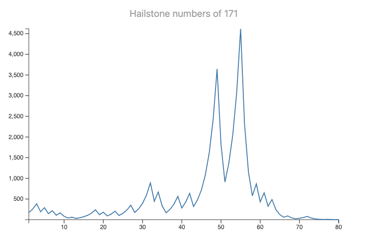
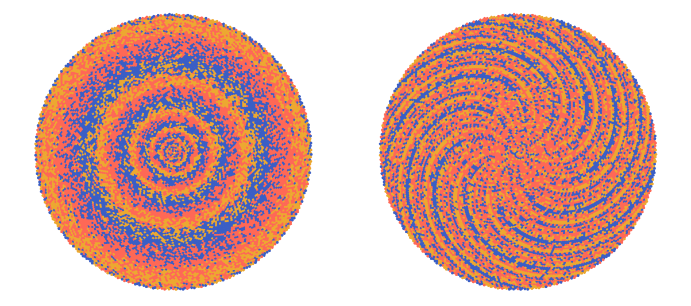
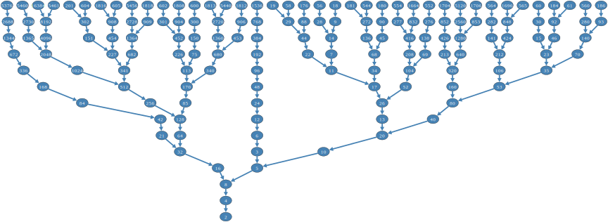

# Collatz conjecture visualizations

Anton Antonov   
[RakuForPrediction blog at WordPress](https://rakuforprediction.wordpress.com)   
May 2025


-----

## Introduction


This notebook presents various visualizations related to the [Collatz conjecture](https://en.wikipedia.org/wiki/Collatz_conjecture), [WMW1, Wk1] using Raku.

The Collatz conjecture, a renowned, _unsolved_ mathematical problem, questions whether iteratively applying two basic arithmetic operations will lead every positive integer to ultimately reach the value of 1.


In this notebook the so-called ["shortcut" version](https://en.wikipedia.org/wiki/Collatz_conjecture#Statement_of_the_problem) of the Collatz function is used:

$
f(n) = \left\{
\begin{array}{ll}
\frac{n}{2} & \text{if } n \equiv 0 \pmod{2}, \\
\frac{3n + 1}{2} & \text{if } n \equiv 1 \pmod{2}.
\end{array}
\right.
$

With that function is used repeatedly form a sequence, beginning with any positive integer, and taking the result of each step as the input for the next.

***The Collatz conjecture is:*** This process will eventually reach the number 1, regardless of which positive integer is chosen initially.

Raku-wise, subs for the Collatz sequences are easy to define. The visualizations are done with the packages
["Graph"](https://raku.land/zef:antononcube/Graph), [AAp1],
["JavaScript::D3"](https://raku.land/zef:antononcube/JavaScript::D3), [AAp2], and
["Math::NumberTheory"](https://raku.land/zef:antononcube/Math::NumberTheory), [AAp3].

There are many articles, blog posts, and videos dedicated to visualizations of the Collatz conjecture. (For example, [KJR1, PZ1, Vv1]).

**Remark:** Consider following the [warnings in [Vv1]](https://youtu.be/094y1Z2wpJg?si=mb2daU4CW3y4gKWj&t=225) and elsewhere:

> Do not work on this [Collatz] problem! (Do real math instead.)

**Remark:** Notebook's visualizations based on "JavaScript::D3" look a lot like the visualizations in [PZ1] -- [D3js](https://d3js.org) is used in both.


-----

## Setup

```raku
use Data::Reshapers;
use Data::Summarizers;
use Data::TypeSystem;
use Graph;
use JavaScript::D3;
use Math::NumberTheory;
```

```raku
#%javascript

require.config({
     paths: {
     d3: 'https://d3js.org/d3.v7.min'
}});

require(['d3'], function(d3) {
     console.log(d3);
});
```

```raku
my $background = 'none';
my $stroke-color = 'Ivory';
my $fill-color = 'none';
my $title-color = 'DarkGray';
```

```raku
sub darker-shades(Str $hex-color, Int $steps) {
    my @rgb = $hex-color.subst(/ ^ '#'/).comb(2).map({ :16($_) });
    my @shades;
    for 1..$steps -> $step {
        my @darker = @rgb.map({ ($_ * (1 - $step / ($steps + 1))).Int });
        @shades.push: '#' ~ @darker.map({ sprintf '%02X', $_ }).join;
    }
    return @shades;
}

#say darker-shades("#34495E", 5);
```

```raku
sub blend-colors(Str $color1, Str $color2, Int $steps) {
    my @rgb1 = $color1.subst(/ ^ '#'/).comb(2).map({ :16($_) });
    my @rgb2 = $color2.subst(/ ^ '#'/).comb(2).map({ :16($_) });
    my @blended;

    for ^$steps -> $step {
        my @blend = (@rgb1 Z @rgb2).map({
            ($_[0] + ($step / $steps) * ($_[1] - $_[0])).Int
        });
        @blended.push: '#' ~ @blend.map({ sprintf '%02X', $_ }).join;
    }
    
    return @blended;
}

#say blend-colors("#34495E", "#FFEBCD", 5);
```

----

## Collatz function definition

Here is a sub for the shortcut version of the Collatz function:

```raku
sub collatz(UInt $n is copy, Int:D $max-steps = 1000) {
    return [] if $n == 0;
    my @sequence = $n;
    while $n != 1 && @sequence.elems < $max-steps {
        $n = ($n %% 2 ?? $n div 2 !! (3 * $n + 1) / 2).Int;
        @sequence.push: $n;
    }
    return @sequence;
}
```

Here is an example using $26$ as a sequence _seed_ (i.e. starting value):

```raku
collatz(26)
```
```
# [26 13 20 10 5 8 4 2 1]
```

The next integer, $27$, produces a much longer sequence:

```raku
collatz(27).elems
```
```
# 71
```

-----

## Simple visualizations


### Collatz sequence numbers


Here is the simplest, informative Collatz sequence -- or [hailstone numbers](https://mathworld.wolfram.com/HailstoneNumber.html) -- plot:

```raku, eval=FALSE
#% js
js-d3-list-line-plot(collatz(171), :$background, :$title-color, title => 'Hailstone numbers of 171')
```



Let us make a multi-line plot for a selection of seeds.

```raku
my @data = (1..1_000).map({ collatz($_) }).grep({ 30 ≤ $_.elems ≤ 150 && $_.max ≤ 600 }).pick(10).sort(*.head).map({my $i = $_.head; $_.kv.map(-> $x, $y {%(group => $i, :$x, :$y )}).Array }).map(*.Slip).Array;

deduce-type(@data)
```
```
# Vector(Assoc(Atom((Str)), Atom((Int)), 3), 322)
```

```raku, eval=FALSE
#% js
js-d3-list-line-plot(@data.flat, :$background)
```


**Remark:** Using simple sampling like the code block below would generally produce very non-uniform length- and max-value sequences.
Hence, we do the filtering above.

```raku
my @data = (^100).pick(9).sort.map(-> $i {collatz($i).kv.map(-> $x, $y {%(group => $i, :$x, :$y )}).Array }).map(*.Slip).Array;
```
```
# [{group => 18, x => 0, y => 18} {group => 18, x => 1, y => 9} {group => 18, x => 2, y => 14} {group => 18, x => 3, y => 7} {group => 18, x => 4, y => 11} {group => 18, x => 5, y => 17} {group => 18, x => 6, y => 26} {group => 18, x => 7, y => 13} {group => 18, x => 8, y => 20} {group => 18, x => 9, y => 10} {group => 18, x => 10, y => 5} {group => 18, x => 11, y => 8} {group => 18, x => 12, y => 4} {group => 18, x => 13, y => 2} {group => 18, x => 14, y => 1} {group => 24, x => 0, y => 24} {group => 24, x => 1, y => 12} {group => 24, x => 2, y => 6} {group => 24, x => 3, y => 3} {group => 24, x => 4, y => 5} {group => 24, x => 5, y => 8} {group => 24, x => 6, y => 4} {group => 24, x => 7, y => 2} {group => 24, x => 8, y => 1} {group => 40, x => 0, y => 40} {group => 40, x => 1, y => 20} {group => 40, x => 2, y => 10} {group => 40, x => 3, y => 5} {group => 40, x => 4, y => 8} {group => 40, x => 5, y => 4} {group => 40, x => 6, y => 2} {group => 40, x => 7, y => 1} {group => 46, x => 0, y => 46} {group => 46, x => 1, y => 23} {group => 46, x => 2, y => 35} {group => 46, x => 3, y => 53} {group => 46, x => 4, y => 80} {group => 46, x => 5, y => 40} {group => 46, x => 6, y => 20} {group => 46, x => 7, y => 10} {group => 46, x => 8, y => 5} {group => 46, x => 9, y => 8} {group => 46, x => 10, y => 4} {group => 46, x => 11, y => 2} {group => 46, x => 12, y => 1} {group => 47, x => 0, y => 47} {group => 47, x => 1, y => 71} {group => 47, x => 2, y => 107} {group => 47, x => 3, y => 161} {group => 47, x => 4, y => 242} {group => 47, x => 5, y => 121} {group => 47, x => 6, y => 182} {group => 47, x => 7, y => 91} {group => 47, x => 8, y => 137} {group => 47, x => 9, y => 206} {group => 47, x => 10, y => 103} {group => 47, x => 11, y => 155} {group => 47, x => 12, y => 233} {group => 47, x => 13, y => 350} {group => 47, x => 14, y => 175} {group => 47, x => 15, y => 263} {group => 47, x => 16, y => 395} {group => 47, x => 17, y => 593} {group => 47, x => 18, y => 890} {group => 47, x => 19, y => 445} {group => 47, x => 20, y => 668} {group => 47, x => 21, y => 334} {group => 47, x => 22, y => 167} {group => 47, x => 23, y => 251} {group => 47, x => 24, y => 377} {group => 47, x => 25, y => 566} {group => 47, x => 26, y => 283} {group => 47, x => 27, y => 425} {group => 47, x => 28, y => 638} {group => 47, x => 29, y => 319} {group => 47, x => 30, y => 479} {group => 47, x => 31, y => 719} {group => 47, x => 32, y => 1079} {group => 47, x => 33, y => 1619} {group => 47, x => 34, y => 2429} {group => 47, x => 35, y => 3644} {group => 47, x => 36, y => 1822} {group => 47, x => 37, y => 911} {group => 47, x => 38, y => 1367} {group => 47, x => 39, y => 2051} {group => 47, x => 40, y => 3077} {group => 47, x => 41, y => 4616} {group => 47, x => 42, y => 2308} {group => 47, x => 43, y => 1154} {group => 47, x => 44, y => 577} {group => 47, x => 45, y => 866} {group => 47, x => 46, y => 433} {group => 47, x => 47, y => 650} {group => 47, x => 48, y => 325} {group => 47, x => 49, y => 488} {group => 47, x => 50, y => 244} {group => 47, x => 51, y => 122} {group => 47, x => 52, y => 61} {group => 47, x => 53, y => 92} {group => 47, x => 54, y => 46} ...]
```

-----

## Distributions


Here are Collatz sequences and their corresponding lengths and max-values:

```raku
my $m = 100_000;
my @cSequences = (1..$m).map({ collatz($_) });
my @cLengths = @cSequences».elems;
my @cMaxes = @cSequences».max;

my @dsCollatz = (1...$m) Z @cLengths Z @cMaxes;
@dsCollatz = @dsCollatz.map({ <seed length max>.Array Z=> $_.Array })».Hash;

sink records-summary(@dsCollatz, field-names => <seed length max>)
```
```
# +-------------------+--------------------+------------------------+
# | seed              | length             | max                    |
# +-------------------+--------------------+------------------------+
# | Min    => 1       | Min    => 1        | Min    => 1            |
# | 1st-Qu => 25000.5 | 1st-Qu => 47       | 1st-Qu => 42272        |
# | Mean   => 50000.5 | Mean   => 72.88948 | Mean   => 320578.18243 |
# | Median => 50000.5 | Median => 68       | Median => 85292        |
# | 3rd-Qu => 75000.5 | 3rd-Qu => 97       | 3rd-Qu => 162980       |
# | Max    => 100000  | Max    => 222      | Max    => 785412368    |
# +-------------------+--------------------+------------------------+
```

Here are histograms of the Collarz sequences lengths and max-value distributions:

```raku, eval=FALSE
#% js
js-d3-histogram(
    @cLengths, 
    100,
    :$background,
    :600width, 
    :400height, 
    title => "Collatz sequences lengths distribution (up to $m)",
    :$title-color
  )
~
js-d3-histogram(
    @cMaxes».log(10), 
    100,
    :$background,
    :600width, 
    :400height, 
    title => "Collatz sequences lg(max-value) distribution (up to $m)",
    :$title-color
  )
```


Here is a scatter plot of seed vs. sequence length:

```raku, eval=FALSE
#% js
js-d3-list-plot(
    @cLengths, 
    :$background, 
    :2point-size,
    :800width, 
    :400height, 
    title => 'Collatz sequences lengths',
    x-label => 'seed',
    y-label => 'sequence length',
    :$title-color
  )
```


-------

## Sunflower embedding


A certain concentric pattern emerges in the spiral embedding plots of the Collatz sequences lengths `mod 8`. (Using `mod 3` makes the pattern clearer.)
Similarly, a clear spiral pattern is seen for the maximum values.

```raku, eval=FALSE
#% js
my @sunflowerLengths = sunflower-embedding(16_000, with => { collatz($_).elems mod 8 mod 3 + 1}):d;
my @sunflowerMaxes = sunflower-embedding(16_000, with => { collatz($_).max mod 8 mod 3 + 1}):d;

js-d3-list-plot(@sunflowerLengths, 
    background => 'none',
    point-size => 4,
    width => 500, height => 440, 
    :!axes, 
    :!legends,
    color-scheme => 'Observable10',
    margins => {:20top, :20bottom, :50left, :50right}
 )

~

js-d3-list-plot(@sunflowerMaxes, 
    background => 'none',
    point-size => 4,
    width => 500, height => 440, 
    :!axes, 
    :!legends,
    color-scheme => 'Observable10',
    margins => {:20top, :20bottom, :50left, :50right}
 )
```



----

## Small graphs


Define a sub for [graph-edge relationship](https://en.wikipedia.org/wiki/Collatz_conjecture#Other_formulations_of_the_conjecture) between consecutive integers in Collatz sequences:

```raku
proto sub collatz-edges(|) {*}

multi sub collatz-edges(Int:D $n) {
    ($n mod 3 == 2) ?? [$n => 2 * $n, $n => (2 * $n - 1) / 3] !! [$n => 2 * $n,]
}

multi sub collatz-edges(@edges where @edges.all ~~ Pair:D) {
    my @leafs = @edges».value.unique;
    @edges.append(@leafs.map({ collatz-edges($_.Int) }).flat)
}
```
```
# &collatz-edges
```

For _didactic_ purposes let use derive the edges of a graph using a certain _small_ number of iterations:

```raku
my @edges = Pair.new(2, 4);

for ^12 { @edges = collatz-edges(@edges) }

deduce-type(@edges)
```
```
# Vector((Any), 536)
```

Make the graph:

```raku
my $g = Graph.new(@edges.map({ $_.value.Str => $_.key.Str })):directed
```
```
# Graph(vertexes => 155, edges => 154, directed => True)
```

Plot the graph using suitable embedding:

```raku, eval=FALSE
#% html
$g.dot(
    engine => 'dot',
    :$background,
    vertex-label-color => 'Gray',
    vertex-shape => 'ellipse',
    vertex-width => 0.8,
    vertex-height => 0.6,
    :24vertex-font-size,
    edge-thickness => 6,
    graph-size => 12
):svg
```



The Collatz sequence paths can be easily followed in the tree graph.


-----

## Big graph


Let us make a bigger, visually compelling graph:

```raku
my $root = 64;
my @edges = Pair.new($root, 2 * $root);
for ^20 { @edges = collatz-edges(@edges) }
my $gBig = Graph.new(@edges.map({ $_.value.Str => $_.key.Str })):!directed;
```
```
# Graph(vertexes => 2581, edges => 2580, directed => False)
```

Next we find the path lengths from the root to each vertex in order to do some sort concentric coloring: 

```raku
my %path-lengths = $gBig.vertex-list.race(:4degree).map({ $_ => $gBig.find-path($_, $root.Str).head.elems });
%path-lengths.values.unique.elems
```
```
# 22
```

We make a blend of these colors:

```raku
JavaScript::D3::Utilities::get-named-colors()<darkred plum orange>
```
```
# (#8B0000 #DDA0DD #FFA500)
```

Here is the graph plot:

```raku, eval=FALSE
#%html
my %classes = $gBig.vertex-list.classify({ %path-lengths{$_} });
my @colors = |blend-colors("#8B0000", "#DDA0DD", 16), |blend-colors("#DDA0DD", "#FFA500", %classes.elems - 16);
my %highlight = %classes.map({ @colors[$_.key - 1] => $_.value });

$gBig.dot(
    engine => 'neato',
    :%highlight,
    :$background,
    vertex-shape => 'circle',
    vertex-width => 0.55,
    :0vertex-font-size,
    vertex-color => 'Red',
    vertex-stroke-width => 2,
    edge-thickness => 8,
    edge-color => 'Purple',
    graph-size => 10
):svg
```


----

## References


### Articles, blog posts

[KJR1] KJ Runia,
["The Collatz Conjecture"](https://opencurve.info/the-collatz-conjecture/),
(2020),
[OpenCurve.info](https://opencurve.info).

[PZ1] Parker Ziegler
["Playing with the Collatz Conjecture"](https://observablehq.com/@parkerziegler/playing-with-the-collatz-conjecture),
(2021),
[ObservableHQ](https://observablehq.com/).

[Wk1] Wikipedia entry,
["Collatz conjecture"](https://en.wikipedia.org/wiki/Collatz_conjecture).

[WMW1] Wolfram Math World entry, 
["Collatz Problem"](https://mathworld.wolfram.com/CollatzProblem.html).


### Packages

[AAp1] Anton Antonov,
[Graph Raku package](https://github.com/antononcube/Raku-Graph),
(2024-2025),
[GitHub/antononcube](https://github.com/antononcube).

[AAp2] Anton Antonov,
[JavaScript::D3 Raku package](https://github.com/antononcube/Raku-JavaScript-D3),
(2022-2025),
[GitHub/antononcube](https://github.com/antononcube).

[AAp3] Anton Antonov,
[Math::NumberTheory Raku package](https://github.com/antononcube/Raku-Math-NumberTheory),
(2025),
[GitHub/antononcube](https://github.com/antononcube).


### Videos

[Vv1] Veritasium,
["The Simplest Math Problem No One Can Solve - Collatz Conjecture"](https://www.youtube.com/watch?v=094y1Z2wpJg),
(2021),
[YouTube@Veritasium](https://www.youtube.com/@veritasium).
