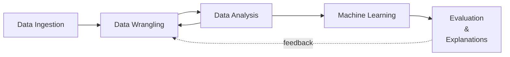

# Data science over small movie dataset -- Part 1

<p style="font-size: 20px; font-weight: bold;">Data transformations and analysis</p>

Anton Antonov   
October 2025  
November 2025  

---

## Introduction

This notebook shows transformations of a movie dataset into a format more suitable for data analysis and for making a movie recommender system. It is the first of a three-part series of notebooks that showcase Raku packages for doing Data Science (DS). The notebook series as a whole goes through this general DS loop:



The movie data was downloaded from ["IMDB Movie Ratings Dataset"](https://www.kaggle.com/datasets/thedevastator/imdb-movie-ratings-dataset). That dataset was chosen because:

- It has the right size for demonstration of data wrangling techniques
    - ≈5000 rows and 15 columns (each row corresponding to a movie)
- It is "real life" data with expected skewness of variable distributions
- It is diverse enough over movie years and genres
- Relatively small number of missing values

The full "Raku for Data Science" showcase is done with three notebooks, [AAn1, AAn2, AAn3]:

1. [Data transformations and analysis](https://github.com/antononcube/RakuForPrediction-blog/blob/main/Notebooks/Jupyter/Data-science-over-a-small-movie-dataset-Part-1.ipynb), [AAn1]
2. [Sparse matrix recommender](https://github.com/antononcube/RakuForPrediction-blog/blob/main/Notebooks/Jupyter/Data-science-over-a-small-movie-dataset-Part-2.ipynb), [AAn2]
3. [Relationships graphs](https://github.com/antononcube/RakuForPrediction-blog/blob/main/Notebooks/Jupyter/Data-science-over-a-small-movie-dataset-Part-3.ipynb), [AAn3]

**Remark:** All three notebooks feature the same introduction, setup, and references sections in order to make it easier for readers to browse, access, or reproduce the content.

**Remark:** The series data files can be found in the folder ["Data"](https://github.com/antononcube/RakuForPrediction-blog/tree/main/Data) of the GitHub repository ["RakuForPrediction-blog"](https://github.com/antononcube/RakuForPrediction-blog), [AAr1].

The notebook series can be used in several ways:

- Just reading this introduction and then browsing the notebooks
- Reading only this (data transformations) notebook in order to see how data wrangling is done
- Evaluating all three notebooks in order to learn and reproduce the computational steps in them

### Outline 

Here are the transformation, data analysis, and machine learning steps taken in the notebook series, [AAn1, AAn2, AAn3]:

1. Ingest the data -- ***Part 1***
    - Shape size and summaries
    - Numerical columns transformation
    - Renaming columns to have more convenient names  
    - Separating the non-uniform genres column into movie-genre associations
        - Into long format
2. Basic data analysis -- ***Part 1***
    - Number of movies per year distribution
    - Movie-genre distribution
    - Pareto principle adherence for movie directors
    - Correlation between number of votes and rating
3. Association Rules Learning (ARL) -- ***Part 1***
    - Converting long format dataset into "baskets" of genres
    - Most frequent combinations of genres
    - Implications between genres
        - I.e. a biography-movie is also a drama-movie 94% of the time
    - LLM-derived dictionary of most commonly used ARL measures    
4. Recommender system creation -- ***Part 2***
    - Conversion of numerical data into categorical data
    - Application of one hot embedding
    - Experimenting / observing recommendation results
    - Getting familiar with the movie data by computing profiles for sets of movies
5. Relationships graphs -- ***Part 3***
    - Find the nearest neighbors for every movie in a certain range of years
    - Make the corresponding nearest neighbors graph
        - Using different weights for the different types of movie metadata
    - Visualize largest components
    - Make and visualize graphs based on different filtering criteria

### Comments & observations

- This notebook series started as a demonstration of making a "real life" data Recommender System (RS).
    - The data transformations notebook would not be needed if the data had "nice" tabular form.
        - Since the data have aggregated values in its "genres" column typical long form transformations have to be done.
        - On the other hand, the actor names per movie are not aggregated but spread-out in three columns.
        - Both cases represent a single movie metadata type.
             - For both long format transformations (or similar) are needed in order to make an RS.
    - After a corresponding Sparse Matrix Recommender (SMR) is made its sparse matrix can be used to do additional analysis.
        - Such extensions are: deriving clusters, making and visualizing graphs, making and evaluating suitable classifiers.
- In most "real life" data processing most of the data transformation listed steps above are taken.
    - Another exploratory data analysis demo is given in the video ["Exploratory Data Analysis with Raku"](https://www.youtube.com/watch?v=YCnjMVSfT8w), [AAv3].
- ARL can be also used for deriving recommendations if the data is large enough.
- The SMR object is based on Nearest Neighbors finding over "bags of tags."
    - Latent Semantic Indexing (LSI) tag-weighting functions are applied.
- The data does not have movie-viewer data, hence only item-item recommenders are created and used.     
- One hot embedding is a common technique, which in this notebook is done via cross-tabulation.
- The categorization of numerical data means putting number into suitable bins or "buckets."
    - The bin or bucket boundaries can be on a regular grid or a quantile grid.
- For categorized numerical data one-hot embedding matrices can be processed to increase similarity between numeric buckets that are close to each to other.
- Nearest-neighbors based recommenders -- like SMR -- can be used as classifiers.
    - These are the so called K-Nearest Neighbors (KNN) classifiers.
    - Although the data is small (both row-wise & column-wise) we can consider making classifiers predicting IMDB ratings or number of votes.
- Using the recommender matrix similarities between different movies can be computed and a corresponding graph can be made.
- Centrality analysis and simulations of random walks over the graph can be made.
    - Like Google's "Page-rank" algorithm.
- The relationship graphs can be used to visualize the "structure" of movie dataset.
- Alternatively, clustering can be used.
    - Hierarchical clustering might be of interest.
- If the movies had reviews or summaries associated with them, then Latent Semantic Analysis (LSA) could be applied.
    - SMR can use both LSA-terms-based and LSA-topics-based representations of the movies.
    - LLMs can be used to derive the LSA representation.
    - Again, *not done in these series of notebooks*.
        - See, the video ["Raku RAG demo"](https://www.youtube.com/watch?v=JHO2Wk1b-Og), [AAv4], for such demonstration.

---

## Setup

Load packages used in the notebook:


```raku
use Math::SparseMatrix;
use ML::SparseMatrixRecommender;
use ML::SparseMatrixRecommender::Utilities;
use Statistics::OutlierIdentifiers;
```

Prime the notebook to show JavaScript plots:


```raku
#% javascript
require.config({
     paths: {
     d3: 'https://d3js.org/d3.v7.min'
}});

require(['d3'], function(d3) {
     console.log(d3);
});
```

Example JavaScript plot:


```raku
#% js
js-d3-list-line-plot(10.rand xx 40, background => 'none', stroke-width => 2)
```

Set different plot style variables:


```raku
my $title-color = 'Silver';
my $stroke-color = 'SlateGray';
my $tooltip-color = 'LightBlue';
my $tooltip-background-color = 'none';
my $tick-labels-font-size = 10;
my $tick-labels-color = 'Silver';
my $tick-labels-font-family = 'Helvetica';
my $background = 'White'; #'#1F1F1F';
my $color-scheme = 'schemeTableau10';
my $color-palette = 'Inferno';
my $edge-thickness = 3;
my $vertex-size = 6;
my $mmd-theme = q:to/END/;
%%{
  init: {
    'theme': 'forest',
    'themeVariables': {
      'lineColor': 'Ivory'
    }
  }
}%%
END
my %force = collision => {iterations => 0, radius => 10},link => {distance => 180};
my %force2 = charge => {strength => -30, iterations => 4}, collision => {radius => 50, iterations => 4}, link => {distance => 30};

sink my %opts = :$background, :$title-color, :$edge-thickness, :$vertex-size;
```

---

## Ingest data

Ingest the movie data:


```raku
# Download and unzip: https://github.com/antononcube/RakuForPrediction-blog/raw/refs/heads/main/Data/movie_data.csv.zip
my $fileName=$*HOME ~ '/Downloads/movie_data.csv';
my @dsMovieData=data-import($fileName, headers=>'auto');

deduce-type(@dsMovieData)
```

```
# Vector(Assoc(Atom((Str)), Atom((Str)), 15), 5043)
```


Show a sample of the movie data:


```raku
#% html
my @field-names = <index movie_title title_year country duration language actor_1_name actor_2_name actor_3_name director_name imdb_score num_user_for_reviews num_voted_users movie_imdb_link>;
@dsMovieData.pick(8)
==> to-html(:@field-names)
```


<table border="1"><thead><tr><th>index</th><th>movie_title</th><th>title_year</th><th>country</th><th>duration</th><th>language</th><th>actor_1_name</th><th>actor_2_name</th><th>actor_3_name</th><th>director_name</th><th>imdb_score</th><th>num_user_for_reviews</th><th>num_voted_users</th><th>movie_imdb_link</th></tr></thead><tbody><tr><td>4399</td><td>I Love Your Work </td><td>2003.0</td><td>USA</td><td>111.0</td><td>English</td><td>Judy Greer</td><td>Marisa Coughlan</td><td>Nicky Katt</td><td>Adam Goldberg</td><td>5.4</td><td>40.0</td><td>1618</td><td>http://www.imdb.com/title/tt0322700/?ref_=fn_tt_tt_1</td></tr><tr><td>347</td><td>A Good Day to Die Hard </td><td>2013.0</td><td>USA</td><td>101.0</td><td>English</td><td>Bruce Willis</td><td>Cole Hauser</td><td>Megalyn Echikunwoke</td><td>John Moore</td><td>5.3</td><td>503.0</td><td>165618</td><td>http://www.imdb.com/title/tt1606378/?ref_=fn_tt_tt_1</td></tr><tr><td>4824</td><td>It Happened One Night </td><td>1934.0</td><td>USA</td><td>65.0</td><td>English</td><td>Claudette Colbert</td><td>Alan Hale</td><td>Walter Connolly</td><td>Frank Capra</td><td>8.2</td><td>235.0</td><td>64888</td><td>http://www.imdb.com/title/tt0025316/?ref_=fn_tt_tt_1</td></tr><tr><td>3406</td><td>Prefontaine </td><td>1997.0</td><td>USA</td><td>106.0</td><td>English</td><td>Kurtwood Smith</td><td>Laurel Holloman</td><td>Amy Locane</td><td>Steve James</td><td>6.8</td><td>37.0</td><td>5673</td><td>http://www.imdb.com/title/tt0119937/?ref_=fn_tt_tt_1</td></tr><tr><td>2683</td><td>A Most Wanted Man </td><td>2014.0</td><td>UK</td><td>122.0</td><td>English</td><td>Philip Seymour Hoffman</td><td>Nina Hoss</td><td>Homayoun Ershadi</td><td>Anton Corbijn</td><td>6.8</td><td>158.0</td><td>57210</td><td>http://www.imdb.com/title/tt1972571/?ref_=fn_tt_tt_1</td></tr><tr><td>704</td><td>The Love Guru </td><td>2008.0</td><td>USA</td><td>87.0</td><td>English</td><td>Justin Timberlake</td><td>Romany Malco</td><td>Verne Troyer</td><td>Marco Schnabel</td><td>3.8</td><td>250.0</td><td>43300</td><td>http://www.imdb.com/title/tt0811138/?ref_=fn_tt_tt_1</td></tr><tr><td>2831</td><td>Under the Skin </td><td>2013.0</td><td>UK</td><td>108.0</td><td>English</td><td>Scarlett Johansson</td><td>Paul Brannigan</td><td>Alison Chand</td><td>Jonathan Glazer</td><td>6.3</td><td>616.0</td><td>85022</td><td>http://www.imdb.com/title/tt1441395/?ref_=fn_tt_tt_1</td></tr><tr><td>560</td><td>Monkeybone </td><td>2001.0</td><td>USA</td><td>93.0</td><td>English</td><td>Brendan Fraser</td><td>Bridget Fonda</td><td>Megan Mullally</td><td>Henry Selick</td><td>4.7</td><td>171.0</td><td>14280</td><td>http://www.imdb.com/title/tt0166276/?ref_=fn_tt_tt_1</td></tr></tbody></table>


Convert string values of the numerical columns into numbers:


```raku
@dsMovieData .= map({ 
    $_<title_year> = $_<title_year>.trim.Int; 
    $_<imdb_score> = $_<imdb_score>.Numeric; 
    $_<num_user_for_reviews> = $_<num_user_for_reviews>.Int; 
    $_<num_voted_users> = $_<num_voted_users>.Int; 
    $_});
deduce-type(@dsMovieData)
```

```
# Vector(Struct([actor_1_name, actor_2_name, actor_3_name, country, director_name, duration, genres, imdb_score, index, language, movie_imdb_link, movie_title, num_user_for_reviews, num_voted_users, title_year], [Str, Str, Str, Str, Str, Str, Str, Rat, Str, Str, Str, Str, Int, Int, Int]), 5043)
```


Summary of the numerical columns:


```raku
sink 
<index title_year imdb_score num_voted_users num_user_for_reviews>
andthen [select-columns(@dsMovieData, $_), $_]
andthen records-summary($_.head, field-names => $_.tail);
```

```
+-----------------+-----------------------+--------------------+------------------------+----------------------+
| index           | title_year            | imdb_score         | num_voted_users        | num_user_for_reviews |
+-----------------+-----------------------+--------------------+------------------------+----------------------+
| 252     => 1    | Min    => 0           | Min    => 1.6      | Min    => 5            | Min    => 0          |
| 1453    => 1    | 1st-Qu => 1998        | 1st-Qu => 5.8      | 1st-Qu => 8589         | 1st-Qu => 64         |
| 2004    => 1    | Mean   => 1959.585961 | Mean   => 6.442138 | Mean   => 83668.160817 | Mean   => 271.63494  |
| 3545    => 1    | Median => 2005        | Median => 6.6      | Median => 34359        | Median => 155        |
| 2903    => 1    | 3rd-Qu => 2011        | 3rd-Qu => 7.2      | 3rd-Qu => 96385        | 3rd-Qu => 324        |
| 2429    => 1    | Max    => 2016        | Max    => 9.5      | Max    => 1689764      | Max    => 5060       |
| 2764    => 1    |                       |                    |                        |                      |
| (Other) => 5036 |                       |                    |                        |                      |
+-----------------+-----------------------+--------------------+------------------------+----------------------+
```

Summary of the name-columns in the data:


```raku
sink 
<director_name actor_1_name actor_2_name actor_3_name>
andthen [select-columns(@dsMovieData, $_), $_]
andthen records-summary($_.head, field-names => $_.tail);
```

```
+--------------------------+---------------------------+-------------------------+------------------------+
| director_name            | actor_1_name              | actor_2_name            | actor_3_name           |
+--------------------------+---------------------------+-------------------------+------------------------+
|                  => 104  | Robert De Niro    => 49   | Morgan Freeman  => 20   |                => 23   |
| Steven Spielberg => 26   | Johnny Depp       => 41   | Charlize Theron => 15   | Steve Coogan   => 8    |
| Woody Allen      => 22   | Nicolas Cage      => 33   | Brad Pitt       => 14   | John Heard     => 8    |
| Clint Eastwood   => 20   | J.K. Simmons      => 31   |                 => 13   | Ben Mendelsohn => 8    |
| Martin Scorsese  => 20   | Denzel Washington => 30   | Meryl Streep    => 11   | Anne Hathaway  => 7    |
| Ridley Scott     => 17   | Bruce Willis      => 30   | James Franco    => 11   | Stephen Root   => 7    |
| Spike Lee        => 16   | Matt Damon        => 30   | Jason Flemyng   => 10   | Sam Shepard    => 7    |
| (Other)          => 4818 | (Other)           => 4799 | (Other)         => 4949 | (Other)        => 4975 |
+--------------------------+---------------------------+-------------------------+------------------------+
```

Convert to long form by skipping special columns (like "genres"):


```raku
my @varnames = <movie_title title_year country actor_1_name actor_2_name actor_3_name num_voted_users num_user_for_reviews imdb_score director_name language>;
my @dsMovieDataLongForm = to-long-format(@dsMovieData, 'index', @varnames, variables-to => 'TagType', values-to => 'Tag');

deduce-type(@dsMovieDataLongForm)
```

```
#  Vector((Any), 55473)
```

**Remark:** The transformation above is also known as "unpivoting" or "pivoting columns into rows".

Show a sample of the converted data:


```raku
#% html
@dsMovieDataLongForm.pick(8)
==> to-html(field-names => <index TagType Tag>)
```

<table border="1"><thead><tr><th>index</th><th>TagType</th><th>Tag</th></tr></thead><tbody><tr><td>3586</td><td>title_year</td><td>1980</td></tr><tr><td>539</td><td>actor_3_name</td><td>Ben Mendelsohn</td></tr><tr><td>1087</td><td>country</td><td>USA</td></tr><tr><td>968</td><td>language</td><td>English</td></tr><tr><td>4856</td><td>director_name</td><td>Maria Maggenti</td></tr><tr><td>3101</td><td>movie_title</td><td>The Longest Day </td></tr><tr><td>2297</td><td>num_user_for_reviews</td><td>26</td></tr><tr><td>684</td><td>num_user_for_reviews</td><td>175</td></tr></tbody></table>


Give some tag types more convenient names:


```raku
my %toBetterTagTypes = 
    movie_title => 'title', 
    title_year => 'year', 
    director_name => 'director',
    actor_1_name => 'actor', actor_2_name => 'actor', actor_3_name => 'actor', 
    num_voted_users => 'votes_count', num_user_for_reviews => 'reviews_count',
    imdb_score => 'score', 
    ;

@dsMovieDataLongForm = @dsMovieDataLongForm.map({ $_<TagType> = %toBetterTagTypes{$_<TagType>} // $_<TagType>; $_ });
@dsMovieDataLongForm = |rename-columns(@dsMovieDataLongForm, {index=>'Item'});

deduce-type(@dsMovieDataLongForm)
```

```
# Vector((Any), 55473)
```


Summarize the long form data:


```raku
sink records-summary(@dsMovieDataLongForm, :12max-tallies)
```

```
+------------------------+------------------+------------------+
| TagType                | Tag              | Item             |
+------------------------+------------------+------------------+
| actor         => 15129 | English => 4704  | 4173    => 11    |
| title         => 5043  | USA     => 3807  | 1330    => 11    |
| votes_count   => 5043  | UK      => 448   | 552     => 11    |
| reviews_count => 5043  | 2009    => 260   | 5022    => 11    |
| country       => 5043  | 2014    => 252   | 4503    => 11    |
| language      => 5043  | 2006    => 239   | 463     => 11    |
| year          => 5043  | 2013    => 237   | 395     => 11    |
| score         => 5043  | 2010    => 230   | 3122    => 11    |
| director      => 5043  | 2015    => 226   | 4873    => 11    |
|                        | 2011    => 226   | 2959    => 11    |
|                        | 2008    => 225   | 23      => 11    |
|                        | 2012    => 223   | 715     => 11    |
|                        | (Other) => 44396 | (Other) => 55341 |
+------------------------+------------------+------------------+
```

Make a separate dataset with movie-genre associations:


```raku
my @dsMovieGenreLongForm = @dsMovieData.map({ $_<index> X $_<genres>.split('|', :skip-empty)}).flat(1).map({ <index genre> Z=> $_ })».Hash;
deduce-type(@dsMovieGenreLongForm)
```

```
# Vector(Assoc(Atom((Str)), Atom((Str)), 2), 14504)
```


Make the genres long form similar to that with the rest of the movie metadata:


```raku
@dsMovieGenreLongForm = rename-columns(@dsMovieGenreLongForm, {index => 'Item', genre => 'Tag'}).map({ $_.push('TagType' => 'genre') });

deduce-type(@dsMovieGenreLongForm)
```

```
# Vector(Assoc(Atom((Str)), Atom((Str)), 3), 14504)
```

```raku
#% html
@dsMovieGenreLongForm.head(8)
==> to-html(field-names => <Item TagType Tag>)
```

<table border="1"><thead><tr><th>Item</th><th>TagType</th><th>Tag</th></tr></thead><tbody><tr><td>0</td><td>genre</td><td>Action</td></tr><tr><td>0</td><td>genre</td><td>Adventure</td></tr><tr><td>0</td><td>genre</td><td>Fantasy</td></tr><tr><td>0</td><td>genre</td><td>Sci-Fi</td></tr><tr><td>1</td><td>genre</td><td>Action</td></tr><tr><td>1</td><td>genre</td><td>Adventure</td></tr><tr><td>1</td><td>genre</td><td>Fantasy</td></tr><tr><td>2</td><td>genre</td><td>Action</td></tr></tbody></table>


----

## Statistics

In this section we compute different statistics that should give us better idea what the data is.

Show movie years distribution:


```raku
#% js
js-d3-bar-chart(@dsMovieData.map(*<title_year>.Str).&tally.sort(*.head), title => 'Movie years distribution', :$title-color, :1200width, :$background)
~
js-d3-box-whisker-chart(@dsMovieData.map(*<title_year>)».Int.grep(*>1916), :horizontal, :$background)
```


Show movie genre distribution:


```raku
#% js
my %genreCounts = cross-tabulate(@dsMovieGenreLongForm, 'Item', 'Tag', :sparse).column-sums(:p);
js-d3-bar-chart(%genreCounts.sort, title => 'Genre distributions', :$background, :$title-color)
```


Check Pareto principle adherence for director names:


```raku
#% js
pareto-principle-statistic(@dsMovieData.map(*<director_name>))
==> js-d3-list-line-plot(
        :$background,
        title => 'Pareto principle adherence for movie directors',
        y-label => 'probability', x-label => 'index',
        :grid-lines, :5stroke-width, :$title-color)
```


Plot the number of IMDB votes vs IMBDB scores:


```raku
#% js
@dsMovieData.map({ %( x => $_<num_voted_users>».Num».log(10), y => $_<imdb_score>».Num ) })
==> js-d3-list-plot(
        :$background,
        title => 'Number of IMBD votes vs IMDB scores',
        x-label => 'Number of votes, lg', y-label => 'score',
        :grid-lines, point-size => 4, :$title-color)
```


---

## Association rules learning

It is interesting to see which genres associated closely with each other. One way to find to those associations is to use Association Rule Learning (ARL).

For each movie make a "basket" of genres:


```raku
my @baskets = cross-tabulate(@dsMovieGenreLongForm, 'Item', 'Tag').values».keys».List;
@baskets».elems.&tally
```

```
# {1 => 633, 2 => 1355, 3 => 1628, 4 => 981, 5 => 349, 6 => 75, 7 => 18, 8 => 4}
```

Find frequent sets that are seen in at least 300 movies:


```raku
my @freqSets = frequent-sets(@baskets, min-support => 300, min-number-of-items => 2, max-number-of-items => Inf);
deduce-type(@freqSets):tally
```

```
# Tuple([Pair(Vector(Atom((Str)), 2), Atom((Rat))) => 14, Pair(Vector(Atom((Str)), 3), Atom((Rat))) => 1], 15)
```


```raku
to-pretty-table(@freqSets.map({ %( FrequentSet => $_.key.join(' '), Frequency => $_.value) }).sort(-*<Frequency>), field-names => <FrequentSet Frequency>, align => 'l');
```

```
+----------------------+-----------+
| FrequentSet          | Frequency |
+----------------------+-----------+
| Drama Romance        | 0.146143  |
| Drama Thriller       | 0.138211  |
| Comedy Drama         | 0.131469  |
| Action Thriller      | 0.116796  |
| Comedy Romance       | 0.116796  |
| Crime Thriller       | 0.108665  |
| Crime Drama          | 0.104303  |
| Action Adventure     | 0.093198  |
| Comedy Family        | 0.070989  |
| Mystery Thriller     | 0.070196  |
| Action Drama         | 0.068412  |
| Action Sci-Fi        | 0.066627  |
| Crime Drama Thriller | 0.066032  |
| Action Crime         | 0.065041  |
| Adventure Comedy     | 0.061670  |
+----------------------+-----------+
```


Here are the corresponding association rules:


```raku
association-rules(@baskets, min-support => 0.025, min-confidence => 0.70)
==> { .sort(-*<confidence>) }()
==> { to-pretty-table($_, field-names => <antecedent consequent count support confidence lift leverage conviction>) }()
```

```
+---------------------+------------+-------+----------+------------+----------+----------+------------+
|      antecedent     | consequent | count | support  | confidence |   lift   | leverage | conviction |
+---------------------+------------+-------+----------+------------+----------+----------+------------+
|      Biography      |   Drama    |  275  | 0.054531 |  0.938567  | 1.824669 | 0.024646 |  7.904874  |
|       History       |   Drama    |  189  | 0.037478 |  0.913043  | 1.775049 | 0.016364 |  5.584672  |
|   Animation Comedy  |   Family   |  154  | 0.030537 |  0.895349  | 8.269678 | 0.026845 |  8.520986  |
| Adventure Animation |   Family   |  151  | 0.029942 |  0.893491  | 8.252520 | 0.026314 |  8.372364  |
|         War         |   Drama    |  190  | 0.037676 |  0.892019  | 1.734175 | 0.015950 |  4.497297  |
|      Animation      |   Family   |  205  | 0.040650 |  0.847107  | 7.824108 | 0.035455 |  5.832403  |
|    Crime Mystery    |  Thriller  |  129  | 0.025580 |  0.821656  | 2.936649 | 0.016869 |  4.038299  |
|     Action Crime    |  Thriller  |  259  | 0.051358 |  0.789634  | 2.822201 | 0.033160 |  3.423589  |
|  Adventure Thriller |   Action   |  175  | 0.034702 |  0.781250  | 3.417037 | 0.024546 |  3.526246  |
|    Drama Mystery    |  Thriller  |  200  | 0.039659 |  0.769231  | 2.749278 | 0.025234 |  3.120894  |
|   Animation Family  |   Comedy   |  154  | 0.030537 |  0.751220  | 2.023718 | 0.015448 |  2.527499  |
|   Adventure Sci-Fi  |   Action   |  193  | 0.038271 |  0.736641  | 3.221927 | 0.026393 |  2.928956  |
|   Animation Family  | Adventure  |  151  | 0.029942 |  0.736585  | 4.024485 | 0.022502 |  3.101475  |
|      Animation      |   Comedy   |  172  | 0.034107 |  0.710744  | 1.914680 | 0.016293 |  2.173825  |
|       Mystery       |  Thriller  |  354  | 0.070196 |  0.708000  | 2.530435 | 0.042456 |  2.466460  |
+---------------------+------------+-------+----------+------------+----------+----------+------------+
```


### Measure cheat-sheet

Here is a table showing the formulas for the Association Rules Learning measures (confidence, lift, leverage, conviction), along with their minimum value, maximum value, and value of indifference:

| Measure    | Formula                                                                                   | Min Value                                         | Max Value        | Value of Indifference |
|------------|-------------------------------------------------------------------------------------------|--------------------------------------------------|------------------|-----------------------|
| Confidence | $ \text{conf}(A \Rightarrow B) = \frac{P(A \cap B)}{P(A)} $                              | 0                                                | 1                | $ P(B) $            |
| Lift       | $ \text{lift}(A \Rightarrow B) = \frac{P(A \cap B)}{P(A) \cdot P(B)} $                 | 0                                                | $ +\infty $    | 1                     |
| Leverage   | $ \text{leverage}(A \Rightarrow B) = P(A \cap B) - P(A) \cdot P(B) $                   | $-\min\{P(A)P(\neg B), P(\neg A)P(B)\}$        | $\min\{P(A)P(B), P(\neg A)P(\neg B)\}$ | 0                     |
| Conviction | $ \text{conv}(A \Rightarrow B) = \frac{1 - P(B)}{1 - \text{conf}(A \Rightarrow B)} = \frac{1 - P(B)}{1 - \frac{P(A \cap B)}{P(A)}} $ | 0                                                | $ +\infty $    | 1                     |

#### Explanation of terms:

- **support(X)** = P(X), the proportion of transactions containing itemset X.
- **¬A** = complement of A (transactions not containing A).
- Value of indifference generally means the value where the measure indicates independence or no association.  
- For Confidence, the baseline is support(B) (probability of B alone).
- For Lift and Conviction, 1 indicates no association.
- Leverage's minimum and maximum depend on the supports of A and B.


### LLM prompt

Here is the prompt used to generate the ARL metrics dictionary table above:

> Give the formulas for the Association Rules Learning measures: confidence, lift, leverage, and conviction.
> In a Markdown table for each measure give the min value, max value, value of indifference. Make sure the formulas are in LaTeX code.

----

## Export transformed data

Here we export the transformed data in order to streamline the computations in the other notebooks of the series:


```raku
data-export($*HOME ~ '/Downloads/dsMovieDataLongForm.csv', @dsMovieDataLongForm.append(@dsMovieGenreLongForm))
```

---

## References

### Articles, blog posts

[AA1] Anton Antonov, ["Introduction to data wrangling with Raku"](https://rakuforprediction.wordpress.com/2021/12/31/introduction-to-data-wrangling-with-raku/), (2021), [RakuForPrediction at WordPress](https://rakuforprediction.wordpress.com).

[AA2] Anton Antonov, ["Implementing Machine Learning algorithms in Raku (TRC-2022 talk)"](https://rakuforprediction.wordpress.com/2022/08/15/implementing-machine-learning-algorithms-in-raku-trc-2022-talk/), (2021), [RakuForPrediction at WordPress](https://rakuforprediction.wordpress.com).

### Notebooks 

[AAn1] Anton Antonov, ["Data science over small movie dataset -- Part 1"](https://github.com/antononcube/RakuForPrediction-blog/blob/main/Notebooks/Jupyter/Data-science-over-a-small-movie-dataset-Part-1.ipynb), (2025), [RakuForPrediction-blog at GitHub](https://github.com/antononcube/RakuForPrediction-blog/).

[AAn2] Anton Antonov, ["Data science over small movie dataset -- Part 1"](https://github.com/antononcube/RakuForPrediction-blog/blob/main/Notebooks/Jupyter/Data-science-over-a-small-movie-dataset-Part-2.ipynb), (2025), [RakuForPrediction-blog at GitHub](https://github.com/antononcube/RakuForPrediction-blog/).

[AAn3] Anton Antonov, ["Data science over small movie dataset -- Part 3"](https://github.com/antononcube/RakuForPrediction-blog/blob/main/Notebooks/Jupyter/Data-science-over-a-small-movie-dataset-Part-3.ipynb), (2025), [RakuForPrediction-blog at GitHub](https://github.com/antononcube/RakuForPrediction-blog/).


### Packages

[AAp1] Anton Antonov, [Data::Importers, Raku package](https://github.com/antononcube/Raku-Data-Importers), (2024-2025), [GitHub/antononcube](https://github.com/antononcube).

[AAp2] Anton Antonov, [Data::Reshapers, Raku package](https://github.com/antononcube/Raku-Data-Reshapers), (2021-2025), [GitHub/antononcube](https://github.com/antononcube).

[AAp3] Anton Antonov, [Data::Summarizers, Raku package](https://github.com/antononcube/Raku-Data-Summarizers), (2021-2024), [GitHub/antononcube](https://github.com/antononcube).

[AAp4] Anton Antonov, [Graph, Raku package](https://github.com/antononcube/Raku-Graph), (2024-2025), [GitHub/antononcube](https://github.com/antononcube).

[AAp5] Anton Antonov, [JavaScript::D3, Raku package](https://github.com/antononcube/Raku-JavaScript-D3), (2022-2025), [GitHub/antononcube](https://github.com/antononcube).

[AAp6] Anton Antonov, [Jupyter::Chatbook, Raku package](https://github.com/antononcube/Raku-Jupyter-Chatbook), (2023-2025), [GitHub/antononcube](https://github.com/antononcube).

[AAp7] Anton Antonov, [Math::SparseMatrix, Raku package](https://github.com/antononcube/Raku-Math-SparseMatrix), (2024-2025), [GitHub/antononcube](https://github.com/antononcube).

[AAp8] Anton Antonov, [ML::AssociationRuleLearning, Raku package](https://github.com/antononcube/Raku-ML-AssociationRuleLearning), (2022-2024), [GitHub/antononcube](https://github.com/antononcube).

[AAp9] Anton Antonov, [ML::SparseMatrixRecommender, Raku package](https://github.com/antononcube/Raku-ML-SparseMatrixRecommender), (2025), [GitHub/antononcube](https://github.com/antononcube).

[AAp10] Anton Antonov, [Statistics::OutlierIdentifiers, Raku package](https://github.com/antononcube/Raku-Statistics-OutlierIdentifiers), (2022), [GitHub/antononcube](https://github.com/antononcube).


### Repositories

[AAr1] Anton Antonov, [RakuForPrediction-blog](https://github.com/antononcube/RakuForPrediction-blog), (2022-2025), [GitHub/antononcube](https://github.com/antononcube).

[AAr2] Anton Antonov, [RakuForPrediction-book](https://github.com/antononcube/RakuForPrediction-book), (2021-2025), [GitHub/antononcube](https://github.com/antononcube).

### Videos

[AAv1] Anton Antonov, ["Simplified Machine Learning Workflows Overview (Raku-centric)"](https://www.youtube.com/watch?v=p3iwPsc6e74), (2022), [YouTube/@AAA4prediction](https://www.youtube.com/@AAA4prediction).

[AAv2] Anton Antonov, ["TRC 2022 Implementation of ML algorithms in Raku"](https://www.youtube.com/watch?v=efRHfjYebs4), (2022), [YouTube/@AAA4prediction](https://www.youtube.com/@AAA4prediction).

[AAv3] Anton Antonov, ["Exploratory Data Analysis with Raku"](https://www.youtube.com/watch?v=YCnjMVSfT8w), (2024), [YouTube/@AAA4prediction](https://www.youtube.com/@AAA4prediction).

[AAv4] Anton Antonov, ["Raku RAG demo"](https://www.youtube.com/watch?v=JHO2Wk1b-Og), (2024), [YouTube/@AAA4prediction](https://www.youtube.com/@AAA4prediction).

