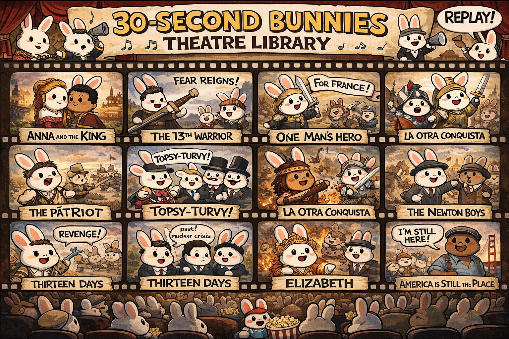
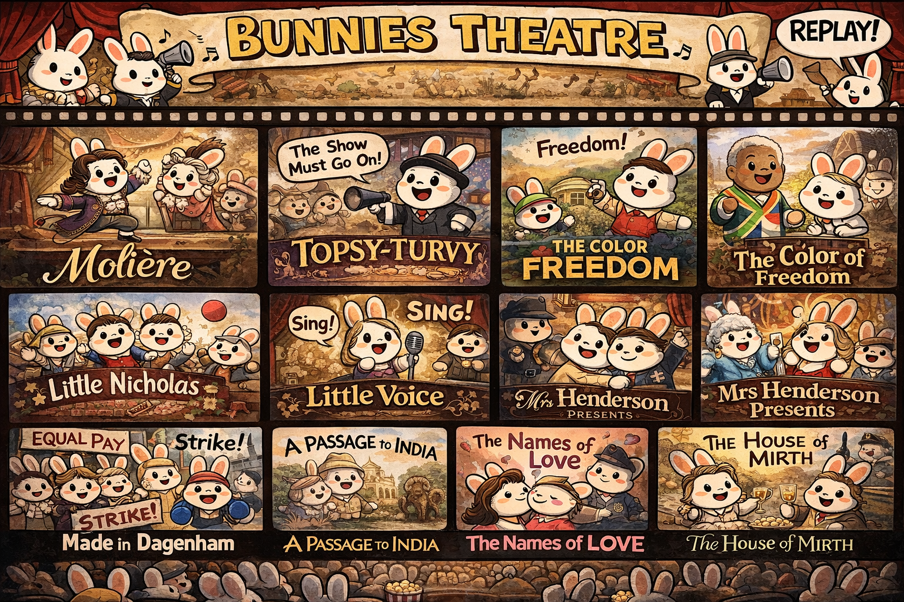
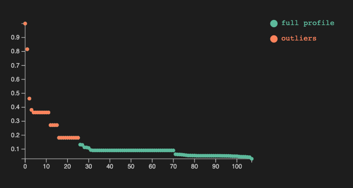

# Data science over small movie dataset -- Part 2

<p style="font-size: 20px; font-weight: bold;">Sparse matrix recommender</p>

Anton Antonov   
October÷December 2025   

---

## Introduction

This document ([notebook](https://github.com/antononcube/RakuForPrediction-blog/blob/main/Notebooks/Jupyter/Data-science-over-a-small-movie-dataset-Part-2.ipynb)) 
shows transformation of movie dataset into a form more suitable for making a ***movie recommender system***.
(It builds upon [Part 1](./Data-science-over-a-small-movie-dataset-Part-1.md) of the blog posts series.)

The movie data was downloaded from ["IMDB Movie Ratings Dataset"](https://www.kaggle.com/datasets/thedevastator/imdb-movie-ratings-dataset). That dataset was chosen because:

- It has the right size for demonstration of data wrangling techniques
  - ≈5000 rows and 15 columns (each row corresponding to a movie)
- It is "real life" data with expected skewness of variable distributions
- It is diverse enough over movie years and genres
- Relatively small number of missing values

The full "Raku for Data Science" showcase is done with three notebooks, [AAn1, AAn2, AAn3]:

1. [Data transformations and analysis](https://github.com/antononcube/RakuForPrediction-blog/blob/main/Notebooks/Jupyter/Data-science-over-a-small-movie-dataset-Part-1.ipynb), [AAn1]
2. [Sparse matrix recommender](https://github.com/antononcube/RakuForPrediction-blog/blob/main/Notebooks/Jupyter/Data-science-over-a-small-movie-dataset-Part-2.ipynb), [AAn2]
3. [Relationships graphs](https://github.com/antononcube/RakuForPrediction-blog/blob/main/Notebooks/Jupyter/Data-science-over-a-small-movie-dataset-Part-3.ipynb), [AAn3]

**Remark:** All three notebooks feature the same introduction, setup, and references sections in order to make it easier for readers to browse, access, or reproduce the content.

**Remark:** The series data files can be found in the folder ["Data"](https://github.com/antononcube/RakuForPrediction-blog/tree/main/Data) of the GitHub repository ["RakuForPrediction-blog"](https://github.com/antononcube/RakuForPrediction-blog), [AAr1].

The notebook series can be used in several ways:

- Just reading this introduction and then browsing the notebooks
- Reading only this (data transformations) notebook in order to see how data wrangling is done
- Evaluating all three notebooks in order to learn and reproduce the computational steps in them

### Outline

Here are the transformation, data analysis, and machine learning steps taken in the notebook series, [AAn1, AAn2, AAn3]:

1. Ingest the data -- ***Part 1***
    - Shape size and summaries
    - Numerical columns transformation
    - Renaming columns to have more convenient names
    - Separating the non-uniform genres column into movie-genre associations
        - Into long format
2. Basic data analysis -- ***Part 1***
    - Number of movies per year distribution
    - Movie-genre distribution
    - Pareto principle adherence for movie directors
    - Correlation between number of votes and rating
3. Association Rules Learning (ARL) -- ***Part 1***
    - Converting long format dataset into "baskets" of genres
    - Most frequent combinations of genres
    - Implications between genres
        - I.e. a biography-movie is also a drama-movie 94% of the time
    - LLM-derived dictionary of most commonly used ARL measures
4. Recommender system creation -- ***Part 2***
    - Conversion of numerical data into categorical data
    - Application of one hot embedding
    - Experimenting / observing recommendation results
    - Getting familiar with the movie data by computing profiles for sets of movies
5. Relationships graphs -- ***Part 3***
    - Find the nearest neighbors for every movie in a certain range of years
    - Make the corresponding nearest neighbors graph
        - Using different weights for the different types of movie metadata
    - Visualize largest components
    - Make and visualize graphs based on different filtering criteria

### Comments & observations

- This notebook series started as a demonstration of making a "real life" data Recommender System (RS).
  - The data transformations notebook would not be needed if the data had "nice" tabular form.
    - Since the data have aggregated values in its "genres" column typical long form transformations have to be done.
    - On the other hand, the actor names per movie are not aggregated but spread-out in three columns.
    - Both cases represent a single movie metadata type.
      - For both long format transformations (or similar) are needed in order to make an RS.
  - After a corresponding Sparse Matrix Recommender (SMR) is made its sparse matrix can be used to do additional analysis.
    - Such extensions are: deriving clusters, making and visualizing graphs, making and evaluating suitable classifiers.
- In most "real life" data processing most of the data transformation listed steps above are taken.
  - Another exploratory data analysis demo is given in the video ["Exploratory Data Analysis with Raku"](https://www.youtube.com/watch?v=YCnjMVSfT8w), [AAv3].
- ARL can be also used for deriving recommendations if the data is large enough.
- The SMR object is based on Nearest Neighbors finding over "bags of tags."
  - Latent Semantic Indexing (LSI) tag-weighting functions are applied.
- The data does not have movie-viewer data, hence only item-item recommenders are created and used.
- One hot embedding is a common technique, which in this notebook is done via cross-tabulation.
- The categorization of numerical data means putting number into suitable bins or "buckets."
  - The bin or bucket boundaries can be on a regular grid or a quantile grid.
- For categorized numerical data one-hot embedding matrices can be processed to increase similarity between numeric buckets that are close to each to other.
- Nearest-neighbors based recommenders -- like SMR -- can be used as classifiers.
  - These are the so called K-Nearest Neighbors (KNN) classifiers.
  - Although the data is small (both row-wise & column-wise) we can consider making classifiers predicting IMDB ratings or number of votes.
- Using the recommender matrix similarities between different movies can be computed and a corresponding graph can be made.
- Centrality analysis and simulations of random walks over the graph can be made.
  - Like Google's "Page-rank" algorithm.
- The relationship graphs can be used to visualize the "structure" of movie dataset.
- Alternatively, clustering can be used.
  - Hierarchical clustering might be of interest.
- If the movies had reviews or summaries associated with them, then Latent Semantic Analysis (LSA) could be applied.
  - SMR can use both LSA-terms-based and LSA-topics-based representations of the movies.
  - LLMs can be used to derive the LSA representation.
  - Again, *not done in these series of notebooks*.
    - See, the video ["Raku RAG demo"](https://www.youtube.com/watch?v=JHO2Wk1b-Og), [AAv4], for such demonstration.

---

## Setup

Load packages used in the notebook:

```raku
use Math::SparseMatrix;
use ML::SparseMatrixRecommender;
use ML::SparseMatrixRecommender::Utilities;
use Statistics::OutlierIdentifiers;
```

```raku
#% javascript
require.config({
     paths: {
     d3: 'https://d3js.org/d3.v7.min'
}});

require(['d3'], function(d3) {
     console.log(d3);
});
```

```raku
#% js
js-d3-list-line-plot(10.rand xx 40, background => 'none', stroke-width => 2)
```

```raku
my $title-color = 'Silver';
my $stroke-color = 'SlateGray';
my $tooltip-color = 'LightBlue';
my $tooltip-background-color = 'none';
my $tick-labels-font-size = 10;
my $tick-labels-color = 'Silver';
my $tick-labels-font-family = 'Helvetica';
my $background = '#1F1F1F';
my $color-scheme = 'schemeTableau10';
my $color-palette = 'Inferno';
my $edge-thickness = 3;
my $vertex-size = 6;
my $mmd-theme = q:to/END/;
%%{
  init: {
    'theme': 'forest',
    'themeVariables': {
      'lineColor': 'Ivory'
    }
  }
}%%
END
my %force = collision => {iterations => 0, radius => 10},link => {distance => 180};
my %force2 = charge => {strength => -30, iterations => 4}, collision => {radius => 50, iterations => 4}, link => {distance => 30};

my %opts = :$background, :$title-color, :$edge-thickness, :$vertex-size;
```

```
# {background => #1F1F1F, edge-thickness => 3, title-color => Silver, vertex-size => 6}
```

---

## Ingest data

Download from GitHub the files:

- https://github.com/antononcube/RakuForPrediction-blog/blob/main/Data/movie_data.csv.zip
- https://github.com/antononcube/RakuForPrediction-blog/blob/main/Data/dsMovieDataLongForm.csv.zip

And unzip them.

Ingest movie data:

```raku
my $fileName = $*HOME ~ '/Downloads/movie_data.csv';
my @dsMovieData=data-import($fileName, headers=>'auto');
@dsMovieData .= map({ $_<title_year> = $_<title_year>.Int.Str; $_});
deduce-type(@dsMovieData)
```

```
# Vector(Assoc(Atom((Str)), Atom((Str)), 15), 5043)
```

Here is a sample of the movie data over the columns we most interested in:

```raku
#% html
my @movie-columns = <index movie_title title_year genres imdb_score num_voted_users>;
@dsMovieData.pick(4)
==> to-html(field-names => @movie-columns)
```

<table border="1"><thead><tr><th>index</th><th>movie_title</th><th>title_year</th><th>genres</th><th>imdb_score</th><th>num_voted_users</th></tr></thead><tbody><tr><td>3322</td><td>Veronika Decides to Die</td><td>2009</td><td>Drama|Romance</td><td>6.5</td><td>10100</td></tr><tr><td>1511</td><td>The Maze Runner</td><td>2014</td><td>Action|Mystery|Sci-Fi|Thriller</td><td>6.8</td><td>310903</td></tr><tr><td>1301</td><td>Big Miracle</td><td>2012</td><td>Biography|Drama|Romance</td><td>6.5</td><td>15231</td></tr><tr><td>55</td><td>The Good Dinosaur</td><td>2015</td><td>Adventure|Animation|Comedy|Family|Fantasy</td><td>6.8</td><td>62836</td></tr></tbody></table>

Ingest the movie data already ***transformed*** in the first notebook, [AAn1]:

```raku
my @dsMovieDataLongForm = data-import($*HOME ~ '/Downloads/dsMovieDataLongForm.csv', headers => 'auto');
deduce-type(@dsMovieDataLongForm)
```

```
# Vector(Assoc(Atom((Str)), Atom((Str)), 3), 84481)
```

Data summary:

```raku
my @field-names = <Item TagType Tag>;
sink records-summary(@dsMovieDataLongForm, :@field-names)
```

```
# +------------------+------------------------+-------------------+
# | Item             | TagType                | Tag               |
# +------------------+------------------------+-------------------+
# | 1387    => 27    | genre         => 29008 | Drama    => 5188  |
# | 3539    => 27    | actor         => 15129 | English  => 4704  |
# | 902     => 27    | title         => 5043  | USA      => 3807  |
# | 2340    => 27    | reviews_count => 5043  | Comedy   => 3744  |
# | 839     => 25    | language      => 5043  | Thriller => 2822  |
# | 1667    => 25    | country       => 5043  | Action   => 2306  |
# | 466     => 25    | director      => 5043  | Romance  => 2214  |
# | (Other) => 84298 | (Other)       => 15129 | (Other)  => 59696 |
# +------------------+------------------------+-------------------+

```

----

## Recommender system

One way to investigate (browse) the data is to make a recommender system and explore with it different aspects of the movie dataset like movie profiles and nearest neighbors similarities distribution.

### Make the recommender

In order to make a more meaningful recommender we put the values of the different numerical variables into "buckets" -- i.e. intervals derived corresponding to the values distribution for each variable. The boundaries of the intervals can form a regular grid, correspond to quanitile values, or be specially made. Here we use quantiles:

```raku
my @bucketVars = <score votes_count reviews_count>;
my @dsMovieDataLongForm2;
sink for @dsMovieDataLongForm.map(*<TagType>).unique -> $var {
    if $var ∈ @bucketVars {
        my %bucketizer = ML::SparseMatrixRecommender::Utilities::categorize-to-intervals(@dsMovieDataLongForm.grep(*<TagType> eq $var).map(*<Tag>)».Numeric, probs => (0..6) >>/>> 6, :interval-names):pairs;
        @dsMovieDataLongForm2.append(@dsMovieDataLongForm.grep(*<TagType> eq $var).map(*.clone).map({ $_<Tag> = %bucketizer{$_<Tag>}; $_ }))
    } else {
        @dsMovieDataLongForm2.append(@dsMovieDataLongForm.grep(*<TagType> eq $var))
    }
}
```

```raku
sink records-summary(@dsMovieDataLongForm2, :@field-names, :12max-tallies)
```

```
# +------------------+------------------------+--------------------+
# | Item             | TagType                | Tag                |
# +------------------+------------------------+--------------------+
# | 902     => 19    | actor         => 15129 | English   => 4704  |
# | 2340    => 19    | genre         => 14504 | USA       => 3807  |
# | 1387    => 19    | score         => 5043  | Drama     => 2594  |
# | 3539    => 19    | country       => 5043  | Comedy    => 1872  |
# | 152     => 18    | votes_count   => 5043  | Thriller  => 1411  |
# | 466     => 18    | language      => 5043  | Action    => 1153  |
# | 1424    => 18    | year          => 5043  | Romance   => 1107  |
# | 839     => 18    | director      => 5043  | Adventure => 923   |
# | 132     => 18    | title         => 5043  | 6.1≤v<6.6 => 901   |
# | 113     => 18    | reviews_count => 5043  | 7≤v<7.5   => 891   |
# | 720     => 18    |                        | Crime     => 889   |
# | 1284    => 18    |                        | 7.5≤v<9.5 => 886   |
# | (Other) => 69757 |                        | (Other)   => 48839 |
# +------------------+------------------------+--------------------+

```

Here we make a Sparse Matrix Recommender (SMR):

```raku
my $smrObj = 
    ML::SparseMatrixRecommender.new
    .create-from-long-form(
        @dsMovieDataLongForm2, 
        item-column-name => 'Item', 
        tag-type-column-name => 'TagType',
        tag-column-name => 'Tag',
        :add-tag-types-to-column-names)        
    .apply-term-weight-functions('IDF', 'None', 'Cosine')
```

```
# ML::SparseMatrixRecommender(:matrix-dimensions((5043, 13825)), :density(<23319/23239825>), :tag-types(("reviews_count", "score", "votes_count", "genre", "country", "language", "actor", "director", "title", "year")))
```

Here are the recommender sub-matrices dimensions (rows and columns):

```raku
.say for $smrObj.take-matrices.deepmap(*.dimensions).sort(*.key)
```

```
# actor => (5043 6256)
# country => (5043 66)
# director => (5043 2399)
# genre => (5043 26)
# language => (5043 48)
# reviews_count => (5043 7)
# score => (5043 7)
# title => (5043 4917)
# votes_count => (5043 7)
# year => (5043 92)

```

Note that the sub-matrices of "reviews_count", "score", and "votes_count" have small number of columns, corresponding to the number probabilities specified when categorizing to intervals.

### Enhance with one-hot embedding

```raku
my $mat = $smrObj.take-matrices<year>;

my $matUp = Math::SparseMatrix.new(
    diagonal => 1/2 xx ($mat.columns-count - 1), k => 1, 
    row-names => $mat.column-names,
    column-names => $mat.column-names
);

my $matDown = $matUp.transpose;

# mat = mat + mat . matDown + mat . matDown
$mat = $mat.add($mat.dot($matUp)).add($mat.dot($matDown));
```

```
# Math::SparseMatrix(:specified-elements(14915), :dimensions((5043, 92)), :density(<14915/463956>))
```

Make a new recommender with the enhanced matrices:

```raku
my %matrices = $smrObj.take-matrices;
%matrices<year> = $mat;
my $smrObj2 = ML::SparseMatrixRecommender.new(%matrices)
```

```
# ML::SparseMatrixRecommender(:matrix-dimensions((5043, 13825)), :density(<79829/69719475>), :tag-types(("genre", "title", "year", "actor", "director", "votes_count", "reviews_count", "score", "country", "language")))
```

### Recommendations

Example recommendation by profile:

```raku
sink $smrObj2
.apply-tag-type-weights({genre => 2})
.recommend-by-profile(<genre:History year:1999>, 12, :!normalize)
.join-across(select-columns(@dsMovieData, @movie-columns), 'index')
.echo-value(as => {to-pretty-table($_, align => 'l', field-names => ['score', |@movie-columns])})
```

```
# +----------+-------+------------------------------------------+------------+----------------------------------------------+------------+-----------------+
# | score    | index | movie_title                              | title_year | genres                                       | imdb_score | num_voted_users |
# +----------+-------+------------------------------------------+------------+----------------------------------------------+------------+-----------------+
# | 1.887751 | 553   | Anna and the King                       | 1999       | Drama|History|Romance                        | 6.7        | 31080           |
# | 1.817476 | 215   | The 13th Warrior                        | 1999       | Action|Adventure|History                     | 6.6        | 101411          |
# | 1.567726 | 1016  | The Messenger: The Story of Joan of Arc | 1999       | Adventure|Biography|Drama|History|War        | 6.4        | 55889           |
# | 1.500264 | 2468  | One Man's Hero                          | 1999       | Action|Drama|History|Romance|War|Western     | 6.2        | 899             |
# | 1.487091 | 2308  | Topsy-Turvy                             | 1999       | Biography|Comedy|Drama|History|Music|Musical | 7.4        | 10037           |
# | 1.479006 | 4006  | La otra conquista                       | 1998       | Drama|History                                | 6.8        | 1024            |
# | 1.411933 | 492   | Thirteen Days                           | 2000       | Drama|History|Thriller                       | 7.3        | 45231           |
# | 1.312900 | 909   | Beloved                                 | 1998       | Drama|History|Horror                         | 5.9        | 6082            |
# | 1.237700 | 1931  | Elizabeth                               | 1998       | Biography|Drama|History                      | 7.5        | 75973           |
# | 1.168287 | 253   | The Patriot                             | 2000       | Action|Drama|History|War                     | 7.1        | 207613          |
# | 1.069476 | 1820  | The Newton Boys                         | 1998       | Action|Crime|Drama|History|Western           | 6.0        | 8309            |
# | 1.000000 | 4767  | America Is Still the Place              | 2015       | History                                      | 7.5        | 22              |
# +----------+-------+------------------------------------------+------------+----------------------------------------------+------------+-----------------+

```



Recommendation by history:

```raku
sink $smrObj
.recommend(<2125 2308>, 12, :!normalize, :!remove-history)
.join-across(select-columns(@dsMovieData, @movie-columns), 'index')
.echo-value(as => {to-pretty-table($_, align => 'l', field-names => ['score', |@movie-columns])})
```

```
# +-----------+-------+-------------------------+------------+----------------------------------------------+------------+-----------------+
# | score     | index | movie_title             | title_year | genres                                       | imdb_score | num_voted_users |
# +-----------+-------+-------------------------+------------+----------------------------------------------+------------+-----------------+
# | 12.510011 | 2125  | Molière                | 2007       | Comedy|History                               | 7.3        | 5166            |
# | 12.510011 | 2308  | Topsy-Turvy            | 1999       | Biography|Comedy|Drama|History|Music|Musical | 7.4        | 10037           |
# | 8.364831  | 1728  | The Color of Freedom   | 2007       | Biography|Drama|History                      | 7.1        | 10175           |
# | 8.182233  | 1724  | Little Nicholas        | 2009       | Comedy|Family                                | 7.2        | 9214            |
# | 7.753039  | 3619  | Little Voice           | 1998       | Comedy|Drama|Music|Romance                   | 7.0        | 13892           |
# | 7.439471  | 2285  | Mrs Henderson Presents | 2005       | Comedy|Drama|Music|War                       | 7.1        | 13505           |
# | 7.430299  | 3404  | Made in Dagenham       | 2010       | Biography|Comedy|Drama|History               | 7.2        | 11158           |
# | 7.270637  | 1799  | A Passage to India     | 1984       | Adventure|Drama|History                      | 7.4        | 12980           |
# | 7.264810  | 3837  | The Names of Love      | 2010       | Comedy|Drama|Romance                         | 7.2        | 6304            |
# | 7.117232  | 4648  | The Hammer             | 2007       | Comedy|Romance|Sport                         | 7.3        | 5489            |
# | 7.046925  | 4871  | Shotgun Stories        | 2007       | Drama|Thriller                               | 7.3        | 7148            |
# | 7.040720  | 3194  | The House of Mirth     | 2000       | Drama|Romance                                | 7.1        | 6377            |
# +-----------+-------+-------------------------+------------+----------------------------------------------+------------+-----------------+

```




### Profiles

Find movie IDs for a certain criteria (e.g. historic action movies):

```raku
my @movieIDs = $smrObj.recommend-by-profile(<genre:Action genre:History>, Inf, :!normalize).take-value.grep(*.value > 1)».key;
deduce-type(@movieIDs)
```

```
# Vector(Atom((Str)), 14)
```

Find the profile of the movie set:

```raku
my @profile = |$smrObj.profile(@movieIDs).take-value;
deduce-type(@profile)
```

```
# Vector(Pair(Atom((Str)), Atom((Numeric))), 108)
```

Find the _top_ outliers in that profile:

```raku
outlier-identifier(@profile».value, identifier => &top-outliers o &quartile-identifier-parameters)
==> {@profile[$_]}()
==> my @profile2;

deduce-type(@profile2)
```

```
# Vector(Pair(Atom((Str)), Atom((Numeric))), 26)
```

Here is a table of the top outlier profile tags and their scores:

```raku
#%html
@profile.head(28)
==> { $_.map({ to-html-table([$_,]) }) }()
==> to-html(:multi-column, :4columns, :html-elements)
```

<table border="1"><tbody><tr><td><table style="border-collapse: collapse; border: 3px solid black;"><thead><tr><th style="border: 3px solid black; text-align: left;">genre:History</th></tr></thead><tbody><tr><td style="border: 3px solid black; text-align: left;">0.9999999999999999</td></tr></tbody></table></td><td><table style="border-collapse: collapse; border: 3px solid black;"><thead><tr><th style="border: 3px solid black; text-align: left;">language:Mandarin</th></tr></thead><tbody><tr><td style="border: 3px solid black; text-align: left;">0.3626315299347615</td></tr></tbody></table></td><td><table style="border-collapse: collapse; border: 3px solid black;"><thead><tr><th style="border: 3px solid black; text-align: left;">score:7.5≤v<9.5</th></tr></thead><tbody><tr><td style="border: 3px solid black; text-align: left;">0.2719736474510711</td></tr></tbody></table></td><td><table style="border-collapse: collapse; border: 3px solid black;"><thead><tr><th style="border: 3px solid black; text-align: left;">year:2015</th></tr></thead><tbody><tr><td style="border: 3px solid black; text-align: left;">0.18131576496738075</td></tr></tbody></table></td></tr><tr><td><table style="border-collapse: collapse; border: 3px solid black;"><thead><tr><th style="border: 3px solid black; text-align: left;">language:English</th></tr></thead><tbody><tr><td style="border: 3px solid black; text-align: left;">0.8159209423532133</td></tr></tbody></table></td><td><table style="border-collapse: collapse; border: 3px solid black;"><thead><tr><th style="border: 3px solid black; text-align: left;">reviews_count:0≤v<37</th></tr></thead><tbody><tr><td style="border: 3px solid black; text-align: left;">0.3626315299347615</td></tr></tbody></table></td><td><table style="border-collapse: collapse; border: 3px solid black;"><thead><tr><th style="border: 3px solid black; text-align: left;">votes_count:5≤v<4120</th></tr></thead><tbody><tr><td style="border: 3px solid black; text-align: left;">0.2719736474510711</td></tr></tbody></table></td><td><table style="border-collapse: collapse; border: 3px solid black;"><thead><tr><th style="border: 3px solid black; text-align: left;">year:2014</th></tr></thead><tbody><tr><td style="border: 3px solid black; text-align: left;">0.18131576496738075</td></tr></tbody></table></td></tr><tr><td><table style="border-collapse: collapse; border: 3px solid black;"><thead><tr><th style="border: 3px solid black; text-align: left;">genre:Action</th></tr></thead><tbody><tr><td style="border: 3px solid black; text-align: left;">0.46214109363846967</td></tr></tbody></table></td><td><table style="border-collapse: collapse; border: 3px solid black;"><thead><tr><th style="border: 3px solid black; text-align: left;">score:6.1≤v<6.6</th></tr></thead><tbody><tr><td style="border: 3px solid black; text-align: left;">0.36263152993476144</td></tr></tbody></table></td><td><table style="border-collapse: collapse; border: 3px solid black;"><thead><tr><th style="border: 3px solid black; text-align: left;">title:Hero</th></tr></thead><tbody><tr><td style="border: 3px solid black; text-align: left;">0.18131576496738075</td></tr></tbody></table></td><td><table style="border-collapse: collapse; border: 3px solid black;"><thead><tr><th style="border: 3px solid black; text-align: left;">country:UK</th></tr></thead><tbody><tr><td style="border: 3px solid black; text-align: left;">0.18131576496738075</td></tr></tbody></table></td></tr><tr><td><table style="border-collapse: collapse; border: 3px solid black;"><thead><tr><th style="border: 3px solid black; text-align: left;">genre:Adventure</th></tr></thead><tbody><tr><td style="border: 3px solid black; text-align: left;">0.38097093240387203</td></tr></tbody></table></td><td><table style="border-collapse: collapse; border: 3px solid black;"><thead><tr><th style="border: 3px solid black; text-align: left;">country:USA</th></tr></thead><tbody><tr><td style="border: 3px solid black; text-align: left;">0.36263152993476144</td></tr></tbody></table></td><td><table style="border-collapse: collapse; border: 3px solid black;"><thead><tr><th style="border: 3px solid black; text-align: left;">votes_count:68935≤v<147317</th></tr></thead><tbody><tr><td style="border: 3px solid black; text-align: left;">0.18131576496738075</td></tr></tbody></table></td><td><table style="border-collapse: collapse; border: 3px solid black;"><thead><tr><th style="border: 3px solid black; text-align: left;">score:7≤v<7.5</th></tr></thead><tbody><tr><td style="border: 3px solid black; text-align: left;">0.18131576496738075</td></tr></tbody></table></td></tr><tr><td><table style="border-collapse: collapse; border: 3px solid black;"><thead><tr><th style="border: 3px solid black; text-align: left;">score:6.6≤v<7</th></tr></thead><tbody><tr><td style="border: 3px solid black; text-align: left;">0.3626315299347615</td></tr></tbody></table></td><td><table style="border-collapse: collapse; border: 3px solid black;"><thead><tr><th style="border: 3px solid black; text-align: left;">reviews_count:450≤v<5060</th></tr></thead><tbody><tr><td style="border: 3px solid black; text-align: left;">0.36263152993476144</td></tr></tbody></table></td><td><table style="border-collapse: collapse; border: 3px solid black;"><thead><tr><th style="border: 3px solid black; text-align: left;">reviews_count:37≤v<91</th></tr></thead><tbody><tr><td style="border: 3px solid black; text-align: left;">0.18131576496738075</td></tr></tbody></table></td><td><table style="border-collapse: collapse; border: 3px solid black;"><thead><tr><th style="border: 3px solid black; text-align: left;">votes_count:4120≤v<14985</th></tr></thead><tbody><tr><td style="border: 3px solid black; text-align: left;">0.18131576496738072</td></tr></tbody></table></td></tr><tr><td><table style="border-collapse: collapse; border: 3px solid black;"><thead><tr><th style="border: 3px solid black; text-align: left;">country:China</th></tr></thead><tbody><tr><td style="border: 3px solid black; text-align: left;">0.3626315299347615</td></tr></tbody></table></td><td><table style="border-collapse: collapse; border: 3px solid black;"><thead><tr><th style="border: 3px solid black; text-align: left;">votes_count:147317≤v<1689764</th></tr></thead><tbody><tr><td style="border: 3px solid black; text-align: left;">0.2719736474510711</td></tr></tbody></table></td><td><table style="border-collapse: collapse; border: 3px solid black;"><thead><tr><th style="border: 3px solid black; text-align: left;">year:2002</th></tr></thead><tbody><tr><td style="border: 3px solid black; text-align: left;">0.18131576496738075</td></tr></tbody></table></td><td><table style="border-collapse: collapse; border: 3px solid black;"><thead><tr><th style="border: 3px solid black; text-align: left;">genre:Drama</th></tr></thead><tbody><tr><td style="border: 3px solid black; text-align: left;">0.1320986315690731</td></tr></tbody></table></td></tr><tr><td><table style="border-collapse: collapse; border: 3px solid black;"><thead><tr><th style="border: 3px solid black; text-align: left;">votes_count:14985≤v<34359</th></tr></thead><tbody><tr><td style="border: 3px solid black; text-align: left;">0.3626315299347615</td></tr></tbody></table></td><td><table style="border-collapse: collapse; border: 3px solid black;"><thead><tr><th style="border: 3px solid black; text-align: left;">reviews_count:91≤v<155</th></tr></thead><tbody><tr><td style="border: 3px solid black; text-align: left;">0.2719736474510711</td></tr></tbody></table></td><td><table style="border-collapse: collapse; border: 3px solid black;"><thead><tr><th style="border: 3px solid black; text-align: left;">director:Yimou Zhang</th></tr></thead><tbody><tr><td style="border: 3px solid black; text-align: left;">0.18131576496738075</td></tr></tbody></table></td><td><table style="border-collapse: collapse; border: 3px solid black;"><thead><tr><th style="border: 3px solid black; text-align: left;">genre:Romance</th></tr></thead><tbody><tr><td style="border: 3px solid black; text-align: left;">0.13001981085966202</td></tr></tbody></table></td></tr></tbody></table>

Plot all of profile's scores and the score outliers: 

```raku
#%js
js-d3-list-plot(
    [|@profile».value.kv.map(-> $x, $y { %(:$x, :$y, group => 'full profile' ) }), 
     |@profile2».value.kv.map(-> $x, $y { %(:$x, :$y, group => 'outliers' ) })], 
    :$background,
    :300height,
    :600width
    )
```



---

## References

### Articles, blog posts

[AA1] Anton Antonov, ["Introduction to data wrangling with Raku"](https://rakuforprediction.wordpress.com/2021/12/31/introduction-to-data-wrangling-with-raku/), (2021), [RakuForPrediction at WordPress](https://rakuforprediction.wordpress.com).

[AA2] Anton Antonov, ["Implementing Machine Learning algorithms in Raku (TRC-2022 talk)"](https://rakuforprediction.wordpress.com/2022/08/15/implementing-machine-learning-algorithms-in-raku-trc-2022-talk/), (2021), [RakuForPrediction at WordPress](https://rakuforprediction.wordpress.com).

### Notebooks 

[AAn1] Anton Antonov, 
["Small movie dataset analysis"](), 
(2025),
[RakuForPrediction-blog at GitHub]().

[AAn2] Anton Antonov, 
["Small movie dataset recommender"](), 
(2025),
[RakuForPrediction-blog at GitHub]().

[AAn3] Anton Antonov, 
["Small movie dataset graph"](), 
(2025),
[RakuForPrediction-blog at GitHub]().


### Packages

[AAp1] Anton Antonov, [Data::Importers, Raku package](https://github.com/antononcube/Raku-Data-Importers), (2024-2025), [GitHub/antononcube](https://github.com/antononcube).

[AAp2] Anton Antonov, [Data::Reshapers, Raku package](https://github.com/antononcube/Raku-Data-Reshapers), (2021-2025), [GitHub/antononcube](https://github.com/antononcube).

[AAp3] Anton Antonov, [Data::Summarizers, Raku package](https://github.com/antononcube/Raku-Data-Summarizers), (2021-2024), [GitHub/antononcube](https://github.com/antononcube).

[AAp4] Anton Antonov, [Graph, Raku package](https://github.com/antononcube/Raku-Graph), (2024-2025), [GitHub/antononcube](https://github.com/antononcube).

[AAp5] Anton Antonov, [JavaScript::D3, Raku package](https://github.com/antononcube/Raku-JavaScript-D3), (2022-2025), [GitHub/antononcube](https://github.com/antononcube).

[AAp6] Anton Antonov, [Jupyter::Chatbook, Raku package](https://github.com/antononcube/Raku-Jupyter-Chatbook), (2023-2025), [GitHub/antononcube](https://github.com/antononcube).

[AAp7] Anton Antonov, [Math::SparseMatrix, Raku package](https://github.com/antononcube/Raku-Math-SparseMatrix), (2024-2025), [GitHub/antononcube](https://github.com/antononcube).

[AAp8] Anton Antonov, [ML::AssociationRuleLearning, Raku package](https://github.com/antononcube/Raku-ML-AssociationRuleLearning), (2022-2024), [GitHub/antononcube](https://github.com/antononcube).

[AAp9] Anton Antonov, [ML::SparseMatrixRecommender, Raku package](https://github.com/antononcube/Raku-ML-SparseMatrixRecommender), (2025), [GitHub/antononcube](https://github.com/antononcube).

[AAp10] Anton Antonov, [Statistics::OutlierIdentifiers, Raku package](https://github.com/antononcube/Raku-Statistics-OutlierIdentifiers), (2022), [GitHub/antononcube](https://github.com/antononcube).


### Videos

[AAv1] Anton Antonov, ["Simplified Machine Learning Workflows Overview (Raku-centric)"](https://www.youtube.com/watch?v=p3iwPsc6e74), (2022), [YouTube/@AAA4prediction](https://www.youtube.com/@AAA4prediction).

[AAv2] Anton Antonov, ["TRC 2022 Implementation of ML algorithms in Raku"](https://www.youtube.com/watch?v=efRHfjYebs4), (2022), [YouTube/@AAA4prediction](https://www.youtube.com/@AAA4prediction).

[AAv3] Anton Antonov, ["Exploratory Data Analysis with Raku"](https://www.youtube.com/watch?v=YCnjMVSfT8w), (2024), [YouTube/@AAA4prediction](https://www.youtube.com/@AAA4prediction).

[AAv4] Anton Antonov, ["Raku RAG demo"](https://www.youtube.com/watch?v=JHO2Wk1b-Og), (2024), [YouTube/@AAA4prediction](https://www.youtube.com/@AAA4prediction).
