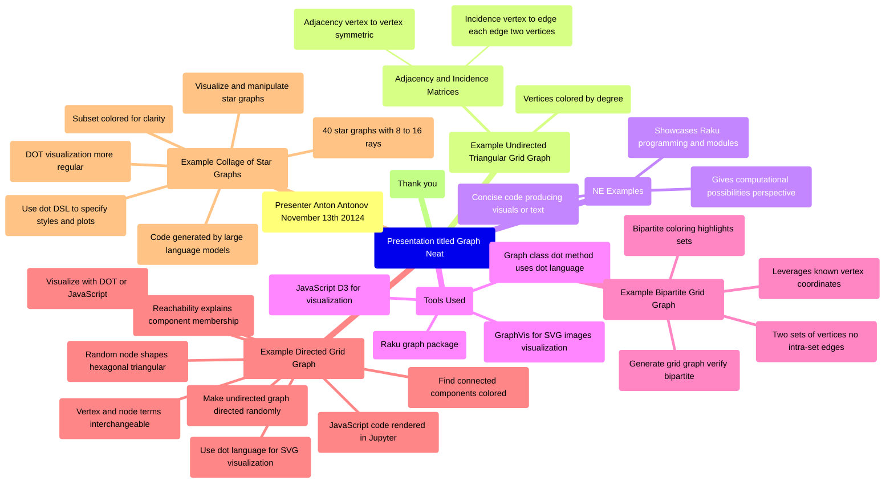

# «Graph» neat examples, set 2

### *LLM summary report*

## Summary

The presentation titled "Graph Neat Examples in Raku" by Anton Antonov demonstrates various graph visualizations using Raku, including undirected triangular grid graphs, bipartite grid graphs, and directed graphs with connected components. The examples utilize Raku's graph package and JavaScript D3 for interactive visualization, as well as the DOT language from Graphviz for generating SVG images. The final example showcases a collage of star graphs, emphasizing the ease of graph styling and manipulation using both Raku code and the DOT language.

## Topics

<table border="1"><thead><tr><th>theme</th><th>content</th></tr></thead><tbody><tr><td align=left>Introduction and first example</td><td align=left>Presentation overview, undirected triangular grid graph, vertex coloring by degree, adjacency and incidence matrices explained.</td></tr><tr><td align=left>NE examples and tools used</td><td align=left>Definition of NE examples, use of Raku graph package, visualization with JavaScript D3 and graph Vis dot language.</td></tr><tr><td align=left>Second example: Bipartite grid graph</td><td align=left>Grid graphs bipartite nature, generating and verifying bipartite coloring, using vertex coordinates for visualization.</td></tr><tr><td align=left>Third example: Directed grid graph and connected components</td><td align=left>Directed graph from undirected, finding connected components, coloring components, explanation of reachability and grouping.</td></tr><tr><td align=left>Visualization techniques and dot language</td><td align=left>Using JavaScript and SVG for visualization, dot language details, vertex vs node terminology, random node shapes.</td></tr><tr><td align=left>Final example: Collage of star graphs</td><td align=left>Creating 40 star graphs with various rays, coloring subsets, code generation mention, interactive visualization.</td></tr><tr><td align=left>Advantages of dot language for graph styling</td><td align=left>Dot language as powerful DSL for styling, making preambles for plot styles, easier than individual argument specification.</td></tr><tr><td align=left>Conclusion</td><td align=left>End of presentation and thanks.</td></tr></tbody></table>

## Mind map

## Thinking hats

<table>
  <tr>
    <th>Hat</th>
    <th>Perspective</th>
    <th>Feedback</th>
    <th>New Ideas</th>
  </tr>
  <tr>
    <td>Yellow Hat</td>
    <td>Benefits and creativity</td>
    <td>This presentation effectively showcases the power of Raku's graph package combined with JavaScript visualization tools like D3 and GraphViz DOT language. The examples highlight computational graph properties such as bipartiteness, connected components, and vertex degrees, which can engage an audience interested in graph theory and programming. The use of visual color coding and different shapes enhances intuitive understanding. The integration with Jupyter notebooks makes this approach accessible and interactive, which is a significant benefit for teaching or demonstrations. Overall, the presentation creates an inspiring environment for exploring graph algorithms and visualization creatively.</td>
    <td>Expand the presentation with interactive demos allowing live manipulation of graph properties, incorporate animations to show graph transformations over time, explore additional graph types beyond grids and stars to showcase versatility</td>
  </tr>
  <tr>
    <td>Gray Hat</td>
    <td>Cynicism and skepticism</td>
    <td>While the presentation is technically impressive, it risks coming off as a thinly veiled advertisement for Raku and its graph package, subtly pushing the idea that Raku is ideal for graph visualization without robust comparison to alternatives. The use of buzzwords like "compelling outputs" and "interesting perspectives" may mask the fact that many similar visualizations are possible in more popular languages with larger ecosystems. Also, the reliance on external tools like GraphViz and JavaScript libraries means the core value is somewhat outsourced. The claim that the code might be LLM-generated but not demonstrated could hint at superficial automation rather than deep insight.</td>
    <td>Include a critical comparison with other graph visualization tools, disclose limitations or weaknesses of Raku's graph package upfront, demonstrate original code generation rather than relying on LLMs to avoid overhyping automated programming</td>
  </tr>
</table>