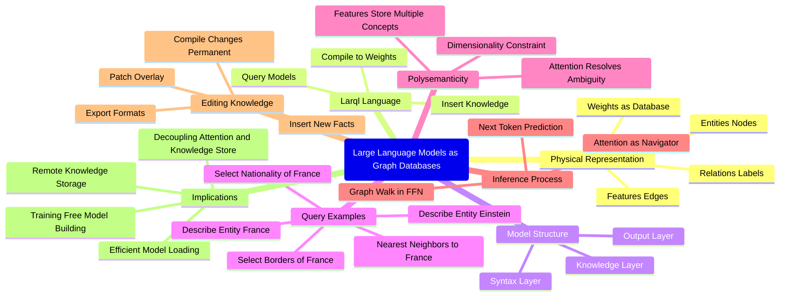

# Chatnik: Summarize a YouTube transcript

Assume that we want to summarize YouTube video ["LLMs Are Databases - So Query Them"](https://www.youtube.com/watch?v=8Ppw8254nLI)
in several different ways: simple summary, table of contents (or themes), corresponding mind-map, etc.

1. First we get the video transcript using the Python package ["youtube-transcript-api"](https://pypi.org/project/youtube-transcript-api/) 
and the prompt ["Summarize"](https://resources.wolframcloud.com/PromptRepository/resources/Summarize/):   

```
youtube_transcript_api 8Ppw8254nLI --format text | llm-chat -i=ts --prompt=@Summarize  
```

```text
Large language models can be understood as physical graph databases, where entities are nodes, features are edges, and relations label those edges, allowing querying and insertion of knowledge directly into model weights. Using a query language called Larql, the speaker demonstrates how to read, infer, and edit knowledge in the Gemma 34B model by treating its feedforward network as a graph and using attention as a routing mechanism, enabling real-time updates without retraining. This approach decouples the knowledge store from attention, allowing for potential remote hosting, efficient model loading, and the possibility of building or editing models without traditional training.
```

2. Next we take the first message of the chat object "ts" (i.e. the transcript) and find the table of contents
with ["ThemeTableJSON"](https://resources.wolframcloud.com/PromptRepository/resources/ThemeTableJSON/):

```
llm-chat-meta -i=ts first-message | llm-chat -i=tbl --prompt=@ThemeTableJSON 
```

```json
[
  {
    "theme": "Large Language Models as Physical Graph Databases",
    "content": "The speaker proposes that every large language model (LLM) is literally a graph database, not metaphorically. Entities are nodes, features are edges, and relations label these edges within the model's weights. This structure allows direct querying, insertion, and compilation of knowledge into weights, enabling programmatic interaction with LLMs through query languages like Larql."
  },
  {
    "theme": "Exploring the Gemma 34B Model with Larql",
    "content": "Using Larql, the speaker connects to the Gemma 34B model to probe its internal structure. The model has 34 layers with thousands of features organized into syntax, knowledge, and output layers. By running queries such as 'describe France' and selecting edges based on relations like 'borders' or 'nationality,' the speaker reveals how the model stores and clusters knowledge, despite polysemantic noise where features encode multiple concepts."
  },
  {
    "theme": "Structure and Interpretation of Features and Relations",
    "content": "Features correspond to columns in the feedforward network (FFN) and represent edges in the graph with gate and down vectors controlling activation and output. The model's 10,240 slots per layer are reused polysemously, representing different concepts across layers. The relations discovered by probes reveal an implicit relational schema resembling real-world knowledge graphs, such as capitals, manufacturers, and languages."
  },
  {
    "theme": "Role of Attention as Routing Mechanism",
    "content": "Attention operates over the full residual stream dimensions, routing signals by aligning query patterns with key vectors. It filters out polysemantic noise by selecting relevant features for the current query, enabling precise answers. Thus, features store knowledge as edges, while attention navigates the graph to produce accurate inference."
  },
  {
    "theme": "Inference via Graph Walk and KNN Lookup",
    "content": "Inference is performed as a graph walk through the FFN, utilizing KNN lookups on gate vectors to find nearest features matching the residual stream state. Attention guides which features fire, accumulating down vectors into the residual stream. This transforms matrix multiplications into efficient graph traversals, fundamentally reinterpreting the model's forward pass."
  },
  {
    "theme": "Editing and Inserting Knowledge Without Retraining",
    "content": "Because the model is a database, new facts can be inserted directly into free feature slots by synthesizing gate and down vectors. An example shows inserting 'Poseidon is the capital of Atlantis,' which immediately influences inference without breaking existing knowledge. These runtime edits are stored in overlays and can be compiled permanently into weight files."
  },
  {
    "theme": "Implications for Model Deployment and Efficiency",
    "content": "Decoupling attention from the knowledge store allows the latter to be hosted remotely or on different machines, enhancing efficiency and scalability. This approach facilitates running large models locally on modest hardware, such as laptops, by streaming or separately managing knowledge stores and attention mechanisms."
  },
  {
    "theme": "Future Prospects: Training-Free Model Building",
    "content": "The speaker hints at exciting future developments where models could be constructed or edited from scratch without traditional training by leveraging this database and graph-based paradigm. This vision suggests new avenues for model customization and scalability, to be explored in upcoming videos."
  }
]
```

3. Since the result is JSON code we use the CLI of "Data::Translators", [AAp4] (and `sed` to remove the Markdown code fences):

```
llm-chat-meta -i=tbl last-message | sed '1d; $d' | data-translation
```

<table border="1"><thead><tr><th>theme</th><th>content</th></tr></thead><tbody><tr><td>Large Language Models as Physical Graph Databases</td><td>The speaker proposes that every large language model (LLM) is literally a graph database, not metaphorically. Entities are nodes, features are edges, and relations label these edges within the model's weights. This structure allows direct querying, insertion, and compilation of knowledge into weights, enabling programmatic interaction with LLMs through query languages like Larql.</td></tr><tr><td>Exploring the Gemma 34B Model with Larql</td><td>Using Larql, the speaker connects to the Gemma 34B model to probe its internal structure. The model has 34 layers with thousands of features organized into syntax, knowledge, and output layers. By running queries such as 'describe France' and selecting edges based on relations like 'borders' or 'nationality,' the speaker reveals how the model stores and clusters knowledge, despite polysemantic noise where features encode multiple concepts.</td></tr><tr><td>Structure and Interpretation of Features and Relations</td><td>Features correspond to columns in the feedforward network (FFN) and represent edges in the graph with gate and down vectors controlling activation and output. The model's 10,240 slots per layer are reused polysemously, representing different concepts across layers. The relations discovered by probes reveal an implicit relational schema resembling real-world knowledge graphs, such as capitals, manufacturers, and languages.</td></tr><tr><td>Role of Attention as Routing Mechanism</td><td>Attention operates over the full residual stream dimensions, routing signals by aligning query patterns with key vectors. It filters out polysemantic noise by selecting relevant features for the current query, enabling precise answers. Thus, features store knowledge as edges, while attention navigates the graph to produce accurate inference.</td></tr><tr><td>Inference via Graph Walk and KNN Lookup</td><td>Inference is performed as a graph walk through the FFN, utilizing KNN lookups on gate vectors to find nearest features matching the residual stream state. Attention guides which features fire, accumulating down vectors into the residual stream. This transforms matrix multiplications into efficient graph traversals, fundamentally reinterpreting the model's forward pass.</td></tr><tr><td>Editing and Inserting Knowledge Without Retraining</td><td>Because the model is a database, new facts can be inserted directly into free feature slots by synthesizing gate and down vectors. An example shows inserting 'Poseidon is the capital of Atlantis,' which immediately influences inference without breaking existing knowledge. These runtime edits are stored in overlays and can be compiled permanently into weight files.</td></tr><tr><td>Implications for Model Deployment and Efficiency</td><td>Decoupling attention from the knowledge store allows the latter to be hosted remotely or on different machines, enhancing efficiency and scalability. This approach facilitates running large models locally on modest hardware, such as laptops, by streaming or separately managing knowledge stores and attention mechanisms.</td></tr><tr><td>Future Prospects: Training-Free Model Building</td><td>The speaker hints at exciting future developments where models could be constructed or edited from scratch without traditional training by leveraging this database and graph-based paradigm. This vision suggests new avenues for model customization and scalability, to be explored in upcoming videos.</td></tr></tbody></table>

4. Next, extract wisdom with the prompt ["ExtractArticleWisdom"](https://www.wolframcloud.com/obj/antononcube/DeployedResources/Prompt/ExtractArticleWisdom/) (too comprehensive to post the result here):

```
llm-chat-meta -i=ts first-message | llm-chat -i=ew --prompt=@ExtractArticleWisdom 
```

5. Finally, let us make a mind-map using the first chat object, "ts", export to a file, and open that file:

```
llm-chat -i=ts '!MermaidDiagram|^^' > mind-map.md && open mind-map.md
```



----

## References

### Packages

[AAp1] Anton Antonov
[Chatnik, Raku package](https://github.com/antononcube/Raku-Chatnik),
(2026),
[GitHub/antononcube](https://github.com/antononcube).

[AAp2] Anton Antonov
[LLM::Functions, Raku package](https://github.com/antononcube/Raku-LLM-Functions),
(2023-2026),
[GitHub/antononcube](https://github.com/antononcube).

[AAp3] Anton Antonov
[LLM::Prompts, Raku package](https://github.com/antononcube/Raku-LLM-Prompts),
(2023-2025),
[GitHub/antononcube](https://github.com/antononcube).

[AAp4] Anton Antonov
[Data::Translators, Raku package](https://github.com/antononcube/Raku-Data-Translators),
(2023-2026),
[GitHub/antononcube](https://github.com/antononcube).

### Videos

[CHv1] Chris Hay,
["LLMs Are Databases - So Query Them"](https://www.youtube.com/watch?v=8Ppw8254nLI),
(2026),
[YouTube/@chrishayuk](https://www.youtube.com/@chrishayuk).

