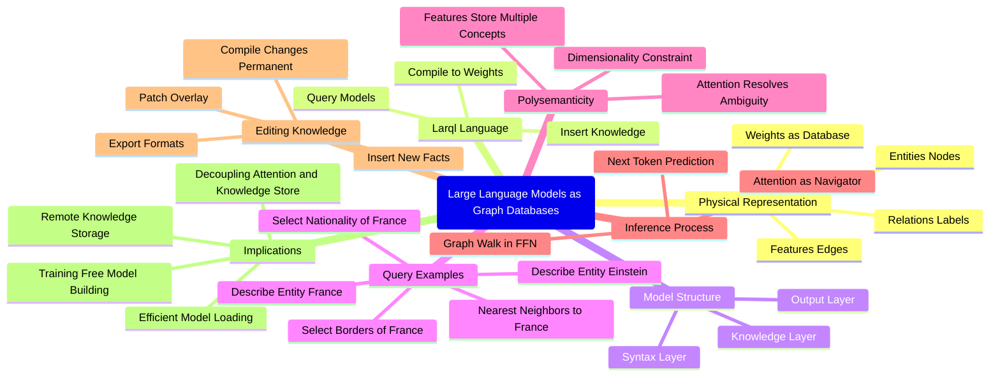

```mermaid
mindmap
  root(Large Language Models as Graph Databases)
    Physical Representation
      Weights as Database
      Entities Nodes
      Features Edges
      Relations Labels
    Larql Language
      Query Models
      Insert Knowledge
      Compile to Weights
    Model Structure
      Syntax Layer
      Knowledge Layer
      Output Layer
    Query Examples
      Describe Entity France
      Select Borders of France
      Select Nationality of France
      Describe Entity Einstein
      Nearest Neighbors to France
    Polysemanticity
      Features Store Multiple Concepts
      Dimensionality Constraint
      Attention Resolves Ambiguity
    Inference Process
      Graph Walk in FFN
      Attention as Navigator
      Next Token Prediction
    Editing Knowledge
      Insert New Facts
      Patch Overlay
      Compile Changes Permanent
      Export Formats
    Implications
      Decoupling Attention and Knowledge Store
      Remote Knowledge Storage
      Efficient Model Loading
      Training Free Model Building
```
