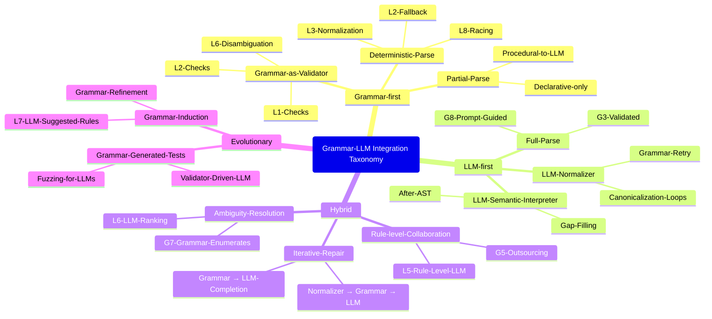

# Morphological Analysis Table: LLM Approaches × Grammar Approaches

**Rows = LLM utilization approaches**
**Columns = Grammar utilization approaches**

---

## **Grammar Utilization Approaches (Columns)**

1. **G1 — Full deterministic grammar parse**
2. **G2 — Grammar-first fallback model (retry on failure)**
3. **G3 — Grammar as structural validator**
4. **G4 — Grammar provides partial parse (declarative only)**
5. **G5 — Grammar rule outsourcing (LLM at rule-level)**
6. **G6 — Grammar-generated tests/specs for LLM**
7. **G7 — Grammar resolves ambiguity; LLM ranks**
8. **G8 — LLM-seeded grammar (prompt-embedded grammar)**

---

## **LLM Utilization Approaches (Rows)**

1. **L1 — LLM full parse**
2. **L2 — LLM fallback after grammar failure**
3. **L3 — LLM as normalizer (pre-parse rewriting)**
4. **L4 — LLM as semantic interpreter (post-parse)**
5. **L5 — LLM at rule-level (token/AST fragment generation)**
6. **L6 — LLM for ambiguity resolution**
7. **L7 — LLM for grammar induction/refinement**
8. **L8 — LLM parallel-racing with grammar**

---

# **Morphological Interaction Table**

| **LLM ↓ / Grammar →**                         | **G1** Deterministic Parse              | **G2** Fallback Model               | **G3** Validator                       | **G4** Partial Parse                                 | **G5** Rule Outsourcing                                | **G6** Tests for LLM                       | **G7** Grammar Disambiguation                   | **G8** Prompt-Embedded Grammar                        |
| --------------------------------------------- | ------------------------------------------ | -------------------------------------- | ----------------------------------------- | ------------------------------------------------------- | --------------------------------------------------------- | --------------------------------------------- | -------------------------------------------------- | -------------------------------------------------------- |
| **L1** LLM full parse                      | Redundant; used only if grammar fails fast | Standard fallback pattern              | Grammar checks LLM AST                    | Grammar extracts structure; LLM fills all               | LLM not used rule-level here                              | Test LLM output via grammar                   | LLM picks among grammar-generated parses           | Grammar shapes LLM output weakly                         |
| **L2** LLM fallback                        | Almost same as G2; trivial                 | Core use-case                          | Validator ensures correctness             | LLM completes missing pieces                            | Not used (fallback only)                                  | Grammar tests correctness                     | Rare (fallback seldom ambiguous)                   | Grammar template helps LLM succeed                       |
| **L3** LLM normalizer                      | Normalized input feeds grammar             | Canonical retry loop                   | Validator applied after grammar           | Useful: grammar handles stable structure                | Rare—LLM doesn’t handle rule-level                        | Grammar tests normalizer correctness          | Grammar ambiguous resolution after normalization   | Prompt grammar informs rewriting                         |
| **L4** LLM semantic interpreter            | Grammar yields AST; LLM interprets         | Same but fallback if AST incomplete    | Grammar validates AST; semantics external | Ideal: grammar handles declarative; LLM does procedural | Occasionally grammar delegates some semantic-heavy tokens | Grammar tests LLM reasoning (semantic checks) | Grammar disambiguates before semantic LLM step     | Grammar in prompt helps stable semantics                 |
| **L5** Rule-level LLM                      | Not typical—LLM deeper than grammar        | Not typical                            | Grammar validates fragments               | Partial grammar + LLM tokens works well                 | Core: direct collaboration rule-by-rule                   | Tests ensure LLM tokens conform               | LLM helps choose rule variants                     | Prompt grammar guides per-rule LLM behavior              |
| **L6** LLM for ambiguity resolution        | Grammar parses → LLM chooses               | Similar but triggered only by fallback | Grammar validates chosen variant          | LLM picks among partial structures                      | Limited rule-level ambiguity feed                         | Tests confirm chosen parse                    | Core: LLM as disambiguator                         | Prompt grammar limits option-space                       |
| **L7** Grammar induction/refinement by LLM | Grammar evolves; parse stays deterministic | Grammar-first; LLM proposes updates    | Grammar validated via tests               | LLM fills gaps in grammar coverage                      | LLM proposes new rules to offload complexity              | Tests crucial for induced rules               | Disambiguation rules revised by LLM                | Grammar spec in prompt seeds refinement                  |
| **L8** Parallel race                       | Whichever finishes first (LLM vs grammar)  | Race + fallback combination            | Grammar validates LLM results             | Grammar takes declarative, LLM procedural               | Rare in rule-level                                        | Grammar tests LLM early outputs               | Grammar disambiguation occurs only if grammar wins | Prompt grammar biases LLM results for faster convergence |

---

# **Notes on Morphological Structure**

✔ **Orthogonality**: Rows represent *when and how* the LLM is used; columns represent *strength + style* of grammar integration.
✔ **Completeness**: Every combination describes a unique architecture style.
✔ **Diagonal significance**:

* L1×G1 = “pure LLM vs pure grammar, mutually exclusive”
* L5×G5 = “maximally interwoven rule-level collaboration”
* L8×G8 = “parallel + grammar-informed prompting hybrid”

---

Here is a corresponding mind-map:

