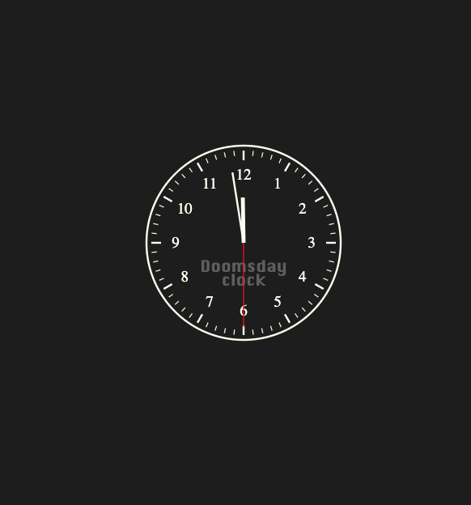

# Doomsday clock parsing and plotting


Anton Antonov    
[MathematicaForPrediction at WordPress](https://mathematicaforprediction.wordpress.com)   
[RakuForPrediction at WordPress](https://rakuforprediction.wordpress.com)   
December 2024


------

## Introduction


[The Doomsday Clock](https://thebulletin.org/doomsday-clock/) is a symbolic timepiece maintained by the [Bulletin of the Atomic Scientists (BAS)](https://thebulletin.org) since 1947. It represents how close humanity is perceived to be to global catastrophe, primarily [nuclear war](https://en.wikipedia.org/wiki/Nuclear_warfare) but also including climate change and biological threats. The clock’s hands are set annually to reflect the current state of global security; midnight signifies theoretical doomsday. 


In this notebook we consider two tasks:


- **Parsing of Doomsday Clock reading statements**

    - Using both [Functional Parsers (FP)](https://raku.land/zef:antononcube/FunctionalParsers) (aka ["parser combinators"](https://en.wikipedia.org/wiki/Parser_combinator)), [AAp1], and Large Language Models (LLMs).

        - We take text data from the past announcements, and extract the Doomsday Clock reading statements.


- **Evolution Doomsday Clock times**

    - We extract relevant Doomsday Clock timeline data from the corresponding Wikipedia page.

        - (Instead of using a page from BAS.)

    - We show how timeline data from that Wikipedia page can be processed with LLMs.

    - The result plot shows the evolution of the minutes to midnight.

        - The plot could show trends, highlighting significant global events that influenced the clock setting.

        - Hence, we put in informative callouts and tooltips.


The data extraction and visualization in the notebook serve educational purposes or provide insights into historical trends of global threats as perceived by experts. We try to make the ingestion and processing code universal and robust, suitable for multiple evaluations now or in the (near) future.


**Remark:** Keep in mind that the Doomsday Clock is a metaphor and its settings are not just data points but reflections of complex global dynamics (by [certain experts](https://thebulletin.org/2024/01/press-release-doomsday-clock-remains-at-90-seconds-to-midnight/) and a [board of sponsors](https://thebulletin.org/about-us/board-of-sponsors/).)


**Remark:** Currently (2024-12-30) Doomsday Clock is set at [90 seconds before midnight](https://thebulletin.org/doomsday-clock/).


**Remark:** This notebook is the Raku-version of the Wolfram Language (WL) [notebook of the same name](https://community.wolfram.com/groups/-/m/t/3347065), [AAn1].
That is why the "standard" Raku-grammar approach is not used. (Although, in the preliminary versions of this work relevant Raku grammars were generated via both LLMs and Raku packages.)


I was very impressed by the looks and tune-ability of WL's [`ClockGauge`](https://reference.wolfram.com/language/ref/ClockGauge.html.en), so, I programmed a similar clock gauge in Raku's package 
["JavaScript::D3"](https://raku.land/zef:antononcube/JavaScript::D3) (which is based on [D3.js](https://d3js.org).)


-----

## Setup

```raku
use LLM::Functions;
use LLM::Prompts;
use LLM::Configurations;
use Text::SubParsers;

use Data::Translators;
use Data::TypeSystem;
use Data::Importers;
use Data::Reshapers;
use Hash::Merge;

use FunctionalParsers :ALL;
use FunctionalParsers::EBNF;

use Math::DistanceFunctions::Edit;

use Lingua::NumericWordForms;
```
```
# (Any)
```

### JavaScript::D3

```raku
my $background = 'none';
my $stroke-color = 'Ivory';
my $fill-color = 'none';
```
```
# none
```

### JavaScript::Google::Charts

```raku
my $format = 'html';
my $titleTextStyle = { color => 'Ivory' };
my $backgroundColor = '#1F1F1F';
my $legendTextStyle = { color => 'Silver' };
my $legend = { position => "none", textStyle => {fontSize => 14, color => 'Silver'} };

my $hAxis = { title => 'x', titleTextStyle => { color => 'Silver' }, textStyle => { color => 'Gray'}, logScale => False, format => 'scientific'};
my $vAxis = { title => 'y', titleTextStyle => { color => 'Silver' }, textStyle => { color => 'Gray'}, logScale => False, format => 'scientific'};

my $annotations = {textStyle => {color => 'Silver', fontSize => 10}};
my $chartArea = {left => 50, right => 50, top => 50, bottom => 50, width => '90%', height => '90%'};

my $background = '1F1F1F';
```
```
# 1F1F1F
```

### Functional parsers

```raku
my sub parsing-test-table(&parser, @phrases) {
    my @field-names = ['statement', 'parser output'];
    my @res = @phrases.map({ @field-names Z=> [$_, &parser($_.words).raku] })».Hash.Array;
    to-html(@res, :@field-names)
}
```
```
# &parsing-test-table
```

-----

## Data ingestion


Here we ingest the Doomsday Clock timeline page and show corresponding statistics:

```raku
my $url = "https://thebulletin.org/doomsday-clock/past-announcements/";
my $txtEN = data-import($url, "plaintext");

text-stats($txtEN)
```
```
# (chars => 73722 words => 11573 lines => 756)
```

By observing the (plain) text of that page we see the Doomsday Clock time setting can be extracted from the sentence(s) that begin with the following phrase:

```raku
my $start-phrase = 'Bulletin of the Atomic Scientists';
my $sentence = $txtEN.lines.first({ / ^ $start-phrase /})
```
```
# Bulletin of the Atomic Scientists, with a clock reading 90 seconds to midnight
```

-----

## Grammar and parsers


Here is a grammar in [Extended Backus-Naur Form (EBNF)](https://en.wikipedia.org/wiki/Extended_Backus–Naur_form) for parsing Doomsday Clock statements:

```raku
my $ebnf = q:to/END/;
<TOP> = <clock-reading>  ;
<clock-reading> = <opening> , ( <minutes> | [ <minutes> , [ 'and' | ',' ] ] , <seconds> ) , 'to' , 'midnight' ;
<opening> = [ { <any> } ] , 'clock' , [ 'is' ] , 'reading' ; 
<any> = '_String' ;
<minutes> = <integer> <& ( 'minute' | 'minutes' ) ;
<seconds> = <integer> <& ( 'second' | 'seconds' ) ;
<integer> = '_Integer' <@ &{ $_.Int } ;
END

text-stats($ebnf)
```
```
# (chars => 364 words => 76 lines => 6)
```

**Remark:** The EBNF grammar above can be obtained with LLMs using a suitable prompt with example sentences. (We do not discuss that approach further in this notebook.)


Here the parsing functions are generated from the EBNF string above:

```raku
my @defs = fp-ebnf-parse($ebnf, <CODE>, name => 'Doomed2', actions => 'Raku::Code').head.tail;
.say for @defs.reverse
```
```
# my &pINTEGER = apply(&{ $_.Int }, symbol('_Integer'));
# my &pSECONDS = sequence-pick-left(&pINTEGER, (alternatives(symbol('second'), symbol('seconds'))));
# my &pMINUTES = sequence-pick-left(&pINTEGER, (alternatives(symbol('minute'), symbol('minutes'))));
# my &pANY = symbol('_String');
# my &pOPENING = sequence(option(many(&pANY)), sequence(symbol('clock'), sequence(option(symbol('is')), symbol('reading'))));
# my &pCLOCK-READING = sequence(&pOPENING, sequence((alternatives(&pMINUTES, sequence(option(sequence(&pMINUTES, option(alternatives(symbol('and'), symbol(','))))), &pSECONDS))), sequence(symbol('to'), symbol('midnight'))));
# my &pTOP = &pCLOCK-READING;
```

**Remark:** The function `fb-ebnf-parse` has a [variety of actions](https://github.com/antononcube/Raku-FunctionalParsers/blob/main/doc/Parser-code-generation.md) for generating code from EBNF strings. For example, with `actions => 'Raku::Class'` the generation above would produce a class, which might be more convenient to do further development with (via inheritance or direct changes.)


Here the imperative code above -- assigned to `@defs` -- is re-written using the infix form of the parser combinators:

```raku
my &pINTEGER = satisfy({ $_ ~~ /\d+/ }) «o {.Int};
my &pMINUTES = &pINTEGER «& (symbol('minute') «|» symbol('minutes')) «o { [minute => $_,] };
my &pSECONDS = &pINTEGER «& (symbol('second') «|» symbol('seconds')) «o { [second => $_,] };
my &pANY = satisfy({ $_ ~~ /\w+/ });
my &pOPENING = option(many(&pANY)) «&» symbol('clock') «&» option(symbol('is')) «&» symbol('reading');
my &pCLOCK-READING = &pOPENING «&» (&pMINUTES «|» option(&pMINUTES «&» option(symbol('and') «|» symbol(','))) «&» &pSECONDS) «&» symbol('to') «&» symbol('midnight');
my &pTOP = &pCLOCK-READING;
```

We must redefine the parser `pANY` (corresponding to the EBNF rule “<any>”) in order to prevent `pANY` of gobbling the word “clock” and in that way making the parser `pOPENING` fail.

```raku
&pANY = satisfy({ $_ ne 'clock' && $_ ~~ /\w+/});
```


Here are random sentences generated with the grammar:

```raku
.say for fp-random-sentence($ebnf, 12).sort;
```
```
# clock  reading 681 minutes to midnight
#  clock  reading 788 minutes to midnight
#  clock is reading  584 seconds to midnight
#  clock is reading  721 second to midnight
#  clock is reading 229 minute and 631 second to midnight
#  clock is reading 458 minutes to midnight
#  clock is reading 727 minute to midnight
# F3V; clock is reading 431 minute to midnight
# FXK<GQ 3RJJJ clock is reading  369 seconds to midnight
# NRP FNSEE K0EQO OPE clock is reading 101 minute to midnight
# QJDV; R<K7S; JMQ>HD AA31 clock is reading 369 minute  871 second to midnight
# QKQGK FZJ@BB M8C1BD BPI;C: clock  reading 45 minute  925 second to midnight
```

Verifications of the (sub-)parsers:

```raku
"90 seconds".words.&pSECONDS
```
```
# ((() [second => 90]))
```

```raku
"That doomsday clock is reading".words.&pOPENING
```
```
# ((() (((((That doomsday)) clock) (is)) reading)))
```

Here the “top” parser is applied:

```raku
my $str = "the doomsday clock is reading 90 seconds to midnight";
$str.words.&pTOP
```
```
# ((() ((((((((the doomsday)) clock) (is)) reading) (() [second => 90])) to) midnight)))
```

Here the sentence extracted above is parsed and interpreted into an association with keys “Minutes” and “Seconds”:

```raku
$sentence.words.&pTOP.tail.flat.grep(* ~~ Pair)
```
```
# (second => 90)
```

Let us redefine `pCLOCK-READING` to return a minutes-&-seconds dictionary, `pTOP` to return a corresponding date-time:

```raku
&pCLOCK-READING = &pCLOCK-READING «o { $_.flat.grep(* ~~ Pair).Hash };

&pTOP = &pCLOCK-READING «o { 
    Date.today.DateTime.earlier(seconds => ($_<minute> // 0) * 60 + ($_<second>// 0) ) 
};
```

Here we assign and show the results of those two parsers:

```raku
my $doom-reading = $sentence.words.&pCLOCK-READING.head.tail;
my $doom-time = $sentence.words.&pTOP.head.tail;

.say for (:$doom-reading, :$doom-time)
```
```
# doom-reading => {second => 90}
# doom-time => 2024-12-31T23:58:30Z
```

------

## Plotting the clock


Using the interpretation derived above plot the corresponding clock with `js-dr-clock-gauge`:

```raku
#% js
js-d3-clock-gauge( $doom-time, :$background, :$stroke-color,
    second-hand-color => 'Red',
    gauge-labels => {Doomsday => [0.5, 0.35], 'clock' => [0.5 ,0.28]}, 
    gauge-labels-color => 'DimGray',
    gauge-labels-font-family => 'Krungthep',
    margins => {:150top, :150bottom, :5left, :5right},
    width => 1000,
    height => 500
    )
```



Let us define a map with clock-gauge plot options.

```raku
my @scale-ranges = (0, 0.01 ... 0.66).rotor(2=>-1).map({ ([0, 60], $_) });
my @scale-ranges2 = (0, 0.01 ... 0.82).rotor(2=>-1).map({ ([0, 60], $_) });
my %opts = 
    background => 'none',
    stroke-color => 'Black', stroke-width => 0,
    title-color => 'Ivory', title-font-family => 'Helvetica',
    hour-hand-color => 'Orange', second-hand-color => 'Red',
    color-scheme => 'Magma',
    fill-color => 'AntiqueWhite',
    :@scale-ranges,
    color-scheme-interpolation-range => (0.11, 0.95),
    margins => {top => 60, left => 20, right => 20, bottom => 60},
    height => 420,
    gauge-labels => {Doomsday => [0.5, 0.35], 'clock' => [0.5 ,0.28]}, 
    gauge-labels-color => 'DarkSlateGray',
    gauge-labels-font-family => 'Krungthep',
    ;

  %opts.elems
```
```
# 16
```

Here are different "doomsday clock" examples:

```raku 
#% js
[
   {color-scheme => 'Plasma', fill-color => 'MistyRose', gauge-labels-color => 'Orchid'},
   {color-scheme => 'Spectral', fill-color => '#4e65ac', stroke-color => 'DarkRed', stroke-width => 10, gauge-labels => %()},
   {color-scheme => 'Cividis', fill-color => 'DarkSlateGray', gauge-labels => {Doomsday => [0.5, 0.6], 'clock' => [0.5 ,0.36]}, scale-ranges => @scale-ranges2},
].map({ js-d3-clock-gauge(:23hour, :58minute, :30second, |merge-hash(%opts.clone, $_, :!deep)) }).join("\n")
```


----

## More robust parsing


More robust parsing of Doomsday Clock statements can be obtained in these three ways:


- “Fuzzy” match of words

    - For misspellings like "doomsdat" instead of "doomsday."

- Parsing of numeric word forms.

    - For statements, like, "two minutes and twenty five seconds."

- Delegating the parsing to LLMs when grammar parsing fails.


### Fuzzy matching


The parser `satisfy` can be used to handle misspellings (via, say, `edit-distance` from ["Math::DistanceFunctions"](https://raku.land/zef:antononcube/Math::DistanceFunctions)):

```raku
#% html
my &pDD = satisfy({ edit-distance($_, "doomsday") ≤ 2 }) «o {"doomsday"};
my @phrases = "doomsdat", "doomsday", "dumzday";

parsing-test-table(&pDD, @phrases)
```

<table border="1"><thead><tr><th>statement</th><th>parser output</th></tr></thead><tbody><tr><td>doomsdat</td><td>(((), &quot;doomsday&quot;),).Seq</td></tr><tr><td>doomsday</td><td>(((), &quot;doomsday&quot;),).Seq</td></tr><tr><td>dumzday</td><td>().Seq</td></tr></tbody></table>

But since "FunctionalParsers" provides the generic parser `fuzzy-symbol` (that takes a word and a distance as arguments) we use that parser below.

```raku
#% html
my &pDD2 = fuzzy-symbol("doomsday", 2);
my @phrases = "doomsdat", "doomsday", "dumzday";

parsing-test-table(&pDD2, @phrases)
```
<table border="1"><thead><tr><th>statement</th><th>parser output</th></tr></thead><tbody><tr><td>doomsdat</td><td>(((), &quot;doomsday&quot;),)</td></tr><tr><td>doomsday</td><td>(((), &quot;doomsday&quot;),)</td></tr><tr><td>dumzday</td><td>()</td></tr></tbody></table>


In order to include the misspelling handling into the grammar we manually rewrite the grammar. (The grammar is small, so, it is not that hard to do.)

```raku
my &pINTEGER = satisfy({ $_ ~~ /\d+/ }) «o {.Int};
my &pMINUTES = &pINTEGER «& (fuzzy-symbol('minute', 2) «|» fuzzy-symbol('minutes', 2)) «o { [minute => $_,] };
my &pSECONDS = &pINTEGER «& (fuzzy-symbol('second', 2) «|» fuzzy-symbol('seconds', 2)) «o { [second => $_,] };
my &pANY = satisfy({ edit-distance($_, 'clock') > 2 && $_ ~~ /\w+/ });
my &pOPENING = option(many(&pANY)) «&» fuzzy-symbol('clock', 1) «&» option(symbol('is')) «&» fuzzy-symbol('reading', 2);
my &pCLOCK-READING = &pOPENING «&» (&pMINUTES «|» option(&pMINUTES «&» option(symbol('and') «|» symbol(','))) «&» &pSECONDS) «&» symbol('to') «&» fuzzy-symbol('midnight', 2);

&pCLOCK-READING = &pCLOCK-READING «o { $_.flat.grep(* ~~ Pair).Hash };

&pTOP = &pCLOCK-READING «o { 
    Date.today.DateTime.earlier(seconds => ($_<minute> // 0) * 60 + ($_<second>// 0) ) 
};
```


Here is a verification table with correct- and incorrect spellings:

```raku
#% html
my @phrases =
    "doomsday clock is reading 2 seconds to midnight", 
    "dooms day cloc is readding 2 minute and 22 sekonds to mildnight";

parsing-test-table(shortest(&pCLOCK-READING), @phrases)
```

<table border="1"><thead><tr><th>statement</th><th>parser output</th></tr></thead><tbody><tr><td>doomsday clock is reading 2 seconds to midnight</td><td>(((), {:second(2)}),)</td></tr><tr><td>dooms day cloc is readding 2 minute and 22 sekonds to mildnight</td><td>(((), {:minute(2), :second(22)}),)</td></tr></tbody></table>


### Parsing of numeric word forms


One way to make the parsing more robust is to implement the ability to parse integer names (or numeric word forms) not just integers.


**Remark:** For a fuller discussion -- and code -- of numeric word forms parsing see the tech note ["Integer names parsing"](https://resources.wolframcloud.com/PacletRepository/resources/AntonAntonov/FunctionalParsers/tutorial/Integernamesparsing.html) of the paclet ["FunctionalParsers"](https://resources.wolframcloud.com/PacletRepository/resources/AntonAntonov/FunctionalParsers/), [AAp1].


First, we make an association that connects integer names with corresponding integer values:

```raku
my %worded-values = (^100).map({ to-numeric-word-form($_) => $_ });
%worded-values.elems
```
```
# 100
```

**Remark:** The function `to-numeric-word-form` is provided by ["Lingua::NumericWordForms"](https://raku.land/zef:antononcube/Lingua::NumericWordForms), [AAp3].


Here is how the rules look like:

```raku
%worded-values.pick(6)
```
```
# (ninety four => 94 forty three => 43 ninety eight => 98 seventy three => 73 ninety two => 92 eleven => 11)
```

Here we program the integer names parser:

```raku
my &pUpTo10 = alternatives( |(^10)».&to-numeric-word-form.map({ symbol($_.trim) }) );
my &p10s = alternatives( |(10, 20 ... 90)».&to-numeric-word-form.map({ symbol($_.trim) }) );
my &pWordedInteger = (&p10s «&» &pUpTo10 «|» &p10s «|» &pUpTo10) «o { %worded-values{$_.flat.join(' ')} };
```

Here is a verification table of that parser:

```raku
#% html
my @phrases = "three", "fifty seven", "thirti one";
parsing-test-table(&pWordedInteger, @phrases)
```

<table border="1"><thead><tr><th>statement</th><th>parser output</th></tr></thead><tbody><tr><td>three</td><td>(((), 3),).Seq</td></tr><tr><td>fifty seven</td><td>(((), 57), ((&quot;seven&quot;,), 50)).Seq</td></tr><tr><td>thirti one</td><td>().Seq</td></tr></tbody></table>

There are two parsing results for “fifty seven”, because `&pWordedInteger` is defined with:

```
&p10s «|» &pUpTo10 «|» p10s ...  
```

This can be remedied by using `just` or `shortest`:

```raku
#% html
parsing-test-table( just(&pWordedInteger), @phrases)
```

<table border="1"><thead><tr><th>statement</th><th>parser output</th></tr></thead><tbody><tr><td>three</td><td>($((), 3),).Seq</td></tr><tr><td>fifty seven</td><td>($((), 57),).Seq</td></tr><tr><td>thirti one</td><td>().Seq</td></tr></tbody></table>


Let us change `&pINTEGER` to parse both integers and integer names:

```raku
#% html
&pINTEGER = &satisfy({ $_ ~~ /\d+/ }) «o {.Int} «|» &pWordedInteger;

my @phrases = "12", "3", "three", "forty five";
parsing-test-table( just(&pINTEGER), @phrases)
```

<table border="1"><thead><tr><th>statement</th><th>parser output</th></tr></thead><tbody><tr><td>12</td><td>($((), 12),).Seq</td></tr><tr><td>3</td><td>($((), 3),).Seq</td></tr><tr><td>three</td><td>($((), 3),).Seq</td></tr><tr><td>forty five</td><td>($((), 45),).Seq</td></tr></tbody></table>


**Remark:** `&pINTEGER` has to be evaluated before the definitions of the rest of the parsers programmed in the previous subsection.


Let us try the new parser using integer names for the clock time:

```raku
my $str = "the doomsday clock is reading two minutes and forty five seconds to midnight";

$str.words
==> take-first(&pCLOCK-READING)()
```
```
# ((() {minute => 2, second => 45}))
```

### Enhance with LLM parsing


There are multiple ways to employ LLMs for extracting “clock readings” from arbitrary statements for Doomsday Clock readings, readouts, and measures. Here we use [LLM few-shot training](https://en.wikipedia.org/wiki/Prompt_engineering#Other_techniques):

```raku
my &flop = llm-example-function([
    "the doomsday clock is reading two minutes and forty five seconds to midnight" => '{"minute":2, "second": 45}', 
    "the clock of the doomsday gives 92 seconds to midnight" => '{"minute":0, "second": 92}', 
    "The bulletin atomic scientist maybe is set to a minute an 3 seconds." => '{"minute":1, "second": 3}'
   ], 
   e => $conf4o,
   form => sub-parser('JSON')
)
```

Here is an example invocation:

```raku
&flop("Maybe the doomsday watch is at 23:58:03")
```
```
# {minute => 1, second => 57}
```

The following function combines the parsing with the grammar and the LLM example function -- the latter is used for fallback parsing:

```raku
my sub get-clock-reading(Str:D $st) {
    my $op = just(&pCLOCK-READING)($st.words); 
    my %h = $op.elems > 0 && $op.head.head.elems == 0 ?? $op.head.tail !! &flop( $st );
    return Date.today.DateTime.earlier(seconds => (%h<minute> // 0) * 60 + (%h<second> // 0) ) 
}
```
```
# &get-clock-reading
```

### Robust parser demo


Here is the application of the combine function above over a certain “random” Doomsday Clock statement:

```raku
my $s = "You know, sort of, that dooms-day watch is 1 and half minute be... before the big boom. (Of doom...)";

$s.&get-clock-reading
```
```
# 2024-12-31T23:58:30Z
```

**Remark:** The same type of robust grammar-and-LLM combination is explained in more detail in the video ["Robust LLM pipelines (Mathematica, Python, Raku)"](https://www.youtube.com/watch?v=QOsVTCQZq_s&t=3700s), [AAv1]. (See, also, the corresponding notebook [AAn1].)


-------

## Timeline


In this section we extract Doomsday Clock timeline data and make a corresponding plot.


### Parsing page data


Instead of using the [official Doomsday clock timeline page](https://thebulletin.org/doomsday-clock/timeline/) we use [Wikipedia](https://en.wikipedia.org/wiki/Doomsday_Clock).
We can extract the Doomsday Clock timeline using LLMs. Here we get the plaintext of the Wikipedia page and show statistics:

```raku
my $url = "https://en.wikipedia.org/wiki/Doomsday_Clock";
my $txtWk = data-import($url, "plaintext");

text-stats($txtWk)
```
```
# (chars => 42728 words => 6231 lines => 853)
```

Here we get the Doomsday Clock timeline table from that page in JSON format using an LLM:

```raku
my $res; 
if False {
  $res = llm-synthesize([
    "Give the time table of the doomsday clock as a time series that is a JSON array.", 
    "Each element of the array is a dictionary with keys 'Year', 'MinutesToMidnight', 'Time', 'Summary', 'Description'.",
    "Do not shorten or summarize the descriptions -- use their full texts.",
    "The column 'Summary' should have summaries of the descriptions, each summary no more than 10 words.",
    $txtWk, 
    llm-prompt("NothingElse")("JSON")
   ], 
   e => $conf4o,
   form => sub-parser('JSON'):drop
  );
} else {
  my @field-names = <Year MinutesToMidnight Time Summary Description>;
  my $url = 'https://raw.githubusercontent.com/antononcube/RakuForPrediction-blog/refs/heads/main/Data/doomsday-clock-timeline-table.csv';
  $res = data-import($url, headers => 'auto');
  $res = $res.map({ my %h = $_.clone; %h<Year> = %h<Year>.Int; %h<MinutesToMidnight> = %h<MinutesToMidnight>.Num; %h }).Array
}

deduce-type($res)
```
```
# Vector(Struct([Description, MinutesToMidnight, Summary, Time, Year], [Str, Num, Str, Str, Int]), 26)
```

Here the LLM result is tabulated:

```raku
#% html
my @field-names = <Year MinutesToMidnight Time Summary Description>;
$res ==> to-html(:@field-names, align => 'left')
```


**Remark:** The LLM derived summaries in the table above are based on the descriptions in the column “Reason” in the Wikipedia data table. 
The tooltips of the plot below use the summaries.


### Timeline plot


In order to have informative Doomsday Clock evolution plot we obtain and partition dataset’s time series into step-function pairs:

```raku
my @dsDoomsdayTimes = |$res;
my @ts0 = @dsDoomsdayTimes.map({ <Year MinutesToMidnight role:tooltip> Z=> $_<Year MinutesToMidnight Summary> })».Hash;

my @ts1 = @dsDoomsdayTimes.rotor(2=>-1).map({[ 
    %( <Year MinutesToMidnight mark role:tooltip> Z=> $_.head<Year MinutesToMidnight MinutesToMidnight Summary>),
    %( <Year MinutesToMidnight mark role:tooltip> Z=> [$_.tail<Year>, $_.head<MinutesToMidnight>, NaN, '']) 
]}).map(*.Slip);

@ts1 = @ts1.push( merge-hash(@ts0.tail, {mark => @ts0.tail<MinutesToMidnight>}) );

deduce-type(@ts1):tally
```
```
# Vector(Struct([MinutesToMidnight, Year, mark, role:tooltip], [Num, Int, Num, Str]), 51)
```

Here are added callout annotations indicating the year and the minutes before midnight:

```raku
my @ts2 = @ts1.map({ 
    my %h = $_.clone;
    my $s = ($_<MinutesToMidnight> * 60) mod 60;
    $s = $s > 0 ?? " {$s}s" !! '';
    if %h<mark> === NaN { 
        %h<role:annotation> = '';
    } else { 
        %h<role:annotation> = "{%h<Year>}: {floor($_<MinutesToMidnight>)}m" ~ $s; 
    }
    %h
});

deduce-type(@ts2):tally
```
```
# Vector(Struct([MinutesToMidnight, Year, mark, role:annotation, role:tooltip], [Num, Int, Num, Str, Str]), 51)
```

Finally, here is the plot:

```raku
#% html
js-google-charts('ComboChart',
    @ts2,
    column-names => <Year MinutesToMidnight mark role:annotation role:tooltip>,
    width => 1200,
    height => 500,
    title => "Doomsday clock: minutes to midnight, {@dsDoomsdayTimes.map(*<Year>).Array.&{ (.min, .max).join('-') }}",
    series => {
        0 => {type => 'line', lineWidth => 4, color => 'DarkOrange'},
        1 => {type => 'scatter', pointSize => 10, opacity => 0.1, color => 'Blue'},
    },
    hAxis => { title => 'Year',  format => '####', titleTextStyle => { color => 'Silver' }, textStyle => { color => 'Gray'},     
                viewWindow => { min => 1945, max => 2026}
            },
    vAxes => { 
        0 => { title => 'Minutes to Midnight', titleTextStyle => { color => 'Silver' }, textStyle => { color => 'Gray'} }, 
        1 => { titleTextStyle => { color => 'Silver' }, textStyle => { color => 'Gray'}, ticks => (^18).map({ [ v => $_, f => ($_ ?? "23::{60-$_}" !! '00:00' ) ] }).Array } 
    },
    :$annotations,
    :$titleTextStyle,
    :$backgroundColor,
    :$legend,
    :$chartArea,
    :$format,
    div-id => 'DoomsdayClock',
    :!png-button
)
```


**Remark:** The plot *should be* piecewise constant -- simple linear interpolation between the blue points would suggest gradual change of the clock times.


**Remark:** By hovering with the mouse over the blue points the corresponding descriptions can be seen. We considered using clock-gauges as tooltips, but showing clock-settings reasons is more informative.


**Remark:** The plot was intentionally made to resemble the [timeline plot in Doomsday Clock's Wikipedia page](https://en.wikipedia.org/wiki/Doomsday_Clock#Timeline).


**Remark:** The plot has deficiencies:
- Tooltips with arbitrary width
    - This can be remedied with the (complicated) HTML tooltip procedure described in [AA1].
        - But I decided to just make the LLM data extraction to produce short summaries of the descriptions.
- No right vertical axis ticks
    - The Doomsday Clock timeline plot in Wikipedia and its reproduction in [AAn1] have the "HH::MM" time axis.
    - I gave up figuring out how to place such axis in "ComboChart".

(It is not that important to figure out Google Charts interface settings for that kind of plots.)


## Conclusion


As expected, parsing, plotting, or otherwise processing the Doomsday Clock settings and statements are excellent didactic subjects for textual analysis (or parsing) and temporal data visualization. The visualization could serve educational purposes or provide insights into historical trends of global threats as perceived by experts. (Remember, the clock’s settings are not just data points but reflections of complex global dynamics.)


One possible application of the code in this notebook is to make a “web service“ that gives clock images with Doomsday Clock readings. For example, click on this button:


- [**Get Doomsday Clock!**](https://www.wolframcloud.com/obj/e28834c9-42a4-4991-9889-243fa39a795d)


## References


### Articles, notebooks


[AA1] Anton Antonov, ["Geographic Data in Raku Demo"](https://rakuforprediction.wordpress.com/2024/06/18/geographic-data-in-raku-demo/), (2024), [RakuForPrediction at WordPress](https://rakuforprediction.wordpress.com/2024/06/18/geographic-data-in-raku-demo/).

[AAn1] Anton Antonov, ["Doomsday clock parsing and plotting"](https://community.wolfram.com/groups/-/m/t/3347065), (2024), [Wolfram Community](https://community.wolfram.com).

[AAn2] Anton Antonov, ["Making robust LLM computational pipelines from software engineering perspective"](https://community.wolfram.com/groups/-/m/t/3279791), (2024), [Wolfram Community](https://community.wolfram.com).


### Paclets


[AAp1] Anton Antonov, [FunctionalParsers Raku package](https://github.com/antononcube/Raku-FunctionalParsers), (2023-2024), [GitHub/antononcube](https://github.com/antononcube).

[AAp2] Anton Antonov, ["FunctionalParsers"](https://resources.wolframcloud.com/PacletRepository/resources/AntonAntonov/FunctionalParsers/), (2023), [Wolfram Language Paclet Repository](https://resources.wolframcloud.com/PacletRepository/).

[AAp3] Anton Antonov, [Lingua::NumericWordForms Raku package](https://github.com/antononcube/Raku-Lingua-NumericWordForms), (2021-2024), [GitHub/antononcube](https://github.com/antononcube).


### Videos


[AAv1] Anton Antonov, ["Robust LLM pipelines (Mathematica, Python, Raku)"](https://youtu.be/QOsVTCQZq_s), (2024), [YouTube/@AAA4prediction](https://www.youtube.com/@AAA4prediction).
