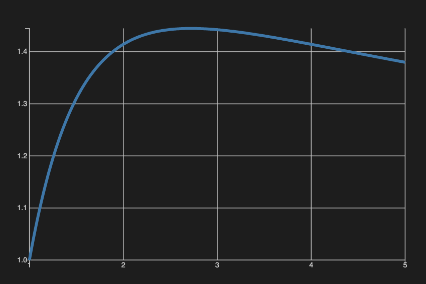
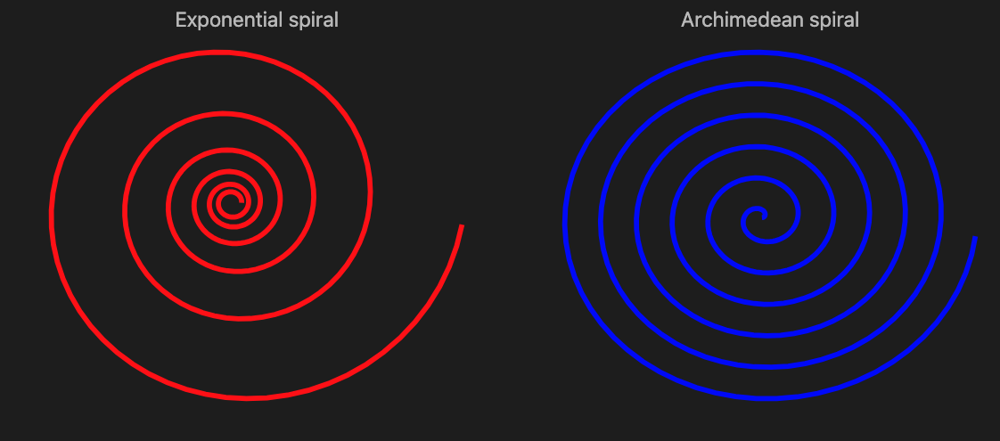
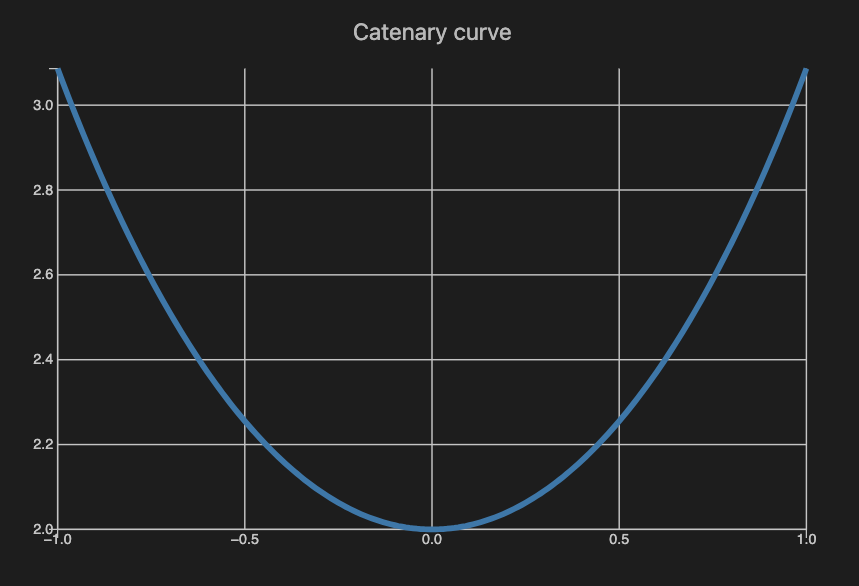
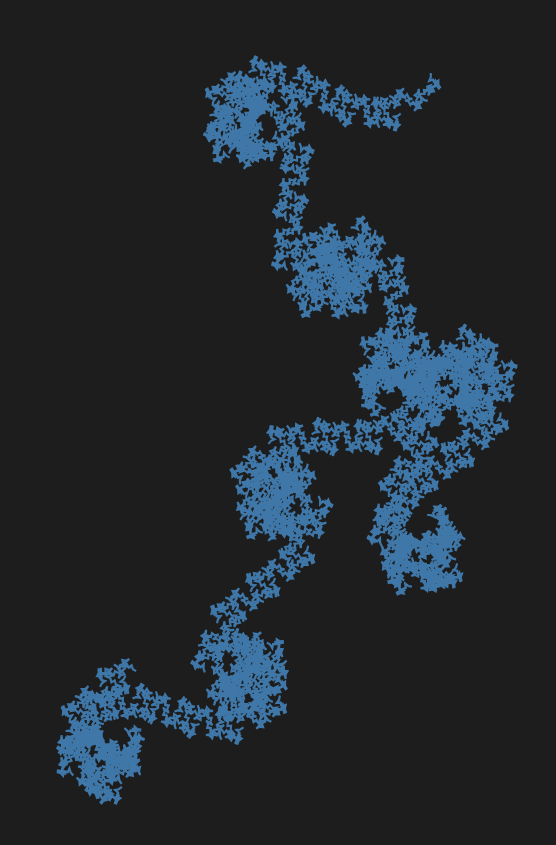
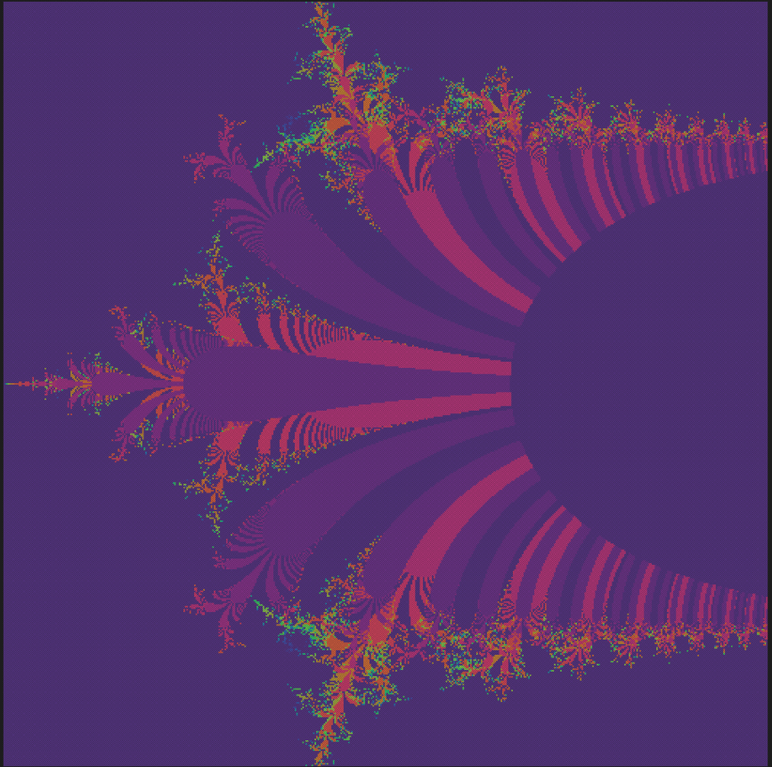

# E-day Logarithmic Glow-up

Anton Antonov   
[RakuForPrediction at WordPress](https://rakuforprediction.wordpress.com)   
February 2026

----

## Introduction

Every year on February 7th, math enthusiasts worldwide (should) consider celebrating Euler’s Day or E-day. Among Euler’s many gifts to the (currently known) math universe is the ever-popular number **e**, the natural logarithm base that’s basically the rock star of calculus, complex analysis, continuous growth models, compound interest, and (much) more. That irrational number shows up in places we might or might not expect. This blog post explores some formulas and plots related to Euler's constant, **e**.

**Remark:** The code of the fractal plots is Raku translation of the Wolfram Language code in the notebook ["Celebrating Euler's day: algorithms for derangements, branch cuts, and exponential fractals"](https://community.wolfram.com/groups/-/m/t/3634481) by Ed Pegg.

---

## Setup

```raku
use JavaScript::D3;
use JavaScript::D3::Utilities;
```

```raku
#% javascript
require.config({
     paths: {
     d3: 'https://d3js.org/d3.v7.min'
}});
 
require(['d3'], function(d3) {
     console.log(d3);
});
```

```raku
#% js
js-d3-list-line-plot(10.rand xx 40, background => 'none', stroke-width => 2)
```

```raku
my $title-color = 'Silver';
my $background = '#1F1F1F';
```


----

## Formulas and computation

Raku has the built in mathematical constant $e$ (base of the natural logarithm). Both ASCII "e" and Unicode "𝑒" ("MATHEMATICAL ITALIC SMALL E" or `U+1D452`) can be used:

```raku
[e, 𝑒]
```

```
# [2.718281828459045 2.718281828459045]
```

We can verify this famous equation:

```raku
e ** (i * π) + 1
```

```
# 0+1.2246467991473532e-16i
```

Let us compute $e$ using the canonical formula:

$$
e = \sum_{n=0}^{\infty} \frac{1}{n!}
$$

Here is the corresponding Raku code:

```raku
my @e-terms = ([\*] 1.FatRat .. *);
my $e-by-sum = 1 + (1 «/» @e-terms[0 .. 100]).sum
```

```
# 2.71828182845904523536028747135266249775724709369995957496696762772407663035354759457138217852516642742746639193200305992181741359662904357290033429526059563073813128
```

Here we compute the $e$ using Wolfram Language (via [`wolframscript`](https://www.wolfram.com/wolframscript)):

```raku
my $proc = run 'wolframscript', '--code', 'N[E, 100]', :out;
my $e-wl = $proc.out.slurp(:close).substr(0,*-6).FatRat
```

```
# 2.7182818284590452353602874713526624977572470936999595749669676277240766303535475945713821785251664274274661651602106
```

Side-by-side comparison:

```raku
#% html
[ 
    {lang => 'Raku', value => $e-by-sum.Str.substr(0,100)},
    {lang => 'Wolfram Language', value => $e-wl.Str.substr(0,100)}
]
==> to-html(field-names => <lang value>, align => 'left')
```

<table border="1"><thead><tr><th>lang</th><th>value</th></tr></thead><tbody><tr><td align=left>Raku</td><td align=left>2.71828182845904523536028747135266249775724709369995957496696762772407663035354759457138217852516642</td></tr><tr><td align=left>Wolfram Language</td><td align=left>2.71828182845904523536028747135266249775724709369995957496696762772407663035354759457138217852516642</td></tr></tbody></table>

And here is the absolute difference:

```raku
abs($e-by-sum - $e-wl).Num
```

```
# 2.2677179245992183e-106
```

Let us next compute `e` using the continuous fractions formula:

$$
e = 2 + \cfrac{1}{1 + \cfrac{1}{2 + \cfrac{1}{1 + \cfrac{1}{1 + \cfrac{1}{4 + \cfrac{1}{1 + \cfrac{1}{1 + \cfrac{1}{6 + \ddots}}}}}}}}
$$

To make the corresponding continuous fraction we first generate its sequence using Philippe Deléham formula for [OEIS sequence A003417](https://oeis.org/A003417):

```raku
my @rec = 2, 1, 2, 1, 1, 4, 1, 1, -1 * * + 0 * * + 0 * * + 2 * * + 0 * * + 0 * * ... Inf;
@rec[^20]
```

```
# (2 1 2 1 1 4 1 1 6 1 1 8 1 1 10 1 1 12 1 1)
```

Here is a function that computes the continuous fraction formula:

```raku
sub e-by-cf(UInt:D $i) { @rec[^$i].reverse».FatRat.reduce({$^b + 1 / $^a}) }
```

```
# &e-by-cf
```

**Remark:** A more generic continuous fraction computation is given in [the Raku entry](https://rosettacode.org/wiki/Continued_fraction#Raku) for ["Continuous fraction"](https://rosettacode.org/wiki/Continued_fraction).

Let us compare all three results:

```raku
#% html
[ 
    {lang => 'Raku', formula => 'sum', value => $e-by-sum.Str.substr(0,100)},
    {lang => 'Raku', formula => 'cont. fraction', value => &e-by-cf(150).Str.substr(0,100)},
    {lang => 'WL', formula => '-', value => $e-wl.Str.substr(0,100)}
]
==> to-html(field-names => <lang formula value>, align => 'left')
```

<table border="1"><thead><tr><th>lang</th><th>formula</th><th>value</th></tr></thead><tbody><tr><td align=left>Raku</td><td align=left>sum</td><td align=left>2.71828182845904523536028747135266249775724709369995957496696762772407663035354759457138217852516642</td></tr><tr><td align=left>Raku</td><td align=left>cont. fraction</td><td align=left>2.71828182845904523536028747135266249775724709369995957496696762772407663035354759457138217852516642</td></tr><tr><td align=left>WL</td><td align=left>-</td><td align=left>2.71828182845904523536028747135266249775724709369995957496696762772407663035354759457138217852516642</td></tr></tbody></table>

----

## Plots

The maximum of the function $x^\frac{1}{x}$ is attained at `e`: 

```raku
#% js
js-d3-list-line-plot((1, 1.01 ... 5).map({ [$_, $_ ** (1/$_)] }), :$background, stroke-width => 4, :grid-lines)
```



The Exponential spiral is based on the exponential function (and below it is compared to the [Archimedean spiral](https://en.wikipedia.org/wiki/Archimedean_spiral)):

```raku
#% js
my @log-spiral = (0, 0.1 ... 12 * π).map({ e ** ($_/12) «*» [cos($_), sin($_)] });
my @arch-spiral = (0, 0.1 ... 12 * π).map({ 2 * $_ «*» [cos($_), sin($_)] });
my %opts = stroke-width => 4, :!axes, :!grid-lines, :400width, :350height, :$title-color;
js-d3-list-line-plot(@log-spiral, :$background, color => 'red', title => 'Exponential spiral', |%opts) ~
js-d3-list-line-plot(@arch-spiral, :$background, color => 'blue', title => 'Archimedean spiral', |%opts)
```



[Catenary](https://mathworld.wolfram.com/Catenary.html) is the curve a hanging flexible wire or chain assumes when supported at its ends and acted upon by a uniform gravitational force. It is given with the formula:

$$
e^{x} + e^{-x}
$$

Here is a corresponding plot:

```raku
#% js
js-d3-list-line-plot((-1, -0.99 ... 1).map({ [$_, e ** $_ + e ** (-$_)] }), :$background, stroke-width => 4, :grid-lines, title => 'Catenary curve', :$title-color)
```



----

## Fractals

The exponential curlicue fractal:

```raku
#%js
js-d3-list-line-plot(angle-path(e <<*>> (1...15_000)), :$background, :!axes, :400width, :600height)
```



Here is a plot of exponential Mandelbrot set:

```raku
my $h = 0.01;
my @table = do for -2.5, -2.5 + $h ... 2.5 -> $x {
    do for -1, -1 + $h ... 4  -> $y {
        my $z = 0;
        my $count = 0;
        while $count < 30 && $z.abs < 10e12 {
            $z = exp($z) + $y + $x * i;
            $count++;
        }
        $count - 1;
    }
}

deduce-type(@table)
```

```raku
#% js
js-d3-matrix-plot(@table, :!grid-lines, color-palette => 'Rainbow', :!tooltip, :!mesh)
```



A fractal variant using reciprocal:

```raku
my $h = 0.0025;
my @table = do for -1/2, -1/2 + $h ... 1/6 -> $x {
    do for -1/2, -1/2 + $h ... 1/2 -> $y {
        my $z = $x + $y * i;
        my $count = 0;
        while $count < 10 && $z.abs < 100000 {
            $z = exp(1 / $z);
            $count++;
        }
        $count;
    }
}

deduce-type(@table)
```

```raku
#% js
js-d3-matrix-plot(@table, :!grid-lines, color-palette => 'Rainbow', :!tooltip, :!mesh)
```


