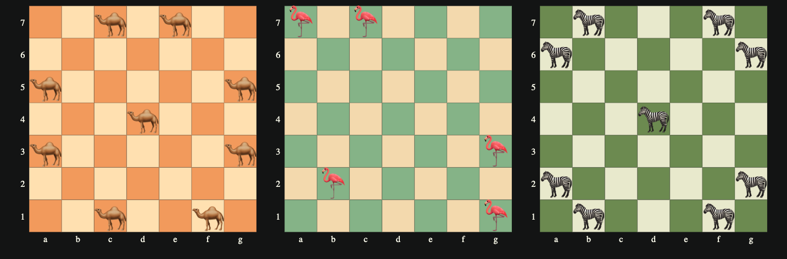
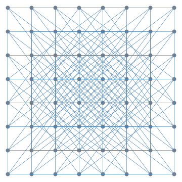
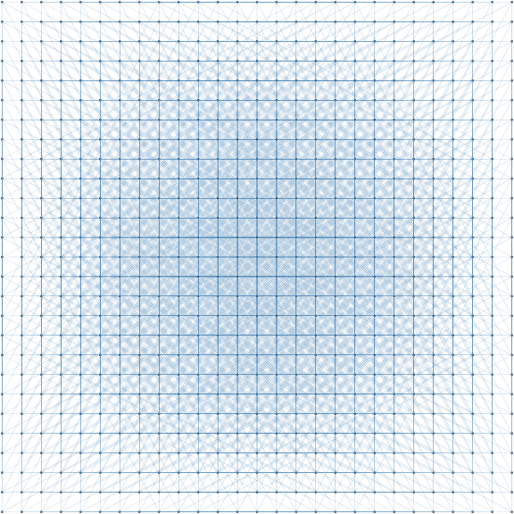
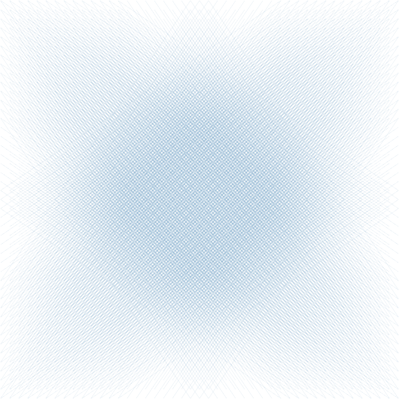

# Erdős unit distance conjecture examples -- Part 1: Leaper graphs

Anton Antonov  
[RakuForPrediction at WordPress](https://rakuforprediction.wordpress.com)  
May, June 2026

---

## Introduction

In the last two weeks there were quite a lot of discussions, posts, and articles about an OpenAI's model disproving a conjecture by Paul Erdős, [OAI1]. Erdős posed the following unit distance problem in 1946: 

> What is the maximum number $u(n)$ of unit-distance pairs (edges in the unit distance graph) determined by $n$ points in the Euclidean plane?

Here are key elements of the ***original conjecture***:

- **Upper bound**: Erdős proved $u(n) = O(n^{3/2})$ by noting that the unit distance graph is $K_{2,3}$-free (two circles of radius 1 intersect in at most two points) and applying a simple [extremal graph theory](https://en.wikipedia.org/wiki/Extremal_graph_theory) argument (related to the [Kővári–Sós–Turán theorem](https://victorlecomte.com/notes/kovari-sos-turan-theorem.html)).

- **Lower bound construction**: A rescaled square grid (e.g., points from a $\sqrt{n} \times \sqrt{n}$ section of the integer lattice $\mathbb{Z}^2$, scaled appropriately). This gives $\Omega(n^{1 + c / \log \log n})$ unit distances for some $c > 0$.

- **Conjecture**: Erdős conjectured that $u(n) = n^{1 + o(1)}$ (i.e., at most $n^{1+\epsilon}$ for any $\epsilon > 0$ and large enough $n$), essentially that the square grid constructions were asymptotically near-optimal.

In graph-theoretic terms, this concerns the maximum edge density in a unit distance graph embeddable in the plane. The square lattice provided the foundational example for believing the exponent was close to $1$.

This conjecture was widely believed for decades (with the square grid seen as the model for maximal constructions), but it was disproved in 2026 by an OpenAI model using algebraic or number-theoretic constructions that achieve a polynomial improvement (higher density than any square-grid-based approach).

For small $n$, other structures (e.g., triangular lattices or algebraic configurations like [Moser spindles/rings](https://en.wikipedia.org/wiki/Moser_spindle)) can be denser, but Erdős' original asymptotic thinking centered on the square grid.

This is closely related to (but distinct from) the chromatic number of the plane ([Hadwiger-Nelson problem](https://mathworld.wolfram.com/Hadwiger-NelsonProblem.html)), which also involves unit distance graphs.

**Remark:** Here is the $K_{2,3}$ graph (which is a [complete bipartite graph](https://mathworld.wolfram.com/CompleteBipartiteGraph.html)):

```raku
#% html
Graph::Complete.new([2,3]).dot(vertex-shape => 'point'):svg
```


The OpenAI-vs-Erdős discussions "triggered" a particular path of learning-by-doing activities for me, which is outlined here:

1. Read about the unit distance conjecture by Paul Erdős.
2. Try to understand some of the tersely-written dedicated posts.
    - Like [EP1].
3. Program [complex number-based visualizations](https://pbs.twimg.com/media/HJf20HEW0AEI_gQ?format=jpg&name=medium) of unit-distance point collections.
4. Try to make related *graph plots* in Raku.
5. Implement or streamline Raku functionalities: 
    - Program [*leaper graphs*](https://mathworld.wolfram.com/LeaperGraph.html) in ["Graph"](https://raku.land/zef:antononcube/Graph), [AAp1]
    - Possible use of vertex coordinates when creating relation graphs
    - Implement `powers-representations` in ["Math::NumberTheory"](https://raku.land/zef:antononcube/Math::NumberTheory), [AAp2] 
    - Use native distance functions implementations in ["Math::DistanceFunctions"](https://raku.land/zef:antononcube/Math::DistanceFunctions), [AAp3, AAp4]
6. Make a leaper graphs visual dictionary via Large Language Models (LLMs).
    - Using [Forsyth-Edwards Notation (FEN)](https://en.wikipedia.org/wiki/Forsyth–Edwards_Notation) and chess-board plots.
7. Program complex numbers visualization animations in Wolfram Language.
8. Consider programming those animations in Raku.
9. Give up to peer pressure and make a dedicated [unit distance graphs animations blog post](https://community.wolfram.com/groups/-/m/t/3723873) at [Wolfram Community](https://community.wolfram.com).
10. Get back to Raku visualizations of Erdős conjecture related graphs.
    - Make the (hard) decision to split the corresponding notebook (or article) into two parts.
11. Make a fully fledged "unit distance leaper graphs" notebook with:
    - *Cute* leaper graph examples
    - Theoretical constructs
    - Animation preparation and creation
12. Experiment with a finding a collection of leaper graphs that produce compelling enough animations.    
13. Make the second part based on complex numbers.    

This notebook is the 11-th point of the list above -- it shows how to make, plot, and animate collections of unit distance leaper graphs.

---

## Setup

```raku
use Graph;
use Graphviz::DOT::Chessboard;
use Math::NumberTheory;
use Math::DistanceFunctions;

use Data::Reshapers;
use Image::Markup::Utilities;
```

```raku
my $title-color = 'Ivory';
my $stroke-color = 'SlateGray';
my $tooltip-color = 'LightBlue';
my $tooltip-background-color = 'none';
my $background = '#1F1F1F';
my $color-scheme = 'schemeTableau10';
my $edge-thickness = 3;
my $vertex-size = 3;
```

----

## Leaper graphs

In order to construct square grid graphs with edges that are of length 1, we consider the family of [*leaper graphs*](https://mathworld.wolfram.com/LeaperGraph.html). The Leaper graph  generalizes the [Knight Tour graph](https://mathworld.wolfram.com/KnightGraph.html). Here are the moves of [Camel graph](https://mathworld.wolfram.com/CamelGraph.html), Flamingo graph,  and [Zebra graph](https://mathworld.wolfram.com/ZebraGraph.html), which are leaper graphs parameterized with $(1, 3)$, $(1, 6)$, and $(2, 3)$, respectively:

```raku
#% html
my %opts-brown = black-square-color => 'SandyBrown', white-square-color => 'Moccasin', :65font-size;
my $fenC = '8/2N1N2/8/N5N1/3n3/N5N1/8/2N2N2';
my $c = dot-chessboard($fenC, :7r, :7c, :4size, background=>'none', |%opts-brown, :svg);
$c .= subst(/ '♞' | '♘'/, '🐪', :g);

my %opts-blue = black-square-color => 'DarkSeaGreen', white-square-color => 'Wheat', :65font-size;
my $fenF = '8/N1N5/8/8/8/6N1/1n6/6N1';
my $f = dot-chessboard($fenF, :7r, :7c, :4size, background=>'none', |%opts-blue, :svg);
$f .= subst(/ '♞' | '♘'/, '🦩', :g);

my %opts-green = black-square-color => '#779556ff', white-square-color => '#ebedb7', :65font-size;
my $fenZ = '8/1N3N1/N5N1/8/3n3/8/N5N1/1N3N1';
my $z = dot-chessboard($fenZ, :7r, :7c, :4size, background=>'none', |%opts-green, :svg);
$z .= subst(/ '♞' | '♘'/, '🦓', :g);


$c ~ $f ~ $z
```



**Remark:** From the code and plots above it can be seen that the package ["Graphviz::DOT::Chessboard"](https://raku.land/zef:antononcube/Graphviz::DOT::Chessboard), [AAp5], can handle chess boards and FEN notations with non-standard sizes.

----

## Making unit distance graphs using leaper graphs


We can ask ourselves:

1. Can we construct a "single-pattern" leaper graph in which the edges corresponding to all leaps are of length 1?
2. Can we combine a few leaper graphs in order to produce a unit distance graph?

To answer the first question, we observe that we can rescale the "chess board" of the leaper graph in such a way that each leap has "over air" distance of 1. For example, the integer coordinates of an $8\times8$ board can be divided by $5$ and that would make leaper graphs parameterized with $(0, 5)$ and $(3, 4)$ to have edges of unit length.

```raku
powers-representations(25, 2, 2)
```

```
# ((0 5) (3 4))
```

```raku
my ($rows, $columns) = (8, 8);
my $g1 = Graph::Leaper.new(moves => [0, 5], :$rows, :$columns);
my $g2 = Graph::Leaper.new(moves => [3, 4], :$rows, :$columns);
my $g = $g1.union($g2)
```

```
# Graph(vertexes => 64, edges => 128, directed => False)
```

Here we rescale the vertex coordinates in order to get edges with unit length:

```raku
sink $g.vertex-coordinates = $g.vertex-coordinates.map({ $_.key => $_.value <</>> 5}).Hash
```

Plot the graph:

```raku
#% html

$g.dot(
    engine => 'neato', 
    graph-size => 5, 
    vertex-shape => 'point', vertex-width => 0.02, vertex-height => 0.02, 
    vertex-color => 'SlateGray', vertex-fill-color => 'SlateGray', 
    edge-thickness => 0.2
):svg
```



Let us convince ourselves that the edges of that graph have unit length:

```raku
$g.edges
andthen .map({ $g.vertex-coordinates{$_.key}, $g.vertex-coordinates{$_.value} })
andthen .map({ euclidean-distance(|$_) })
andthen .List
andthen (min => $_.min, max => $_.max)
```

```
# (min => 0.9999999999999998 max => 1)
```

---

## Larger unit distance leaper graphs

That was just one, a relatively small graph. Can we find other leaper graphs based on representations with two or more terms? Here we search for integers that:

- Have two (or more) square-powers representations
- Are the square of an integer 

```raku
(1...10_000).grep({ my @fs = |factor-integer($_); @fs.elems == 1 && @fs.head.tail == 2 }).map({ $_ => powers-representations($_, 2, 2) }).grep({ $_.value.elems ≥ 2 })
```

```
# (25 => ((0 5) (3 4)) 169 => ((0 13) (5 12)) 289 => ((0 17) (8 15)) 841 => ((0 29) (20 21)) 1369 => ((0 37) (12 35)) 1681 => ((0 41) (9 40)) 2809 => ((0 53) (28 45)) 3721 => ((0 61) (11 60)) 5329 => ((0 73) (48 55)) 7921 => ((0 89) (39 80)) 9409 => ((0 97) (65 72)))
```

For example, if we pick the third smallest number of the ones found, $289 = 17^2$, we can make two leaper graphs and combine them as above.

```raku
my $g1 = Graph::Leaper.new(moves => [0, 17], :27rows, :27columns);
my $g2 = Graph::Leaper.new(moves => [8, 15], :27rows, :27columns);
my $g = $g1.union($g2)
```

```
# Graph(vertexes => 729, edges => 1452, directed => False)
```

Here we rescale vertex coordinates (in order to get unit length edges):

```raku
sink $g.vertex-coordinates = $g.vertex-coordinates.map({ $_.key => $_.value <</>> 17 }).Hash;
```

Plot the graph:

```raku
#% html

$g.dot(engine => 'neato', graph-size => 8, edge-thickness => 0.5, vertex-shape => 'point', vertex-width => 0.1, vertex-height => 0.1, :!vertex-labels ):svg
```



---

## Interesting patterns

We can just make leaper graphs in order to produce some interesting to look at patterns of lines. For example:

```raku
#% html
my $g = Graph::Leaper.new(moves => [31, 21], :45rows, :45columns);
$g.dot(engine => 'neato', :8graph-size, edge-thickness => 0.4, vertex-shape => 'point', :0vertex-width, :0vertex-height):svg
```



### Animation

Let us make an animation of images of leaper graphs. First we derive the graph plots: 

```raku
my @all-moves = (1, 2 ... 35) X (1, 2 ... 21);

@all-moves .= grep({ are-coprime(|$_) && $_.all ≥ 6 && $_.sum ≥ 30 });

say 'all-moves : ', @all-moves.elems;

my @rules = 
@all-moves.pairs.map({
    my $i = $_.key; 
    my @moves = |$_.value;
    say (:$i) if $i %% 20;
    
    my $g = Graph::Leaper.new(:@moves, :45rows, :45columns);
    $i => $g.dot(
        engine => 'neato', 
        :8graph-size, 
        vertex-shape => 'point', 
        vertex-width => 0,
        vertex-height => 0, 
        edge-thickness => 0.23,
        edge-color => 'ivory', 
        background => 'black',
        ):svg
});

deduce-type(@rules)

# ≈2m
```

```
# all-moves : 185
# i => 0
# i => 20
# i => 40
# i => 60
# i => 80
# i => 100
# i => 120
# i => 140
# i => 160
# i => 180

```

```
# Vector(Pair(Atom((Int)), Atom((Str))), 185)
```

Sort the graph plots according to the sums of the squares of their leaps (and the take SVG values):

```raku
my @imgs = @rules.sort({ sum(@all-moves[|$_.key] <<**>> 2) })».value;

deduce-type(@imgs)
```

```
# Vector(Atom((Str)), 185)
```

Make an animation with the list of images (SVG strings):

```raku
#%html
sink my $res = list-animate(@imgs, :10duration, repeat-count => 'indefinite')

# ≈11s without rendering
# ≈3m with rendering
```

### Export

Export the obtained SVG animation into one file:

```raku
spurt('./img/leaper-graphs-from-45-35-21-coprime-30sum.svg', $res)
```

```
# True
```

In general, the SVG animation file can be quite large. (E.g. ≈50MB, or 200MB.) That is why we might prefer making PNG or JPEG images for the graphs plots and then combining them into a movie.

Export each SVG graph plot (into a directory of frames), then convert the SVG file into a PNG image using [`rsvg-convert`](https://en.wikipedia.org/wiki/Librsvg):

```raku
sink for @rules.sort({ sum(@all-moves[|$_.key] <<**>> 2) }).kv -> $index, $p {
    my $svg-content = $p.value;

    my $filename = sprintf "./img/leaper-graph-frames/frame%05d.svg", $index;
    say (:$filename) if $index %% 20;
    spurt $filename, $svg-content;
    my $png-filename = sprintf "./img/leaper-graph-frames/frame-%05d.png", $index;
    shell "rsvg-convert -w 800 -h 800 -o $png-filename $filename";
}

# ≈45s
```

```
# filename => ./img/leaper-graph-frames/frame00000.svg
# filename => ./img/leaper-graph-frames/frame00020.svg
# filename => ./img/leaper-graph-frames/frame00040.svg
# filename => ./img/leaper-graph-frames/frame00060.svg
# filename => ./img/leaper-graph-frames/frame00080.svg
# filename => ./img/leaper-graph-frames/frame00100.svg
# filename => ./img/leaper-graph-frames/frame00120.svg
# filename => ./img/leaper-graph-frames/frame00140.svg
# filename => ./img/leaper-graph-frames/frame00160.svg
# filename => ./img/leaper-graph-frames/frame00180.svg

```

### Make a movie

Make a movie using [`FFmpeg`](https://ffmpeg.org):

```raku
#% bash
# ffmpeg -framerate 6 -pattern_type glob -i './img/leaper-graph-frames/frame-*.png' -c:v libx264 -pix_fmt yuv420p -crf 23 -movflags +faststart ./img/output.mp4
```

The animation can be seen [here (Imgur)](https://imgur.com/2nHq73e).

----

## References

### Articles, blog posts

[OAI1] OpenAI, ["An OpenAI model has disproved a central conjecture in discrete geometry"](https://openai.com/index/model-disproves-discrete-geometry-conjecture/), (2026), [openai.com](https://openai.com).

### Notebooks

[AAn1] Anton Antonov, ["Unit distance graph animations"](https://community.wolfram.com/groups/-/m/t/3723873), (2026), [Wolfram Community](https://community.wolfram.com).

[EPn1] Ed Pegg, ["OpenAI disproves Erdős unit distance conjecture"](https://community.wolfram.com/groups/-/m/t/3719376), (2026), [Wolfram Community](https://community.wolfram.com).

### Packages

[AAp1] Anton Antonov, [Graph, Raku package](https://github.com/antononcube/Raku-Graph), (2024-2026), [GitHub/antononcube](https://github.com/antononcube).

[AAp2] Anton Antonov, [Math::NumberTheory, Raku package](https://github.com/antononcube/Raku-Math-NumberTheory), (2025-2026), [GitHub/antononcube](https://github.com/antononcube).

[AAp3] Anton Antonov, [Math::DistanceFunctions, Raku package](https://github.com/antononcube/Raku-Math-DistanceFunctions), (2024-2026), [GitHub/antononcube](https://github.com/antononcube).

[AAp4] Anton Antonov, [Math::DistanceFunctions::Native, Raku package](https://github.com/antononcube/Raku-Math-DistanceFunctions-Native), (2024), [GitHub/antononcube](https://github.com/antononcube).

[AAp5] Anton Antonov, [Graphviz::DOT::Chessboard, Raku package](https://github.com/antononcube/Raku-Graphviz-DOT-Chessboard), (2024), [GitHub/antononcube](https://github.com/antononcube).

[AAp6] Anton Antonov, [Image::Markup::Utilities, Raku package](https://github.com/antononcube/Raku-Image-Markup-Utilities), (2023-2026), [GitHub/antononcube](https://github.com/antononcube).