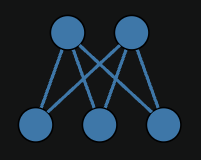
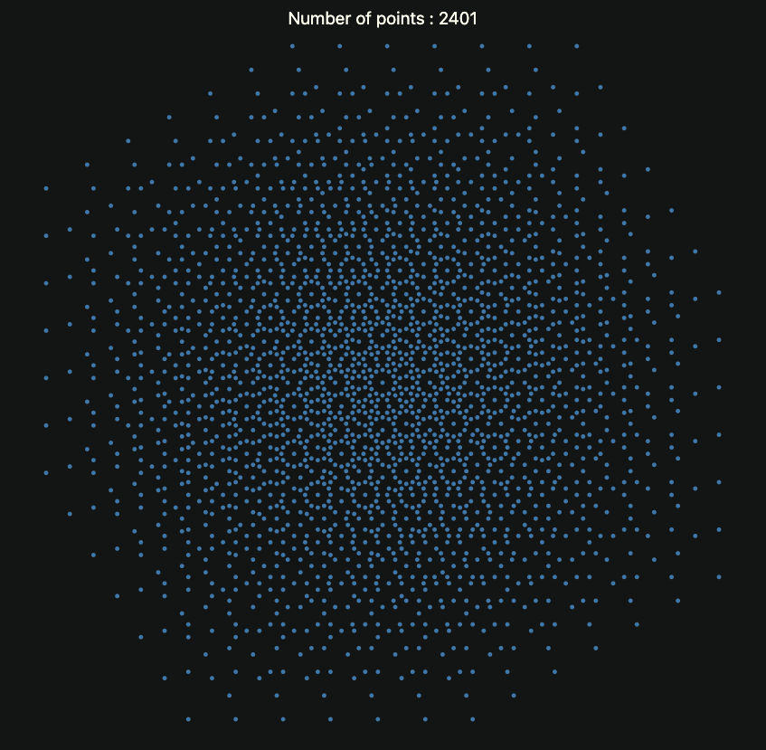
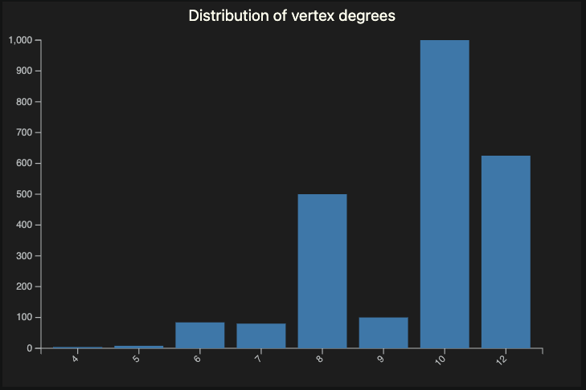
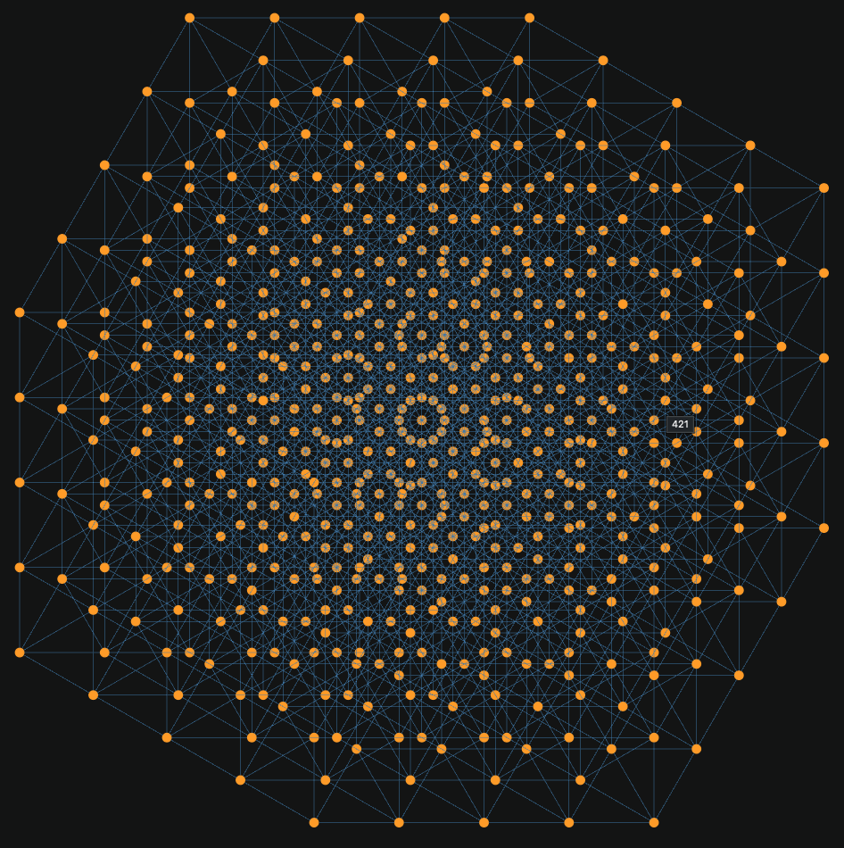
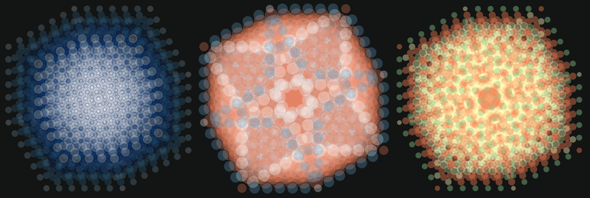

# Erdős unit distance conjecture examples -- Part 2: Lattice graphs

Anton Antonov  
[RakuForPrediction at WordPress](https://rakuforprediction.wordpress.com)  
May, June 2026

---

## Introduction

<p>In the last two weeks there were quite a lot of discussions, posts, and articles about an OpenAI's model disproving a conjecture by Paul Erdős, [OAI1]. Erdős posed the following unit distance problem in 1946:</p>

<blockquote>
  <p>What is the maximum number <span style="font-style:italic;">u(n)</span> of unit-distance pairs (edges in the unit distance graph) determined by <span style="font-style:italic;">n</span> points in the Euclidean plane?</p>
</blockquote>

<p>Here are key elements of the <strong>original conjecture</strong>:</p>

<ul>
  <li><strong>Upper bound</strong>: Erdős proved <span style="font-style:italic;">u(n) = O(n<sup>3/2</sup>)</span> by noting that the unit distance graph is <span style="font-style:italic;">K<sub>2,3</sub></span>-free (two circles of radius 1 intersect in at most two points) and applying a simple <a href="https://en.wikipedia.org/wiki/Extremal_graph_theory">extremal graph theory</a> argument (related to the <a href="https://victorlecomte.com/notes/kovari-sos-turan-theorem.html">Kővári–Sós–Turán theorem</a>).</li>
  <li><strong>Lower bound construction</strong>: A rescaled square grid (e.g., points from a <span style="font-style:italic;">√n × √n</span> section of the integer lattice <span style="font-style:italic;">ℤ<sup>2</sup></span>, scaled appropriately). This gives <span style="font-style:italic;">Ω(n<sup>1 + c / log log n</sup>)</span> unit distances for some <span style="font-style:italic;">c > 0</span>.</li>
  <li><strong>Conjecture</strong>: Erdős conjectured that <span style="font-style:italic;">u(n) = n<sup>1 + o(1)</sup></span> (i.e., at most <span style="font-style:italic;">n<sup>1+ε</sup></span> for any <span style="font-style:italic;">ε > 0</span> and large enough <span style="font-style:italic;">n</span>), essentially that the square grid constructions were asymptotically near-optimal.</li>
</ul>

<p>In graph-theoretic terms, this concerns the maximum edge density in a unit distance graph embeddable in the plane. The square lattice provided the foundational example for believing the exponent was close to 1.</p>

<p>This conjecture was widely believed for decades (with the square grid seen as the model for maximal constructions), but it was disproved in 2026 by an OpenAI model using algebraic or number-theoretic constructions that achieve a polynomial improvement (higher density than any square-grid-based approach).</p>

<p>For small <span style="font-style:italic;">n</span>, other structures (e.g., triangular lattices or algebraic configurations like <a href="https://en.wikipedia.org/wiki/Moser_spindle">Moser spindles/rings</a>) can be denser, but Erdős' original asymptotic thinking centered on the square grid.</p>

<p>This is closely related to (but distinct from) the chromatic number of the plane (<a href="https://mathworld.wolfram.com/Hadwiger-NelsonProblem.html">Hadwiger-Nelson problem</a>), which also involves unit distance graphs.</p>

<p><strong>Remark:</strong> Here is the <span style="font-style:italic;">K<sub>2,3</sub></span> graph (which is a <a href="https://mathworld.wolfram.com/CompleteBipartiteGraph.html">complete bipartite graph</a>):</p>


```raku
#% html
Graph::Complete.new([2,3]).dot(vertex-shape => 'point'):svg
```



The OpenAI-vs-Erdős discussions "triggered" a particular path of learning-by-doing activities for me, which is outlined here:

1. Read about the unit distance conjecture by Paul Erdős.
2. Try to understand some of the tersely-written dedicated posts.
    - Like [EP1].
3. Program [complex number-based visualizations](https://pbs.twimg.com/media/HJf20HEW0AEI_gQ?format=jpg&name=medium) of unit-distance point collections.
4. Try to make related *graph plots* in Raku.
5. Implement or streamline Raku functionalities: 
    - Program [*leaper graphs*](https://mathworld.wolfram.com/LeaperGraph.html) in ["Graph"](https://raku.land/zef:antononcube/Graph), [AAp1]
    - Possible use of vertex coordinates when creating relation graphs
    - Implement `powers-representations` in ["Math::NumberTheory"](https://raku.land/zef:antononcube/Math::NumberTheory), [AAp2] 
    - Use native distance functions implementations in ["Math::DistanceFunctions"](https://raku.land/zef:antononcube/Math::DistanceFunctions), [AAp3, AAp4]
6. Make a leaper graphs visual dictionary via Large Language Models (LLMs).
    - Using [Forsyth-Edwards Notation (FEN)](https://en.wikipedia.org/wiki/Forsyth–Edwards_Notation) and chess-board plots.
7. Program complex numbers visualization animations in Wolfram Language.
8. Consider programming those animations in Raku.
9. Give up to peer pressure and make a dedicated [unit distance graphs animations blog post](https://community.wolfram.com/groups/-/m/t/3723873) at [Wolfram Community](https://community.wolfram.com).
10. Get back to Raku visualizations of Erdős conjecture related graphs.
    - Make the (hard) decision to split the corresponding notebook (or article) into two parts.
11. Make a fully fledged "unit distance leaper graphs" notebook with:
    - *Cute* leaper graph examples
    - Theoretical constructs
    - Animation preparation and creation
12. Experiment with a finding a collection of leaper graphs that produce compelling enough animations.    
13. Make the second part based on graphs over lattices generated by complex number operations.

This, second notebook is the 13-th point of the list above -- it shows how to make unit distance graphs using 2D lattices generated with complex number operations.
The [first notebook, corresponding to the 11-th point](https://github.com/antononcube/RakuForPrediction-blog/blob/main/Notebooks/Jupyter/Erdős-unit-distance-conjecture-examples--Part-1-Leaper-graphs.ipynb) corresponds to the blog post ["Erdős unit distance conjecture examples -- Part 1: Leaper graphs"](https://rakuforprediction.wordpress.com/2026/06/05/erdos-unit-distance-conjecture-examples-part-1-leaper-graphs/), [AA1].

---

## Setup

```raku
use Math::NumberTheory;
use Math::NumberTheory::Utilities;

use Math::Nearest;
use Math::DistanceFunctions;
use NativeCall;
use NativeHelpers::Array;

use Data::Reshapers;
use Graphviz::DOT::Chessboard;

use NativeCall;
```

### D3.js

```raku
#%javascript
require.config({
     paths: {
     d3: 'https://d3js.org/d3.v7.min'
}});

require(['d3'], function(d3) {
     console.log(d3);
});
```

```raku
#%js
js-d3-list-line-plot(10.rand xx 30, background => 'none')
```

```raku
my $title-color = 'Ivory';
my $stroke-color = 'SlateGray';
my $tooltip-color = 'LightBlue';
my $tooltip-background-color = 'none';
my $background = '#1F1F1F';
my $color-scheme = 'schemeTableau10';
my $edge-thickness = 3;
my $vertex-size = 3;
```

---

## Graphs over lattices

It has been observed that highly dense unit distance graphs can be made over Morse lattices, [PE1]. Morse lattices can be defined as additive subgroups of the complex numbers, ℂ, that are isomorphic to ℤ⁴.

### Edges computation

Here we define a function that computes the edges of a Morse lattice graph:

```raku
sub unit-distance-graph-edges(Numeric:D $alpha, Int:D $m) {
    my $omega = -0.5 + $alpha * 1i;
    my @r = (-$m ... $m);
    my @pt = do gather {
        for @r -> $a {
            for @r -> $b {
                for @r -> $c {
                    for @r -> $d {
                        my $p = $a + $b * 1i + $c * $omega + $d * 1i * $omega;
                        take [$p.re, $p.im]
                    }
                }
            }
        }
    }

    @pt = @pt.map({ copy-to-carray($_, num64) });
    my &nf = nearest(@pt);
    
    my %conn;
    for @pt.kv -> $k, $p {
        my @neighbors = &nf($p, (Whatever, 1.1));
        %conn{$k} = @neighbors.grep({ abs(1 - euclidean-distance($_, $p)) ≤ 1e-5 });
    }
    
    %conn = %conn.grep(*.value.elems);
    my @edges = %conn.kv.map( -> $k, @v { @v.map({ [@pt[$k.Int], $_].sort }) }).flat(1)».Array.unique;
    my @vertices = flatten(@edges, 1).unique;
    my %vertex-coords = @vertices.kv.map( -> $k, $v { $k.Str => $v });
    my %vertex-index = %vertex-coords.map({ $_.value => $_.key });
    @edges = @edges.map({ [%vertex-index{$_[0]}, %vertex-index{$_[1]}] });

    return %(:@edges, vertex-coordinates => %vertex-coords, :%vertex-index);
}
```

Compute the graph with particular parameters:

```raku
my %res = unit-distance-graph-edges(sqrt(3)/2, 3);
deduce-type(%res)
```

```
# Struct([edges, vertex-coordinates, vertex-index], [Array, Hash, Hash])
```

### Just plot the points

Here we get graph's vertex coordinates and plot them:

```raku
#%js
my @points = |%res<vertex-coordinates>.values;

js-d3-list-plot(
    @points».Array,
    point-size => 3,
    background => 'none',
    :700width, :700height, 
    :!axes,
    :$title-color,
    title => "Number of points : {@points.elems}"
)
```



---

## Vertex degrees

The obtained graphs are clearly with non-uniform distribution of the points. This prompts us to analyze the vertex degrees. Here we make the graph object:

```raku
my $g = Graph.new(edges => %res<edges>, vertex-coordinates => %res<vertex-coordinates>)
```

```
# Graph(vertexes => 2401, edges => 11760, directed => False)
```

Here is a tally of the vertex degrees:

```raku
tally($g.vertex-degree)
```

```
# {10 => 1000, 12 => 625, 4 => 4, 5 => 8, 6 => 84, 7 => 80, 8 => 500, 9 => 100}
```

And here is the vertex degrees distribution:

```raku
#% js
js-d3-bar-chart(
    tally($g.vertex-degree).map({ <x y>.Array Z=> [$_.key, $_.value] })».Hash.sort(*<x>), 
    :$background,
    :$title-color,
    title => 'Distribution of vertex degrees'
)
```



----

## Alternative graph creation

A faster way of computing the graphs above -- in Raku -- is to use a relation graph over the points of a Moser lattice, [PE1]:

```raku
sub omega($t) { exp(i * acos(1 - 1/2 * $t))}
my $omega = omega(1); # or just: -0.5 + sqrt(3)/2 * 1i
my @gen = 1, 1i, $omega, 1i * $omega; # or just: i <<**>> (0, 1, 4/3, 7/3)) })
my @p = cross((-2 ... 2) xx 4).map({ dot-product($_.Array, @gen) });
my $gML = Graph::Relation.new({abs(abs(@p[$^a] - @p[$^b]) - 1) ≤ 1e-8}, ^@p.elems, as => {.Str}, vertex-coordinates => @p.kv.map(-> $k, $v { $k => [$v.re, $v.im]}).Hash);
$gML
```

```
# Graph(vertexes => 625, edges => 2800, directed => False)
```

Plot the graph:

```raku
#% html
$gML.dot(
    :!vertex-labels,
    vertex-color => 'Orange',
    vertex-fill-color => 'Orange',
    vertex-shape => 'point', 
    vertex-width => 0.1, 
    vertex-height => 0.1, 
    edge-width => 0.4,
    edge-color => 'SteelBlue',
    :8graph-size,
    engine => 'neato'
):svg
```



---

## Prettier graph plots

Let us make highlights on the graph based on vertex degrees:

```raku
my @highlight = $g.vertex-degree(:p).classify(*.value).map({ $_.value».key }).sort(-*.elems);
deduce-type(@highlight)
```

```
# Tuple([Vector(Atom((Str)), 1000), Vector(Atom((Str)), 625), Vector(Atom((Str)), 500), Vector(Atom((Str)), 100), Vector(Atom((Str)), 84), Vector(Atom((Str)), 80), Vector(Atom((Str)), 8), Vector(Atom((Str)), 4)])
```

Plot the graph using [Graphviz DOT](https://graphviz.org/doc/info/lang.html) (and [related layout engines](https://graphviz.org/docs/layouts/)):

```raku
#% html
$g.dot(
    :!vertex-labels,
    :@highlight,
    vertex-fill-color => 'orange',
    vertex-shape => 'point', 
    vertex-width => 0.1, 
    vertex-height => 0.1, 
    edge-width => 0.2,
    :8graph-size,
    engine => 'neato'
):svg
```



Bubble charts using ["JavaScript::D3"](https://raku.land/zef:antononcube/JavaScript::D3):

```raku
#% js
my %degrees = $g.vertex-degree():p;
my @data = %res<vertex-coordinates>.map({ x => $_.value.head, y => $_.value.tail, z => %degrees{$_.key}, group => %degrees{$_.key}.Str })».Hash;
@data .= sort({ -$_<z> * 100 + 10 * norm($_<x y>) + cosine-distance($_<x y>, [0, 1]) });
my %opts =
   :500width,
   :500height, 
   background => 'none',
   z-range-min => 6,
   z-range-max => 12,
   opacity => 0.4,
   color-palette => 'Tableau10',
   :!axes,
   :!tooltip,
   :!legends,
   :20margins
   ;

js-d3-bubble-chart(@data.sort(*<z>), |%opts, z-range-min => 8, opacity => 0.2, color-palette => 'Blues[7]', stroke-color => 'Black')
~
js-d3-bubble-chart(@data, |%opts, z-range-min => 10, z-range-max => 24, opacity => 0.3, color-palette => 'RdBu[3]', stroke-color => 'none')
~
js-d3-bubble-chart(@data, |%opts, color-palette => 'Spectral[3]', stroke-color => 'none') 
```

**Remark:** The z-ranges, opacities, and color palettes were chosen after 10 to 20 experiments in order to reveal the graph structure or configuration and produce compelling, attractive plots.

----

## References

### Articles, blog posts

[AA1] Anton Antonov, ["Erdős unit distance conjecture examples — Part 1: Leaper graphs"](https://rakuforprediction.wordpress.com/2026/06/05/erdos-unit-distance-conjecture-examples-part-1-leaper-graphs/), (2026), [RakuForPrediction at WordPress](https://rakuforprediction.wordpress.com).

[DC1] Davide Castelvecchi, ["AI cracks 80-year-old mathematics challenge — researchers are astonished"](https://www.nature.com/articles/d41586-026-01651-0), [Nature.com](https://www.nature.com), DOI: https://doi.org/10.1038/d41586-026-01651-0.

[PE1] Peter Engel et al., ["Diverse beam search to find densest-known planar unit distance graphs", arXiv:2406.15317 [math.CO]](https://arxiv.org/abs/2406.15317), (2025), [arxiv.org](https://arxiv.org).

[OAI1] OpenAI, ["An OpenAI model has disproved a central conjecture in discrete geometry"](https://openai.com/index/model-disproves-discrete-geometry-conjecture/), (2026), [openai.com](https://openai.com).

### Books

[PB1] Peter Brass et al., [Research Problems in Discrete Geometry](https://link.springer.com/book/10.1007/0-387-29929-7), 2005, Springer. ISBN-13: 978-0387-23815-8.

### Notebooks

[AAn1] Anton Antonov, ["Unit distance graph animations"](https://community.wolfram.com/groups/-/m/t/3723873), (2026), [Wolfram Community](https://community.wolfram.com).

[EPn1] Ed Pegg, ["OpenAI disproves Erdős unit distance conjecture"](https://community.wolfram.com/groups/-/m/t/3719376), (2026), [Wolfram Community](https://community.wolfram.com).

### Packages

[AAp1] Anton Antonov, [Graph, Raku package](https://github.com/antononcube/Raku-Graph), (2024-2026), [GitHub/antononcube](https://github.com/antononcube).

[AAp2] Anton Antonov, [Math::NumberTheory, Raku package](https://github.com/antononcube/Raku-Math-NumberTheory), (2025-2026), [GitHub/antononcube](https://github.com/antononcube).

[AAp3] Anton Antonov, [Math::DistanceFunctions, Raku package](https://github.com/antononcube/Raku-Math-DistanceFunctions), (2024-2026), [GitHub/antononcube](https://github.com/antononcube).

[AAp4] Anton Antonov, [Math::DistanceFunctions::Native, Raku package](https://github.com/antononcube/Raku-Math-DistanceFunctions-Native), (2024), [GitHub/antononcube](https://github.com/antononcube).

[AAp5] Anton Antonov, [Graphviz::DOT::Chessboard, Raku package](https://github.com/antononcube/Raku-Graphviz-DOT-Chessboard), (2024), [GitHub/antononcube](https://github.com/antononcube).

[AAp6] Anton Antonov, [Image::Markup::Utilities, Raku package](https://github.com/antononcube/Raku-Image-Markup-Utilities), (2023-2026), [GitHub/antononcube](https://github.com/antononcube).