# Graph::RandomMaze examples

<p style="font-size: 18px; font-weight: bold; font-style: italic;">Generate random labyrinths</p>

Anton Antonov  
[RakuForPrediction at WordPress](https://rakuforprediction.wordpress.com)   
December 2025

---

## Introduction

This document demonstrates the functions of ["Graph::RandomMaze"](https://raku.land/zef:antononcube/Graph::RandomMaze), [AAp1], for generating and displaying random mazes.
The methodology and implementations of maze creation based on random rectangular and hexagonal grid graphs are described in detail in the blog post ["Day 24 – Maze Making Using Graphs"](https://raku-advent.blog/2025/12/24/day-24-maze-making-using-graphs/), [AA1], 
and in the Wolfram notebook ["Maze Making Using Graphs"](https://community.wolfram.com/groups/-/m/t/3597439), [AAn1].

**Remark:** The corresponding Wolfram Language implementation is [Wolfram Function Repository](https://resources.wolframcloud.com/FunctionRepository/) 
function ["RandomLabyrinth"](https://www.wolframcloud.com/obj/antononcube/DeployedResources/Function/RandomLabyrinth/), [AAf1]. 

**Remark:** Both synonyms, "labyrinth" and "maze," are used in this document.

### TL;DR

Just look at the "neat examples" in the last section.

----

## Documentation

This section gives basic documentation of the subs.

### Usage

| Function                          | Description                                                                 |
|-----------------------------------|-----------------------------------------------------------------------------|
| `random-maze(n)`                  | generate a random labyrinth based on `n × n` grid graph               |
| `random-maze([n, m])`             | generate a random labyrinth based on a grid graph with `n` rows and `m` columns |
| `&random-labyrinth`               | a synonym of `&random-maze`                                             |
| `display-maze($m)`                | displays outputs `random-maze` using [Graphviz graph layout engines](https://graphviz.org/docs/layouts/)    |

### Details & Options

- The sub `random-maze` generates mazes based on regular rectangular grid graphs or hexagonal grid graphs.
- By default, are generated random mazes based on rectangular grid graphs.
- The named argument (option) "type" can be used the specify the type of the grid graph used for maze's construction.
- The labyrinth elements can be obtained by using the second argument (the "properties argument.")
- The labyrinth elements are: walls, paths (pathways), solution, start, and end.
- The sub `display-maze` can be used to make SVG images of the outputs of `random-maze`.
- By default `display-maze` uses the Graphviz engine ["neato"](https://graphviz.org/docs/layouts/neato/).
- The sub `random-maze` uses the grid graphs `Graph::Grid`, `Graph::HexagonalGrid`, and `Graph::TriangularGrid`. For more details see [AA1, AAn1].
- For larger sizes the maze generation might be (somewhat) slow.

---

## Setup

Here are the packages used in this document:

```raku
use Graph::RandomMaze;
use Data::Generators;
use JavaScript::D3;
use Hash::Merge;
```

Here are `Graph.dot` options used in this document:

```raku
sink my $engine = 'neato';
sink my $vertex-shape = 'square';
sink my $graph-size = 8;
sink my %opts = :$engine, :8size, vertex-shape => 'square', :!vertex-labels, edge-thickness => 12;
sink my %hex-opts = :$engine, :8size, vertex-shape => 'hexagon', :!vertex-labels, vertex-width => 0.8, vertex-height => 0.8, edge-thickness => 32;

sink my $background = '#1F1F1F';
```

This code is used to prime the notebook to display (JavaScript) D3.js graphics:

```raku
#% javascript
require.config({
     paths: {
     d3: 'https://d3js.org/d3.v7.min'
}});

require(['d3'], function(d3) {
     console.log(d3);
});
```

----

## Examples

### Basic Examples

Make a random rectangular grid labyrinth with 8 rows and columns:

```raku
#%html
random-maze(8).dot(|%opts, :3size):svg
```

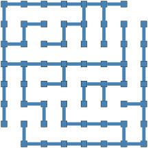

Make a random rectangular grid labyrinth with 5 rows and 8 columns:

```raku
#%html
random-maze([5, 8]).dot(|%opts, :3size):svg
```

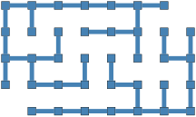

### Scope

Make a random hexagonal grid labyrinth:

```raku
#% html
random-maze([8, 16], type => "hexagonal").dot(|%hex-opts):svg
```

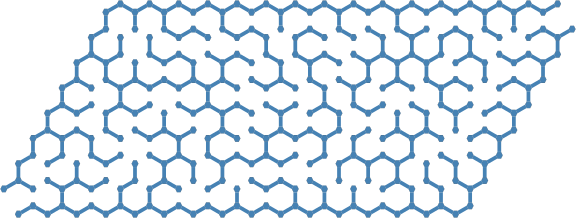

Make a labyrinth using options to specify the rows and columns of the walls graph:

```raku
#% html
random-maze(:10rows, :5columns)
andthen display-maze($_, |%opts, :3size)
```

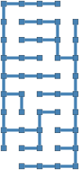

The sub `random-maze` take an optional properties argument. Here are the different properties:

```raku
random-maze("properties")
```

```
# [type dimensions walls paths solution start end]
```

If the properties argument is `Whatever`, then an association with all properties is returned ("props" can be used instead of "properties"):

```raku
random-maze(5, props => Whatever)
```

```
# {dimensions => [5 5], end => 3_3, paths => Graph(vertexes => 16, edges => 15, directed => False), solution => [0_0 1_0 1_1 2_1 2_2 2_3 3_3], start => 0_0, type => rectangular, walls => Graph(vertexes => 23, edges => 21, directed => False)}
```

The first argument of the sub `display-maze` can be a graphs or a hashmap. Here is example of using both argument types:

```raku
#%html
my %new-opts = merge-hash(%opts, {:2size});
[
    graph   => display-maze(random-maze(5, props => 'walls' ), |%new-opts),
    hashmap => display-maze(random-maze(5, props => Whatever), |%new-opts) 
]
==> to-html-table()
```

<table style="border-collapse: collapse; border: 3px solid black;"><thead><tr><th style="border: 3px solid black; text-align: left;">graph</th><th style="border: 3px solid black; text-align: left;">hashmap</th></tr></thead><tbody><tr><td style="border: 3px solid black; text-align: left;"><?xml version="1.0" encoding="UTF-8" standalone="no"?>
<!DOCTYPE svg PUBLIC "-//W3C//DTD SVG 1.1//EN"
 "http://www.w3.org/Graphics/SVG/1.1/DTD/svg11.dtd">
<!-- Generated by graphviz version 14.0.0 (20250921.2048)
 -->
<!-- Pages: 1 -->
</td><td style="border: 3px solid black; text-align: left;"><?xml version="1.0" encoding="UTF-8" standalone="no"?>
<!DOCTYPE svg PUBLIC "-//W3C//DTD SVG 1.1//EN"
 "http://www.w3.org/Graphics/SVG/1.1/DTD/svg11.dtd">
<!-- Generated by graphviz version 14.0.0 (20250921.2048)
 -->
<!-- Pages: 1 -->
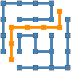</td></tr></tbody></table>

---

## Options

#### Type

The option `:$type` specifies the type grid graphs used to make the labyrinth. It takes the values "rectangular" and "hexagonal":

```raku
#% html
<rectangular hexagonal>
andthen .map({ random-maze(7, type => $_, props => Whatever) }).List
andthen 
    [
        $_.head<type> => display-maze($_.head, |merge-hash(%opts, {:3size})), 
        $_.tail<type> => display-maze($_.tail, |merge-hash(%hex-opts, {size => 4.5}))
    ]
andthen .&to-html-table
```

<table style="border-collapse: collapse; border: 3px solid black;"><thead><tr><th style="border: 3px solid black; text-align: left;">rectangular</th><th style="border: 3px solid black; text-align: left;">hexagonal</th></tr></thead><tbody><tr><td style="border: 3px solid black; text-align: left;"><?xml version="1.0" encoding="UTF-8" standalone="no"?>
<!DOCTYPE svg PUBLIC "-//W3C//DTD SVG 1.1//EN"
 "http://www.w3.org/Graphics/SVG/1.1/DTD/svg11.dtd">
<!-- Generated by graphviz version 14.0.0 (20250921.2048)
 -->
<!-- Pages: 1 -->
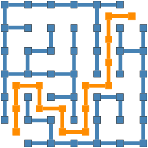</td><td style="border: 3px solid black; text-align: left;"><?xml version="1.0" encoding="UTF-8" standalone="no"?>
<!DOCTYPE svg PUBLIC "-//W3C//DTD SVG 1.1//EN"
 "http://www.w3.org/Graphics/SVG/1.1/DTD/svg11.dtd">
<!-- Generated by graphviz version 14.0.0 (20250921.2048)
 -->
<!-- Pages: 1 -->
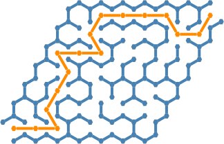</td></tr></tbody></table>

### DOT options

The sub `display-graph` takes Graphviz DOT options for more tuned maze display. The options are the same as those of `Graph.dot`.

```raku
#%html
random-maze([5, 10], props => 'walls')
==> display-maze(:$engine, vertex-shape => 'ellipse', vertex-width => 0.6, :6size)
```

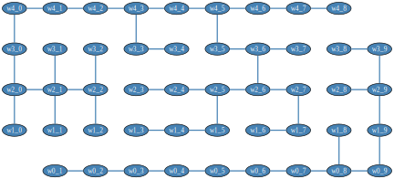

---

## Applications

### Rectangular maze with solution

Make a rectangular grid labyrinth and show it together with a (shortest path) solution:

```raku
#%html
my %res = random-maze([12, 24], props => <walls paths solution>);

display-maze(%res, |%opts)
```

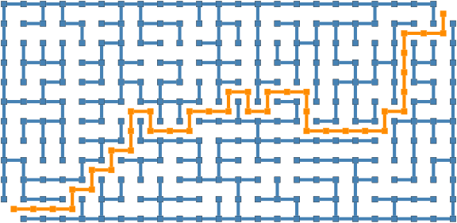

### Hexagonal maze with solution

Make a hexagonal grid labyrinth and show it together with a (shortest path) solution:

```raku
#%html
my %res = random-maze([12, 20], type => 'hexagonal', props => <walls paths solution>);

display-maze(%res, |%hex-opts)
```

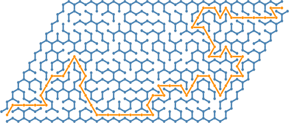

### Distribution of solution lengths

Generate -- in parallel -- 500 mazes:

```raku
my @labs = (^500).race(:4degree, :125batch).map({ random-maze(12, props => <walls paths solution>) });
deduce-type(@labs)
```

```
# Vector(Struct([paths, solution, walls], [Graph, Array, Graph]), 500)
```

Show the histogram of the shortest path solution lengths:

```raku
#% js
js-d3-histogram(
    @labs.map(*<solution>)».elems, 
    title => 'Distribution of solution lengths',
    title-color => 'Silver',
    x-axis-label => 'shortest path solution length',
    y-axis-label => 'count',
    :$background, :grid-lines, 
    :350height, :450width
)
```

Show the mazes with the shortest and longest shortest paths solutions:

```raku
#% html
@labs.sort(*<solution>.elems).List
andthen 
    [
        "shortest : {$_.head<solution>.elems}" => display-maze($_.head, |merge-hash(%opts , {:3size})),
        "longest : {$_.tail<solution>.elems}"  => display-maze($_.tail, |merge-hash(%opts , {size => 3}))
    ]
andthen .&to-html-table
```

<table style="border-collapse: collapse; border: 3px solid black;"><thead><tr><th style="border: 3px solid black; text-align: left;">shortest : 21</th><th style="border: 3px solid black; text-align: left;">longest : 55</th></tr></thead><tbody><tr><td style="border: 3px solid black; text-align: left;"><?xml version="1.0" encoding="UTF-8" standalone="no"?>
<!DOCTYPE svg PUBLIC "-//W3C//DTD SVG 1.1//EN"
 "http://www.w3.org/Graphics/SVG/1.1/DTD/svg11.dtd">
<!-- Generated by graphviz version 14.0.0 (20250921.2048)
 -->
<!-- Pages: 1 -->
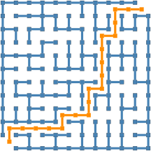</td><td style="border: 3px solid black; text-align: left;"><?xml version="1.0" encoding="UTF-8" standalone="no"?>
<!DOCTYPE svg PUBLIC "-//W3C//DTD SVG 1.1//EN"
 "http://www.w3.org/Graphics/SVG/1.1/DTD/svg11.dtd">
<!-- Generated by graphviz version 14.0.0 (20250921.2048)
 -->
<!-- Pages: 1 -->
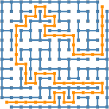</td></tr></tbody></table>

---

## Neat Examples

Larger rectangular grid maze:

```raku
#%html
random-maze([30, 60]).dot(|%opts, edge-thickness => 25):svg
```

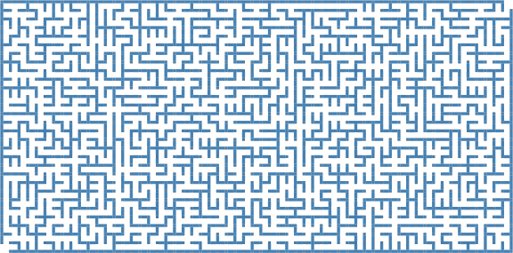

A larger hexagonal grid maze with its largest connected components colored:

```raku
#%html
my $g = random-maze([20, 30], type => 'hexagonal', props => 'walls');
$g.dot(highlight => $g.connected-components.head(2).map({ my $sg = $g.subgraph($_); [|$sg.vertex-list, |$sg.edge-list] }), |%hex-opts):svg
```

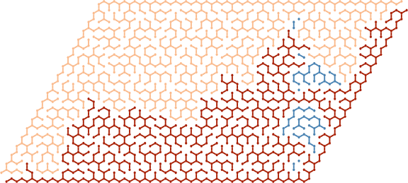

A grid of tiny labyrinths:

```raku
#%html
my $k = 6;
my @mazes = random-maze((6...7).pick) xx $k ** 2;
my %new-opts = size => 0.8, vertex-shape => 'square', vertex-width => 0.5, vertex-height => 0.5, edge-thickness => 36;
#my %new-opts = size => 0.8, vertex-shape => 'point', edge-thickness => 25;
#my @maze-plots = @mazes.kv.map( -> $i, $_ { $_.dot(highlight => $i mod $k < $i div $k ?? Whatever !! $_.subgraph($_.connected-components.head),|merge-hash(%opts, %new-opts), :svg) });
my @maze-plots = @mazes.map({ $_.dot(|%opts, |%new-opts, :svg) });

@maze-plots
==> to-html(:multi-column, :6columns, :html-elements)
```

<table border="1"><tbody><tr><td><?xml version="1.0" encoding="UTF-8" standalone="no"?>
<!DOCTYPE svg PUBLIC "-//W3C//DTD SVG 1.1//EN"
 "http://www.w3.org/Graphics/SVG/1.1/DTD/svg11.dtd">
<!-- Generated by graphviz version 14.0.0 (20250921.2048)
 -->
<!-- Pages: 1 -->
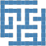</td><td><?xml version="1.0" encoding="UTF-8" standalone="no"?>
<!DOCTYPE svg PUBLIC "-//W3C//DTD SVG 1.1//EN"
 "http://www.w3.org/Graphics/SVG/1.1/DTD/svg11.dtd">
<!-- Generated by graphviz version 14.0.0 (20250921.2048)
 -->
<!-- Pages: 1 -->
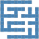</td><td><?xml version="1.0" encoding="UTF-8" standalone="no"?>
<!DOCTYPE svg PUBLIC "-//W3C//DTD SVG 1.1//EN"
 "http://www.w3.org/Graphics/SVG/1.1/DTD/svg11.dtd">
<!-- Generated by graphviz version 14.0.0 (20250921.2048)
 -->
<!-- Pages: 1 -->
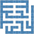</td><td><?xml version="1.0" encoding="UTF-8" standalone="no"?>
<!DOCTYPE svg PUBLIC "-//W3C//DTD SVG 1.1//EN"
 "http://www.w3.org/Graphics/SVG/1.1/DTD/svg11.dtd">
<!-- Generated by graphviz version 14.0.0 (20250921.2048)
 -->
<!-- Pages: 1 -->
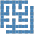</td><td><?xml version="1.0" encoding="UTF-8" standalone="no"?>
<!DOCTYPE svg PUBLIC "-//W3C//DTD SVG 1.1//EN"
 "http://www.w3.org/Graphics/SVG/1.1/DTD/svg11.dtd">
<!-- Generated by graphviz version 14.0.0 (20250921.2048)
 -->
<!-- Pages: 1 -->
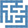</td><td><?xml version="1.0" encoding="UTF-8" standalone="no"?>
<!DOCTYPE svg PUBLIC "-//W3C//DTD SVG 1.1//EN"
 "http://www.w3.org/Graphics/SVG/1.1/DTD/svg11.dtd">
<!-- Generated by graphviz version 14.0.0 (20250921.2048)
 -->
<!-- Pages: 1 -->
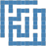</td></tr><tr><td><?xml version="1.0" encoding="UTF-8" standalone="no"?>
<!DOCTYPE svg PUBLIC "-//W3C//DTD SVG 1.1//EN"
 "http://www.w3.org/Graphics/SVG/1.1/DTD/svg11.dtd">
<!-- Generated by graphviz version 14.0.0 (20250921.2048)
 -->
<!-- Pages: 1 -->
</td><td><?xml version="1.0" encoding="UTF-8" standalone="no"?>
<!DOCTYPE svg PUBLIC "-//W3C//DTD SVG 1.1//EN"
 "http://www.w3.org/Graphics/SVG/1.1/DTD/svg11.dtd">
<!-- Generated by graphviz version 14.0.0 (20250921.2048)
 -->
<!-- Pages: 1 -->
</td><td><?xml version="1.0" encoding="UTF-8" standalone="no"?>
<!DOCTYPE svg PUBLIC "-//W3C//DTD SVG 1.1//EN"
 "http://www.w3.org/Graphics/SVG/1.1/DTD/svg11.dtd">
<!-- Generated by graphviz version 14.0.0 (20250921.2048)
 -->
<!-- Pages: 1 -->
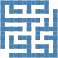</td><td><?xml version="1.0" encoding="UTF-8" standalone="no"?>
<!DOCTYPE svg PUBLIC "-//W3C//DTD SVG 1.1//EN"
 "http://www.w3.org/Graphics/SVG/1.1/DTD/svg11.dtd">
<!-- Generated by graphviz version 14.0.0 (20250921.2048)
 -->
<!-- Pages: 1 -->
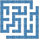</td><td><?xml version="1.0" encoding="UTF-8" standalone="no"?>
<!DOCTYPE svg PUBLIC "-//W3C//DTD SVG 1.1//EN"
 "http://www.w3.org/Graphics/SVG/1.1/DTD/svg11.dtd">
<!-- Generated by graphviz version 14.0.0 (20250921.2048)
 -->
<!-- Pages: 1 -->
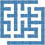</td><td><?xml version="1.0" encoding="UTF-8" standalone="no"?>
<!DOCTYPE svg PUBLIC "-//W3C//DTD SVG 1.1//EN"
 "http://www.w3.org/Graphics/SVG/1.1/DTD/svg11.dtd">
<!-- Generated by graphviz version 14.0.0 (20250921.2048)
 -->
<!-- Pages: 1 -->
</td></tr><tr><td><?xml version="1.0" encoding="UTF-8" standalone="no"?>
<!DOCTYPE svg PUBLIC "-//W3C//DTD SVG 1.1//EN"
 "http://www.w3.org/Graphics/SVG/1.1/DTD/svg11.dtd">
<!-- Generated by graphviz version 14.0.0 (20250921.2048)
 -->
<!-- Pages: 1 -->
</td><td><?xml version="1.0" encoding="UTF-8" standalone="no"?>
<!DOCTYPE svg PUBLIC "-//W3C//DTD SVG 1.1//EN"
 "http://www.w3.org/Graphics/SVG/1.1/DTD/svg11.dtd">
<!-- Generated by graphviz version 14.0.0 (20250921.2048)
 -->
<!-- Pages: 1 -->
</td><td><?xml version="1.0" encoding="UTF-8" standalone="no"?>
<!DOCTYPE svg PUBLIC "-//W3C//DTD SVG 1.1//EN"
 "http://www.w3.org/Graphics/SVG/1.1/DTD/svg11.dtd">
<!-- Generated by graphviz version 14.0.0 (20250921.2048)
 -->
<!-- Pages: 1 -->
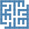</td><td><?xml version="1.0" encoding="UTF-8" standalone="no"?>
<!DOCTYPE svg PUBLIC "-//W3C//DTD SVG 1.1//EN"
 "http://www.w3.org/Graphics/SVG/1.1/DTD/svg11.dtd">
<!-- Generated by graphviz version 14.0.0 (20250921.2048)
 -->
<!-- Pages: 1 -->
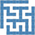</td><td><?xml version="1.0" encoding="UTF-8" standalone="no"?>
<!DOCTYPE svg PUBLIC "-//W3C//DTD SVG 1.1//EN"
 "http://www.w3.org/Graphics/SVG/1.1/DTD/svg11.dtd">
<!-- Generated by graphviz version 14.0.0 (20250921.2048)
 -->
<!-- Pages: 1 -->
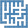</td><td><?xml version="1.0" encoding="UTF-8" standalone="no"?>
<!DOCTYPE svg PUBLIC "-//W3C//DTD SVG 1.1//EN"
 "http://www.w3.org/Graphics/SVG/1.1/DTD/svg11.dtd">
<!-- Generated by graphviz version 14.0.0 (20250921.2048)
 -->
<!-- Pages: 1 -->
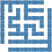</td></tr><tr><td><?xml version="1.0" encoding="UTF-8" standalone="no"?>
<!DOCTYPE svg PUBLIC "-//W3C//DTD SVG 1.1//EN"
 "http://www.w3.org/Graphics/SVG/1.1/DTD/svg11.dtd">
<!-- Generated by graphviz version 14.0.0 (20250921.2048)
 -->
<!-- Pages: 1 -->
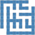</td><td><?xml version="1.0" encoding="UTF-8" standalone="no"?>
<!DOCTYPE svg PUBLIC "-//W3C//DTD SVG 1.1//EN"
 "http://www.w3.org/Graphics/SVG/1.1/DTD/svg11.dtd">
<!-- Generated by graphviz version 14.0.0 (20250921.2048)
 -->
<!-- Pages: 1 -->
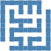</td><td><?xml version="1.0" encoding="UTF-8" standalone="no"?>
<!DOCTYPE svg PUBLIC "-//W3C//DTD SVG 1.1//EN"
 "http://www.w3.org/Graphics/SVG/1.1/DTD/svg11.dtd">
<!-- Generated by graphviz version 14.0.0 (20250921.2048)
 -->
<!-- Pages: 1 -->
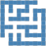</td><td><?xml version="1.0" encoding="UTF-8" standalone="no"?>
<!DOCTYPE svg PUBLIC "-//W3C//DTD SVG 1.1//EN"
 "http://www.w3.org/Graphics/SVG/1.1/DTD/svg11.dtd">
<!-- Generated by graphviz version 14.0.0 (20250921.2048)
 -->
<!-- Pages: 1 -->
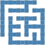</td><td><?xml version="1.0" encoding="UTF-8" standalone="no"?>
<!DOCTYPE svg PUBLIC "-//W3C//DTD SVG 1.1//EN"
 "http://www.w3.org/Graphics/SVG/1.1/DTD/svg11.dtd">
<!-- Generated by graphviz version 14.0.0 (20250921.2048)
 -->
<!-- Pages: 1 -->
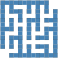</td><td><?xml version="1.0" encoding="UTF-8" standalone="no"?>
<!DOCTYPE svg PUBLIC "-//W3C//DTD SVG 1.1//EN"
 "http://www.w3.org/Graphics/SVG/1.1/DTD/svg11.dtd">
<!-- Generated by graphviz version 14.0.0 (20250921.2048)
 -->
<!-- Pages: 1 -->
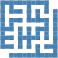</td></tr><tr><td><?xml version="1.0" encoding="UTF-8" standalone="no"?>
<!DOCTYPE svg PUBLIC "-//W3C//DTD SVG 1.1//EN"
 "http://www.w3.org/Graphics/SVG/1.1/DTD/svg11.dtd">
<!-- Generated by graphviz version 14.0.0 (20250921.2048)
 -->
<!-- Pages: 1 -->
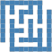</td><td><?xml version="1.0" encoding="UTF-8" standalone="no"?>
<!DOCTYPE svg PUBLIC "-//W3C//DTD SVG 1.1//EN"
 "http://www.w3.org/Graphics/SVG/1.1/DTD/svg11.dtd">
<!-- Generated by graphviz version 14.0.0 (20250921.2048)
 -->
<!-- Pages: 1 -->
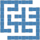</td><td><?xml version="1.0" encoding="UTF-8" standalone="no"?>
<!DOCTYPE svg PUBLIC "-//W3C//DTD SVG 1.1//EN"
 "http://www.w3.org/Graphics/SVG/1.1/DTD/svg11.dtd">
<!-- Generated by graphviz version 14.0.0 (20250921.2048)
 -->
<!-- Pages: 1 -->
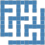</td><td><?xml version="1.0" encoding="UTF-8" standalone="no"?>
<!DOCTYPE svg PUBLIC "-//W3C//DTD SVG 1.1//EN"
 "http://www.w3.org/Graphics/SVG/1.1/DTD/svg11.dtd">
<!-- Generated by graphviz version 14.0.0 (20250921.2048)
 -->
<!-- Pages: 1 -->
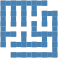</td><td><?xml version="1.0" encoding="UTF-8" standalone="no"?>
<!DOCTYPE svg PUBLIC "-//W3C//DTD SVG 1.1//EN"
 "http://www.w3.org/Graphics/SVG/1.1/DTD/svg11.dtd">
<!-- Generated by graphviz version 14.0.0 (20250921.2048)
 -->
<!-- Pages: 1 -->
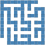</td><td><?xml version="1.0" encoding="UTF-8" standalone="no"?>
<!DOCTYPE svg PUBLIC "-//W3C//DTD SVG 1.1//EN"
 "http://www.w3.org/Graphics/SVG/1.1/DTD/svg11.dtd">
<!-- Generated by graphviz version 14.0.0 (20250921.2048)
 -->
<!-- Pages: 1 -->
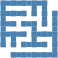</td></tr><tr><td><?xml version="1.0" encoding="UTF-8" standalone="no"?>
<!DOCTYPE svg PUBLIC "-//W3C//DTD SVG 1.1//EN"
 "http://www.w3.org/Graphics/SVG/1.1/DTD/svg11.dtd">
<!-- Generated by graphviz version 14.0.0 (20250921.2048)
 -->
<!-- Pages: 1 -->
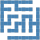</td><td><?xml version="1.0" encoding="UTF-8" standalone="no"?>
<!DOCTYPE svg PUBLIC "-//W3C//DTD SVG 1.1//EN"
 "http://www.w3.org/Graphics/SVG/1.1/DTD/svg11.dtd">
<!-- Generated by graphviz version 14.0.0 (20250921.2048)
 -->
<!-- Pages: 1 -->
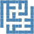</td><td><?xml version="1.0" encoding="UTF-8" standalone="no"?>
<!DOCTYPE svg PUBLIC "-//W3C//DTD SVG 1.1//EN"
 "http://www.w3.org/Graphics/SVG/1.1/DTD/svg11.dtd">
<!-- Generated by graphviz version 14.0.0 (20250921.2048)
 -->
<!-- Pages: 1 -->
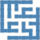</td><td><?xml version="1.0" encoding="UTF-8" standalone="no"?>
<!DOCTYPE svg PUBLIC "-//W3C//DTD SVG 1.1//EN"
 "http://www.w3.org/Graphics/SVG/1.1/DTD/svg11.dtd">
<!-- Generated by graphviz version 14.0.0 (20250921.2048)
 -->
<!-- Pages: 1 -->
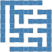</td><td><?xml version="1.0" encoding="UTF-8" standalone="no"?>
<!DOCTYPE svg PUBLIC "-//W3C//DTD SVG 1.1//EN"
 "http://www.w3.org/Graphics/SVG/1.1/DTD/svg11.dtd">
<!-- Generated by graphviz version 14.0.0 (20250921.2048)
 -->
<!-- Pages: 1 -->
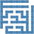</td><td><?xml version="1.0" encoding="UTF-8" standalone="no"?>
<!DOCTYPE svg PUBLIC "-//W3C//DTD SVG 1.1//EN"
 "http://www.w3.org/Graphics/SVG/1.1/DTD/svg11.dtd">
<!-- Generated by graphviz version 14.0.0 (20250921.2048)
 -->
<!-- Pages: 1 -->
</td></tr></tbody></table>

---

## References

### Articles

[AA1] Anton Antonov, ["Day 24 – Maze Making Using Graphs"](https://raku-advent.blog/2025/12/24/day-24-maze-making-using-graphs/), (2025), [Raku Advent Calendar at WordPress](https://raku-advent.blog/).

### Notebooks

[AAn1] Anton Antonov, ["Maze making using graphs"](https://community.wolfram.com/groups/-/m/t/3597439), (2026), [Wolfram Community](https://community.wolfram.com).

### Functions, packages

[AAf1] Anton Antonov, [RandomLabyrinth](https://www.wolframcloud.com/obj/antononcube/DeployedResources/Function/RandomLabyrinth/), (2025), [Wolfram Function Repository](https://resources.wolframcloud.com/FunctionRepository/).

[AAp1] Anton Antonov, [Graph::RandomMaze, Raku package](https://github.com/antononcube/Raku-Graph-RandomMaze), (2025), [GitHub/antononcube](https://github.com/antononcube).

[AAp2] Anton Antonov, [Graph, Raku package](https://github.com/antononcube/Raku-Graph), (2024-2025), [GitHub/antononcube](https://github.com/antononcube).