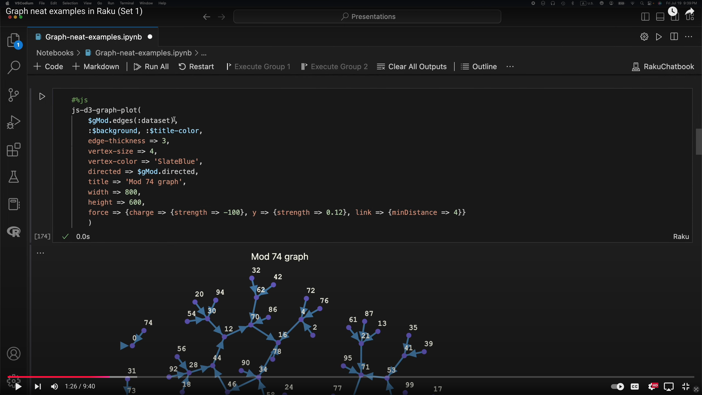
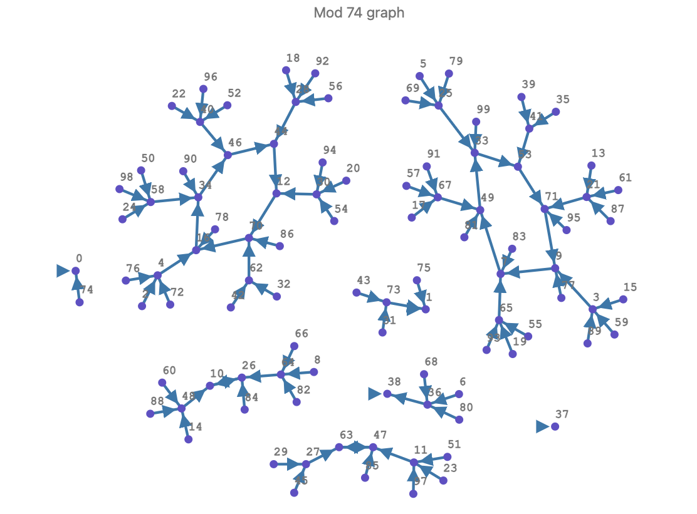
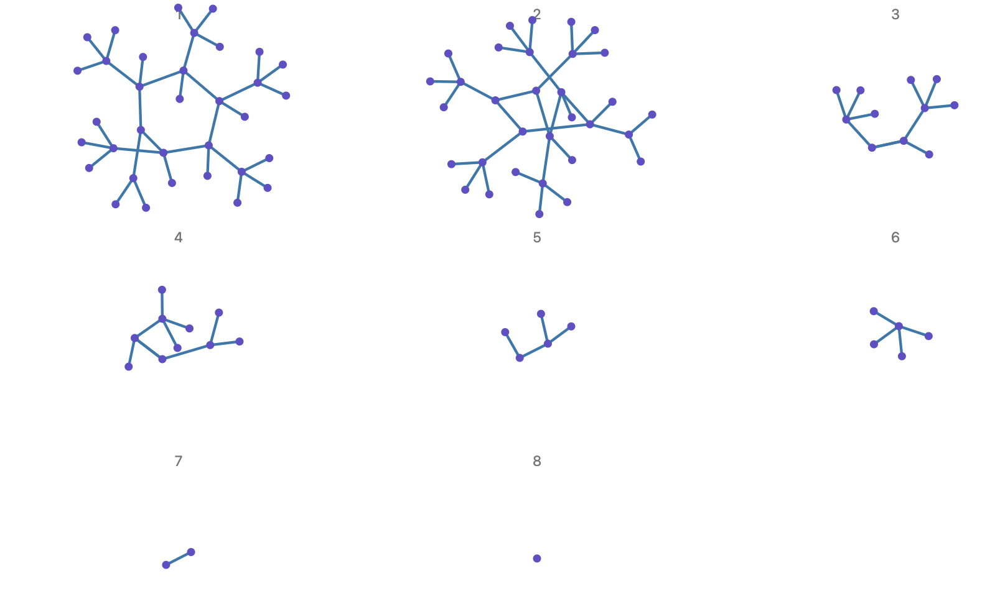
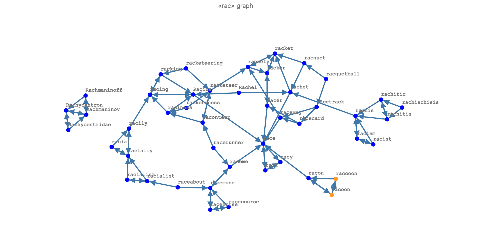
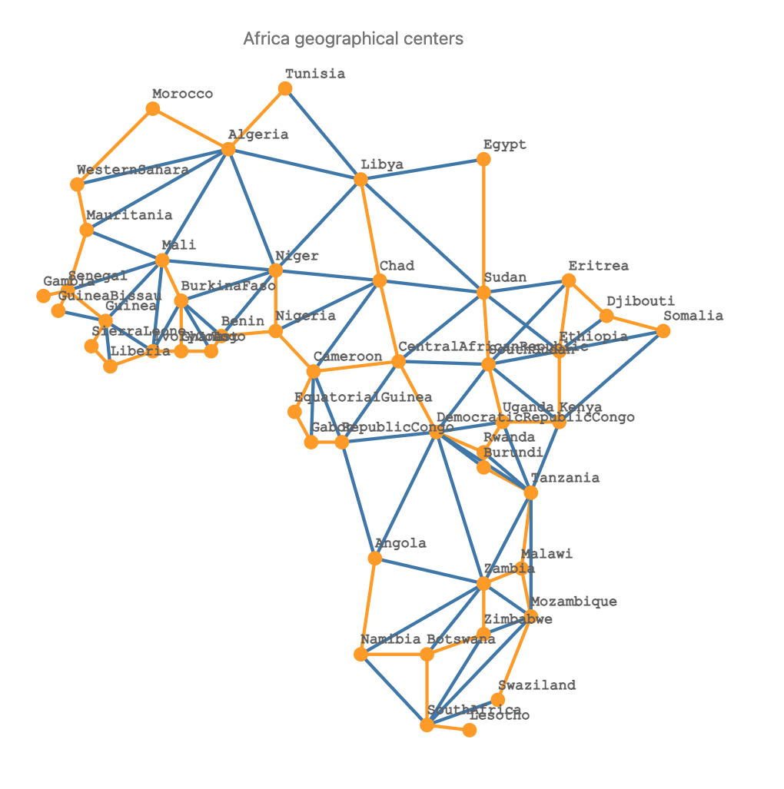
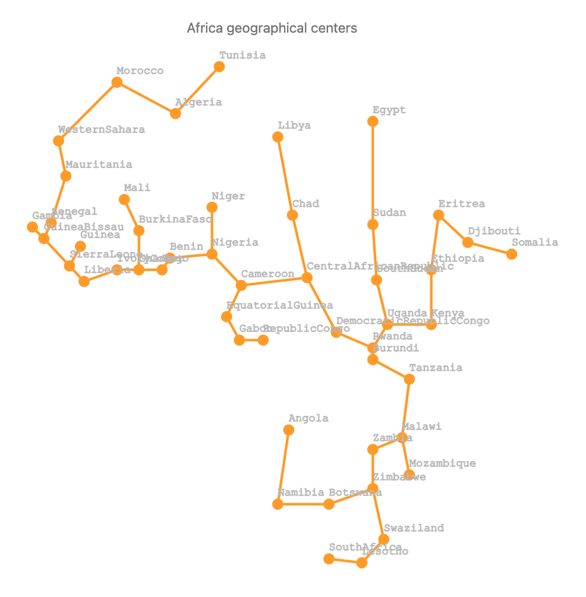
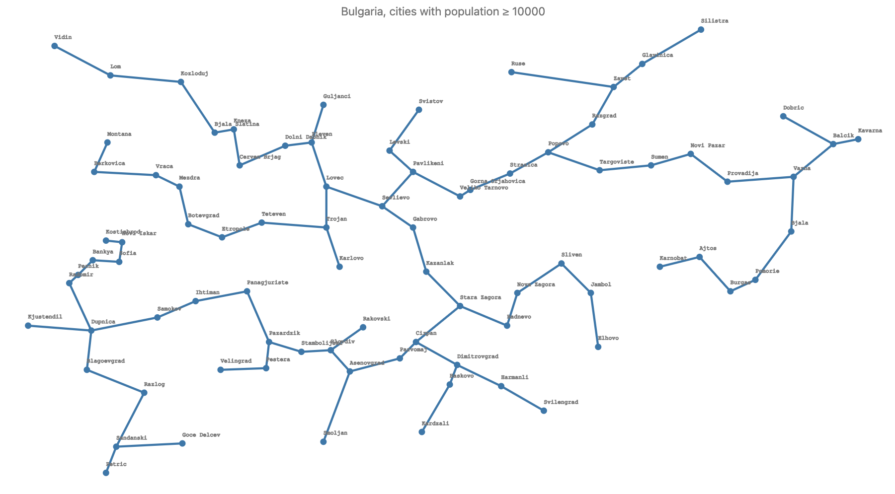

# Graph Neat Examples in Raku - Set 1

Anton Antonov  
[RakuForPrediction at WordPress](https://rakuforprediction.wordpress.com)  
[RakuForPrediction-book at GitHub](https://github.com/antononcube/RakuForPrediction-book)  
July 2024

---

## Introduction

In this blog post, we explore some neat examples of graph computations using Raku.
These examples are designed to be concise, straightforward, and compelling, showcasing the capabilities of Raku and its modules.

### What is a neat example?

A neat example is a piece of code that is both concise and straightforward, producing visually or textually compelling outputs. These examples are intended to:

- Showcase Raku programming.
- Utilize functionalities from various Raku modules.
- Provide interesting perspectives on computational possibilities.

Modules featured in this post include:

- ["Graph"](https://raku.land/zef:antononcube/Graph) for graph features, [AAp1].
- ["JavaScript::D3"](https://raku.land/zef:antononcube/JavaScript::D3) for graph plotting using [D3.js](https://d3js.org), [AAp2].
- ["Data::Generators"](https://raku.land/zef:antononcube/Data::Generators) for English words.
- ["Math::Nearest"](https://raku.land/zef:antononcube/Math::Nearest) for nearest neighbor computations.
- ["Text::Levenshtein::Damerau"](https://raku.land/github:ugexe/Text::Levenshtein::Damerau) for distance calculations.
- ["Data::Geographics"](https://raku.land/zef:antononcube/Data::Geographics) for geographical data.
- ["Data::Reshapers"](https://raku.land/zef:antononcube/Data::Reshapers) for cross-tabulation.

### Videos

Videos with neat examples using the Raku package "Graph" can be found in the channel
[YouTube/AAA4prediction](https://www.youtube.com/@AAA4prediction), [AAv1 - AAv3].

This document corresponds to the video 
["Graph neat examples in Raku (Set 1)"](https://youtu.be/5qXgqqRZHow), [AAv1]. 

[](https://youtu.be/5qXgqqRZHow)

----

## Setting Up the Environment

To begin, we load the necessary packages that will be used throughout the document 
(or corresponding notebook):

```raku
use Graph;
use Data::Reshapers;
use Data::Summarizers;
use Data::Generators;
use Data::TypeSystem;
use Data::Translators;
use Data::Geographics;
use Math::DistanceFunctions;
use Math::Nearest;
use Text::Levenshtein::Damerau;
use JavaScript::D3;
```

### Preparing for JavaScript Visualization

This code prepares Jupyter notebooks to visualize graphs using JavaScript:

```raku
#% javascript
require.config({
     paths: {
     d3: 'https://d3js.org/d3.v7.min'
}});

require(['d3'], function(d3) {
     console.log(d3);
});
```


Verification of the setup:

```raku, eval=FALSE
#% js
js-d3-list-line-plot(10.rand xx 40, background => 'none', stroke-width => 2)
```


We also set up a collection of visualization variables to customize the appearance of our plots:

```raku
my $title-color = 'Ivory';
my $stroke-color = 'SlateGray';
my $tooltip-color = 'LightBlue';
my $tooltip-background-color = 'none';
my $background = '1F1F1F';
my $color-scheme = 'schemeTableau10';
my $edge-thickness = 3;
my $vertex-size = 6;
my $mmd-theme = q:to/END/;
%%{
  init: {
    'theme': 'forest',
    'themeVariables': {
      'lineColor': 'Ivory'
    }
  }
}%%
END
my %force = collision => {iterations => 0, radius => 10},link => {distance => 180};
my %force2 = charge => {strength => -30, iterations => 4}, collision => {radius => 50, iterations => 4}, link => {distance => 30};

my %opts = :$background, :$title-color, :$edge-thickness, :$vertex-size;
```
```
# {background => 1F1F1F, edge-thickness => 3, title-color => Ivory, vertex-size => 6}
```

---

## Mod Graph

The first example involves creating a mod graph. We take integers from 0 to 99, square each, and find the remainder when divided by 74. This forms the edges of our graph.

```raku
my @redges = (^100).map({ $_.Str => (($_ ** 2) mod 74).Str });
my $gMod = Graph.new(@redges, :directed)
```
```
# Graph(vertexes => 100, edges => 100, directed => True)
```

The graph is plotted using the `js-d3-graph-plot` function from the "JavaScript::D3" module, which leverages the D3.js library for visualization.

```raku
#%js
js-d3-graph-plot(
    $gMod.edges(:dataset),
    :$background, :$title-color, 
    edge-thickness => 3, 
    vertex-size => 4,
    vertex-color => 'SlateBlue',
    directed => $gMod.directed,
    title => 'Mod 74 graph', 
    width => 800,
    height => 600, 
    force => {charge => {strength => -100}, y => {strength => 0.12}, link => {minDistance => 4}}
    )
```



Next, we find the weakly connected components of the mod graph. A weakly connected component in a directed graph is a maximal subgraph where every pair of vertices is connected by an undirected path.

```raku
.say for $gMod.weakly-connected-components
```
```
# [35 41 53 33 25 5 79 69 99 49 67 91 57 17 81 7 9 71 21 13 87 61 95 3 59 89 15 77 83 65 93 19 55 39]
# [54 30 20 12 44 46 40 96 22 52 34 16 78 4 76 2 72 70 62 42 32 86 90 58 24 98 50 28 92 56 18 94]
# [26 64 82 66 8 84 10 48 14 88 60]
# [63 47 11 97 23 51 85 27 45 29]
# [31 73 1 75 43]
# [38 36 80 68 6]
# [74 0]
# [37]
```

We plot each component using subgraphs:

```raku
#% js
$gMod.weakly-connected-components.pairs.map({
    js-d3-graph-plot(
        $gMod.subgraph($_.value).edges(:dataset),
        title => ($_.key + 1).Str,
        :$background, :$title-color, :$edge-thickness, vertex-size => 4,
        vertex-color => 'SlateBlue',
        vertex-label-color => 'none',
        force => { charge => {strength => -70}},
    )
}).join("\n")
```



---

## Dictionary Graph

In this example, we use a dataset of approximately 85,000 English words from the "Data::Generators" package. We focus on words starting with the prefix "rac".

```raku
my $ra = Data::Generators::ResourceAccess.instance();
$ra.get-word-data().elems;
```
```
# 84996
```

We generate random words and sample some of them:

```raku
random-word(4, type => 'common')
```
```
# (remarry earful sanctuary sailor)
```

```raku
.say for $ra.get-word-data().pick(4)
```
```
# hemline => (hemline True True False 34487)
# airlift => (airlift True True False 2160)
# nephrocalcinosis => (nephrocalcinosis True False False 50156)
# planchette => (planchette True False False 57230)
```

We find words with the prefix "rac":

```raku
my @words = $ra.get-word-data.keys.grep({ $_.starts-with('rac'):i });
@words.elems
```
```
# 46
```

Using the Damerau-Levenshtein distance, we compute the nearest neighbors graph for these words:

```raku
my @nnEdges = nearest-neighbor-graph(@words, 2, distance-function => &dld);
```
```
# [racially => racial racially => racily racker => racket racker => racer racism => racist racism => racial raconteur => racketeer raconteur => racker Rachel => rachet Rachel => racker racket => racker racket => rachet raccoon => racoon raccoon => racon racon => racoon racon => raccoon rachet => racket rachet => racker racialist => racialism racialist => racially racial => racially racial => racism racking => racing racking => racker racoon => raccoon racoon => racon racquet => racket racquet => rachet rack => racy rack => race racing => racking racing => racism raciness => racism raciness => racing rachitic => rachitis rachitic => rachet racetrack => racecard racetrack => racer racketeering => racketeer racketeering => racking racialism => racialist racialism => racially racketeer => racker racketeer => raconteur racquetball => racquet racquetball => racetrack rachis => racism rachis => rachet rachischisis => rachitis rachischisis => racialist racehorse => racemose racehorse => racecourse racily => racially racily => racism raceme => racemose raceme => racer racemose => racehorse racemose => raceme Rachycentridae => Rachycentron Rachycentridae => Rachmaninov racecard => racer racecard => raceway racy => rack racy => race racer => racker racer => race rackety => racket rackety => racker rachitis => rachitic rachitis => rachis Rachycentron => Rachycentridae Rachycentron => Rachmaninov race => rack race => racy racketiness => raciness racketiness => racketeer racist => racism racist => racket racecourse => racehorse racecourse => racemose Rachmaninoff => Rachmaninov Rachmaninoff => Rachycentron raceabout => racialist raceabout => racemose raceway => racial raceway => racily Rachmaninov => Rachmaninoff Rachmaninov => Rachycentron racerunner => racker racerunner => raconteur Racine => racing Racine => racism]
```

We create and plot the directed graph:

```raku
my $gDict = Graph.new(@nnEdges, :directed)
```
```
# Graph(vertexes => 46, edges => 92, directed => True)
```

```raku
#%js
js-d3-graph-plot(
    $gDict.edges(:dataset),
    highlight => <raccoon racoon>,
    :$background, :$title-color, :$edge-thickness, 
    vertex-size => 5,
    vertex-color => 'Blue',
    directed => $gDict.directed,
    title => "«rac» graph", 
    width => 1200,
    height => 650, 
    force => {charge => {strength => -400}, y => {strength => 0.2}, link => {minDistance => 6}}
)
```



We can also derive graph edges ad hoc without using `nearest-neighbor-graph`:

```raku
# Construct on nearest finder object over them
my &wn = nearest(@words, distance-function => &dld);

# For each word find the closest two words and make edge rules of the corresponding pairs:
my @redges = @words.map({ $_ <<=><< &wn($_, 3).flat.grep(-> $x { $x ne $_ }) }).flat;
deduce-type(@redges)
```
```
# Vector(Pair(Atom((Str)), Atom((Str))), 92)
```

---

## African Centers

We build an interstate highway system connecting the geographical centers of African countries. We start by assigning coordinates to each country.

```raku
my %africaCoords = 'Algeria'=>[3.0,28.0],'Libya'=>[17.0,25.0],'Mali'=>[-4.0,17.0],'Mauritania'=>[-12.0,20.0],'Morocco'=>[-5.0,32.0],'Niger'=>[8.0,16.0],'Tunisia'=>[9.0,34.0],'WesternSahara'=>[-13.0,24.5],'Chad'=>[19.0,15.0],'Egypt'=>[30.0,27.0],'Sudan'=>[30.0,13.8],'BurkinaFaso'=>[-2.0,13.0],'Guinea'=>[-10.0,11.0],'IvoryCoast'=>[-5.0,8.0],'Senegal'=>[-14.0,14.0],'Benin'=>[2.25,9.5],'Nigeria'=>[8.0,10.0],'Cameroon'=>[12.0,6.0],'CentralAfricanRepublic'=>[21.0,7.0],'Eritrea'=>[39.0,15.0],'Ethiopia'=>[38.0,8.0],'SouthSudan'=>[30.51,6.7],'Ghana'=>[-2.0,8.0],'Togo'=>[1.1667,8.0],'GuineaBissau'=>[-15.0,12.0],'Liberia'=>[-9.5,6.5],'SierraLeone'=>[-11.5,8.5],'Gambia'=>[-16.5667,13.4667],'EquatorialGuinea'=>[10.0,2.0],'Gabon'=>[11.75,-1.0],'RepublicCongo'=>[15.0,-1.0],'DemocraticRepublicCongo'=>[25.0,0.0],'Djibouti'=>[43.0,11.5],'Kenya'=>[38.0,1.0],'Somalia'=>[49.0,10.0],'Uganda'=>[32.0,1.0],'Angola'=>[18.5,-12.5],'Burundi'=>[30.0,-3.5],'Rwanda'=>[30.0,-2.0],'Tanzania'=>[35.0,-6.0],'Zambia'=>[30.0,-15.0],'Namibia'=>[17.0,-22.0],'Malawi'=>[34.0,-13.5],'Mozambique'=>[35.0,-18.25],'Botswana'=>[24.0,-22.0],'Zimbabwe'=>[30.0,-20.0],'SouthAfrica'=>[24.0,-29.0],'Swaziland'=>[31.5,-26.5],'Lesotho'=>[28.5,-29.5];
sink records-summary(%africaCoords.values)
```
```
# +---------------------+---------------------+
# | 0                   | 1                   |
# +---------------------+---------------------+
# | Min    => -16.5667  | Min    => -29.5     |
# | 1st-Qu => -2        | 1st-Qu => -2.75     |
# | Mean   => 15.094082 | Mean   => 4.5044224 |
# | Median => 17        | Median => 8         |
# | 3rd-Qu => 30        | 3rd-Qu => 13.9      |
# | Max    => 49        | Max    => 34        |
# +---------------------+---------------------+
```

We create a graph and find its minimum spanning tree:

```raku
my @africaEdges = %('from'=>'Algeria','to'=>'Libya','weight'=>1),%('from'=>'Algeria','to'=>'Mali','weight'=>1),%('from'=>'Algeria','to'=>'Mauritania','weight'=>1),%('from'=>'Algeria','to'=>'Morocco','weight'=>1),%('from'=>'Algeria','to'=>'Niger','weight'=>1),%('from'=>'Algeria','to'=>'Tunisia','weight'=>1),%('from'=>'Algeria','to'=>'WesternSahara','weight'=>1),%('from'=>'Libya','to'=>'Niger','weight'=>1),%('from'=>'Libya','to'=>'Tunisia','weight'=>1),%('from'=>'Libya','to'=>'Chad','weight'=>1),%('from'=>'Libya','to'=>'Egypt','weight'=>1),%('from'=>'Libya','to'=>'Sudan','weight'=>1),%('from'=>'Mali','to'=>'Mauritania','weight'=>1),%('from'=>'Mali','to'=>'Niger','weight'=>1),%('from'=>'Mali','to'=>'BurkinaFaso','weight'=>1),%('from'=>'Mali','to'=>'Guinea','weight'=>1),%('from'=>'Mali','to'=>'IvoryCoast','weight'=>1),%('from'=>'Mali','to'=>'Senegal','weight'=>1),%('from'=>'Mauritania','to'=>'WesternSahara','weight'=>1),%('from'=>'Mauritania','to'=>'Senegal','weight'=>1),%('from'=>'Morocco','to'=>'WesternSahara','weight'=>1),%('from'=>'Niger','to'=>'Chad','weight'=>1),%('from'=>'Niger','to'=>'BurkinaFaso','weight'=>1),%('from'=>'Niger','to'=>'Benin','weight'=>1),%('from'=>'Niger','to'=>'Nigeria','weight'=>1),%('from'=>'Chad','to'=>'Sudan','weight'=>1),%('from'=>'Chad','to'=>'Nigeria','weight'=>1),%('from'=>'Chad','to'=>'Cameroon','weight'=>1),%('from'=>'Chad','to'=>'CentralAfricanRepublic','weight'=>1),%('from'=>'Egypt','to'=>'Sudan','weight'=>1),%('from'=>'Sudan','to'=>'CentralAfricanRepublic','weight'=>1),%('from'=>'Sudan','to'=>'Eritrea','weight'=>1),%('from'=>'Sudan','to'=>'Ethiopia','weight'=>1),%('from'=>'Sudan','to'=>'SouthSudan','weight'=>1),%('from'=>'BurkinaFaso','to'=>'IvoryCoast','weight'=>1),%('from'=>'BurkinaFaso','to'=>'Benin','weight'=>1),%('from'=>'BurkinaFaso','to'=>'Ghana','weight'=>1),%('from'=>'BurkinaFaso','to'=>'Togo','weight'=>1),%('from'=>'Guinea','to'=>'IvoryCoast','weight'=>1),%('from'=>'Guinea','to'=>'Senegal','weight'=>1),%('from'=>'Guinea','to'=>'GuineaBissau','weight'=>1),%('from'=>'Guinea','to'=>'Liberia','weight'=>1),%('from'=>'Guinea','to'=>'SierraLeone','weight'=>1),%('from'=>'IvoryCoast','to'=>'Ghana','weight'=>1),%('from'=>'IvoryCoast','to'=>'Liberia','weight'=>1),%('from'=>'Senegal','to'=>'GuineaBissau','weight'=>1),%('from'=>'Senegal','to'=>'Gambia','weight'=>1),%('from'=>'Benin','to'=>'Nigeria','weight'=>1),%('from'=>'Benin','to'=>'Togo','weight'=>1),%('from'=>'Nigeria','to'=>'Cameroon','weight'=>1),%('from'=>'Cameroon','to'=>'CentralAfricanRepublic','weight'=>1),%('from'=>'Cameroon','to'=>'EquatorialGuinea','weight'=>1),%('from'=>'Cameroon','to'=>'Gabon','weight'=>1),%('from'=>'Cameroon','to'=>'RepublicCongo','weight'=>1),%('from'=>'CentralAfricanRepublic','to'=>'SouthSudan','weight'=>1),%('from'=>'CentralAfricanRepublic','to'=>'RepublicCongo','weight'=>1),%('from'=>'CentralAfricanRepublic','to'=>'DemocraticRepublicCongo','weight'=>1),%('from'=>'Eritrea','to'=>'Ethiopia','weight'=>1),%('from'=>'Eritrea','to'=>'SouthSudan','weight'=>1),%('from'=>'Eritrea','to'=>'Djibouti','weight'=>1),%('from'=>'Ethiopia','to'=>'SouthSudan','weight'=>1),%('from'=>'Ethiopia','to'=>'Djibouti','weight'=>1),%('from'=>'Ethiopia','to'=>'Kenya','weight'=>1),%('from'=>'Ethiopia','to'=>'Somalia','weight'=>1),%('from'=>'SouthSudan','to'=>'DemocraticRepublicCongo','weight'=>1),%('from'=>'SouthSudan','to'=>'Kenya','weight'=>1),%('from'=>'SouthSudan','to'=>'Uganda','weight'=>1),%('from'=>'Ghana','to'=>'Togo','weight'=>1),%('from'=>'Liberia','to'=>'SierraLeone','weight'=>1),%('from'=>'EquatorialGuinea','to'=>'Gabon','weight'=>1),%('from'=>'Gabon','to'=>'RepublicCongo','weight'=>1),%('from'=>'RepublicCongo','to'=>'DemocraticRepublicCongo','weight'=>1),%('from'=>'RepublicCongo','to'=>'Angola','weight'=>1),%('from'=>'DemocraticRepublicCongo','to'=>'Uganda','weight'=>1),%('from'=>'DemocraticRepublicCongo','to'=>'Angola','weight'=>1),%('from'=>'DemocraticRepublicCongo','to'=>'Burundi','weight'=>1),%('from'=>'DemocraticRepublicCongo','to'=>'Rwanda','weight'=>1),%('from'=>'DemocraticRepublicCongo','to'=>'Tanzania','weight'=>1),%('from'=>'DemocraticRepublicCongo','to'=>'Zambia','weight'=>1),%('from'=>'Djibouti','to'=>'Somalia','weight'=>1),%('from'=>'Kenya','to'=>'Somalia','weight'=>1),%('from'=>'Kenya','to'=>'Uganda','weight'=>1),%('from'=>'Kenya','to'=>'Tanzania','weight'=>1),%('from'=>'Uganda','to'=>'Rwanda','weight'=>1),%('from'=>'Uganda','to'=>'Tanzania','weight'=>1),%('from'=>'Angola','to'=>'Zambia','weight'=>1),%('from'=>'Angola','to'=>'Namibia','weight'=>1),%('from'=>'Burundi','to'=>'Rwanda','weight'=>1),%('from'=>'Burundi','to'=>'Tanzania','weight'=>1),%('from'=>'Rwanda','to'=>'Tanzania','weight'=>1),%('from'=>'Tanzania','to'=>'Zambia','weight'=>1),%('from'=>'Tanzania','to'=>'Malawi','weight'=>1),%('from'=>'Tanzania','to'=>'Mozambique','weight'=>1),%('from'=>'Zambia','to'=>'Namibia','weight'=>1),%('from'=>'Zambia','to'=>'Malawi','weight'=>1),%('from'=>'Zambia','to'=>'Mozambique','weight'=>1),%('from'=>'Zambia','to'=>'Botswana','weight'=>1),%('from'=>'Zambia','to'=>'Zimbabwe','weight'=>1),%('from'=>'Namibia','to'=>'Botswana','weight'=>1),%('from'=>'Namibia','to'=>'SouthAfrica','weight'=>1),%('from'=>'Malawi','to'=>'Mozambique','weight'=>1),%('from'=>'Mozambique','to'=>'Zimbabwe','weight'=>1),%('from'=>'Mozambique','to'=>'SouthAfrica','weight'=>1),%('from'=>'Mozambique','to'=>'Swaziland','weight'=>1),%('from'=>'Botswana','to'=>'Zimbabwe','weight'=>1),%('from'=>'Botswana','to'=>'SouthAfrica','weight'=>1),%('from'=>'Zimbabwe','to'=>'SouthAfrica','weight'=>1),%('from'=>'SouthAfrica','to'=>'Swaziland','weight'=>1),%('from'=>'SouthAfrica','to'=>'Lesotho','weight'=>1);
@africaEdges .= map({ %(from => $_<from>, to => $_<to>, weight => geo-distance(|%africaCoords{$_<from>}, |%africaCoords{$_<to>}, units => 'km' ).round) });

my $gAfrica = Graph.new(@africaEdges, :!directed)
```
```
# Graph(vertexes => 49, edges => 109, directed => False)
```

```raku
my $gAfricaTree = $gAfrica.find-spanning-tree
```
```
# Graph(vertexes => 49, edges => 48, directed => False)
```

The graph is plotted, highlighting the spanning tree in orange:

```raku
#% js
js-d3-graph-plot(
    $gAfrica.edges,
    highlight => [|$gAfricaTree.vertex-list, |$gAfricaTree.edges],
    vertex-coordinates => %africaCoords,
    title => 'Africa geographical centers',
    width => 700,
    height => 700,
    vertex-label-color => 'DimGray',
    margins => {right => 100, top => 80},
    :$background, :$title-color, :$edge-thickness, :$vertex-size,
    )
```



### Distances

We cross-tabulate countries and distances:

```raku
my @tbl = (%africaCoords X %africaCoords).map({ %( from => $_.head.key, to => $_.tail.key, weight => &geo-distance($_.head.value, $_.tail.value, units => 'miles').round(0.1) ) });
my @ct = cross-tabulate(@tbl, 'from', 'to', 'weight').sort(*.key);

deduce-type(@ct)
```
```
# Vector(Pair(Atom((Str)), Assoc(Atom((Str)), Atom((Rat)), 49)), 49)
```

The table is displayed:

```raku
#% html
@ct.map({ ['from' => $_.key , |$_.value].Hash }) ==> to-html(field-names => ['from', |@ct>>.key])
```

<table border="1"><thead><tr><th>from</th><th>Algeria</th><th>Angola</th><th>Benin</th><th>Botswana</th><th>BurkinaFaso</th><th>Burundi</th><th>Cameroon</th><th>CentralAfricanRepublic</th><th>Chad</th><th>DemocraticRepublicCongo</th><th>Djibouti</th><th>Egypt</th><th>EquatorialGuinea</th><th>Eritrea</th><th>Ethiopia</th><th>Gabon</th><th>Gambia</th><th>Ghana</th><th>Guinea</th><th>GuineaBissau</th><th>IvoryCoast</th><th>Kenya</th><th>Lesotho</th><th>Liberia</th><th>Libya</th><th>Malawi</th><th>Mali</th><th>Mauritania</th><th>Morocco</th><th>Mozambique</th><th>Namibia</th><th>Niger</th><th>Nigeria</th><th>RepublicCongo</th><th>Rwanda</th><th>Senegal</th><th>SierraLeone</th><th>Somalia</th><th>SouthAfrica</th><th>SouthSudan</th><th>Sudan</th><th>Swaziland</th><th>Tanzania</th><th>Togo</th><th>Tunisia</th><th>Uganda</th><th>WesternSahara</th><th>Zambia</th><th>Zimbabwe</th></tr></thead><tbody><tr><td>Algeria</td><td>0</td><td>2943</td><td>1279.3</td><td>3636.8</td><td>1093.3</td><td>2782.1</td><td>1630.5</td><td>1883.9</td><td>1413.6</td><td>2406.5</td><td>2947.4</td><td>1868.8</td><td>1850</td><td>2621.3</td><td>2731.8</td><td>2077.1</td><td>1678.7</td><td>1425.5</td><td>1476.5</td><td>1658.7</td><td>1488.7</td><td>2962.5</td><td>4166.2</td><td>1715.6</td><td>989.6</td><td>3424.6</td><td>901.5</td><td>1174.3</td><td>618.6</td><td>3696.3</td><td>3528.5</td><td>895.4</td><td>1286.3</td><td>2144</td><td>2710.3</td><td>1518.2</td><td>1674.9</td><td>3354.9</td><td>4066.6</td><td>2358</td><td>2086.5</td><td>4049.7</td><td>3106.6</td><td>1388.2</td><td>585.2</td><td>2664.9</td><td>1132.5</td><td>3375.6</td><td>3650.9</td></tr><tr><td>Angola</td><td>2943</td><td>0</td><td>1867.2</td><td>720.6</td><td>2241</td><td>976.3</td><td>1312.8</td><td>1280.4</td><td>1799.7</td><td>919.6</td><td>2198.8</td><td>2600.3</td><td>1135</td><td>2173.1</td><td>1829.6</td><td>898.2</td><td>3001.2</td><td>1989.3</td><td>2541.3</td><td>2855.9</td><td>2143.8</td><td>1575.8</td><td>1278.8</td><td>2330.8</td><td>2468.2</td><td>1073.9</td><td>2542.2</td><td>3060.5</td><td>3441</td><td>1194.6</td><td>634.3</td><td>2047.8</td><td>1677.3</td><td>799</td><td>1033.8</td><td>2884</td><td>2521.8</td><td>2454.5</td><td>1128.7</td><td>1462.7</td><td>1833.2</td><td>1254.1</td><td>1209</td><td>1836.5</td><td>3183.4</td><td>1256.7</td><td>3333.8</td><td>810.9</td><td>924.8</td></tr><tr><td>Benin</td><td>1279.3</td><td>1867.2</td><td>0</td><td>2587.8</td><td>380.8</td><td>2100.5</td><td>715.8</td><td>1307.9</td><td>1217</td><td>1696.4</td><td>2821.4</td><td>2236.6</td><td>743.7</td><td>2565.6</td><td>2474.7</td><td>974.8</td><td>1329.5</td><td>311.7</td><td>853.6</td><td>1205.4</td><td>512.1</td><td>2530.9</td><td>3145.8</td><td>838.6</td><td>1466.8</td><td>2651</td><td>675.1</td><td>1221.7</td><td>1633.7</td><td>2882.9</td><td>2371.6</td><td>598.8</td><td>399.2</td><td>1136.3</td><td>2062.5</td><td>1165.6</td><td>953.6</td><td>3233.9</td><td>2980.1</td><td>1963.4</td><td>1940.1</td><td>3097.7</td><td>2474.9</td><td>127.9</td><td>1748.9</td><td>2131</td><td>1474.2</td><td>2503.2</td><td>2724.9</td></tr><tr><td>Botswana</td><td>3636.8</td><td>720.6</td><td>2587.8</td><td>0</td><td>2960.8</td><td>1211.5</td><td>2014.7</td><td>1861.6</td><td>2399.4</td><td>1385</td><td>2312.6</td><td>3025.9</td><td>1854.4</td><td>2394.5</td><td>2012.2</td><td>1617.9</td><td>3689</td><td>2701.9</td><td>3240.7</td><td>3543.2</td><td>2848.2</td><td>1664.7</td><td>559.6</td><td>3012.8</td><td>3069.7</td><td>861.1</td><td>3262.6</td><td>3775.7</td><td>4152.6</td><td>793.5</td><td>484.2</td><td>2745.6</td><td>2388.7</td><td>1501.6</td><td>1298.4</td><td>3581.5</td><td>3206.1</td><td>2447.9</td><td>442.3</td><td>1815.9</td><td>2235.8</td><td>587.2</td><td>1224.6</td><td>2555.1</td><td>3830.4</td><td>1505.8</td><td>4052.4</td><td>598.3</td><td>432.9</td></tr><tr><td>BurkinaFaso</td><td>1093.3</td><td>2241</td><td>380.8</td><td>2960.8</td><td>0</td><td>2467.2</td><td>1081.3</td><td>1642</td><td>1458.9</td><td>2061.1</td><td>3114.1</td><td>2398.9</td><td>1123.8</td><td>2838.9</td><td>2785.3</td><td>1353.1</td><td>1008.1</td><td>345.6</td><td>570.2</td><td>901.8</td><td>402.7</td><td>2871.3</td><td>3519.7</td><td>684.8</td><td>1548.5</td><td>3028.5</td><td>309</td><td>841.9</td><td>1327.9</td><td>3262.6</td><td>2725.7</td><td>722</td><td>722</td><td>1517</td><td>2425.1</td><td>832.9</td><td>726</td><td>3532.3</td><td>3345.9</td><td>2286.8</td><td>2214.1</td><td>3476.6</td><td>2840.1</td><td>409.3</td><td>1635.4</td><td>2480</td><td>1094.9</td><td>2883.8</td><td>3105.3</td></tr><tr><td>Burundi</td><td>2782.1</td><td>976.3</td><td>2100.5</td><td>1211.5</td><td>2467.2</td><td>0</td><td>1386.4</td><td>903.1</td><td>1387.8</td><td>407</td><td>1222.7</td><td>1821.6</td><td>1428.2</td><td>1221.1</td><td>859.6</td><td>1272.5</td><td>3413.9</td><td>2340.2</td><td>2930.4</td><td>3279.7</td><td>2538.2</td><td>610.4</td><td>1569.2</td><td>2812.1</td><td>2010.9</td><td>648.2</td><td>2715.4</td><td>3300.1</td><td>3375</td><td>926.2</td><td>1474.6</td><td>1978.2</td><td>1755.5</td><td>1049.7</td><td>89.9</td><td>3259.4</td><td>2979.8</td><td>1493.6</td><td>1621.6</td><td>610.3</td><td>1035.3</td><td>1368.7</td><td>375.3</td><td>2132.9</td><td>2823.2</td><td>300.5</td><td>3511</td><td>688.6</td><td>987.6</td></tr><tr><td>Cameroon</td><td>1630.5</td><td>1312.8</td><td>715.8</td><td>2014.7</td><td>1081.3</td><td>1386.4</td><td>0</td><td>626.1</td><td>770.5</td><td>981.1</td><td>2169.5</td><td>1834.3</td><td>304.8</td><td>1947.7</td><td>1802.7</td><td>474.1</td><td>2040.9</td><td>978.1</td><td>1560.1</td><td>1912.3</td><td>1183.9</td><td>1824.8</td><td>2556.7</td><td>1487.6</td><td>1317.7</td><td>1955.9</td><td>1340.6</td><td>1918.3</td><td>2140.3</td><td>2200.3</td><td>1904.8</td><td>735.1</td><td>388.3</td><td>514.4</td><td>1346.8</td><td>1880.2</td><td>1634.6</td><td>2569.6</td><td>2438.9</td><td>1281.1</td><td>1342</td><td>2469.8</td><td>1760.1</td><td>761.8</td><td>1914.7</td><td>1419.5</td><td>2145.1</td><td>1834.3</td><td>2080.7</td></tr><tr><td>CentralAfricanRepublic</td><td>1883.9</td><td>1280.4</td><td>1307.9</td><td>1861.6</td><td>1642</td><td>903.1</td><td>626.1</td><td>0</td><td>538</td><td>524.4</td><td>1543.9</td><td>1392.2</td><td>830.4</td><td>1332.7</td><td>1177.4</td><td>830.9</td><td>2635.3</td><td>1592.4</td><td>2161.5</td><td>2513.2</td><td>1799.7</td><td>1229.4</td><td>2341.3</td><td>2110</td><td>1208.5</td><td>1541</td><td>1857.5</td><td>2447.7</td><td>2472.3</td><td>1812.5</td><td>1914</td><td>1081.6</td><td>921.3</td><td>670</td><td>837.9</td><td>2467.2</td><td>2250.4</td><td>1943.9</td><td>2303.8</td><td>658.1</td><td>753.1</td><td>2191.1</td><td>1249.7</td><td>1373.5</td><td>1981.1</td><td>846.2</td><td>2635.4</td><td>1504.4</td><td>1791.4</td></tr><tr><td>Chad</td><td>1413.6</td><td>1799.7</td><td>1217</td><td>2399.4</td><td>1458.9</td><td>1387.8</td><td>770.5</td><td>538</td><td>0</td><td>1046.8</td><td>1672.6</td><td>1070.6</td><td>1069.3</td><td>1383.4</td><td>1380.3</td><td>1178.1</td><td>2462.4</td><td>1528.6</td><td>2024.4</td><td>2360.7</td><td>1727.2</td><td>1561.4</td><td>2876.2</td><td>2054.8</td><td>672.1</td><td>2035.9</td><td>1596.7</td><td>2171.2</td><td>2024.1</td><td>2313.1</td><td>2433.6</td><td>763.8</td><td>831.6</td><td>1093.4</td><td>1310.2</td><td>2283.7</td><td>2155.8</td><td>2093.8</td><td>2841.7</td><td>950.8</td><td>764.6</td><td>2718</td><td>1696.1</td><td>1321.7</td><td>1448.7</td><td>1251.5</td><td>2306.2</td><td>2027.9</td><td>2319.7</td></tr><tr><td>DemocraticRepublicCongo</td><td>2406.5</td><td>919.6</td><td>1696.4</td><td>1385</td><td>2061.1</td><td>407</td><td>981.1</td><td>524.4</td><td>1046.8</td><td>0</td><td>1405.8</td><td>1688.1</td><td>1045.9</td><td>1304.7</td><td>1014.4</td><td>918.8</td><td>3015.1</td><td>1943.2</td><td>2532.1</td><td>2882.8</td><td>2143.7</td><td>901.1</td><td>1833.5</td><td>2426.3</td><td>1703.2</td><td>1022.1</td><td>2308.4</td><td>2893.1</td><td>2989</td><td>1290.4</td><td>1522</td><td>1580.4</td><td>1348.5</td><td>694.7</td><td>367</td><td>2858.2</td><td>2589</td><td>1746</td><td>1823.2</td><td>559.6</td><td>913.8</td><td>1671.4</td><td>779.1</td><td>1733</td><td>2495.5</td><td>488</td><td>3104.9</td><td>982.1</td><td>1272.9</td></tr><tr><td>Djibouti</td><td>2947.4</td><td>2198.8</td><td>2821.4</td><td>2312.6</td><td>3114.1</td><td>1222.7</td><td>2169.5</td><td>1543.9</td><td>1672.6</td><td>1405.8</td><td>0</td><td>1241.5</td><td>2353.5</td><td>331.5</td><td>391.7</td><td>2288</td><td>4122.2</td><td>3120.3</td><td>3666.2</td><td>4012</td><td>3327.4</td><td>650.9</td><td>2480.2</td><td>3645.2</td><td>1965.9</td><td>1482.2</td><td>3269.2</td><td>3842.3</td><td>3559.9</td><td>1681.8</td><td>2663</td><td>2436.4</td><td>2422.7</td><td>2073.7</td><td>1168.2</td><td>3945.9</td><td>3774.6</td><td>421.2</td><td>2645</td><td>903.5</td><td>908.2</td><td>2215.8</td><td>1088.2</td><td>2901.7</td><td>2717.1</td><td>952.8</td><td>3960.2</td><td>1715</td><td>1952.9</td></tr><tr><td>Egypt</td><td>1868.8</td><td>2600.3</td><td>2236.6</td><td>3025.9</td><td>2398.9</td><td>1821.6</td><td>1834.3</td><td>1392.2</td><td>1070.6</td><td>1688.1</td><td>1241.5</td><td>0</td><td>2124.1</td><td>923.4</td><td>1218.8</td><td>2195.4</td><td>3345</td><td>2544.4</td><td>2964.7</td><td>3269.4</td><td>2729</td><td>1583.8</td><td>3375.8</td><td>3053.8</td><td>908.1</td><td>2376.5</td><td>2443.3</td><td>2942.4</td><td>2443.6</td><td>2640</td><td>3210</td><td>1680.6</td><td>1878.9</td><td>2059.3</td><td>1732.5</td><td>3164.5</td><td>3123.9</td><td>1589</td><td>3443.1</td><td>1211.8</td><td>790.3</td><td>3149.7</td><td>1946.9</td><td>2353.1</td><td>1521.5</td><td>1544</td><td>2979</td><td>2501.3</td><td>2794.7</td></tr><tr><td>EquatorialGuinea</td><td>1850</td><td>1135</td><td>743.7</td><td>1854.4</td><td>1123.8</td><td>1428.2</td><td>304.8</td><td>830.4</td><td>1069.3</td><td>1045.9</td><td>2353.5</td><td>2124.1</td><td>0</td><td>2160.9</td><td>1972.4</td><td>237</td><td>1998.1</td><td>927.2</td><td>1515.7</td><td>1860.2</td><td>1116.9</td><td>1937.8</td><td>2409.6</td><td>1383.9</td><td>1619.3</td><td>1929.1</td><td>1416.3</td><td>1961.2</td><td>2312.9</td><td>2149.8</td><td>1683.5</td><td>966.3</td><td>563.8</td><td>400.8</td><td>1407.3</td><td>1853.1</td><td>1552.9</td><td>2737</td><td>2259.8</td><td>1450.6</td><td>1579.1</td><td>2354.5</td><td>1801.5</td><td>737.3</td><td>2183.4</td><td>1523.1</td><td>2217.8</td><td>1765.3</td><td>1981.5</td></tr><tr><td>Eritrea</td><td>2621.3</td><td>2173.1</td><td>2565.6</td><td>2394.5</td><td>2838.9</td><td>1221.1</td><td>1947.7</td><td>1332.7</td><td>1383.4</td><td>1304.7</td><td>331.5</td><td>923.4</td><td>2160.9</td><td>0</td><td>385.1</td><td>2125.9</td><td>3844.9</td><td>2870.8</td><td>3399.1</td><td>3740.3</td><td>3076.3</td><td>760.3</td><td>2632.3</td><td>3399.1</td><td>1637.1</td><td>1615</td><td>2977.1</td><td>3542.4</td><td>3231.9</td><td>1847.1</td><td>2695.2</td><td>2145.2</td><td>2166.7</td><td>1923.9</td><td>1148.8</td><td>3666.6</td><td>3518.2</td><td>734.7</td><td>2763</td><td>752.5</td><td>626.3</td><td>2379.6</td><td>1189.7</td><td>2654.2</td><td>2385.8</td><td>923.6</td><td>3648.8</td><td>1809.9</td><td>2075.5</td></tr><tr><td>Ethiopia</td><td>2731.8</td><td>1829.6</td><td>2474.7</td><td>2012.2</td><td>2785.3</td><td>859.6</td><td>1802.7</td><td>1177.4</td><td>1380.3</td><td>1014.4</td><td>391.7</td><td>1218.8</td><td>1972.4</td><td>385.1</td><td>0</td><td>1899.1</td><td>3791.1</td><td>2766.8</td><td>3325.9</td><td>3675.2</td><td>2974.3</td><td>381.5</td><td>2249.6</td><td>3287</td><td>1781.6</td><td>1231.5</td><td>2962</td><td>3544.9</td><td>3350.2</td><td>1469.3</td><td>2326.3</td><td>2134.5</td><td>2078.9</td><td>1683.4</td><td>795.9</td><td>3617.9</td><td>3424.1</td><td>767.4</td><td>2377.9</td><td>523.4</td><td>645.3</td><td>1999.5</td><td>804.7</td><td>2547.8</td><td>2577.6</td><td>573.7</td><td>3686.4</td><td>1425.4</td><td>1690.6</td></tr><tr><td>Gabon</td><td>2077.1</td><td>898.2</td><td>974.8</td><td>1617.9</td><td>1353.1</td><td>1272.5</td><td>474.1</td><td>830.9</td><td>1178.1</td><td>918.8</td><td>2288</td><td>2195.4</td><td>237</td><td>2125.9</td><td>1899.1</td><td>0</td><td>2194.4</td><td>1134.7</td><td>1715.8</td><td>2053.5</td><td>1313.7</td><td>1819.9</td><td>2173.8</td><td>1557.7</td><td>1777.9</td><td>1729.3</td><td>1649.3</td><td>2186</td><td>2548.8</td><td>1938.7</td><td>1452.2</td><td>1186.8</td><td>793</td><td>224.8</td><td>1264</td><td>2056.8</td><td>1735.6</td><td>2652.9</td><td>2022.9</td><td>1388.3</td><td>1580.1</td><td>2123.5</td><td>1638.6</td><td>957.8</td><td>2387.5</td><td>1406.5</td><td>2448.1</td><td>1549.8</td><td>1755.4</td></tr><tr><td>Gambia</td><td>1678.7</td><td>3001.2</td><td>1329.5</td><td>3689</td><td>1008.1</td><td>3413.9</td><td>2040.9</td><td>2635.3</td><td>2462.4</td><td>3015.1</td><td>4122.2</td><td>3345</td><td>1998.1</td><td>3844.9</td><td>3791.1</td><td>2194.4</td><td>0</td><td>1074.1</td><td>483.6</td><td>145.9</td><td>881.8</td><td>3860.4</td><td>4239.7</td><td>677.5</td><td>2451.3</td><td>3923.1</td><td>901.8</td><td>539.9</td><td>1489.8</td><td>4130.3</td><td>3351.9</td><td>1708.1</td><td>1715.8</td><td>2396.5</td><td>3382.1</td><td>181.1</td><td>483.6</td><td>4540.3</td><td>4011.8</td><td>3287.4</td><td>3221.1</td><td>4253</td><td>3789.2</td><td>1282.1</td><td>2258.7</td><td>3459.6</td><td>777.9</td><td>3738.3</td><td>3917.9</td></tr><tr><td>Ghana</td><td>1425.5</td><td>1989.3</td><td>311.7</td><td>2701.9</td><td>345.6</td><td>2340.2</td><td>978.1</td><td>1592.4</td><td>1528.6</td><td>1943.2</td><td>3120.3</td><td>2544.4</td><td>927.2</td><td>2870.8</td><td>2766.8</td><td>1134.7</td><td>1074.1</td><td>0</td><td>590.5</td><td>939.8</td><td>207.5</td><td>2802.8</td><td>3261.1</td><td>528.9</td><td>1753</td><td>2856.1</td><td>636.9</td><td>1074.9</td><td>1669.7</td><td>3072.7</td><td>2432.5</td><td>884.9</td><td>705.3</td><td>1327.6</td><td>2309.9</td><td>925.9</td><td>658</td><td>3529.7</td><td>3068.5</td><td>2250.4</td><td>2246.4</td><td>3240.1</td><td>2715.4</td><td>219</td><td>1947.1</td><td>2396.2</td><td>1362</td><td>2684.4</td><td>2883.8</td></tr><tr><td>Guinea</td><td>1476.5</td><td>2541.3</td><td>853.6</td><td>3240.7</td><td>570.2</td><td>2930.4</td><td>1560.1</td><td>2161.5</td><td>2024.4</td><td>2532.1</td><td>3666.2</td><td>2964.7</td><td>1515.7</td><td>3399.1</td><td>3325.9</td><td>1715.8</td><td>483.6</td><td>590.5</td><td>0</td><td>352.4</td><td>402.4</td><td>3382.6</td><td>3796.3</td><td>308.7</td><td>2098.7</td><td>3442.8</td><td>584.6</td><td>626.5</td><td>1480.5</td><td>3654</td><td>2929.2</td><td>1291.8</td><td>1247</td><td>1914.9</td><td>2899</td><td>343.1</td><td>199.1</td><td>4081.5</td><td>3582.3</td><td>2816.6</td><td>2773.1</td><td>3795.4</td><td>3305.6</td><td>799.6</td><td>2057.9</td><td>2979.6</td><td>938.1</td><td>3263.3</td><td>3451.1</td></tr><tr><td>GuineaBissau</td><td>1658.7</td><td>2855.9</td><td>1205.4</td><td>3543.2</td><td>901.8</td><td>3279.7</td><td>1912.3</td><td>2513.2</td><td>2360.7</td><td>2882.8</td><td>4012</td><td>3269.4</td><td>1860.2</td><td>3740.3</td><td>3675.2</td><td>2053.5</td><td>145.9</td><td>939.8</td><td>352.4</td><td>0</td><td>743.3</td><td>3735</td><td>4093.9</td><td>531.8</td><td>2384.7</td><td>3782.7</td><td>833.6</td><td>576.6</td><td>1526.1</td><td>3987.9</td><td>3206.7</td><td>1614.4</td><td>1596.8</td><td>2257.5</td><td>3249.6</td><td>150.7</td><td>337.8</td><td>4428.6</td><td>3866.4</td><td>3167.7</td><td>3115</td><td>4107.5</td><td>3654.9</td><td>1151.3</td><td>2243</td><td>3331.8</td><td>850.1</td><td>3595.5</td><td>3773.2</td></tr><tr><td>IvoryCoast</td><td>1488.7</td><td>2143.8</td><td>512.1</td><td>2848.2</td><td>402.7</td><td>2538.2</td><td>1183.9</td><td>1799.7</td><td>1727.2</td><td>2143.7</td><td>3327.4</td><td>2729</td><td>1116.9</td><td>3076.3</td><td>2974.3</td><td>1313.7</td><td>881.8</td><td>207.5</td><td>402.4</td><td>743.3</td><td>0</td><td>3008.2</td><td>3405.5</td><td>327.8</td><td>1914.6</td><td>3041.6</td><td>624.4</td><td>952.6</td><td>1653.7</td><td>3251.6</td><td>2553.3</td><td>1055.1</td><td>909.7</td><td>1514.7</td><td>2510.1</td><td>744.8</td><td>450.9</td><td>3737.2</td><td>3200</td><td>2457.8</td><td>2451.3</td><td>3397.7</td><td>2913.1</td><td>426.6</td><td>2037.6</td><td>2600.5</td><td>1254.8</td><td>2860.9</td><td>3050.2</td></tr><tr><td>Kenya</td><td>2962.5</td><td>1575.8</td><td>2530.9</td><td>1664.7</td><td>2871.3</td><td>610.4</td><td>1824.8</td><td>1229.4</td><td>1561.4</td><td>901.1</td><td>650.9</td><td>1583.8</td><td>1937.8</td><td>760.3</td><td>381.5</td><td>1819.9</td><td>3860.4</td><td>2802.8</td><td>3382.6</td><td>3735</td><td>3008.2</td><td>0</td><td>1872.4</td><td>3304.8</td><td>2056</td><td>856.2</td><td>3081.2</td><td>3671.1</td><td>3578.9</td><td>1088.2</td><td>2013.7</td><td>2277.1</td><td>2150.1</td><td>1595.6</td><td>579.4</td><td>3694.5</td><td>3458.3</td><td>883.4</td><td>2012.2</td><td>611.7</td><td>917.7</td><td>1619.6</td><td>440.9</td><td>2586.4</td><td>2870</td><td>415</td><td>3842.7</td><td>1069.2</td><td>1321.3</td></tr><tr><td>Lesotho</td><td>4166.2</td><td>1278.8</td><td>3145.8</td><td>559.6</td><td>3519.7</td><td>1569.2</td><td>2556.7</td><td>2341.3</td><td>2876.2</td><td>1833.5</td><td>2480.2</td><td>3375.8</td><td>2409.6</td><td>2632.3</td><td>2249.6</td><td>2173.8</td><td>4239.7</td><td>3261.1</td><td>3796.3</td><td>4093.9</td><td>3405.5</td><td>1872.4</td><td>0</td><td>3562.5</td><td>3536.8</td><td>1018.3</td><td>3820.8</td><td>4335.1</td><td>4697</td><td>799.1</td><td>927.6</td><td>3281.3</td><td>2936</td><td>2047.4</td><td>1658.9</td><td>4136</td><td>3756.2</td><td>2517.1</td><td>312.8</td><td>2174.4</td><td>2599.6</td><td>274.5</td><td>1449.4</td><td>3114.5</td><td>4322.3</td><td>1832.4</td><td>4611.8</td><td>880.6</td><td>582.5</td></tr><tr><td>Liberia</td><td>1715.6</td><td>2330.8</td><td>838.6</td><td>3012.8</td><td>684.8</td><td>2812.1</td><td>1487.6</td><td>2110</td><td>2054.8</td><td>2426.3</td><td>3645.2</td><td>3053.8</td><td>1383.9</td><td>3399.1</td><td>3287</td><td>1557.7</td><td>677.5</td><td>528.9</td><td>308.7</td><td>531.8</td><td>327.8</td><td>3304.8</td><td>3562.5</td><td>0</td><td>2227.3</td><td>3283.1</td><td>815.2</td><td>933.4</td><td>1776.5</td><td>3477.9</td><td>2675.6</td><td>1376.1</td><td>1234.3</td><td>1771</td><td>2790.2</td><td>595.6</td><td>194</td><td>4052.1</td><td>3334.7</td><td>2767.6</td><td>2775.1</td><td>3579.9</td><td>3184.9</td><td>745</td><td>2285.6</td><td>2893.5</td><td>1244.5</td><td>3084.1</td><td>3251.7</td></tr><tr><td>Libya</td><td>989.6</td><td>2468.2</td><td>1466.8</td><td>3069.7</td><td>1548.5</td><td>2010.9</td><td>1317.7</td><td>1208.5</td><td>672.1</td><td>1703.2</td><td>1965.9</td><td>908.1</td><td>1619.3</td><td>1637.1</td><td>1781.6</td><td>1777.9</td><td>2451.3</td><td>1753</td><td>2098.7</td><td>2384.7</td><td>1914.6</td><td>2056</td><td>3536.8</td><td>2227.3</td><td>0</td><td>2654.5</td><td>1552</td><td>2034.9</td><td>1595.2</td><td>2933.9</td><td>3101</td><td>869.5</td><td>1187.8</td><td>1733</td><td>1927</td><td>2272.1</td><td>2271.3</td><td>2368.5</td><td>3511.9</td><td>1484.5</td><td>1144.4</td><td>3366.8</td><td>2279</td><td>1593.2</td><td>820.6</td><td>1825.2</td><td>2075.4</td><td>2675.8</td><td>2971.7</td></tr><tr><td>Malawi</td><td>3424.6</td><td>1073.9</td><td>2651</td><td>861.1</td><td>3028.5</td><td>648.2</td><td>1955.9</td><td>1541</td><td>2035.9</td><td>1022.1</td><td>1482.2</td><td>2376.5</td><td>1929.1</td><td>1615</td><td>1231.5</td><td>1729.3</td><td>3923.1</td><td>2856.1</td><td>3442.8</td><td>3782.7</td><td>3041.6</td><td>856.2</td><td>1018.3</td><td>3283.1</td><td>2654.5</td><td>0</td><td>3296.4</td><td>3869.9</td><td>4010.9</td><td>279.4</td><td>1288.7</td><td>2600.4</td><td>2340</td><td>1528.6</td><td>728.6</td><td>3781.8</td><td>3463.9</td><td>1587.8</td><td>1162.8</td><td>1203.9</td><td>1620.2</td><td>775.2</td><td>433</td><td>2663.3</td><td>3469.5</td><td>851.7</td><td>4100.8</td><td>290.3</td><td>470.9</td></tr><tr><td>Mali</td><td>901.5</td><td>2542.2</td><td>675.1</td><td>3262.6</td><td>309</td><td>2715.4</td><td>1340.6</td><td>1857.5</td><td>1596.7</td><td>2308.4</td><td>3269.2</td><td>2443.3</td><td>1416.3</td><td>2977.1</td><td>2962</td><td>1649.3</td><td>901.8</td><td>636.9</td><td>584.6</td><td>833.6</td><td>624.4</td><td>3081.2</td><td>3820.8</td><td>815.2</td><td>1552</td><td>3296.4</td><td>0</td><td>590.2</td><td>1036.6</td><td>3537.9</td><td>3034.1</td><td>832.9</td><td>960.4</td><td>1802.4</td><td>2667.1</td><td>721.4</td><td>779.8</td><td>3690.2</td><td>3651.8</td><td>2482.3</td><td>2361.3</td><td>3770.7</td><td>3084.1</td><td>717.5</td><td>1477.4</td><td>2703.3</td><td>806.4</td><td>3164.7</td><td>3394.5</td></tr><tr><td>Mauritania</td><td>1174.3</td><td>3060.5</td><td>1221.7</td><td>3775.7</td><td>841.9</td><td>3300.1</td><td>1918.3</td><td>2447.7</td><td>2171.2</td><td>2893.1</td><td>3842.3</td><td>2942.4</td><td>1961.2</td><td>3542.4</td><td>3544.9</td><td>2186</td><td>539.9</td><td>1074.9</td><td>626.5</td><td>576.6</td><td>952.6</td><td>3671.1</td><td>4335.1</td><td>933.4</td><td>2034.9</td><td>3869.9</td><td>590.2</td><td>0</td><td>952.6</td><td>4104.4</td><td>3502</td><td>1410.5</td><td>1544.9</td><td>2357.4</td><td>3253.9</td><td>427.4</td><td>779.5</td><td>4263.5</td><td>4142.6</td><td>3070.7</td><td>2934.4</td><td>4306.6</td><td>3670.6</td><td>1228.5</td><td>1742.6</td><td>3293.4</td><td>311.7</td><td>3724.6</td><td>3941.2</td></tr><tr><td>Morocco</td><td>618.6</td><td>3441</td><td>1633.7</td><td>4152.6</td><td>1327.9</td><td>3375</td><td>2140.3</td><td>2472.3</td><td>2024.1</td><td>2989</td><td>3559.9</td><td>2443.6</td><td>2312.9</td><td>3231.9</td><td>3350.2</td><td>2548.8</td><td>1489.8</td><td>1669.7</td><td>1480.5</td><td>1526.1</td><td>1653.7</td><td>3578.9</td><td>4697</td><td>1776.5</td><td>1595.2</td><td>4010.9</td><td>1036.6</td><td>952.6</td><td>0</td><td>4278.1</td><td>3990.5</td><td>1423.8</td><td>1764.3</td><td>2651.3</td><td>3306.7</td><td>1375.4</td><td>1669.2</td><td>3963.7</td><td>4569.5</td><td>2972.4</td><td>2704.9</td><td>4601.9</td><td>3709.3</td><td>1712.3</td><td>978.2</td><td>3272.8</td><td>753.9</td><td>3942</td><td>4206.9</td></tr><tr><td>Mozambique</td><td>3696.3</td><td>1194.6</td><td>2882.9</td><td>793.5</td><td>3262.6</td><td>926.2</td><td>2200.3</td><td>1812.5</td><td>2313.1</td><td>1290.4</td><td>1681.8</td><td>2640</td><td>2149.8</td><td>1847.1</td><td>1469.3</td><td>1938.7</td><td>4130.3</td><td>3072.7</td><td>3654</td><td>3987.9</td><td>3251.6</td><td>1088.2</td><td>799.1</td><td>3477.9</td><td>2933.9</td><td>279.4</td><td>3537.9</td><td>4104.4</td><td>4278.1</td><td>0</td><td>1266.4</td><td>2862.3</td><td>2587.2</td><td>1749.8</td><td>1007.6</td><td>3995.4</td><td>3662.9</td><td>1729.5</td><td>997.5</td><td>1480.1</td><td>1893.1</td><td>534.9</td><td>693.7</td><td>2887</td><td>3748.6</td><td>1127.7</td><td>4344</td><td>394.3</td><td>360.6</td></tr><tr><td>Namibia</td><td>3528.5</td><td>634.3</td><td>2371.6</td><td>484.2</td><td>2725.7</td><td>1474.6</td><td>1904.8</td><td>1914</td><td>2433.6</td><td>1522</td><td>2663</td><td>3210</td><td>1683.5</td><td>2695.2</td><td>2326.3</td><td>1452.2</td><td>3351.9</td><td>2432.5</td><td>2929.2</td><td>3206.7</td><td>2553.3</td><td>2013.7</td><td>927.6</td><td>2675.6</td><td>3101</td><td>1288.7</td><td>3034.1</td><td>3502</td><td>3990.5</td><td>1266.4</td><td>0</td><td>2635.4</td><td>2245.1</td><td>1402.5</td><td>1550.7</td><td>3262.1</td><td>2869.4</td><td>2848</td><td>663.1</td><td>2034.5</td><td>2429.6</td><td>1042</td><td>1588.8</td><td>2316.6</td><td>3802.8</td><td>1774.2</td><td>3794.4</td><td>1002.2</td><td>908.1</td></tr><tr><td>Niger</td><td>895.4</td><td>2047.8</td><td>598.8</td><td>2745.6</td><td>722</td><td>1978.2</td><td>735.1</td><td>1081.6</td><td>763.8</td><td>1580.4</td><td>2436.4</td><td>1680.6</td><td>966.3</td><td>2145.2</td><td>2134.5</td><td>1186.8</td><td>1708.1</td><td>884.9</td><td>1291.8</td><td>1614.4</td><td>1055.1</td><td>2277.1</td><td>3281.3</td><td>1376.1</td><td>869.5</td><td>2600.4</td><td>832.9</td><td>1410.5</td><td>1423.8</td><td>2862.3</td><td>2635.4</td><td>0</td><td>411</td><td>1249</td><td>1917.6</td><td>1527.9</td><td>1444.2</td><td>2857.4</td><td>3172.8</td><td>1669.3</td><td>1528.4</td><td>3178.7</td><td>2331.2</td><td>726.2</td><td>1233.2</td><td>1920</td><td>1565.6</td><td>2519.2</td><td>2783.1</td></tr><tr><td>Nigeria</td><td>1286.3</td><td>1677.3</td><td>399.2</td><td>2388.7</td><td>722</td><td>1755.5</td><td>388.3</td><td>921.3</td><td>831.6</td><td>1348.5</td><td>2422.7</td><td>1878.9</td><td>563.8</td><td>2166.7</td><td>2078.9</td><td>793</td><td>1715.8</td><td>705.3</td><td>1247</td><td>1596.8</td><td>909.7</td><td>2150.1</td><td>2936</td><td>1234.3</td><td>1187.8</td><td>2340</td><td>960.4</td><td>1544.9</td><td>1764.3</td><td>2587.2</td><td>2245.1</td><td>411</td><td>0</td><td>888.6</td><td>1709.1</td><td>1546.3</td><td>1352.8</td><td>2836</td><td>2806</td><td>1571.6</td><td>1541.6</td><td>2855.6</td><td>2125.6</td><td>492.3</td><td>1643</td><td>1758.1</td><td>1761.4</td><td>2222.5</td><td>2468</td></tr><tr><td>RepublicCongo</td><td>2144</td><td>799</td><td>1136.3</td><td>1501.6</td><td>1517</td><td>1049.7</td><td>514.4</td><td>670</td><td>1093.4</td><td>694.7</td><td>2073.7</td><td>2059.3</td><td>400.8</td><td>1923.9</td><td>1683.4</td><td>224.8</td><td>2396.5</td><td>1327.6</td><td>1914.9</td><td>2257.5</td><td>1514.7</td><td>1595.6</td><td>2047.4</td><td>1771</td><td>1733</td><td>1528.6</td><td>1802.4</td><td>2357.4</td><td>2651.3</td><td>1749.8</td><td>1402.5</td><td>1249</td><td>888.6</td><td>0</td><td>1039.5</td><td>2253.3</td><td>1945.2</td><td>2433.1</td><td>1924.5</td><td>1178.9</td><td>1400.9</td><td>1973.3</td><td>1417.9</td><td>1137.3</td><td>2401.3</td><td>1182.6</td><td>2607.5</td><td>1367.3</td><td>1592.5</td></tr><tr><td>Rwanda</td><td>2710.3</td><td>1033.8</td><td>2062.5</td><td>1298.4</td><td>2425.1</td><td>89.9</td><td>1346.8</td><td>837.9</td><td>1310.2</td><td>367</td><td>1168.2</td><td>1732.5</td><td>1407.3</td><td>1148.8</td><td>795.9</td><td>1264</td><td>3382.1</td><td>2309.9</td><td>2899</td><td>3249.6</td><td>2510.1</td><td>579.4</td><td>1658.9</td><td>2790.2</td><td>1927</td><td>728.6</td><td>2667.1</td><td>3253.9</td><td>3306.7</td><td>1007.6</td><td>1550.7</td><td>1917.6</td><td>1709.1</td><td>1039.5</td><td>0</td><td>3225</td><td>2954.6</td><td>1457.9</td><td>1710.6</td><td>520.9</td><td>945.7</td><td>1457.1</td><td>417.1</td><td>2100</td><td>2741</td><td>225.3</td><td>3459</td><td>778.3</td><td>1077.1</td></tr><tr><td>Senegal</td><td>1518.2</td><td>2884</td><td>1165.6</td><td>3581.5</td><td>832.9</td><td>3259.4</td><td>1880.2</td><td>2467.2</td><td>2283.7</td><td>2858.2</td><td>3945.9</td><td>3164.5</td><td>1853.1</td><td>3666.6</td><td>3617.9</td><td>2056.8</td><td>181.1</td><td>925.9</td><td>343.1</td><td>150.7</td><td>744.8</td><td>3694.5</td><td>4136</td><td>595.6</td><td>2272.1</td><td>3781.8</td><td>721.4</td><td>427.4</td><td>1375.4</td><td>3995.4</td><td>3262.1</td><td>1527.9</td><td>1546.3</td><td>2253.3</td><td>3225</td><td>0</td><td>409.3</td><td>4364.7</td><td>3917.9</td><td>3116.9</td><td>3043.5</td><td>4137.9</td><td>3634.6</td><td>1126.8</td><td>2101.3</td><td>3296.5</td><td>709.5</td><td>3605.3</td><td>3794.2</td></tr><tr><td>SierraLeone</td><td>1674.9</td><td>2521.8</td><td>953.6</td><td>3206.1</td><td>726</td><td>2979.8</td><td>1634.6</td><td>2250.4</td><td>2155.8</td><td>2589</td><td>3774.6</td><td>3123.9</td><td>1552.9</td><td>3518.2</td><td>3424.1</td><td>1735.6</td><td>483.6</td><td>658</td><td>199.1</td><td>337.8</td><td>450.9</td><td>3458.3</td><td>3756.2</td><td>194</td><td>2271.3</td><td>3463.9</td><td>779.8</td><td>779.5</td><td>1669.2</td><td>3662.9</td><td>2869.4</td><td>1444.2</td><td>1352.8</td><td>1945.2</td><td>2954.6</td><td>409.3</td><td>0</td><td>4185.8</td><td>3528.7</td><td>2908.3</td><td>2892.2</td><td>3772</td><td>3353.9</td><td>876.8</td><td>2255.4</td><td>3049.6</td><td>1086.3</td><td>3269.6</td><td>3441.3</td></tr><tr><td>Somalia</td><td>3354.9</td><td>2454.5</td><td>3233.9</td><td>2447.9</td><td>3532.3</td><td>1493.6</td><td>2569.6</td><td>1943.9</td><td>2093.8</td><td>1746</td><td>421.2</td><td>1589</td><td>2737</td><td>734.7</td><td>767.4</td><td>2652.9</td><td>4540.3</td><td>3529.7</td><td>4081.5</td><td>4428.6</td><td>3737.2</td><td>883.4</td><td>2517.1</td><td>4052.1</td><td>2368.5</td><td>1587.8</td><td>3690.2</td><td>4263.5</td><td>3963.7</td><td>1729.5</td><td>2848</td><td>2857.4</td><td>2836</td><td>2433.1</td><td>1457.9</td><td>4364.7</td><td>4185.8</td><td>0</td><td>2725.3</td><td>1290.6</td><td>1329.4</td><td>2243.6</td><td>1265.2</td><td>3310.8</td><td>3096.3</td><td>1265.5</td><td>4379.4</td><td>1856.4</td><td>2048.2</td></tr><tr><td>SouthAfrica</td><td>4066.6</td><td>1128.7</td><td>2980.1</td><td>442.3</td><td>3345.9</td><td>1621.6</td><td>2438.9</td><td>2303.8</td><td>2841.7</td><td>1823.2</td><td>2645</td><td>3443.1</td><td>2259.8</td><td>2763</td><td>2377.9</td><td>2022.9</td><td>4011.8</td><td>3068.5</td><td>3582.3</td><td>3866.4</td><td>3200</td><td>2012.2</td><td>312.8</td><td>3334.7</td><td>3511.9</td><td>1162.8</td><td>3651.8</td><td>4142.6</td><td>4569.5</td><td>997.5</td><td>663.1</td><td>3172.8</td><td>2806</td><td>1924.5</td><td>1710.6</td><td>3917.9</td><td>3528.7</td><td>2725.3</td><td>0</td><td>2231.3</td><td>2655.1</td><td>540.8</td><td>1574.3</td><td>2937.2</td><td>4271.6</td><td>1906.8</td><td>4428.7</td><td>956.4</td><td>692.3</td></tr><tr><td>SouthSudan</td><td>2358</td><td>1462.7</td><td>1963.4</td><td>1815.9</td><td>2286.8</td><td>610.3</td><td>1281.1</td><td>658.1</td><td>950.8</td><td>559.6</td><td>903.5</td><td>1211.8</td><td>1450.6</td><td>752.5</td><td>523.4</td><td>1388.3</td><td>3287.4</td><td>2250.4</td><td>2816.6</td><td>3167.7</td><td>2457.8</td><td>611.7</td><td>2174.4</td><td>2767.6</td><td>1484.5</td><td>1203.9</td><td>2482.3</td><td>3070.7</td><td>2972.4</td><td>1480.1</td><td>2034.5</td><td>1669.3</td><td>1571.6</td><td>1178.9</td><td>520.9</td><td>3116.9</td><td>2908.3</td><td>1290.6</td><td>2231.3</td><td>0</td><td>425.6</td><td>1962</td><td>800.6</td><td>2031.5</td><td>2305.1</td><td>352.4</td><td>3234.4</td><td>1295</td><td>1592</td></tr><tr><td>Sudan</td><td>2086.5</td><td>1833.2</td><td>1940.1</td><td>2235.8</td><td>2214.1</td><td>1035.3</td><td>1342</td><td>753.1</td><td>764.6</td><td>913.8</td><td>908.2</td><td>790.3</td><td>1579.1</td><td>626.3</td><td>645.3</td><td>1580.1</td><td>3221.1</td><td>2246.4</td><td>2773.1</td><td>3115</td><td>2451.3</td><td>917.7</td><td>2599.6</td><td>2775.1</td><td>1144.4</td><td>1620.2</td><td>2361.3</td><td>2934.4</td><td>2704.9</td><td>1893.1</td><td>2429.6</td><td>1528.4</td><td>1541.6</td><td>1400.9</td><td>945.7</td><td>3043.5</td><td>2892.2</td><td>1329.4</td><td>2655.1</td><td>425.6</td><td>0</td><td>2384.4</td><td>1203.4</td><td>2030.5</td><td>1953.4</td><td>770.9</td><td>3058.6</td><td>1720.6</td><td>2017.2</td></tr><tr><td>Swaziland</td><td>4049.7</td><td>1254.1</td><td>3097.7</td><td>587.2</td><td>3476.6</td><td>1368.7</td><td>2469.8</td><td>2191.1</td><td>2718</td><td>1671.4</td><td>2215.8</td><td>3149.7</td><td>2354.5</td><td>2379.6</td><td>1999.5</td><td>2123.5</td><td>4253</td><td>3240.1</td><td>3795.4</td><td>4107.5</td><td>3397.7</td><td>1619.6</td><td>274.5</td><td>3579.9</td><td>3366.8</td><td>775.2</td><td>3770.7</td><td>4306.6</td><td>4601.9</td><td>534.9</td><td>1042</td><td>3178.7</td><td>2855.6</td><td>1973.3</td><td>1457.1</td><td>4137.9</td><td>3772</td><td>2243.6</td><td>540.8</td><td>1962</td><td>2384.4</td><td>0</td><td>1208</td><td>3078.5</td><td>4166.6</td><td>1613.5</td><td>4571.5</td><td>691.1</td><td>400</td></tr><tr><td>Tanzania</td><td>3106.6</td><td>1209</td><td>2474.9</td><td>1224.6</td><td>2840.1</td><td>375.3</td><td>1760.1</td><td>1249.7</td><td>1696.1</td><td>779.1</td><td>1088.2</td><td>1946.9</td><td>1801.5</td><td>1189.7</td><td>804.7</td><td>1638.6</td><td>3789.2</td><td>2715.4</td><td>3305.6</td><td>3654.9</td><td>2913.1</td><td>440.9</td><td>1449.4</td><td>3184.9</td><td>2279</td><td>433</td><td>3084.1</td><td>3670.6</td><td>3709.3</td><td>693.7</td><td>1588.8</td><td>2331.2</td><td>2125.6</td><td>1417.9</td><td>417.1</td><td>3634.6</td><td>3353.9</td><td>1265.2</td><td>1574.3</td><td>800.6</td><td>1203.4</td><td>1208</td><td>0</td><td>2508.2</td><td>3099.2</td><td>453.8</td><td>3876</td><td>628.3</td><td>885.9</td></tr><tr><td>Togo</td><td>1388.2</td><td>1836.5</td><td>127.9</td><td>2555.1</td><td>409.3</td><td>2132.9</td><td>761.8</td><td>1373.5</td><td>1321.7</td><td>1733</td><td>2901.7</td><td>2353.1</td><td>737.3</td><td>2654.2</td><td>2547.8</td><td>957.8</td><td>1282.1</td><td>219</td><td>799.6</td><td>1151.3</td><td>426.6</td><td>2586.4</td><td>3114.5</td><td>745</td><td>1593.2</td><td>2663.3</td><td>717.5</td><td>1228.5</td><td>1712.3</td><td>2887</td><td>2316.6</td><td>726.2</td><td>492.3</td><td>1137.3</td><td>2100</td><td>1126.8</td><td>876.8</td><td>3310.8</td><td>2937.2</td><td>2031.5</td><td>2030.5</td><td>3078.5</td><td>2508.2</td><td>0</td><td>1870</td><td>2181.1</td><td>1497.4</td><td>2502.4</td><td>2713.2</td></tr><tr><td>Tunisia</td><td>585.2</td><td>3183.4</td><td>1748.9</td><td>3830.4</td><td>1635.4</td><td>2823.2</td><td>1914.7</td><td>1981.1</td><td>1448.7</td><td>2495.5</td><td>2717.1</td><td>1521.5</td><td>2183.4</td><td>2385.8</td><td>2577.6</td><td>2387.5</td><td>2258.7</td><td>1947.1</td><td>2057.9</td><td>2243</td><td>2037.6</td><td>2870</td><td>4322.3</td><td>2285.6</td><td>820.6</td><td>3469.5</td><td>1477.4</td><td>1742.6</td><td>978.2</td><td>3748.6</td><td>3802.8</td><td>1233.2</td><td>1643</td><td>2401.3</td><td>2741</td><td>2101.3</td><td>2255.4</td><td>3096.3</td><td>4271.6</td><td>2305.1</td><td>1953.4</td><td>4166.6</td><td>3099.2</td><td>1870</td><td>0</td><td>2645.4</td><td>1655.8</td><td>3476.1</td><td>3768.4</td></tr><tr><td>Uganda</td><td>2664.9</td><td>1256.7</td><td>2131</td><td>1505.8</td><td>2480</td><td>300.5</td><td>1419.5</td><td>846.2</td><td>1251.5</td><td>488</td><td>952.8</td><td>1544</td><td>1523.1</td><td>923.6</td><td>573.7</td><td>1406.5</td><td>3459.6</td><td>2396.2</td><td>2979.6</td><td>3331.8</td><td>2600.5</td><td>415</td><td>1832.4</td><td>2893.5</td><td>1825.2</td><td>851.7</td><td>2703.3</td><td>3293.4</td><td>3272.8</td><td>1127.7</td><td>1774.2</td><td>1920</td><td>1758.1</td><td>1182.6</td><td>225.3</td><td>3296.5</td><td>3049.6</td><td>1265.5</td><td>1906.8</td><td>352.4</td><td>770.9</td><td>1613.5</td><td>453.8</td><td>2181.1</td><td>2645.4</td><td>0</td><td>3480.3</td><td>957.8</td><td>1250.8</td></tr><tr><td>WesternSahara</td><td>1132.5</td><td>3333.8</td><td>1474.2</td><td>4052.4</td><td>1094.9</td><td>3511</td><td>2145.1</td><td>2635.4</td><td>2306.2</td><td>3104.9</td><td>3960.2</td><td>2979</td><td>2217.8</td><td>3648.8</td><td>3686.4</td><td>2448.1</td><td>777.9</td><td>1362</td><td>938.1</td><td>850.1</td><td>1254.8</td><td>3842.7</td><td>4611.8</td><td>1244.5</td><td>2075.4</td><td>4100.8</td><td>806.4</td><td>311.7</td><td>753.9</td><td>4344</td><td>3794.4</td><td>1565.6</td><td>1761.4</td><td>2607.5</td><td>3459</td><td>709.5</td><td>1086.3</td><td>4379.4</td><td>4428.7</td><td>3234.4</td><td>3058.6</td><td>4571.5</td><td>3876</td><td>1497.4</td><td>1655.8</td><td>3480.3</td><td>0</td><td>3971</td><td>4198.6</td></tr><tr><td>Zambia</td><td>3375.6</td><td>810.9</td><td>2503.2</td><td>598.3</td><td>2883.8</td><td>688.6</td><td>1834.3</td><td>1504.4</td><td>2027.9</td><td>982.1</td><td>1715</td><td>2501.3</td><td>1765.3</td><td>1809.9</td><td>1425.4</td><td>1549.8</td><td>3738.3</td><td>2684.4</td><td>3263.3</td><td>3595.5</td><td>2860.9</td><td>1069.2</td><td>880.6</td><td>3084.1</td><td>2675.8</td><td>290.3</td><td>3164.7</td><td>3724.6</td><td>3942</td><td>394.3</td><td>1002.2</td><td>2519.2</td><td>2222.5</td><td>1367.3</td><td>778.3</td><td>3605.3</td><td>3269.6</td><td>1856.4</td><td>956.4</td><td>1295</td><td>1720.6</td><td>691.1</td><td>628.3</td><td>2502.4</td><td>3476.1</td><td>957.8</td><td>3971</td><td>0</td><td>299.5</td></tr><tr><td>Zimbabwe</td><td>3650.9</td><td>924.8</td><td>2724.9</td><td>432.9</td><td>3105.3</td><td>987.6</td><td>2080.7</td><td>1791.4</td><td>2319.7</td><td>1272.9</td><td>1952.9</td><td>2794.7</td><td>1981.5</td><td>2075.5</td><td>1690.6</td><td>1755.4</td><td>3917.9</td><td>2883.8</td><td>3451.1</td><td>3773.2</td><td>3050.2</td><td>1321.3</td><td>582.5</td><td>3251.7</td><td>2971.7</td><td>470.9</td><td>3394.5</td><td>3941.2</td><td>4206.9</td><td>360.6</td><td>908.1</td><td>2783.1</td><td>2468</td><td>1592.5</td><td>1077.1</td><td>3794.2</td><td>3441.3</td><td>2048.2</td><td>692.3</td><td>1592</td><td>2017.2</td><td>400</td><td>885.9</td><td>2713.2</td><td>3768.4</td><td>1250.8</td><td>4198.6</td><td>299.5</td><td>0</td></tr></tbody></table>

We create a graph based on the distance table and find its spanning tree:

```raku
my $gAfricaComplete = Graph.new(@tbl)
```
```
# Graph(vertexes => 49, edges => 1225, directed => False)
```

```raku
$gAfricaComplete.vertex-list.combinations(2).elems + $gAfricaComplete.vertex-count
```
```
# 1225
```

```raku
my $gAfricaTree2 = $gAfricaComplete.find-spanning-tree
```
```
# Graph(vertexes => 49, edges => 48, directed => False)
```

The graph is plotted:

```raku
#% js
js-d3-graph-plot(
    $gAfricaTree2.edges,
    highlight => [|$gAfricaTree2.vertex-list, |$gAfricaTree2.edges],
    vertex-coordinates => %africaCoords,
    title => 'Africa geographical centers',
    width => 700,
    height => 700,
    vertex-label-color => 'Silver',
    margins => {right => 100, top => 80},
    :$background, :$title-color, :$edge-thickness, :$vertex-size,
    )
```



---

## Bulgarian Cities

Finally, we build an interstate highway system connecting cities in Bulgaria with populations over 10,000.

```raku
city-data().map(*<Country>).unique.sort
```
```
# (Botswana Bulgaria Canada Germany Hungary Russia Spain Ukraine United States)
```

We filter the dataset for large cities:

```raku
my $maxPop = 10_000;
my @cities = city-data().grep({ $_<Country> eq 'Bulgaria' && $_<Population> ≥ $maxPop });
@cities.elems
```
```
# 84
```

The dataset is displayed:

```raku
#% html
@cities.head(4) 
==> to-html(field-names => <ID Country State City Latitude Longitude Elevation LocationLink>)
```

<table border="1"><thead><tr><th>ID</th><th>Country</th><th>State</th><th>City</th><th>Latitude</th><th>Longitude</th><th>Elevation</th><th>LocationLink</th></tr></thead><tbody><tr><td>Bulgaria.Sofia_grad.Sofia</td><td>Bulgaria</td><td>Sofia grad</td><td>Sofia</td><td>42.69</td><td>23.31</td><td>570</td><td>http://maps.google.com/maps?q=42.69,23.31&amp;z=12&amp;t=h</td></tr><tr><td>Bulgaria.Plovdiv.Plovdiv</td><td>Bulgaria</td><td>Plovdiv</td><td>Plovdiv</td><td>42.15</td><td>24.75</td><td>170</td><td>http://maps.google.com/maps?q=42.15,24.75&amp;z=12&amp;t=h</td></tr><tr><td>Bulgaria.Varna.Varna</td><td>Bulgaria</td><td>Varna</td><td>Varna</td><td>43.21</td><td>27.900000000000002</td><td>16</td><td>http://maps.google.com/maps?q=43.21,27.900000000000002&amp;z=12&amp;t=h</td></tr><tr><td>Bulgaria.Burgas.Burgas</td><td>Bulgaria</td><td>Burgas</td><td>Burgas</td><td>42.51</td><td>27.47</td><td>30</td><td>http://maps.google.com/maps?q=42.51,27.47&amp;z=12&amp;t=h</td></tr></tbody></table>

We create a complete graph and find its spanning tree:

```raku
my %coords = @cities.map({ $_<City> => ($_<Latitude>, $_<Longitude>) });
my @dsEdges = (%coords.keys X %coords.keys ).map({ %(from => $_.head, to => $_.tail, weight => geo-distance(|%coords{$_.head}, |%coords{$_.tail} )) });
my $gGeo = Graph.new(@dsEdges, :!directed)
```
```
# Graph(vertexes => 84, edges => 3570, directed => False)
```

```raku
my $stree = $gGeo.find-spanning-tree(method => 'kruskal')
```
```
# Graph(vertexes => 84, edges => 83, directed => False)
```

The graph is plotted:

```raku
#% js
$stree.edges
==> js-d3-graph-plot(
    vertex-coordinates => %coords.nodemap(*.reverse)».List.Hash,
    title => "Bulgaria, cities with population ≥ $maxPop",
    width => 1400,
    height => 700,
    :$background, :$title-color, :$edge-thickness, 
    vertex-size => 4,
    vertex-label-font-size => 8,
    vertex-label-font-family => Whatever,
    margins => {right => 200}
    )
```



-----

## References

### Packages

[AAp1] Anton Antonov,
[Graph Raku package](https://github.com/antononcube/Raku-Graph),
(2024),
[GitHub/antononcube](https://github.com/antononcube).

[AAp2] Anton Antonov,
[JavaScript::D3 Raku package](https://github.com/antononcube/Raku-JavaScript-D3),
(2022-2024),
[GitHub/antononcube](https://github.com/antononcube).

### Videos

[AAv1] Anton Antonov
["Graph neat examples in Raku (Set 1)"](https://youtu.be/5qXgqqRZHow),
(2024),
[YouTube/@AAA4prediction](https://www.youtube.com/@AAA4prediction).

[AAv2] Anton Antonov
["Graph neat examples in Raku (Set 2)"](https://youtu.be/E7qhutQcWCY),
(2024),
[YouTube/@AAA4prediction](https://www.youtube.com/@AAA4prediction).

[AAv3] Anton Antonov
["Graph neat examples in Raku (Set 3)"](https://youtu.be/S_3e7liz4KM),
(2024),
[YouTube/@AAA4prediction](https://www.youtube.com/@AAA4prediction).