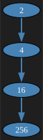
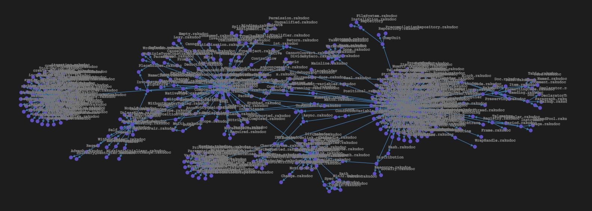

# Graph Neat Examples in Raku

*Set 3*

Anton Antonov  
[RakuForPrediction at WordPress](https://rakuforprediction.wordpress.com)  
[RakuForPrediction-book at GitHub](https://github.com/antononcube/RakuForPrediction-book)  
November 2024

---

## Introduction

In this post I am showcasing some examples of using the Raku programming language to create and visualize graphs. 
These examples are part of a series of neat examples, which are concise or straightforward code snippets that produce compelling visual or textual outputs.
(And, hopefully, we know something is neat when we see it...)

All computational graph features discussed here are provided by the ["Graph"](https://raku.land/zef:antononcube/Graph) module.
The graphs are visualized using [D3.js](https://d3js.org) (via ["JavaScript::D3"](https://raku.land/zef:antononcube/JavaScript::D3)) and
[Graphviz DOT](https://graphviz.org/doc/info/lang.html) (via `Graph.dot`),
providing both interactive and static visualizations.

Here is the link to the related presentation recording ["Graph neat examples in Raku (Set 3)](https://youtu.be/S_3e7liz4KM):

[](https://youtu.be/S_3e7liz4KM)


------

## Setup

The setup for these examples is the same as in the two sets, so it is skipped here.

---

## Nested Graphs

Let us look first into nested graphs. 
A nested graph is created by repeatedly applying a function to an initial value. 
Here's a basic example:

```raku, output.prompt=NONE, result=asis
#% html

my $g1 = Graph::Nested.new({$_ ** 2}, 2, 3, :directed);

my $g2 = Graph::Nested.new({"f($_)"}, 'x', 3, :directed);

$g1.dot(:$background, engine => 'dot', vertex-shape => 'ellipse', vertex-width => 0.75, :svg)
~
$g2.dot(:$background, engine => 'dot', vertex-shape => 'ellipse', vertex-width => 0.75, :svg)
```




In this example, we start with a value and apply a function to it multiple times. 
The graph visually represents these nested applications.

### Binary Tree

We can extend this concept by using two functions, creating a binary tree structure:

```raku
my $g = Graph::Nested.new({["f($_)", "g($_)"]}, 'x', 3, :directed)
```
```
# Graph(vertexes => 15, edges => 14, directed => True)
```

```raku, output.prompt=NONE, results=asis
#%html
$g.dot(node-width => 0.75, node-height => 0.3, node-shape => 'rect', engine => 'dot'):svg
```


This creates a more complex graph where each node has two children, representing the application of two different functions.

### Mod Graph

The mod graph example uses arithmetic operations to create a directed graph:

```raku
my $g = Graph::Nested.new({($_.Int ** 2 + 1) mod 10}, ^10, :directed)
```
```
# Graph(vertexes => 10, edges => 10, directed => True)
```

```raku, output.prompt=NONE, result=asis
#%html
$g.dot(node-width => 0.3, node-height => 0.3, node-shape => 'circle', engine => 'sfdp'):svg
```


This graph shows how numbers transform through a series of operations, resulting in a directed cycle.

### Range Graph

Finally, we have a range graph, which uses an integer range to create a graph:

```raku
my $g = Graph::Nested.new({^$_}, '9', 2, :directed)
```
```
# Graph(vertexes => 10, edges => 45, directed => True)
```

```raku, output.prompt=NONE, result=asis
#%html
$g.dot(node-width => 0.4, node-height => 0.4, node-font-size => 18, engine => 'dot', size => (6, 6)):svg
```


This graph illustrates the concept of completeness and allows us to compute in-degrees and out-degrees of vertices.

```raku
$g.undirected-graph.is-complete
```
```
# True
```

```raku
say 'in  : ', $g.vertex-in-degree(:pairs);
say 'out : ', $g.vertex-out-degree():p;
```
```
# in  : (0 => 9 1 => 8 2 => 7 3 => 6 4 => 5 5 => 4 6 => 3 7 => 2 8 => 1 9 => 0)
# out : (0 => 0 1 => 1 2 => 2 3 => 3 4 => 4 5 => 5 6 => 6 7 => 7 8 => 8 9 => 9)
```

---

## File System Graphs

### RakuMode Notebooks

Next, let's visualize file system structures as graphs. We'll start by getting a list of file paths from a directory:

```raku
my @paths = paths($*HOME ~ "/MathFiles/RakuForPrediction");
my @paths2 = @paths>>.subst($*HOME.Str)>>.split("/", :skip-empty);
@paths2.elems
```
```
# 183
```

We then create graph edges from these paths:

```raku
my @edges = @paths2.map({ $_.rotor(2 => -1).map({ $_.head => $_.tail }) }).map(*.Slip).unique(:as({.Str}));
my $g = Graph.new(@edges, :directed)
```
```
# Graph(vertexes => 188, edges => 188, directed => True)
```

And visualize the graph using Graphviz:

```raku, output.prompt=NONE, output=FALSE
#%html
my $preamble = q:to/END/;
fontcolor = "Ivory";
fontsize = "12";
labelloc = "t";
label = "Directory paths";
graph [size="8,8!"];

bgcolor="#1F1F1F";
node [style=filled, fixedsize=true, shape=circle, color="Black", fillcolor="SlateBlue", penwidth=1, fontsize=4, fontcolor="White", labelloc=c, width=0.08, height=0.08];
edge [color="SteelBlue", penwidth=0.6, arrowsize=0.4];
END

$g.dot(:$preamble, engine=>'twopi'):svg;
```


### Raku-doc Files

Finally, we'll create a larger graph from the Raku documentation files:

```raku
my @paths = paths($*HOME ~ "/Downloads/doc/doc");
my @paths2 = @paths>>.subst($*HOME.Str)>>.split("/", :skip-empty);
my @edges = @paths2.map({ $_.rotor(2 => -1).map({ $_.head => $_.tail }) }).map(*.Slip).unique(:as({.Str}));
my $g2 = Graph.new(@edges, :directed)
```
```
# Graph(vertexes => 476, edges => 510, directed => True)
```

And plot it using D3.js:

```raku, eval=FALSE
#%js
$g2.edges ==>
    js-d3-graph-plot(
        width => 1100,
        height => 400,
        :$background, 
        :$title-color,
        vertex-size => 3,
        vertex-fill-color => 'SlateBlue',
        vertex-label-font-size => 10,
        vertex-label-color => 'none',
        edge-thickness => 1,
        directed => $g.directed,
        force => {charge => {strength => -50, iterations => 1}, y => {strength => 0.4}, collision => {radius => 2, iterations => 1}, link => {distance => 1}}
    )
```


Same graph, but with vertex names:



This visualization demonstrates the structure of the Raku documentation as a graph, offering insights into its organization.

Thank you for joining me in exploring these neat examples of graph visualization in Raku. 
I hope you will use Raku's graph-functionalities a lot and often!