# LLM function calling workflows (Part 1, OpenAI)

Anton Antonov   
[RakuForPrediction at WordPress](https://rakuforprediction.wordpress.com)   
May-June 2025


-----

## Introduction


This notebook shows how to do [Function Calling](https://platform.openai.com/docs/guides/function-calling) workflows with Large Language Models (LLMs) of OpenAI. 

The Raku package ["WWW::OpenAI"](https://github.com/antononcube/Raku-WWW-OpenAI), [AAp1], is used.


### Outline of the overall process


The overall process is (supposed to be) simple:

1. Implement a "tool", i.e. a function/sub
    - The tool is capable of performing (say, quickly and reliably) certain tasks.
    - *More than one tool can be specified.*
2. Describe the tool(s) using a certain JSON format
    - The JSON description is to be "understood" by the LLM.
    - [JSON-schema](https://json-schema.org) is used for the arguments.
    - Using the description, the LLM figures out when to make requests for computations with the tool and with what parameters and corresponding values.
3. Make a first call to the LLM using suitably composed messages that have the tool JSON description(s).
4. Examine the response of the LLM:
5. If the response indicates that the (local) tool has to be evaluated:
    - Process the tool names and corresponding parameters.
    - Make a new message with the tool result(s).
    - Send the messages to the LLM.
    - Goto Step 4.
6. Otherwise, give that "final" response.

(Currently) OpenAI indicates its tool evaluation requests with having the rule `finish_reason => tool_calls` in its responses.


### Diagram


Here is a [Mermaid-JS](https://mermaid.js.org) diagram that shows _single-pass_ LLM-and-tool interaction:

```mermaid
sequenceDiagram
    participant Developer
    participant Model as LLM Service (e.g., OpenAI, Gemini, Anthropic)
    participant Tool as External Function

    Note over Developer, Model: 1. Tool Definitions + Messages
    Developer->>Model: get-current-weather(location) <br> "What's the weather in Boston, MA?"

    Note over Model: 2. Tool Calls
    Model->>Tool: get-current-weather("Boston, MA")

    Note over Tool: 3. Execute Function Code
    Tool->>Model: {"temperature": 45}

    Note over Model: 4. Results
    Model->>Developer: {"temperature": 45}

    Note over Developer: 5. Final Response
    Developer->>Model: It's currently 45°F in Boston, MA, USA.
```





**Remark:** Instead of a loop -- as in the outline above -- only one invocation of a local tool is shown in the diagram.


### Examples and big picture


The rest of the notebook gives concrete code how to do function calling with OpenAI's LLMs using Raku.

There are similar workflows with other LLM providers. (Like, Google's Gemini.) They follow the same structure, although there are some small differences. (Say, in the actual specifications of tools.)

It would be nice to have:
- Universal programming interface for those function calling interfaces.
- Facilitation of tool descriptions derivations.
    - Via Raku's introspection or using suitable LLM prompts.
        - ["LLM::Functions"](https://raku.land/zef:antononcube/LLM::Functions), [AAp3], can be used for both approaches.

This notebook belongs to a collection of notebooks describing how to do LLM function calling with Raku.


-----

## Setup


Load packages:

```raku
use WWW::OpenAI;
use JSON::Fast;
```
```
# (Any)
```

Choose a model:

```raku
my $model = "gpt-4.1";
```
```
# gpt-4.1
```

------

## Workflow


### Define a local function

This is the "tool" to be communicated to OpenAI. (I.e. define the local function/sub.)

```raku
sub get-current-weather(Str $location, Str $unit = "fahrenheit") returns Str {
    return "It is currently sunny in $location with a temperature of 72 degrees $unit.";
}
```
```
# &get-current-weather
```

Define the function specification (as prescribed in [OpenAI's function calling documentation](https://platform.openai.com/docs/guides/function-calling?api-mode=responses)):

```raku
my $function-spec = {
    type => "function",
    function => {
        name => "get-current-weather",
        description => "Get the current weather for a given location",
        parameters => {
            type => "object",
            properties => {
                '$location' => {
                    type => "string",
                    description => "The city and state, e.g., San Francisco, CA"
                },
                '$unit' => {
                    type => "string",
                    enum => ["celsius", "fahrenheit"],
                    description => "The temperature unit to use"
                }
            },
            required => ["location"]
        }
    }
};
```
```
# {function => {description => Get the current weather for a given location, name => get-current-weather, parameters => {properties => {$location => {description => The city and state, e.g., San Francisco, CA, type => string}, $unit => {description => The temperature unit to use, enum => [celsius fahrenheit], type => string}}, required => [location], type => object}}, type => function}
```

### First communication with OpenAI


Initialize messages and tools:

```raku
my @messages =
    {role => "system", content =>  "You are a helpful assistant that can provide weather information."},
    {role => "user", content => "What's the weather in Boston, MA?"}
    ;

my @tools = [$function-spec,];
```
```
# [{function => {description => Get the current weather for a given location, name => get-current-weather, parameters => {properties => {$location => {description => The city and state, e.g., San Francisco, CA, type => string}, $unit => {description => The temperature unit to use, enum => [celsius fahrenheit], type => string}}, required => [location], type => object}}, type => function}]
```

Send the first chat completion request:

```raku
my $response = openai-chat-completion(
    @messages,
    :@tools,
    :$model,
    max-tokens => 4096,
    format => "raku",
    temperature => 0.45
);
```
```
# [{finish_reason => tool_calls, index => 0, logprobs => (Any), message => {annotations => [], content => (Any), refusal => (Any), role => assistant, tool_calls => [{function => {arguments => {"$location":"Boston, MA"}, name => get-current-weather}, id => call_ROi3n0iICSrGbetBKZ9KVG4E, type => function}]}}]
```

### Refine the response with functional calls


The following copy of the messages is not required, but it makes repeated experiments easier:

```raku
my @messages2 = @messages;
```
```
# [{content => You are a helpful assistant that can provide weather information., role => system} {content => What's the weather in Boston, MA?, role => user}]
```

Process the response -- invoke the tool, give the tool result to the LLM, get the LLM answer:

```raku
my $assistant-message = $response[0]<message>;
if $assistant-message<tool_calls> {

    @messages2.push: {
        role => "assistant",
        tool_calls => $assistant-message<tool_calls>
    };

    my $tool-call = $assistant-message<tool_calls>[0];
    my $function-name = $tool-call<function><name>;
    my $function-args = from-json($tool-call<function><arguments>);
    
    if $function-name eq "get-current-weather" {
        my $result = get-current-weather(
            $function-args{'$location'} // $function-args<location>,
            $function-args{'$unit'} // $function-args<unit> // "fahrenheit"
        );
        @messages2.push: {
            role => "tool",
            content => $result,
            tool_call_id => $tool-call<id>
        };
        
        # Send the second request with function result
        my $final-response = openai-chat-completion(
            @messages2,
            :@tools,
            #tool_choice => "auto",
            :$model,
            format => "raku"
        );
        say "Assistant: $final-response[0]<message><content>";
    }
} else {
    say "Assistant: $assistant-message<content>";
}
```
```
# Assistant: The weather in Boston, MA is currently sunny with a temperature of 72
```

Show all messages:

```raku
.say for @messages2
```
```
# {content => You are a helpful assistant that can provide weather information., role => system}
# {content => What's the weather in Boston, MA?, role => user}
# {role => assistant, tool_calls => [{function => {arguments => {"$location":"Boston, MA"}, name => get-current-weather}, id => call_ROi3n0iICSrGbetBKZ9KVG4E, type => function}]}
# {content => It is currently sunny in Boston, MA with a temperature of 72 degrees fahrenheit., role => tool, tool_call_id => call_ROi3n0iICSrGbetBKZ9KVG4E}
```

In general, there should be an evaluation loop that checks the finishing reason(s) in the LLM answers and invokes the tools as many times as it is required. 
(I.e., there might be several back-and-forth exchanges in the LLM, requiring different tools or different tool parameters.)


-----

## References


[AAp1] Anton Antonov,
[WWW::OpenAI Raku package](https://github.com/antononcube/Raku-WWW-OpenAI),
(2023-2025),
[GitHub/antononcube](https://github.com/antononcube).

[AAp2] Anton Antonov,
[WWW::Gemini Raku package](https://github.com/antononcube/Raku-WWW-Gemini),
(2023-2025),
[GitHub/antononcube](https://github.com/antononcube).

[AAp3] Anton Antonov,
[LLM::Functions Raku package](https://github.com/antononcube/Raku-LLM-Functions),
(2023-2025),
[GitHub/antononcube](https://github.com/antononcube).
