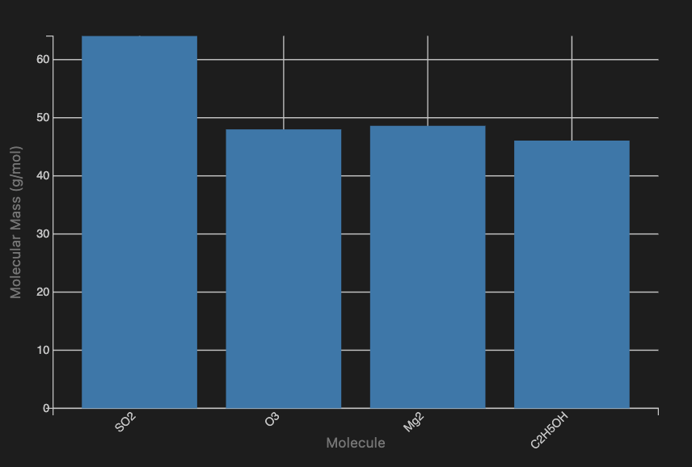

# LLM function calling workflows (Part 4, Universal specs)

Anton Antonov   
[RakuForPrediction at WordPress](https://rakuforprediction.wordpress.com)   
September 2025

-----

## Introduction

This document (notebook) shows how to utilize Large Language Model (LLM) [Function Calling](https://ai.google.dev/gemini-api/docs/function-calling) with the Raku package ["LLM::Functions"](https://github.com/antononcube/Raku-LLM-Functions), [AAp1].

"LLM::Functions" supports *high level* function calling via `llm-synthesize` and `llm-synthesize-with-tools`. (The latter provides more options for the tool invocation process like max-iterations or overriding tool specs.)

At this point "LLM::Functions" supports function calling in the styles of OpenAI's ChatGPT and Google's Gemini. If the LLM configuration is not set with the names "ChatGPT" or "Gemini", then the function calling style used is that of ChatGPT. (Many LLM providers -- other than OpenAI and Gemini -- tend to adhere to OpenAI's API.)

**Remark:** LLM "function calling" is also known as LLM "tools" or "LLM tool invocation."

In this document, non-trivial Stoichiometry computations are done with the Raku package ["Chemistry::Stoichiometry"](https://raku.land/zef:antononcube/Chemistry::Stoichiometry), [AAp4]. Related plots are done with the Raku package ["JavaScript::D3"](https://raku.land/zef:antononcube/JavaScript::D3), [AAp6].

### Big picture

Inversion of control is a way to characterize LLM function calling. This means the LLM invokes functions or subroutines that operate on an external system, such as a local computer, rather than within the LLM provider's environment. See the section "Outline of the overall process" of ["LLM function calling workflows (Part 1, OpenAI)"](https://rakuforprediction.wordpress.com/2025/06/01/llm-function-calling-workflows-part-1-openai/), [AA1].

**Remark:** The following Software Framework building principles (or mnemonic slogans) apply to LLM function calling:

- "Don't call us, we'll call you." (The Hollywood Principle)
- "Leave the driving to us." (Greyhound Lines, Inc.)

### The whole series

This document is the fourth of the [LLM function calling series](https://rakuforprediction.wordpress.com/tag/llm-function-calling/), [AA1 ÷ AA4]. The other three show lower-level LLM function calling workflows.

Here are all blog posts of the series:

1. ["LLM function calling workflows (Part 1, OpenAI)"](https://rakuforprediction.wordpress.com/2025/06/01/llm-function-calling-workflows-part-1-openai/)
2. ["LLM function calling workflows (Part 2, Google’s Gemini)"](https://rakuforprediction.wordpress.com/2025/06/07/llm-function-calling-workflows-part-2-googles-gemini/)
3. ["LLM function calling workflows (Part 3, Facilitation)"](https://rakuforprediction.wordpress.com/2025/06/08/llm-function-calling-workflows-part-3-facilitation/)
4. ["LLM function calling workflows (Part 4, Universal specs)"](https://rakuforprediction.wordpress.com/2025/09/28/llm-function-calling-workflows-part-4-universal-specs/)

### Overall comments and observations

- Raku's constellation of LLM packages was behind with the LLM tools.
    - There are two main reasons for this:
        - For a long period of time (say, 2023 & 2024) LLM tool invocation was unreliable.
            - Meaning, tools were invoked (or not) in an unexpected manner.
        - Different LLM providers use similar but different protocols for LLM tooling.
            - And that poses "interesting" development choices. (Architecture and high-level signatures.)
- At this point, LLM providers have more reliable LLM tool invocation.
    - And API parameters that postulate (or force) tool invocation behavior.
    - Still, not 100% reliable or expected.
- In principle, LLM function calling can be replaced by using LLM graphs, [AA5].
    - Though, at this point `llm-graph` provides computation over acyclic graphs only.
    - On the other hand, `llm-synthesize` and `llm-synthesize-with-tools` use loops for multiple iterations over the tool invocation.
        - Again, the tool is external to the LLM. Tools are (most likely) running on "local" computers.
- In Raku, LLM tooling specs can be (nicely) derived by introspection.
    - So, package developers are encouraged to use declarator blocks as much as possible.
    - Very often, though, it is easier to write an adapter function with specific (or simplified) input parameters.
        - See the last section "Adding plot tools".
- The package "LLM::Functions" provides a system of classes and subs that facilitate LLM function calling, [AA3].
    - See the namespace `LLM::Tooling`:
        - Classes: `LLM::Tool`, `LLM::ToolRequest`, `LLM::ToolResponse`.
        - Subs: `sub-info`, `llm-tool-definition`, `generate-llm-tool-response`, `llm-tool-request`.
    - A new LLM tool for the sub `&f` can be easily created with `LLM::Tool.new(&f)`.
        - `LLM::Tool` uses `llm-tool-definition` which, in turn, uses `sub-info`.


### Outline

Here is an outline of the exposition below:

- **Setup**   
  Computation environment setup
- **Chemistry computations examples**   
  Stoichiometry computations demonstrations
- **Define package functions as tools**     
  Show how to define LLM-tools
- **Stoichiometry by LLM**   
  Invoking LLM requests with LLM tools
- **"Thoughtful" response**    
  Elaborated LLM answer based in LLM tools results
- **Adding plot tools**     
  Enhancing the LLM answers with [D3.js](https://d3js.org) plots

-----

## Setup

Load packages:


```raku
use JSON::Fast;
use LLM::Functions;
use LLM::Tooling;
use Chemistry::Stoichiometry;

```

Define LLM access configurations:


```raku
sink my $conf5-mini = llm-configuration('ChatGPT', model => 'gpt-5-mini');
sink my $conf41-mini = llm-configuration('ChatGPT', model => 'gpt-4.1-mini', :8192max-tokens, temperature => 0.4);
sink my $conf-gemini-flash = llm-configuration('Gemini', model => 'gemini-2.0-flash', :8192max-tokens, temperature => 0.4);
```

### JavaScript::D3


```raku
#%javascript
require.config({
     paths: {
     d3: 'https://d3js.org/d3.v7.min'
}});

require(['d3'], function(d3) {
     console.log(d3);
});
```


```raku
#%js
js-d3-list-line-plot(10.rand xx 30, background => 'none')
```

---

## Chemistry computations examples

The package ["Chemistry::Stoichiometry"](https://raku.land/zef:antononcube/Chemistry::Stoichiometry), [AAp4], provides element data, a grammar (or parser) for chemical formulas, and subs for computing molecular masses and balancing equations. Here is an example of calling `molecular-mass`:


```raku
molecular-mass("SO2")
```


    64.058


Balance chemical equation:


```raku
'Al + O2 -> Al2O3'
==> balance-chemical-equation
```


    [4*Al + 3*O2 -> 2*Al2O3]


----

## Define package functions as tools

Define a few tools based in chemistry computations subs:


```raku
sink my @tools =
        LLM::Tool.new(&molecular-mass),
        LLM::Tool.new(&balance-chemical-equation)
        ;
```

    Undefined type of parameter ⎡$spec⎦; continue assuming it is a string.


Make an LLM configuration with the LLM-tools:


```raku
sink my $conf = llm-configuration($conf41-mini, :@tools);
```

**Remark:** When `llm-synthesize` is given LLM configurations with LLM tools, it hands over the process to `llm-synthesize-with-tools`. This function then begins the LLM-tool interaction loop.

-----

## Stoichiometry by LLM

Here is a prompt requesting to compute molecular masses and to balance a certain chemical equation:


```raku
sink my $input = "What are the masses of SO2, O3, and C2H5OH? Also balance: C2H5OH + O2 = H2O + CO2."
```

The LLM invocation and result:


```raku
llm-synthesize(
        [$input, llm-prompt('NothingElse')('JSON')],
        e => $conf, 
        form => sub-parser('JSON'):drop)
```


    {balanced_equation => 1*C2H5OH + 3*O2 -> 2*CO2 + 3*H2O, masses => {C2H5OH => 46.069, O3 => 47.997, SO2 => 64.058}}


**Remark:** It order to see the LLM-tool interaction use the Boolean option (adverb) `:echo` of `llm-synthesize`.

--- 

## "Thoughtful" response

Here is a very informative, "thoughtful" response for a quantitative Chemistry question:


```raku
#% markdown
my $input = "How many molecules a kilogram of water has? Use LaTeX for the formulas. (If any.)";

llm-synthesize($input, e => $conf)
==> { .subst(/'\[' | '\]'/, '$$', :g).subst(/'\(' | '\)'/, '$', :g) }() # Make sure LaTeX code has proper fences
```


To find the number of molecules in a kilogram of water, we follow these steps:

1. Calculate the molar mass of water (H₂O):
   
$$
M = 18.015 \, \text{g/mol}
$$

2. Convert 1 kilogram of water to grams:
   
$$
   1 \, \text{kg} = 1000 \, \text{g}
$$

3. Calculate the number of moles in 1 kilogram of water:

$$
   n = \frac{1000 \, \text{g}}{18.015 \, \text{g/mol}} \approx 55.51 \, \text{mol}
$$

4. Use Avogadro's number to find the number of molecules:
 
$$
N_A = 6.022 \times 10^{23} \, \text{molecules/mol}
$$
$$
N = n \times N_A = 55.51 \times 6.022 \times 10^{23} \approx 3.34 \times 10^{25} \, \text{molecules}
$$

So, 1 kilogram of water contains approximately $3.34 \times 10^{25}$ molecules.


---

## Adding plot tools

It would be interesting (or fancy) to add a plotting tool. We can use `text-list-plot` of ["Text::Plot"](https://raku.land/zef:antononcube/Text::Plot), [AAp5], or 
`js-d3-list-plot` of ["JavaScript::D3"](https://raku.land/zef:antononcube/JavaScript::D3), [AAp6].
For both, the automatically derived tool specs -- via the sub `llm-tool-definition` used by `LLM::Tool` -- are somewhat incomplete. Here is the auto-result for `js-d3-list-plot`:


```raku
#llm-tool-definition(&text-list-plot)
llm-tool-definition(&js-d3-list-plot)
```

    Undefined type of parameter ⎡$data⎦; continue assuming it is a string.
    Undefined type of parameter ⎡⎦; continue assuming it is a string.


    {
      "function": {
        "strict": true,
        "parameters": {
          "additionalProperties": false,
          "required": [
            "$data",
            ""
          ],
          "type": "object",
          "properties": {
            "$data": {
              "description": "",
              "type": "string"
            },
            "": {
              "description": "",
              "type": "string"
            }
          }
        },
        "type": "function",
        "name": "js-d3-list-plot",
        "description": "Makes a list plot (scatter plot) for a list of numbers or a list of x-y coordinates."
      },
      "type": "function"
    }


The automatic tool-spec for `js-d3-list-plot` can be replaced with this spec:

```raku
my $spec = q:to/END/;
{
  "type": "function",
  "function": {
    "name": "jd-d3-list-plot",
    "description": "Creates D3.js code for a list-plot of the given arguments.",
    "parameters": {
      "type": "object",
      "properties": {
        "$x": {
          "type": "array",
          "description": "A list of a list of x-coordinates or x-labels",
          "items": {
            "anyOf": [
              { "type": "string" },
              { "type": "number" }
            ]
          }
        }
        "$y": {
          "type": "array",
          "description": "A list of y-coordinates",
          "items": {
            "type": "number"
          }
        }
      },
      "required": ["$x", "$y"]
    }
  }
}
END

my $t = LLM::Tool.new(&text-list-plot);
$t.json-spec = $spec;
```


Though, it is easier and more robust to define a new function that delegates to `js-d3-list-plot` -- or other plotting function -- and does some additional input processing that anticipates LLM derived argument values:


```raku
#| Make a string that represents a list-plot of the given arguments.
my sub data-plot(
    Str:D $x,             #= A list of comma separated x-coordinates or x-labels
    Str:D $y,             #= A list of comma separated y-coordinates
    Str:D :$x-label = '', #= Label of the x-axis
    Str:D :$y-label = '', #= Label of the y-axis
    Str:D :$title = '',   #= Plot title
    ) {
  
    my @x = $x.split(/<[\[\],"]>/, :skip-empty)».trim.grep(*.chars);
    my @y = $y.split(/<[\[\],"]>/, :skip-empty)».trim».Num;
      
    my @points = (@x Z @y).map({ %( variable => $_.head, value => $_.tail ) });
    js-d3-bar-chart(@points, :$x-label, :$y-label, title-color => 'Gray', background => '#1F1F1F', :grid-lines)
}
```


    &data-plot


Here we add the new tool to the tool list above:


```raku
sink my @tool-objects =
        LLM::Tool.new(&molecular-mass),
        LLM::Tool.new(&balance-chemical-equation),
        LLM::Tool.new(&data-plot);
```

    Undefined type of parameter ⎡$spec⎦; continue assuming it is a string.


Here we make an LLM request for chemical molecules masses calculation and corresponding plotting -- note that require to obtain a dictionary of the masses and plot:


```raku
my $input = q:to/END/;
What are the masses of SO2, O3, Mg2, and C2H5OH? 
Make a plot the obtained quantities: x-axes for the molecules, y-axis for the masses.
The plot has to have appropriate title and axes labels.
Return a JSON dictionary with keys "masses" and "plot".
END

# LLM configuration with tools
my $conf = llm-configuration($conf41-mini, tools => @tool-objects);

# LLM invocation
my $res = llm-synthesize([
        $input, 
        llm-prompt('NothingElse')('JSON')
    ], 
    e => $conf,
    form => sub-parser('JSON'):drop
);

# Type/structure of the result
deduce-type($res)
```


    Struct([masses, plot], [Hash, Str])


Here are result's molecule masses:


```raku
$res<masses>
```


    {C2H5OH => 46.069, Mg2 => 48.61, O3 => 47.997, SO2 => 64.058}


Here is the corresponding plot:


```raku
#%js
$res<plot>
```



-----

## References

### Articles, blog posts

[AA1] Anton Antonov,
["LLM function calling workflows (Part 1, OpenAI)"](https://rakuforprediction.wordpress.com/2025/06/01/llm-function-calling-workflows-part-1-openai/),
(2025),
[RakuForPrediction at WordPress](https://rakuforprediction.wordpress.com).

[AA2] Anton Antonov,
["LLM function calling workflows (Part 2, Google's Gemini)"](https://rakuforprediction.wordpress.com/2025/06/01/llm-function-calling-workflows-part-2-google-gemini/),
(2025),
[RakuForPrediction at WordPress](https://rakuforprediction.wordpress.com).

[AA3] Anton Antonov,
["LLM function calling workflows (Part 3, Facilitation)"](https://rakuforprediction.wordpress.com/2025/06/08/llm-function-calling-workflows-part-3-facilitation/),
(2025),
[RakuForPrediction at WordPress](https://rakuforprediction.wordpress.com).

[AA4] Anton Antonov,
["LLM function calling workflows (Part 4, Universal specs)"](https://rakuforprediction.wordpress.com/2025/09/28/llm-function-calling-workflows-part-4-universal-specs/),
(2025),
[RakuForPrediction at WordPress](https://rakuforprediction.wordpress.com).

[AA5] Anton Antonov,
["LLM::Graph"](https://rakuforprediction.wordpress.com/2025/08/23/llmgraph/),
(2025),
[RakuForPrediction at WordPress](https://rakuforprediction.wordpress.com).

[Gem1] Google Gemini,
["Gemini Developer API"](https://ai.google.dev/gemini-api/docs).

[OAI1] Open AI,
["Function calling guide"](https://platform.openai.com/docs/guides/function-calling).

[WRI1] Wolfram Research, Inc.
["LLM-Related Functionality" guide](https://reference.wolfram.com/language/guide/LLMFunctions.html).


### Packages 

[AAp1] Anton Antonov,
[LLM::Functions, Raku package](https://github.com/antononcube/Raku-LLM-Functions),
(2023-2025),
[GitHub/antononcube](https://github.com/antononcube).

[AAp2] Anton Antonov,
[WWW::OpenAI, Raku package](https://github.com/antononcube/Raku-WWW-OpenAI),
(2023-2025),
[GitHub/antononcube](https://github.com/antononcube).

[AAp3] Anton Antonov,
[WWW::Gemini, Raku package](https://github.com/antononcube/Raku-WWW-Gemini),
(2023-2025),
[GitHub/antononcube](https://github.com/antononcube).

[AAp4] Anton Antonov,
[Chemistry::Stoichiometry, Raku package](https://github.com/antononcube/Raku-Chemistry-Stoichiometry),
(2021-2025),
[GitHub/antononcube](https://github.com/antononcube).

[AAp5] Anton Antonov,
[Text::Plot, Raku package](https://github.com/antononcube/Raku-Text-Plot),
(2022-2025),
[GitHub/antononcube](https://github.com/antononcube).

[AAp6] Anton Antonov,
[JavaScript::D3, Raku package](https://github.com/antononcube/Raku-JavaScript-D3),
(2022-2025),
[GitHub/antononcube](https://github.com/antononcube).
