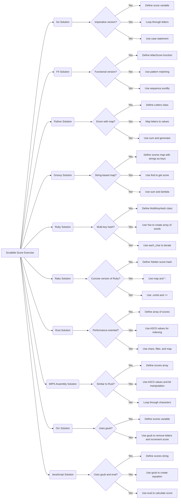

# [LLM] Extracting wisdom and hidden messages

[Complexia The Sinker](https://complexiathesinker.substack.com)

2024-04-11


***Text statistics:***


```
# [chars => 32098 words => 6442 lines => 855 totalTokens => 8020]
```

-----

## Introduction

This post applies various Large Language Model (LLM) summarization prompts to the transcript of the program
["10 ways to solve Scrabble Score on Exercism"](https://www.youtube.com/watch?v=pFKLHOygtqQ)
by the YouTube channel [Exercism](https://www.youtube.com/@exercism_org).

Alex and Eric explore various ways to solve the Scrabble Score programming exercise in multiple languages, including Go, F#, Python, Groovy, Ruby, Raku, Rust, MIPS assembly, and Orc. They discuss the efficiency and readability of different approaches, highlighting functional programming, pattern matching, and performance optimization techniques.


**Remark:** The LLM results below were obtained from the "raw" transcript, which did not have punctuation.

**Remark:** The transcription software had problems parsing the names of the participants. Some of the names were manually corrected.


Post’s structure:

1. **Themes**    
   Instead of a summary.
2. **Mind-map**   
   An even better summary replacement!
3. **Summary, ideas, and recommendations**     
   The main course.
4. **Hidden and propaganda messages**     
   Didactic POV.

-----

## Themes

Instead of a summary consider this table of themes:


<table border="1"><thead><tr><th>theme</th><th>content</th></tr></thead><tbody><tr><td>Introduction</td><td>Eric and the speaker introduce the Scrabble score exercise, where points are calculated based on letter values in a word.</td></tr><tr><td>Go Solution</td><td>A basic Go implementation with a loop and case statements to increment the score based on letter values.</td></tr><tr><td>F# Solution</td><td>A functional approach in F# using pattern matching and higher-order functions like &#39;sumBy&#39; for conciseness.</td></tr><tr><td>Python Solution</td><td>Python solution using an Enum class to define letter-score mappings and a generator expression for efficient summing.</td></tr><tr><td>Groovy Solution</td><td>Groovy implementation with a string-based map and a lambda function to find the score for each character.</td></tr><tr><td>Ruby Solution</td><td>A Ruby solution using a custom &#39;MultiKeyHash&#39; class to enable indexing by character while maintaining string-based definitions.</td></tr><tr><td>Raku Solution</td><td>A concise Raku (Perl 6) version using the &#39;map&#39; and &#39;sum&#39; methods and a special operator for pairwise mapping.</td></tr><tr><td>Rust Solution</td><td>A performance-oriented Rust solution using an array for efficient lookups based on character indices.</td></tr><tr><td>MIPS Assembly Solution</td><td>MIPS assembly implementation with a loop, character comparisons, and a bitwise OR trick for lowercase conversion.</td></tr><tr><td>Orc Solution</td><td>An Orc solution using regular expressions and the &#39;gsub&#39; function to count and sum letter occurrences.</td></tr><tr><td>Perl Solution</td><td>A Perl solution with regular expression replacements to create an equation and &#39;eval&#39; to calculate the score.</td></tr><tr><td>Conclusion</td><td>The speakers encourage viewers to try the exercise, explore performance optimizations, and share their solutions.</td></tr></tbody></table>


------

## Mind-map

Here is a mind-map summarizing the text:





-------

## Summary, ideas, and recommendations


#### SUMMARY

Alex and Eric explore various ways to solve the Scrabble Score programming exercise in multiple languages, including Go, F#, Python, Groovy, Ruby, Raku, Rust, MIPS assembly, and Orc. They discuss the efficiency and readability of different approaches, highlighting functional programming, pattern matching, and performance optimization techniques. 

#### IDEAS

*   The Scrabble Score exercise provides a simple yet versatile problem for exploring different programming languages and techniques.
*   Functional programming languages like F# offer concise and expressive ways to solve problems using higher-order functions like `sumBy`. 
*   Pattern matching allows for elegant and readable code by handling different cases based on specific values or patterns.
*   Performance optimization techniques, such as using arrays instead of maps and minimizing unnecessary operations, can significantly improve code efficiency.
*   Assembly language, while often considered intimidating, can be quite readable and efficient for specific tasks like character manipulation.
*   Regular expressions offer powerful tools for string manipulation and can be creatively used to solve problems like calculating Scrabble scores. 
*   The choice of data structures and algorithms can have a significant impact on code performance, especially when dealing with large datasets or real-time applications. 
*   Readability and maintainability are essential considerations when writing code, even for small exercises. 
*   Exploring solutions in various languages can broaden your understanding of programming paradigms and techniques. 
*   Community engagement and feedback are valuable for learning and improving coding skills.
*   The ASCII table's design, with non-consecutive values for uppercase and lowercase letters, can present challenges for character manipulation.
*   Bit manipulation tricks, such as using bitwise OR to convert uppercase letters to lowercase, can be efficient and elegant.
*   Understanding the trade-offs between different approaches is crucial for making informed decisions when coding. 
*   Benchmarking is essential for evaluating the performance of different solutions and identifying areas for improvement.
*   Creative and unconventional solutions, like using regular expression substitutions to build an equation, can be both fun and effective.
*   Code reviews and discussions with other programmers can provide valuable insights and perspectives.
*   The importance of error handling and edge case considerations to ensure code robustness.
*   The value of exploring different programming paradigms, such as functional programming, to expand your coding toolkit.
*   The continuous learning and improvement mindset is essential for programmers to stay up-to-date with evolving technologies and best practices.

#### QUOTES

*   "I like to use the word ergonomic; I'm going to use that to describe code more in future." - Alex
*   "Kudos to all of you." - Eric
*   "This exercise leaves it up to you." - Eric
*   "It's sort of like a shorthand for doing a map first and then doing maybe a reduce or sum, but now you can combine that into two, so that's a neat little trick that you can use in F#." - Eric
*   "This syntax always confuses me: the whole using brackets as a sort of inheritance thing in Python; um, always catches me out. I always think something's been passed into something, but yeah, this is this is just effectively inheritance with this as a base class, right, Eric?" - Alex 
*   "I think so, yeah. Okay, neither of us are particularly Pythonistas." - Eric
*   "Performance-wise, it probably doesn't matter at all because Scrabble score is such a limited domain, but if you were to try to optimize this, move the upper casing to the left so that you don't have to do it within the loop." - Eric
*   "I always think through things like this. If you've got like some program where you're trying to calculate the Scrabble score for every word in the whole English dictionary, then actually performance starts to matter because you're running this, you know, millions of times—how many words? I don't know. Millions, but a lot of times anyway. Um, and yeah, so it's a trade-off between if you're just running this in a normal game, it probably doesn't matter, but if you're trying to build an online Scrabble game that's going to have a million people simultaneously playing it, this sort of performance actually matters because this is going to be costing you money as you have to have more servers running to do more things in parallel. So um yeah, always trade-offs to consider with uh with this stuff with speed." - Eric
*   "Yeah, and you could even if you wanted to to completely optimize, you could also create the array with um placeholder values for all the other characters so that you don't even have to do minus 97. So for example, you have an an array—I think 97 plus 26 that's like 123—so you would have an array of 124 values, and then you would have everything so you have the up—the lowercase letters—have to duplicate it for the uppercase letters and then the rest doesn't matter because you wouldn't be indexing into that anyways uh and then you could just do the map without having to do the minus 97. I don't know how much it gains you. You—the offset is that you have a larger array so you might get data locality issues there, but that would be something to at least try out to see if that would help but uh always measure." - Eric 
*   "Horrible, bad design by the original creators of ASCII." - Alex
*   "Yeah, the whole—that's really nice. The more I see assembly and the more I—you know I've not used it probably since University 20 years ago—but the more actually—just it is really readable and really nice for these sorts of things. It's quite—is fun to work with, isn't it?" - Alex
*   "Yeah, it is definitely fun." - Eric
*   "I'm not sure if this is very intuitive to people. Um, I had to look at—once you see it once you get it, it's really nice. Like it's a really clever way of doing it." - Eric
*   "It is a really—it's a is a very fun solution, I think." - Alex
*   "Yeah, and if you're in languages that use regular expressions a lot, of which Orc is one, then it probably actually feels relatively natural to another Orc developer." - Alex
*   "Yeah, I like it. I think it's very cool." - Eric
*   "Yeah, definitely unique—a sort of similarish approach um in a way in terms of G Subs, but that uses—this is just brilliant. This is massive credit to—I think Sadia is is the name of this person—yeah, massive, massive credit because this is my favorite solution I've seen to this." - Alex
*   "Um yeah, Eric, talk us—talk us through this." - Alex
*   "Evil is evil. I've I've heard that a lot of times because it's basically not something that you would normally do, but it is a lot of fun in this little exercise." - Eric 
*   "Yeah, I love it." - Alex
*   "There's been apparently 21 submissions of these, so um I don't for a second believe 21 people have come up with this um uniquely. I think 20 people have gone and browsed the solutions and then gone 'Yes, want this—this is mine' and copied and pasted it. So that tells you it's a little bit—a little bit popular as well, that people are are claiming this for their own, but um cool." - Alex

#### HABITS

*   Breaking down problems into smaller, more manageable functions for better organization and readability.
*   Using meaningful variable and function names to enhance code clarity.
*   Considering performance implications of different approaches and choosing appropriate data structures and algorithms.
*   Testing code thoroughly to ensure correctness and handle edge cases.
*   Seeking feedback from other programmers to gain different perspectives and improve code quality.
*   Exploring different programming languages and paradigms to broaden your skillset and understanding. 
*   Practicing regularly to hone your coding skills and experiment with new techniques.
*   Staying up-to-date with the latest advancements in programming languages and technologies.
*   Engaging with the programming community to learn from others and share your knowledge. 

#### FACTS

*   The ASCII table assigns numerical values to characters, including letters, numbers, and symbols. 
*   The ASCII values for lowercase letters are not consecutive to the values for uppercase letters, requiring additional processing for case conversion.
*   Bitwise operations, such as OR, can be used to efficiently manipulate binary representations of data.
*   Regular expressions provide a powerful and flexible way to match and manipulate patterns in strings.
*   The performance characteristics of different data structures, such as arrays and maps, can vary significantly.
*   The choice of programming language and techniques can impact code readability, maintainability, and performance.

#### REFERENCES

*   The Scrabble Score programming exercise
*   Go programming language
*   F# programming language
*   Python programming language
*   Groovy programming language
*   Ruby programming language
*   Raku programming language
*   Rust programming language
*   MIPS assembly language
*   Orc programming language
*   Regular expressions
*   ASCII table
*   Bitwise operations

#### RECOMMENDATIONS

*   Try the Scrabble Score exercise in different programming languages to explore various approaches and language features. 
*   Experiment with functional programming techniques like higher-order functions and pattern matching for concise and expressive code.
*   Consider performance implications when choosing data structures and algorithms, especially for large-scale applications.
*   Utilize regular expressions for efficient string manipulation and pattern matching tasks.
*   Engage with the programming community to learn from others, share your knowledge, and get feedback on your code.
*   Continuously learn and explore new programming languages and technologies to expand your skillset and stay current in the field. 
*   Benchmark different solutions to evaluate their performance and identify areas for optimization. 
*   Prioritize code readability and maintainability to ensure long-term project success. 
*   Don't be afraid to experiment with creative and unconventional solutions to programming challenges.


-------

## Hidden and propaganda messages

In this section we try to find is the text apolitical and propaganda-free.

**Remark:** We leave to the reader as an exercise to verify that both the overt and hidden messages found by the LLM below are explicitly stated in the text.

**Remark:** The LLM prompt "FindPropagandaMessage" has an explicit instruction to say that it is intentionally cynical. 
It is also, marked as being "For fun."

The LLM result is rendered below.

<hr width="65%">


#### OVERT MESSAGE

Two programmers are discussing different ways to solve a programming challenge involving calculating the score of a word as in the game Scrabble.

#### HIDDEN MESSAGE

Technology and programming are fun and interesting pursuits that are accessible to people from a variety of backgrounds and skill levels.

#### HIDDEN OPINIONS

- Programming is a valuable skill to learn. 
- There are many different programming languages available, each with its strengths and weaknesses. 
- It is important to choose the right tool for the job when programming.
- Functional programming can be a powerful tool for solving problems. 
- Performance is an important consideration when programming.
- Code readability is important for maintainability.
- It is important to test code to ensure it is working correctly.
- Collaboration can help improve the quality of code.
- It is important to be open to learning new things and experimenting with different approaches.
- The programming community is a valuable resource for learning and support.

#### SUPPORTING ARGUMENTS and QUOTES

- The video discusses different programming languages, including Go, F#, Python, Ruby, Raku, Rust, MIPS assembly, and Orc. This suggests that the speakers believe there are many different ways to approach programming and that it is valuable to be familiar with a variety of languages.
- The speakers discuss the trade-offs between different approaches, such as performance vs. readability. This suggests they believe that it is important to consider different factors when choosing how to solve a problem.
- The speakers encourage viewers to try the challenge themselves and share their solutions. This suggests that they believe that programming is a fun and rewarding activity that can be enjoyed by people of all skill levels.
- "Scrabble score is such a limited domain, but if you were to try to optimize this, move the upper casing U to the left so that you don't have to do it within the loop." - This quote suggests that the speakers believe that performance is an important consideration when programming, even for small tasks.
- "I always think through things like this if you've got like some program where you're trying to calculate the Scrabble score for every word in the whole English dictionary then actually performance starts to matter because you're running this you know millions of times how many words I not Millions but a lot of times anyway um and yeah so it's a trade-off between if you're just running this in a normal game it probably doesn't matter but if you're trying to build an online Scrabble game that's going to have a million people simultaneously playing it this sort of performance actually matters because this is going to be costing you money as you have have to have more servers running to do more things in parallel so um yeah always tradeoffs to consider with uh with speed" - This quote suggests that the speakers believe that it is important to consider the context in which code will be used when making decisions about how to write it. 
- "I had to look at once once you see it once you get it it's really nice like it's a really clever way of doing it" - This quote suggests that the speakers believe that programming can be challenging but also rewarding, and that it is important to be persistent when learning new things.

#### DESIRED AUDIENCE OPINION CHANGE

- Programming is an enjoyable and rewarding activity.
- Learning to code is accessible and achievable for anyone.
- Different programming languages offer unique approaches to problem-solving.
- Exploring various programming techniques expands your skillset.
- Performance optimization is crucial in real-world applications.
- Readable code is essential for collaboration and maintainability.
- Testing and debugging are integral parts of the programming process.
- The programming community fosters learning and collaboration.
- Continuous learning and experimentation are key to growth as a programmer.
- Programming skills are valuable in today's technology-driven world.

#### DESIRED AUDIENCE ACTION CHANGE

- Try the Scrabble score programming challenge.
- Explore different programming languages and paradigms.
- Share your programming solutions and learn from others.
- Engage with the programming community and seek support.
- Consider performance implications when writing code.
- Prioritize code readability and maintainability.
- Implement testing and debugging practices in your workflow.
- Embrace continuous learning and experimentation in programming.
- Apply programming skills to solve real-world problems.
- Consider a career path in the technology industry. 

#### MESSAGES

The programmers want you to believe they are simply discussing solutions to a programming challenge, but they are actually promoting the idea that programming is a fun, accessible, and rewarding activity with diverse applications.

#### PERCEPTIONS

The programmers want you to believe they are technical experts, but they are actually enthusiastic advocates for programming education and community engagement.

#### ELLUL'S ANALYSIS

According to Jacques Ellul's "Propaganda: The Formation of Men's Attitudes," the video subtly employs propaganda techniques to shape viewers' perceptions of programming. By showcasing diverse solutions and emphasizing the enjoyment and accessibility of coding, the programmers aim to integrate viewers into the technological society and promote its values. The video avoids overt persuasion, instead relying on the inherent appeal of problem-solving and the allure of technical expertise to subtly influence viewers' attitudes towards programming.

#### BERNAYS' ANALYSIS

In line with Edward Bernays' principles of propaganda and engineering consent, the video leverages the power of social proof and expert authority to promote programming. By featuring multiple programmers and highlighting their ingenuity and problem-solving skills, the video aims to create a sense of community and inspire viewers to participate. The emphasis on the accessibility and enjoyment of coding aligns with Bernays' concept of associating desired behaviors with positive emotions and social acceptance.

#### LIPPMANN'S ANALYSIS

Walter Lippmann's concept of the "pseudo-environment" is relevant to the video's portrayal of programming. The video constructs a simplified and idealized representation of the programming world, focusing on the intellectual challenge and the satisfaction of finding solutions. This pseudo-environment may not fully reflect the complexities and challenges of real-world programming but serves to make it more appealing and accessible to viewers. 

#### FRANKFURT'S ANALYSIS

While the video provides valuable insights into programming, it could be argued that it avoids delving into the deeper philosophical and ethical questions surrounding technology and its impact on society. This aligns with Harry G. Frankfurt's critique of "bullshit," which emphasizes the tendency to prioritize persuasion over truth-seeking. While the video's enthusiasm for programming is genuine, it may benefit from a more critical examination of the potential downsides and societal implications of technology. 

**NOTE: This AI is tuned specifically to be cynical and politically-minded. Don't take it as perfect. Run it multiple times and/or go consume the original input to get a second opinion.**

