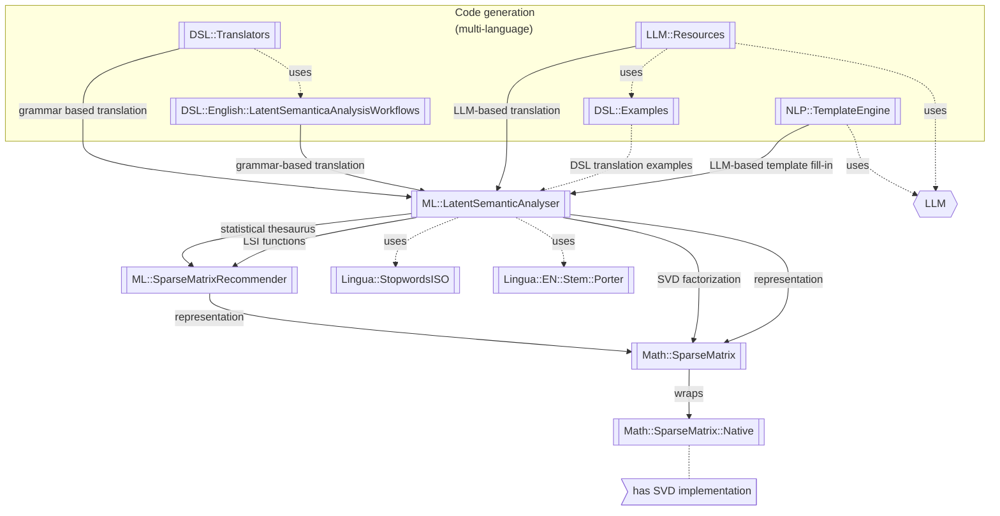

# Latent Semantic Analysis (LSA) package 

## Introduction

This Raku package, ["ML::LatentSemanticAnalyzer"](https://raku.land/zef:antononcube/ML::LatentSemanticAnalyzer), 
has different functions for computations of Latent Semantic Analysis (LSA) workflows
(using Sparse matrix Linear Algebra.) The design and implementation of the package is based on those of Python package, 
["LatentSemanticAnalyser"](https://pypi.org/project/LatentSemanticAnalyzer/), [AAp3]. 
(There are also corresponding implementations in R and Wolfram Language (WL); see [AAp3, AAp1]. The WL one implemented first.) 

Before continuing further with examples of LSA pipelines and code generation of such pipelines, a few important points:

- With this LSA package, Raku is nearly fully equipped for Machine Learning (ML). 
(See the blog post ["Doing Data Science with Raku"](https://raku-advent.blog/2025/12/02/day-2-doing-data-science-with-raku/) for more details.)

- The LSA package was made possible because of the C-implementation of one of the sparse matrix algorithms for Singular Value Decomposition (SVD)
in the Raku "native call" package ["Math::SparseMatrix::Native"](https://raku.land/zef:antononcube/Math::SparseMatrix::Native), [AAp6].

- The package ["Math::SparseMatrix"](https://raku.land/zef:antononcube/Math::SparseMatrix), [AAp6], has an adapter class to "Math::SparseMatrix::Native".

- The package "Math::SparseMatrix" provides matrices with named rows and columns which are especially convenient for implementing LSA and recommender systems based on sparse linear algebra. See [AAv6];  

- Before the implementation of "ML::LatentSemanticAnalyzer" the only streamlined way to LSA with Raku was through Retrieval Augmented Generation (RAG). See [AAp11, AAv5].

----- 

## LSA workflows

The scope of the package is to facilitate the creation and execution of the workflows encompassed in this
flow chart:


For more details see the article 
["A monad for Latent Semantic Analysis workflows"](https://mathematicaforprediction.wordpress.com/2019/09/13/a-monad-for-latent-semantic-analysis-workflows/),
[AA1].

The package provides:
- Class `ML::LatentSemanticAnalyzer`
- Functions for applying Latent Semantic Indexing (LSI) functions on matrix entries
- "Data loader" function for obtaining a dataset of ~580 abstracts of conference presentations

------

## LSA pipeline example

Here is an example of an LSA pipeline that:
1. Ingests a collection of texts
2. Makes the corresponding document-term matrix using stemming and removing stop words
3. Extracts 40 topics
4. Shows a table with the extracted topics
5. Shows a table with statistical thesaurus entries for selected words  

```raku
use ML::LatentSemanticAnalyzer;
use ML::LatentSemanticAnalyzer::Utilities;
use Lingua::EN::Stem::Porter;

# Collection of texts
my @dsAbstracts = ML::LatentSemanticAnalyzer::Utilities::get-abstracts-dataset();
my %docs = @dsAbstracts.map(*<ID>) Z=> @dsAbstracts.map(*<Abstract>);
say %docs.elems;

# Remove non-strings
my %docs2 = %docs.grep({ $_.value ~~ Str:D });
say %docs2.elems;

# Stemmer function (to preprocess words in the pipeline below)
say &porter.WHY;

# Words to show statistical thesaurus entries for
my @words = <notebook computational function neural talk programming>;

# Reproducible results (just within a session)
srand(12);

# LSA pipeline
my $lsaObj =
        ML::LatentSemanticAnalyzer.new
        .make-document-term-matrix(docs => %docs2, :stop-words, :stemming-rules, :3min-length)
        .apply-term-weight-functions( 
                global-weight-func => "IDF",
                local-weight-func => "None",
                normalizer-func => "Cosine")
        .extract-topics(:40number-of-topics, :10min-number-of-documents-per-term, method => "SVD")
        .echo-topics-interpretation(:12number-of-terms, :!wide-form)
        .echo-statistical-thesaurus(
                terms => @words.map(*.&porter),
                :wide-form,
                :12number-of-nearest-neighbors,
                method => "cosine",
                :echo)
```

------

## Related Raku packages

This package is based on the Raku package 
["Math::SparseMatrix"](https://raku.land/zef:antononcube/Math::SparseMatrix), [AAp5]

The package 
["ML::SparseMatrixRecommender"](https://raku.land/zef:antononcube/ML::SparseMatrixRecommender), [AAp7],
also uses LSI functions -- this package uses LSI methods of the class `ML::SparseMatrixRecommender`.
The statistical thesaurus derivation with the method "cosine-distance" use `ML::SparseMatrixRecommender` recommender.

Several packages can be used to generate LSA workflow code (not just Raku, but other programming languages too) --
see the section "Code generation with natural language commands" below. 

The following diagram summarizes the relationship between "ML::LatentSemanticAnalysis" and other Raku packages: 



------

## Related Mathematica, Python, and R packages

### Mathematica

The Raku pipeline above corresponds to the following pipeline for the Mathematica package
[AAp1]:

```wl
lsaObj =
  LSAMonUnit[aAbstracts]⟹
   LSAMonMakeDocumentTermMatrix["StemmingRules" -> Automatic, "StopWords" -> Automatic]⟹
   LSAMonEchoDocumentTermMatrixStatistics["LogBase" -> 10]⟹
   LSAMonApplyTermWeightFunctions["IDF", "None", "Cosine"]⟹
   LSAMonExtractTopics["NumberOfTopics" -> 20, Method -> "NNMF", "MaxSteps" -> 16, "MinNumberOfDocumentsPerTerm" -> 20]⟹
   LSAMonEchoTopicsTable["NumberOfTerms" -> 10]⟹
   LSAMonEchoStatisticalThesaurus["Words" -> Map[WordData[#, "PorterStem"]&, {"notebook", "computational", "function", "neural", "talk", "programming"}]];
```

### Python

Here is a corresponding Python pipeline with the package [AAp3]:

```python
lsaObj = (LatentSemanticAnalyzer()
          .make_document_term_matrix(docs=docs2,
                                     stop_words=True,
                                     stemming_rules=True,
                                     min_length=3)
          .apply_term_weight_functions(global_weight_func="IDF",
                                       local_weight_func="None",
                                       normalizer_func="Cosine")
          .extract_topics(number_of_topics=40, min_number_of_documents_per_term=10, method="NNMF")
          .echo_topics_interpretation(number_of_terms=12, wide_form=True)
          .echo_statistical_thesaurus(terms=stemmerObj.stemWords(words),
                                      wide_form=True,
                                      number_of_nearest_neighbors=12,
                                      method="cosine",
                                      echo_function=lambda x: print(x.to_string())))
```

### R 

The package 
[`LSAMon-R`](https://github.com/antononcube/R-packages/tree/master/LSAMon-R), 
[AAp2], implements a software monad for LSA workflows. 

------

## LSA packages comparison project

The project "Random mandalas deconstruction with R, Python, and Mathematica", [AAr1, AA2],
has documents, diagrams, and (code) notebooks for comparison of LSA application to a collection of images
(in multiple programming languages.)

A big part of the motivation to make the Python package 
["RandomMandala"](https://pypi.org/project/RandomMandala), [AAp4], 
was to make easier the LSA package comparison. 
Mathematica and R have fairly streamlined connections to Python, hence it is easier
to propagate (image) data generated in Python into those systems. 

------

## Code generation with natural language commands

### Using grammar-based interpreters

The project "Raku for Prediction", [AAr2, AAv2, AAp9], has a Domain Specific Language (DSL) grammar and interpreters 
that allow the generation of LSA code for corresponding Mathematica, Python, R, and Raku packages. 

Here is Command Line Interface (CLI) invocation example that generate code for this package:

```shell
dsl-translation -t=Raku 'create from aDocs; apply LSI functions IDF, None, Cosine; extract 20 topics; show topics table'
```
```
# ML::LatentSemanticAnalyzer.new(aDocs)
# .apply-term-weight-functions(global-weight-func => "IDF", local-weight-func => "None", normalizer-func => "Cosine")
# .extract-topics(number-of-topics => 20)
# .echo-topics-table( )
```

### NLP Template Engine

Here is an example using the NLP Template Engine, [AAr2, AAv3, AAp10]:

```raku
use ML::NLPTemplateEngine;
concretize('create from aDocs; apply LSI functions IDF, None, Cosine; extract 20 topics; show topics table; thesaurus for bell and ringer.', lang => "Raku")
```
```
# my $lsaObj = ML::LatentSemanticAnalyzer.new
# .make-document-term-matrix(docs=>aDocs,
#                            stop-words=>Whatever,
#                            stemming-rules=>Whatever,
#                            min-length=>3)
# .apply-term-weight-functions(global-weight-func=>"IDF",
# 						   local-weight-func=>"None",
# 						   normalizer-func=>"Cosine")
# .extract-topics(number-of-topics=>20, min-number-of-documents-per-term=>20, method=>"LSI", max-steps=>16)
# .echo-topics-interpretation(number-of-terms=>10, wide-form=>True)
# .echo-statistical-thesaurus(terms=>["bell", "ringer"],
# 						  wide-form=>True,
# 						  number-of-nearest-neighbors=>12,
# 						  method=>"cosine",
# 						  echo-function=>&put)
```

**Remark:** For more LSA-code generation examples see the Jupyter notebook ["Code-generation.ipynb"](./docs/Code-generation.ipynb).  

------

## References

### Articles

[AA1] Anton Antonov,
["A monad for Latent Semantic Analysis workflows"](https://mathematicaforprediction.wordpress.com/2019/09/13/a-monad-for-latent-semantic-analysis-workflows/),
(2019),
[MathematicaForPrediction at WordPress](https://mathematicaforprediction.wordpress.com).

[AA2] Anton Antonov,
["Random mandalas deconstruction in R, Python, and Mathematica"](https://mathematicaforprediction.wordpress.com/2022/03/01/random-mandala-deconstruction-in-r-python-and-mathematica/),
(2022),
[MathematicaForPrediction at WordPress](https://mathematicaforprediction.wordpress.com).

[AA3] Anton Antonov
["Day 2 – Doing Data Science with Raku"](https://raku-advent.blog/2025/12/02/day-2-doing-data-science-with-raku/),
(2025),
[Raku Advent Calendar at WordPress](https://raku-advent.blog).

### Python, R, and Wolfram Language packages 

[AAp1] Anton Antonov, 
[Monadic Latent Semantic Analysis Mathematica package](https://github.com/antononcube/MathematicaForPrediction/blob/master/MonadicProgramming/MonadicLatentSemanticAnalysis.m),
(2017),
[MathematicaForPrediction at GitHub](https://github.com/antononcube/MathematicaForPrediction).

[AAp2] Anton Antonov,
[Latent Semantic Analysis Monad in R](https://github.com/antononcube/R-packages/tree/master/LSAMon-R)
(2019),
[R-packages at GitHub/antononcube](https://github.com/antononcube/R-packages).

[AAp3] Anton Antonov,
[LatentSemanticAnalyzer, Python package](https://pypi.org/project/LatentSemanticAnalyzer/),
(2021-2026),
[PyPI](https://pypi.org).

[AAp4] Anton Antonov,
[RandomMandala, Python package](https://pypi.org/project/RandomMandala),
(2021),
[PyPI](https://pypi.org).


### Raku packages

[AAp5] Anton Antonov,
[Math::SparseMatrix, Raku package](https://github.com/antononcube/Raku-Math-SparseMatrix),
(2024-2026),
[GitHub/antononcube](https://github.com/antononcube).

[AAp6] Anton Antonov,
[Math::SparseMatrix::Native, Raku package](https://github.com/antononcube/Raku-Math-SparseMatrix-Native),
(2024-2026),
[GitHub/antononcube](https://github.com/antononcube).

[AAp7] Anton Antonov,
[ML::SparseMatrixRecommender, Raku package](https://github.com/antononcube/Raku-ML-LatentSemanticAnalyzer),
(2025),
[GitHub/antononcube](https://github.com/antononcube).

[AAp8] Anton Antonov,
[Data::Generators, Raku package](https://raku.land/zef:antononcube/Data::Generators),
(2021-2025),
[GitHub/antononcube](https://github.com/antononcube).

[AAp9] Anton Antonov,
[DSL::English::LatentSemanticAnalysisWorkflows, Raku package](https://github.com/antononcube/Raku-DSL-English-LatentSemanticAnalysisWorkflows),
(2020-2024),
[GitHub/antononcube](https://github.com/antononcube).

[AAp10] Anton Antonov,
[ML::NLPTemplateEngine, Raku package](https://github.com/antononcube/Raku-ML-NLPTemplateEngine),
(2023-2025),
[GitHub/antononcube](https://github.com/antononcube).

[AAp11] Anton Antonov,
[LLM::RetrievalAugmentedGeneration, Raku package](https://github.com/antononcube/Raku-LLM-RetrievalAugmentedGeneration),
(2024-2025),
[GitHub/antononcube](https://github.com/antononcube).

### Repositories

[AAr1] Anton Antonov,
["Random mandalas deconstruction with R, Python, and Mathematica" presentation project](https://github.com/antononcube/SimplifiedMachineLearningWorkflows-book/tree/master/Presentations/Greater-Boston-useR-Group-Meetup-2022/RandomMandalasDeconstruction),
(2022)
[SimplifiedMachineLearningWorkflows-book at GitHub/antononcube](https://github.com/antononcube/SimplifiedMachineLearningWorkflows-book).

[AAr2] Anton Antonov,
["Raku for Prediction" book project](https://github.com/antononcube/RakuForPrediction-book),
(2021-2022),
[GitHub/antononcube](https://github.com/antononcube).


### Videos

[AAv1] Anton Antonov,
["TRC 2022 Implementation of ML algorithms in Raku"](https://www.youtube.com/watch?v=efRHfjYebs4),
(2022),
[Anton A. Antonov's channel at YouTube](https://www.youtube.com/channel/UC5qMPIsJeztfARXWdIw3Xzw).

[AAv2] Anton Antonov,
["Raku for Prediction"](https://www.youtube.com/watch?v=frpCBjbQtnA),
(2021),
[The Raku Conference (TRC) at YouTube](https://www.youtube.com/channel/UCnKoF-TknjGtFIpU3Bc_jUA).

[AAv3] Anton Antonov,
["NLP Template Engine, Part 1"](https://www.youtube.com/watch?v=a6PvmZnvF9I),
(2021),
[Anton A. Antonov's channel at YouTube](https://www.youtube.com/channel/UC5qMPIsJeztfARXWdIw3Xzw).

[AAv4] Anton Antonov
["Random Mandalas Deconstruction in R, Python, and Mathematica (Greater Boston useR Meetup, Feb 2022)"](https://www.youtube.com/watch?v=nKlcts5aGwY),
(2022),
[Anton A. Antonov's channel at YouTube](https://www.youtube.com/channel/UC5qMPIsJeztfARXWdIw3Xzw).

[AAv5] Anton Antonov,
["Raku RAG demo"](https://www.youtube.com/watch?v=kQo3wpiUu6w),
(2024),
[Anton A. Antonov's channel at YouTube](https://www.youtube.com/channel/UC5qMPIsJeztfARXWdIw3Xzw).

[AAv6] Anton Antonov,
["Sparse matrix neat examples in Raku"](https://www.youtube.com/watch?v=JHO2Wk1b-Og),
(2024),
[Anton A. Antonov's channel at YouTube](https://www.youtube.com/channel/UC5qMPIsJeztfARXWdIw3Xzw).