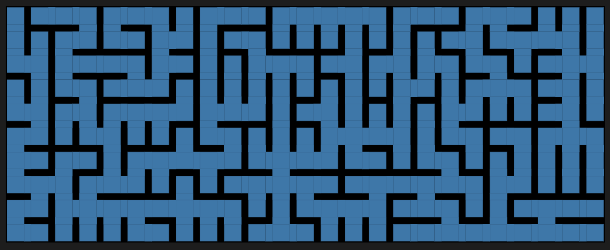
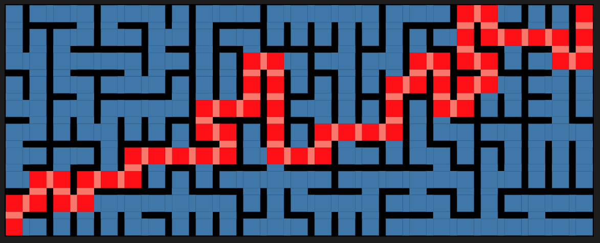
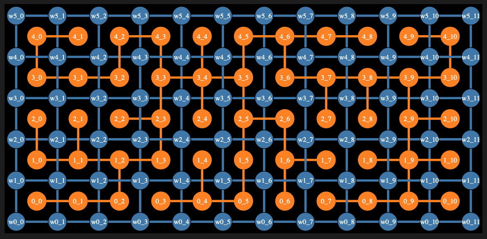
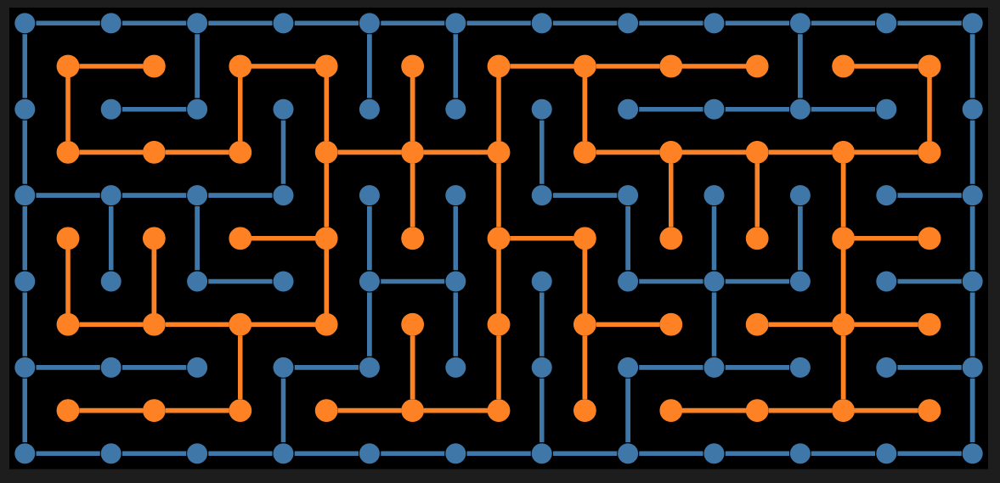
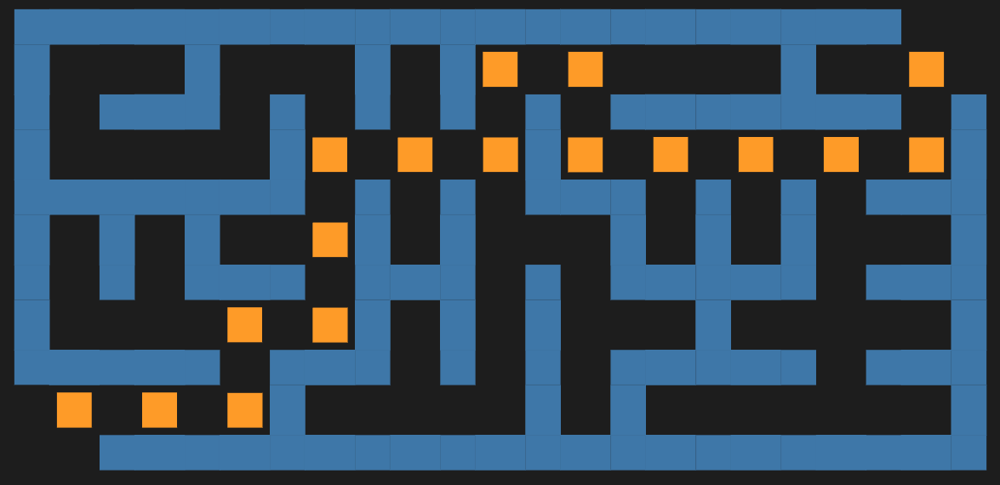
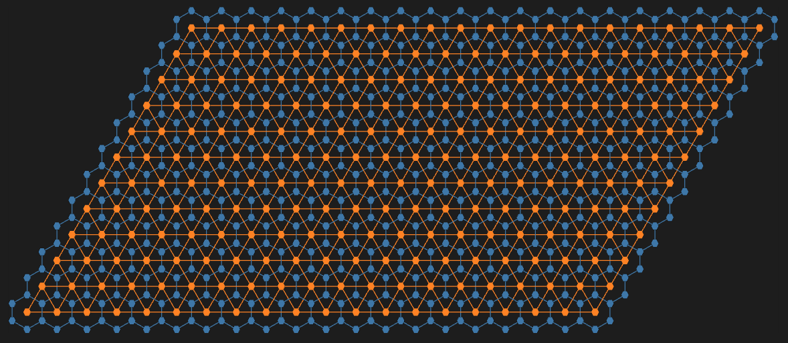
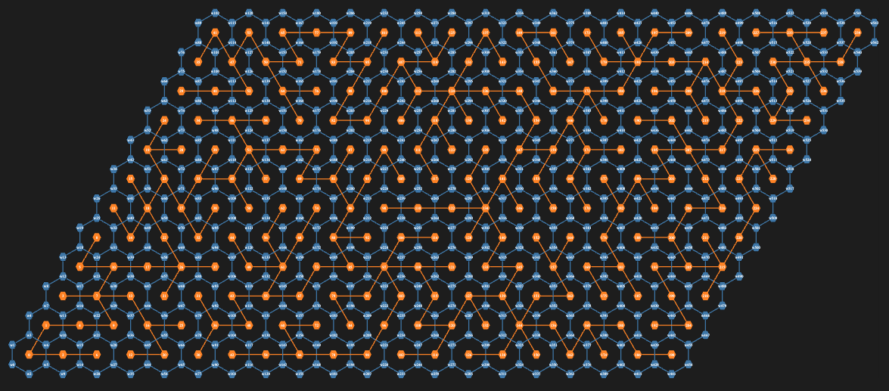
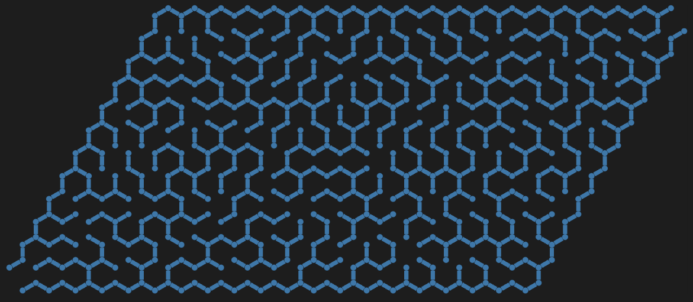

# Maze Making Using Graphs

Anton Antonov  
[RakuForPrediction at WordPress](https://rakuforprediction.wordpress.com)  
[RakuForPrediction-book at GitHub](https://github.com/antononcube/RakuForPrediction-book)  
November 2024  
December 2025

---

## Introduction

This document ([notebook](https://github.com/antononcube/RakuForPrediction-blog/blob/main/Notebooks/Jupyter/Maze-making-using-graphs.ipynb)) describes three ways of making mazes (or labyrinths) using graphs. The first two are based on rectangular grids; the third on a hexagonal grid.

All computational graph features discussed here are provided by ["Graph"](https://raku.land/zef:antononcube/Graph), [AAp1]. The package used for the construction of the third, hexagonal graph is ["Math::Nearest"](https://raku.land/zef:antononcube/Math::Nearest), [AAp2].

### TL;DR

Just see the maze pictures below. (And try to solve the mazes.)

### Procedure outline

The first maze is made by a simple procedure which is actually some sort of cheating:

- A regular rectangular grid graph is generated with random weights associated with its edges.
- The (minimum) spanning tree for that graph is found.
- That tree is plotted with exaggeratedly large vertices and edges, so the graph plot looks like a maze.
    - This is "the cheat" — the maze walls are not given by the graph.

The second maze is made "properly":

- Two interlacing regular rectangular grid graphs are created.
- The second one has one less row and one less column than the first.
- The vertex coordinates of the second graph are at the centers of the rectangles of the first graph.
- The first graph provides the maze walls; the second graph is used to make paths through the maze.
    - In other words, to create a solvable maze.
- Again, random weights are assigned to edges of the second graph, and a minimum spanning tree is found.
- There is a convenient formula that allows using the spanning tree edges to remove edges from the first graph.
- In that way, a proper maze is derived.

The third maze is again made "properly" using the procedure above with two modifications:

- Two interlacing regular grid graphs are created: one over a hexagonal grid, the other over a triangular grid.
    - The hexagonal grid graph provides the maze walls; the triangular grid graph provides the maze paths.
- Since the formula for wall removal is hard to derive, a more robust and universal method based on nearest neighbors is used.

---


## Setup

### Packages

Here are the packages loaded for use in the rest of the notebook:


```raku
use Graph;
use Graph::Classes;

use Math::DistanceFunctions;
use Math::Nearest;

use Data::TypeSystem;
use Data::Translators;
```

### Conversion

This sub is used to invoke the Graphviz graph layout engines:


```raku
sub dot-svg($input, Str:D :$engine = 'dot', Str:D :$format = 'svg') {
    my $temp-file = $*TMPDIR.child("temp-graph.dot");
    $temp-file.spurt: $input;
    my $svg-output = run($engine, $temp-file, "-T$format", :out).out.slurp-rest;
    unlink $temp-file;
    return $svg-output;
}
```


    &dot-svg


----

## Simple Maze

In this section, we create a simple, "cheating" maze.

**Remark:** The steps are easy to follow, given the procedure outlined in the introduction.


```raku
# Maze dimensions
my ($n, $m) = (10, 25);

# Base grid graph
my $g = Graph::Grid.new($n, $m, :!directed);

# Using the edges of the grid graph make a new graph assigned random edge weights
my $gWeighted = Graph.new($g.edges(:dataset).map({ $_<weight> = random-real([10,1000]); $_}))
```


    Graph(vertexes => 250, edges => 465, directed => False)


Find the spanning tree of the graph:


```raku
my $mazePath = $gWeighted.find-spanning-tree
```


    Graph(vertexes => 250, edges => 249, directed => False)


Shortest path from the first vertex (bottom-left) to the last vertex (top-right):


```raku
my @path = $mazePath.find-shortest-path('0_0', "{$n-1}_{$m-1}");
@path.elems
```


    56


Graph plot:


```raku
#% html
my $simpleMaze = Graph.new($mazePath.edges);
$simpleMaze.vertex-coordinates = $g.vertex-coordinates;

my %opts =
    background => "Black",
    :!node-labels,
    :!edge-lables,
    node-shape => 'square', 
    node-width => 0.7, 
    node-color => 'SteelBlue',
    node-fill-color => 'SteelBlue',
    edge-thickness => 52, 
    edge-color => 'SteelBlue',
    size => '10,6!',
    engine => 'neato';

$simpleMaze.dot(|%opts):svg
```



The "maze" above looks like a maze because the vertices and edges are rectangular with matching sizes, and they are thicker than the spaces between them. In other words, we are cheating.

To make that cheating construction clearer, let us plot the shortest path from the bottom left to the top right and color the edges in pink (salmon) and the vertices in red:


```raku
#%html
my $gPath = Graph::Path.new(@path);
$simpleMaze.dot(highlight => {Salmon => $gPath.edge-list, Red => $gPath.vertex-list}, |%opts):svg
```



----

## Proper Maze

A ***proper maze*** is a maze given with its walls (not with the space between walls).

**Remark:** For didactical reasons, the maze in this section is small so that the steps—outlined in the introduction—can be easily followed.

Make two regular graphs: one for the maze walls and the other for the maze paths.


```raku
# Maze dimensions
my ($n, $m) = (6, 12) »*» 1;

# Walls graph
my $g1 = Graph::Grid.new($n, $m, prefix => 'w');

# Space graph
my $g2 = Graph::Grid.new($n-1, $m-1);
$g2.vertex-coordinates = $g2.vertex-coordinates.map({ $_.key => $_.value >>+>> 0.5 }).Hash;

$g2
```


    Graph(vertexes => 55, edges => 94, directed => False)


Maze Path Graph:


```raku
my $mazePath = Graph.new($g2.edges(:dataset).map({ $_<weight> = random-real([10,1000]); $_}));
$mazePath = $mazePath.find-spanning-tree;
$mazePath.vertex-coordinates = $g2.vertex-coordinates;

$mazePath
```


    Graph(vertexes => 55, edges => 54, directed => False)


Combined Graph:


```raku
my $g3 = Graph.new([|$g1.edges, |$mazePath.edges]);
$g3.vertex-coordinates = [|$g1.vertex-coordinates, |$mazePath.vertex-coordinates].Hash;

$g3
```


    Graph(vertexes => 127, edges => 180, directed => False)


Plot the combined graph:


```raku
#% html
$g3.dot(
    highlight => $mazePath,
    :node-labels,
    background => "Black",
    node-width => 0.45,
    node-height => 0.2,
    edge-width => 4,
    size => '10,10!',
    engine => 'neato'
):svg
```



Remove wall edges using a formula:


```raku
my $g4 = $g3.clone;
for $mazePath.edges -> $e {

    my ($i, $j) = |$e.key.split('_')».Int;
    my ($i2, $j2) = |$e.value.split('_')».Int;
    
    if $i2 < $i || $j2 < $j { 
        ($i2, $j2, $i, $j) = ($i, $j, $i2, $j2)
    }

    # Horizontal
    if $i == $i2 && $j < $j2 {
        $g4 = $g4.edge-delete( "w{$i2}_{$j2}" => "w{$i2+1}_{$j2}")
    }

    # Vertical
    if $j == $j2 && $i < $i2 {
        $g4 = $g4.edge-delete( "w{$i2}_{$j2}" => "w{$i2}_{$j2+1}")
    }
}

$g4
```


    Graph(vertexes => 127, edges => 126, directed => False)


Plot wall graph and maze space graph:


```raku
#% html
$g4.dot(
    highlight => $mazePath,
    :!node-labels,
    background => "Black",
    node-width => 0.25,
    node-height => 0.2,
    edge-width => 4,
    size => '10,10!',
    engine => 'neato'
):svg
```



Fancier maze presentation with rectangular vertices and edges (with matching sizes):


```raku
#% html
my $g5 = $g4.subgraph($g1.vertex-list);

my @path = $mazePath.find-shortest-path('0_0', "{$n-2}_{$m-2}");
say @path.elems;

my @mazeStartEnd = "w0_0", w0_0 => "w0_1", w0_0 => "w1_0", "w{$n-1}_{$m-1}", "w{$n-1}_{$m-1}" => "w{$n-1}_{$m-2}", "w{$n-1}_{$m-1}" => "w{$n-2}_{$m-1}";

$g4.dot(
    highlight => {'#1F1F1F' => [|$mazePath.vertex-list, |$mazePath.edge-list, |@mazeStartEnd], Orange => @path},
    #highlight => {'#1F1F1F' => @mazeStartEnd},
    background => '#1F1F1F',
    size => '10,10!',
    :!node-labels,
    node-shape => 'square',
    node-color => 'SteelBlue',
    node-fill-color => 'SteelBlue',
    node-width => 0.4,
    edge-width => 30,
    engine => 'neato'
):svg
```



---

## Hexagonal Version

Let us create another maze based on a hexagonal grid. Here are two grid graphs:

- The first is a **hexagonal grid** graph representing the maze's walls.
- The second graph is a **triangular grid** graph with one fewer row and column, and shifted vertex coordinates.


```raku
# Maze dimensions
my ($n, $m) = (6, 10) »*» 2;

# Walls graph
my $g1 = Graph::HexagonalGrid.new($n, $m, prefix => 'w');

# Space graph
my $g2 = Graph::TriangularGrid.new($n-1, $m-1);
$g2.vertex-coordinates = $g2.vertex-coordinates.map({ $_.key => $_.value >>+<< [sqrt(3), 1 ] }).Hash;

$g2
```


    Graph(vertexes => 240, edges => 657, directed => False)


```raku
#% html
$g1.union($g2).dot(
    highlight => $g2,
    :!node-labels,
    background => "#1F1F1F",
    node-width => 0.85,
    node-height => 0.85,
    node-font-size => 28,
    node-shape => 'hexagon',
    edge-width => 7,
    size => '10,10!',
    engine => 'neato'
):svg
```



Maze Path Graph:


```raku
my $mazePath = Graph.new($g2.edges(:dataset).map({ $_<weight> = random-real([10,1000]); $_}));
$mazePath = $mazePath.find-spanning-tree;
$mazePath = Graph.new($mazePath.edges);
$mazePath.vertex-coordinates = $g2.vertex-coordinates;

$mazePath
```


    Graph(vertexes => 240, edges => 239, directed => False)


Combine the walls-maze and the maze-path graphs (i.e., make a union of them), and plot the resulting graph:


```raku
#% html

my $g3 = $g1.union($mazePath);

$g3.dot(
    highlight => $mazePath,
    :node-labels,
    background => "#1F1F1F",
    node-width => 0.85,
    node-height => 0.85,
    node-font-size => 28,
    node-shape => 'hexagon',
    edge-width => 7,
    size => '10,10!',
    engine => 'neato'
):svg
```



Make a nearest neighbor points finder functor:


```raku
my &finder = nearest($g1.vertex-coordinates.Array, method => 'KDTree');

```


    Math::Nearest::Finder(Algorithm::KDimensionalTree(points => 544, distance-function => &euclidean-distance, labels => 544))


Take a maze edge and its vertex points:


```raku
my $e = $mazePath.edges.head;
my @points = $g2.vertex-coordinates{($e.kv)};
```


    [[-3.4641016151381225 -2] [-1.7320508075691228 1]]


Find the edge's midpoint and the nearest wall-graph vertices:


```raku
my @m = |((@points.head <<+>> @points.tail) >>/>> 2);
say "Mean edge point: {@m}";
my @vs = |&finder.nearest(@m, 2, prop => <label>).flat;
say "To remove: {@vs}";
```

    Mean edge point: -2.5980762113536224 -0.5
    To remove: w3 w6


Loop over all maze edges, removing wall-maze edges:


```raku
my $g4 = $g1.clone;
for $mazePath.edges -> $e {
    my @points = $g2.vertex-coordinates{($e.kv)};
    my @m = |((@points.head <<+>> @points.tail) >>/>> 2);
    my @vs = |&finder.nearest(@m, 2, prop => <label>).flat;
    $g4 = $g4.edge-delete(@vs.head => @vs.tail);
}

$g4
```


    Graph(vertexes => 544, edges => 544, directed => False)


The start and end points of the maze:


```raku
my ($start, $end) = $g4.vertex-list.head, $g4.vertex-list.sort({ $_.substr(1).Int }).tail;
```


    (w0 w543)


Finding the Maze Solution:


```raku
my $solution = Graph::Path.new: $mazePath.find-shortest-path(|$mazePath.vertex-list.sort(*.Int)[0,*-1]);
$solution.vertex-coordinates = $mazePath.vertex-coordinates.grep({$_.key ∈ $solution.vertex-list }).Hash;

$solution
```


    Graph(vertexes => 50, edges => 49, directed => False)


Plot the maze:


```raku
#% html

my @mazeStartEnd = $start, $end, |$g4.neighborhood-graph([$start, $end]).edges;

my $g5 = $g4.union($solution);

my %opts = 
    :!node-labels,
    background => "#1F1F1F",
    node-width => 0.8,
    node-height => 0.8,
    node-shape => 'circle',
    edge-width => 40,
    size => '10,10!',
    engine => 'neato';

$g4.dot(highlight => {'#1F1F1F' => @mazeStartEnd}, |%opts):svg
```



([Here is the solution of the maze](./Diagrams/Maze-making-using-graphs/Hexagonal-grid-maze-4.png)).  

----

## Additional Comments

- The initial (and unfinished) version of this document was created 13 months ago.

    - Its completion was postponed because the blog post ["Day 12 – Graphs in Raku"](https://raku-advent.blog/2024/12/12/day-12-graphs-in-raku/), [AA1], featured many of the graph operations in "Graph", [AAp1]. 

        - (Well, until this Raku Advent effort...)

- The document demonstrates how feature-rich the package "Graph" is.

- Here are the special graph functionalities used to create the mazes:

    - Construction of [regular grid graphs](https://mathworld.wolfram.com/GridGraph.html)
    - Construction of [hexagonal grid graphs](https://mathworld.wolfram.com/HexagonalGridGraph.html)
    - Construction of [triangular grid graphs](https://mathworld.wolfram.com/TriangularGridGraph.html)
    - [Subgraph](https://mathworld.wolfram.com/Subgraph.html) extraction
    - [Neighborhood graphs](https://mathworld.wolfram.com/NeighborhoodGraph.html)
    - [Graph difference](https://mathworld.wolfram.com/GraphDifference.html)
    - Edge deletion
    - Graph plotting via Graphviz DOT using:
        - Customized styling of various elements
        - Vertex coordinates
        - Specified vertex labels (see the top of the tree)
    - Graph highlighting
        - Multiple sets of vertices and edges with different colors can be specified

----

## References

### Articles, Blog Posts

[AA1] Anton Antonov, [“Day 12 – Graphs in Raku”](https://raku-advent.blog/2024/12/12/day-12-graphs-in-raku/), (2024), [Raku Advent Calendar at WordPress](https://raku-advent.blog/).

### Packages

[AAp1] Anton Antonov, [Graph, Raku package](https://github.com/antononcube/Raku-Graph), (2024–2025), [GitHub/antononcube](https://github.com/antononcube).

[AAp2] Anton Antonov, [Math::Nearest, Raku package](https://github.com/antononcube/Raku-Math-Nearest), (2024), [GitHub/antononcube](https://github.com/antononcube).

### Videos

[AAv1] Anton Antonov, ["Graphs" videos playlist](https://www.youtube.com/playlist?list=PLke9UbqjOSOiMnn8kNg6pb3TFWDsqjNTN),(2024-2025), [YouTube/@AAA4prediction](https://www.youtube.com/@AAA4prediction).
