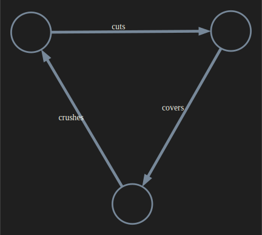
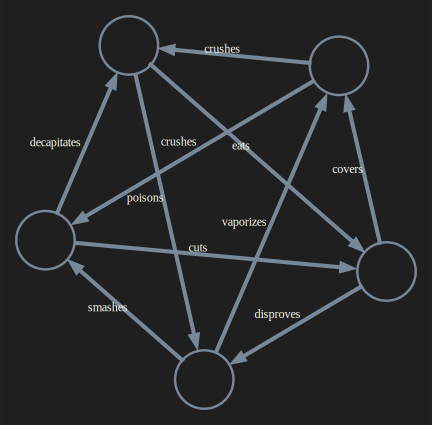
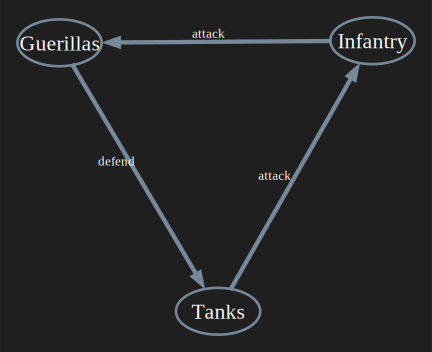
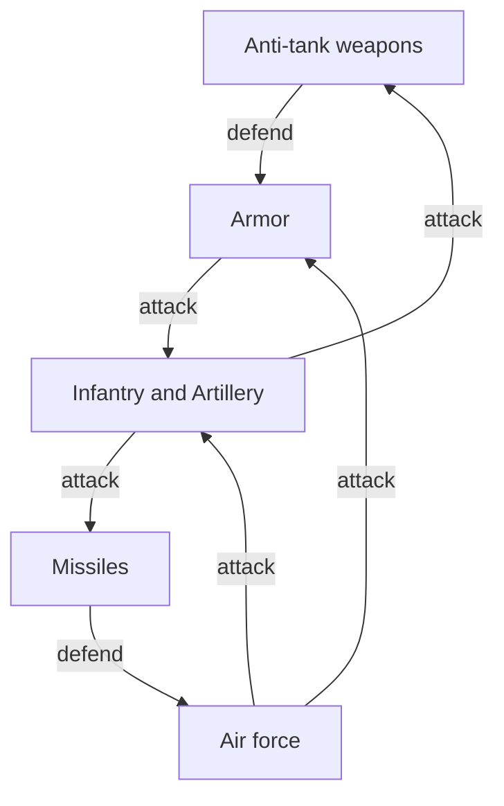
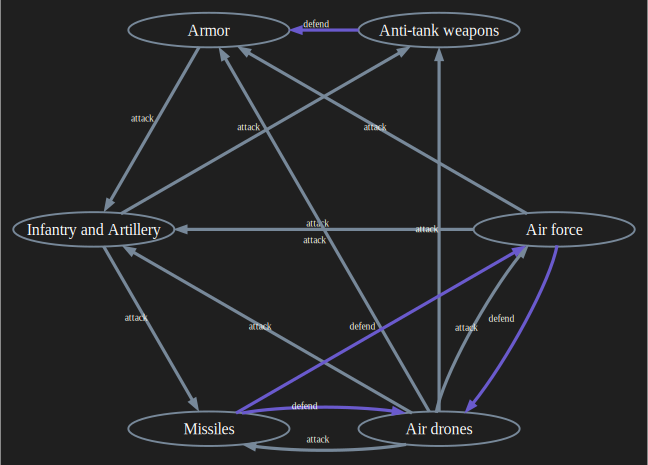
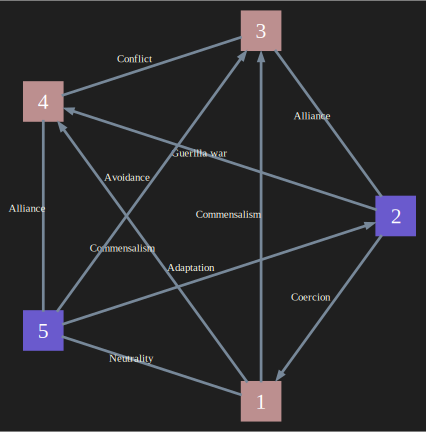

# Military forces interactions graphs

Anton Antonov   
[RakuForPrediction at WordPress](https://rakuforprediction.wordpress.com)   
March 2025

------

## Introduction

Interesting analogies of [Rock-Paper-Scissors](https://en.wikipedia.org/wiki/Rock_paper_scissors) (RPS) hand games can be made with military forces interactions; see [AAv1]. Those analogies are easily seen using graphs. For example, the extension of the graph of Rock-Paper-Scissors-Lizard-Spock into the graph "Chuck Norris defeats all" is analogous to the extension of "older" (say, WWII) military forces interactions graphs with drones.


Here is the graph of *Rock-Paper-Scissors-Lizard-Spock-ChuckNorris*:


In this document (notebook), we use Raku to create graphs that show how military forces interact. We apply the know-how for making graphs for RPS-games detailed in the blog post "Rock-Paper-Scissors extensions", [AA1].


------

## Setup

*The setup is the same as in [AA1] ([notebook](https://github.com/antononcube/RakuForPrediction-blog/blob/main/Notebooks/Jupyter/Rock-Paper-Scissors-extensions.ipynb)).*

This notebook is a Raku-chatbook, hence, its Jupyter session pre-loads certain packages and LLM-personas.


```raku
# Preloaded in any chatbook
# use LLM::Functions;
# use LLM::Prompts;

# Preloaded in a user init file
# use Graph;

# For this concrete session
use Text::Emoji;
```

LLM configurations:


```raku
my $conf4o = llm-configuration('chat-gpt', model => 'gpt-4o', :4096max-tokens, temperature => 0.4);
my $conf4o-mini = llm-configuration('chat-gpt', model => 'gpt-4o-mini', :4096max-tokens, temperature => 0.4);

($conf4o, $conf4o-mini)».Hash».elems
```


    (24 24)


```raku
my $background = '#1F1F1F';
my $engine = 'neato';

my %opts =
    :$background,     
    :6graph-size, 
    :1edge-width,
    :3edge-font-size,
    edge-color => 'LightSlateGray',
    node-width => 0.2, node-height => 0.2, 
    node-shape => 'circle', 
    :node-labels, 
    :8node-font-size,
    node-fill-color => '#1F1F1F',
    node-color => 'LightSlateGray',
    node-stroke-width => 0.6,
    arrow-size => 0.25,
    :$engine;

my %opts-plain = merge-hash(%opts, {:5node-font-size, node-shape => 'ellipse', node-width => 0.27, node-height => 0.15});

(%opts, %opts-plain)».elems
```


    (15 15)


### Additional


```raku
sub game-table(Graph:D $g, Str:D :$link-value = '+', Str:D :$missing-value = '-') {
    cross-tabulate($g.edges(:dataset), <from>, <to>)
    ==> -> %h { %h.map({ $_.key => ($g.vertex-list Z=> $_.value{$g.vertex-list}).Hash }).Hash }()
    ==> to-dataset(:$missing-value)
    ==> -> %h { for $g.vertex-list { %h{$_}{$_} = ''}; %h }()
    ==> -> %h { $g.vertex-list.map({ [|%h{$_}, "" => $_].Hash }) }()
    ==> to-html(field-names => ["", |$g.vertex-list])
    ==> { .Str.subst('1', $link-value, :g).subst('(Any)', $missing-value, :g) }()
}
```


    &game-table


-----

## Convenient LLM function

We can define an LLM function that provides the graph edges dataset for different RPS variants. Here is such an LLM function using "LLM::Functions", [AAp1], and "LLM::Prompts", [AAv2]:


```raku
my sub rps-edge-dataset($description, Str:D $game-name = 'Rock-Paper-Scissors', *%args) {
    llm-synthesize([
        "Give the edges the graph for this $game-name variant description",
        'Give the edges as an array of dictionaries. Each dictionary with keys "from", "to", "label",',
        'where "label" has the action of "from" over "to".',
        $description,
        llm-prompt('NothingElse')('JSON')
        ], 
        e => %args<llm-evaluator> // %args<e> // %args<conf> // $conf4o-mini,
        form => sub-parser('JSON'):drop
    )
}
```


    &rps-edge-dataset


**Remark:** We reuse the sub definition  `rps-edge-dataset` from [AA1].

**Remark::** Both "LLM::Functions" and "LLM::Prompts" are pre-loaded in Raku chatbooks.

----

## Rock-Paper-Scissors and its Lizard-Spock extensions

Here is the graph of the standard RPS game and it "Lizard-Spock" extension:


```raku
#% html

# Graph edges: LLM-generated and LLM-translates
my @edges-emo =
    { from => '🪨', to => '✂️',   label => 'crushes' },
    { from => '✂️',  to => '📄',  label => 'cuts' },
    { from => '📄', to => '🪨',  label => 'covers' },
    { from => '🪨', to => '🦎',  label => 'crushes' },
    { from => '🦎', to => '🖖',  label => 'poisons' },
    { from => '🖖', to => '✂️',   label => 'smashes' },
    { from => '✂️',  to => '🦎',  label => 'decapitates' },
    { from => '🦎', to => '📄',  label => 'eats' },
    { from => '📄', to => '🖖',  label => 'disproves' },
    { from => '🖖', to => '🪨',  label => 'vaporizes' }
;

# Edge-label rules
my %edge-labels-emo;
@edges-emo.map({ %edge-labels-emo{$_<from>}{$_<to>} = $_<label> });

# RPS-3 Lizard-Spock extension
my $g-emo = Graph.new(@edges-emo, :directed);

# Standard RPS-3 as a subgraph
my $g-rps = $g-emo.subgraph(<🪨 ✂️ 📄>);

# Plot the graphs together
$g-rps.dot(|%opts, edge-labels => %edge-labels-emo, :svg)
~
$g-emo.dot(|%opts, edge-labels => %edge-labels-emo, :svg)
```




----

## Simple analogy

We consider the following military analogy with RPS:

- Tanks attack (and defeat) Infantry
- Guerillas defend against Tanks
- Infantry attacks Guerillas

Here we obtain the corresponding graph edges using an LLM:


```raku
my $war-game = rps-edge-dataset('tanks attack infantry, guerillas defend against tanks, infantry attacks querillas')
```


    [{from => Tanks, label => attack, to => Infantry} {from => Guerillas, label => defend, to => Tanks} {from => Infantry, label => attack, to => Guerillas}]


Plotting the graphs together:


```raku
#% html
my %edge-labels = Empty; 
for |$war-game -> %r { %edge-labels{%r<from>}{%r<to>} = %r<label> };
Graph.new($war-game, :directed).dot(|%opts-plain, :%edge-labels, :svg)
~
$g-rps.dot(|%opts, edge-labels => %edge-labels-emo, :svg)
```




------

## Military forces interaction

Here is [Mermaid-JS](https://mermaid.js.org) diagram of a more complicated military forces interactions diagram; see [NM1]:



Using diagram's mermaid code here the graph are LLM-generated:


```raku
#% html
my $mmd-descr = q:to/END/;
graph TD
AT[Anti-tank weapons] --> |defend|Arm[Armor]
Arm --> |attack|IA[Infantry and Artillery] 
Air[Air force] --> |attack|Arm
Air --> |attack|IA
M[Missiles] --> |defend|Air
IA --> |attack|M
IA --> |attack|AT
END

my $war-game2 = rps-edge-dataset($mmd-descr);

$war-game2 ==> to-html(field-names => <from label to>)
```

Direct assignment (instead of using LLMs):


```raku
my $war-game2 = $[
    {:from("Anti-tank weapons"), :label("defend"), :to("Armor")}, {:from("Armor"), :label("attack"), :to("Infantry and Artillery")}, 
    {:from("Air force"), :label("attack"), :to("Armor")}, {:from("Air force"), :label("attack"), :to("Infantry and Artillery")}, 
    {:from("Missiles"), :label("defend"), :to("Air force")}, {:from("Infantry and Artillery"), :label("attack"), :to("Missiles")}, 
    {:from("Infantry and Artillery"), :label("attack"), :to("Anti-tank weapons")}
];
```


    [{from => Anti-tank weapons, label => defend, to => Armor} {from => Armor, label => attack, to => Infantry and Artillery} {from => Air force, label => attack, to => Armor} {from => Air force, label => attack, to => Infantry and Artillery} {from => Missiles, label => defend, to => Air force} {from => Infantry and Artillery, label => attack, to => Missiles} {from => Infantry and Artillery, label => attack, to => Anti-tank weapons}]


The diagram does not correspond to modern warfare -- it is taken from doctoral thesis, [NM1], discussing reconstruction of historical military data.
The corresponding graph can be upgraded with drones in a similar way as Chuck-Norris-defeats-all upgrade above.


```raku
my $war-forces = Graph.new($war-game2, :directed); 
my $drone = "Air drones";
my $war-game-d = $war-game2.clone.append( $war-forces.vertex-list.map({ %( from => $drone, to => $_, label => 'attack' ) }) );
$war-game-d .= append( ['Missiles', 'Air force'].map({ %(from => $_, to => $drone, label => 'defend') }) );
my $war-forces-d = Graph.new($war-game-d, :directed);
```


    Graph(vertexes => 6, edges => 14, directed => True)


Here is the corresponding table:


```raku
#% html
game-table($war-forces-d, link-value => '⊙', missing-value => '')
```


<table border="⊙"><thead><tr><th></th><th>Air drones</th><th>Air force</th><th>Anti-tank weapons</th><th>Armor</th><th>Infantry and Artillery</th><th>Missiles</th></tr></thead><tbody><tr><td>Air drones</td><td></td><td>⊙</td><td>⊙</td><td>⊙</td><td>⊙</td><td>⊙</td></tr><tr><td>Air force</td><td>⊙</td><td></td><td></td><td>⊙</td><td>⊙</td><td></td></tr><tr><td>Anti-tank weapons</td><td></td><td></td><td></td><td>⊙</td><td></td><td></td></tr><tr><td>Armor</td><td></td><td></td><td></td><td></td><td>⊙</td><td></td></tr><tr><td>Infantry and Artillery</td><td></td><td></td><td>⊙</td><td></td><td></td><td>⊙</td></tr><tr><td>Missiles</td><td>⊙</td><td>⊙</td><td></td><td></td><td></td><td></td></tr></tbody></table>


Here is the graph with different coloring for "attack" edges (gray) and "defend" edges (blue):


```raku
#% html
$war-forces-d.vertex-coordinates = ($war-forces-d.vertex-list Z=> Graph::Cycle($war-forces-d.vertex-count).vertex-coordinates{^$war-forces-d.vertex-count}.values).Hash;

my %edge-labels;
$war-game-d.map({ %edge-labels{$_<from>}{$_<to>} = $_<label> });

my %highlight = 
    'SlateBlue' => Graph.new( $war-game-d.grep(*<label> eq 'defend'), :directed).edges;

$war-forces-d.dot(
    :%highlight,
    |merge-hash(%opts-plain, {:9graph-size, node-width => 0.7}),
    :%edge-labels, 
    :svg
)
```




**Remark:** The graph above is just an example -- real-life military forces interactions are more complicated.

-------

## Generalized antagonism

Following the article ["The General Lanchester Model Defining Multilateral Conflicts"](https://www.researchgate.net/publication/356424971_Obobsennaa_model_Lancestera_formalizuusaa_konflikt_neskolkih_storon_The_General_Lanchester_Model_Defining_Multilateral_Conflicts), [SM1], we can make a graph for multiple conflicts (narrated exposition is given in the presentation ["Upgrading Epidemiological Models into War Models"](https://www.youtube.com/watch?v=852vMS_6Qaw), [AAv1]):


```raku
#% html

# Graph edges
my @multi-conflict-edges = 
    %(from=>1, to=>5, label=>'Neutrality',   :!directed), %(from=>1, to=>3, label=>'Commensalism', :directed),
    %(from=>1, to=>4, label=>'Commensalism', :directed),  %(from=>2, to=>1, label=>'Coercion',     :directed),
    %(from=>2, to=>3, label=>'Alliance',     :!directed), %(from=>2, to=>4, label=>'Guerilla war', :directed),
    %(from=>3, to=>4, label=>'Conflict',     :!directed), %(from=>5, to=>3, label=>'Avoidance',    :directed),
    %(from=>5, to=>4, label=>'Alliance',     :!directed), %(from=>5, to=>2, label=>'Adaptation',   :directed);

@multi-conflict-edges .= deepmap({ $_ ~~ Bool:D ?? $_ !! $_.Str });

# Edg-label rules
my %edge-labels;
@multi-conflict-edges.map({ %edge-labels{$_<from>}{$_<to>} = $_<label> });

# Make an empty graph
my $mc = Graph.new;

# Add edge depending of its direction specification
my @dir-edges;
for @multi-conflict-edges -> %e { 
    $mc.edge-add(%e<from>, %e<to>, :directed);
    if !%e<directed> {
        $mc.edge-add(%e<to>, %e<from>, :directed)
    }
}

# Vertex coordinates via Cycle graph
$mc.vertex-coordinates = ($mc.vertex-list Z=> Graph::Cycle($mc.vertex-count).vertex-coordinates{^$mc.vertex-count}.values).Hash;

# Graph plot
$mc.dot(|merge-hash(%opts, {node-shape => 'square', :4edge-font-size }), :%edge-labels, highlight => { RosyBrown => <1 3 4>, SlateBlue => <2 5> }, :mixed, :svg)
```





**Remark:** The graph above is just for illustration. For mathematical modeling additional interaction graph is required; see [AAv1].

-----

## References

### Articles, books, these

[AA1] Anton Antonov,
["Rock-Paper-Scissors extensions"](https://rakuforprediction.wordpress.com/2025/03/03/rock-paper-scissors-extensions/),
(2025),
[RakuForPrediction at WordPress](https://rakuforprediction.wordpress.com).

[AJ1] Archer Jones,
["The Art of War in Western World"](https://www.press.uillinois.edu/books/?id=p069666),
(2000),
[University of Illinois Press](https://www.press.uillinois.edu).
768 pages, ISBN-10: 0252069668, ISBN-13: 978-0252069666.

[SM1] Sergei Makarenko et al.,
["Обобщенная модель Ланчестера, формализующая конфликт нескольких сторон"](https://www.researchgate.net/publication/356424971_Obobsennaa_model_Lancestera_formalizuusaa_konflikt_neskolkih_storon_The_General_Lanchester_Model_Defining_Multilateral_Conflicts),
[Eng. "The General Lanchester Model Defining Multilateral Conflicts"],
(2021),
Automation of Control Processes № 2 (64), doi: 10.35752/1991-2927-2021-2-64-66-76.

[NM1] Николай В. Митюков,
["Математические модели и программные средства для реконструкции военно-исторических данных"](https://www.dissercat.com/content/matematicheskie-modeli-i-programmnye-sredstva-dlya-rekonstruktsii-voenno-istoricheskikh-dann),
(2009),
[disserCat](https://www.dissercat.com).

### Packages

[AAp1] Anton Antonov,
[Graph Raku package](https://github.com/antononcube/Raku-Graph),
(2024-2025),
[GitHub/antononcube](https://github.com/antononcube).

[AAp2] Anton Antonov,
[LLM::Functions Raku package](https://github.com/antononcube/Raku-LLM-Functions),
(2023-2024),
[GitHub/antononcube](https://github.com/antononcube).

[AAp3] Anton Antonov,
[LLM::Prompts Raku package](https://github.com/antononcube/Raku-LLM-Prompts),
(2023-2024),
[GitHub/antononcube](https://github.com/antononcube).

[AAp4] Anton Antonov,
[Jupyter::Chatbook Raku package](https://github.com/antononcube/Raku-Jupyter-Chatbook),
(2023-2024),
[GitHub/antononcube](https://github.com/antononcube).

[EMp1] Elizabeth Mattijsen,
[Text::Emoji Raku package](https://github.com/lizmat/Text-Emoji),
(2024-2025),
[GitHub/lizmat](https://github.com/lizmat).

### Videos

[AAv1] Anton Antonov,
["Upgrading Epidemiological Models into War Models"](https://www.youtube.com/watch?v=852vMS_6Qaw),
(2024),
[YouTube/@WolframResearch](https://www.youtube.com/@WolframResearch).

[Wv1] Wozamil,
["Rock Paper Scissors Lizard Spock (Extended Cut) ~ The Big Bang Theory ~"](https://www.youtube.com/watch?v=x5Q6-wMx-K8),
(2012),
[YouTube@Wozamil](https://www.youtube.com/@Wozamil).
