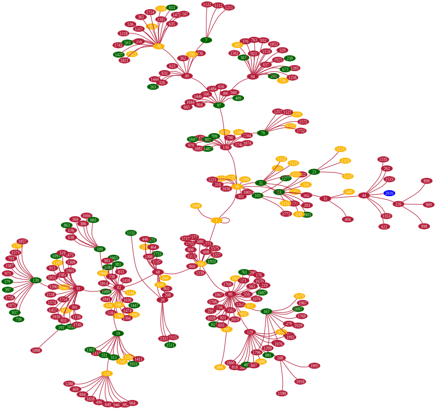
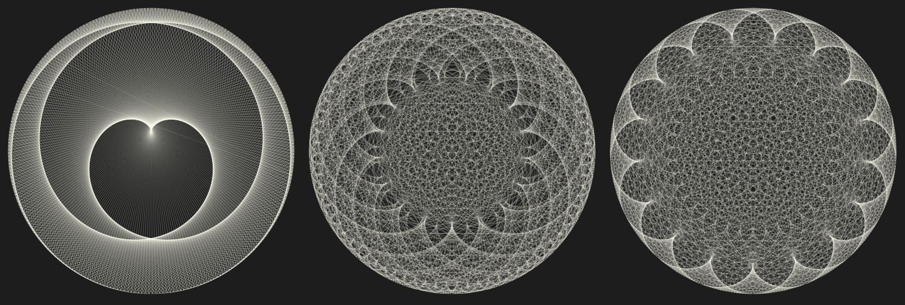
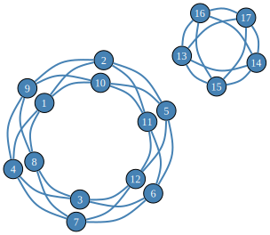

# Numerically, 2026 Is Unremarkable Yet Happy

Anton Antonov  
[RakuForPrediction at WordPress](https://rakuforprediction.wordpress.com)  
December 2025

---

## Introduction

This document ([notebook](https://github.com/antononcube/RakuForPrediction-blog/blob/main/Notebooks/Jupyter/Numerically-2026-is-unremarkable-yet-happy.ipynb)) discusses number theory properties and relationships of the integer 2026.

The integer `2026` is semiprime and a happy number, with 365 as one of its primitive roots. Although `2026` may not be particularly noteworthy in number theory, this provides a great excuse to create various elaborate visualizations that reveal some interesting aspects of the number.

The computations in this document are done with the Raku package ["Math::NumberTheory"](https://raku.land/zef:antononcube/Math::NumberTheory), [AAp1].

---

## Setup


```raku
use Math::NumberTheory;
use Math::NumberTheory::Utilities;

use Data::Importers;
use Data::Translators;
use Data::TypeSystem;

use Graph;
use Graph::Classes;
use JavaScript::D3;
```

Notebook priming code:

```raku, eval=FALSE
#%javascript
require.config({
     paths: {
     d3: 'https://d3js.org/d3.v7.min'
}});

require(['d3'], function(d3) {
     console.log(d3);
});
```

---

## 2026 Is a Happy Semiprime with Primitive Roots

First, 2026 is obviously not prime—it is divisible by `2`—but dividing it by `2` gives a prime, `1013`:


```raku
is-prime(2026 / 2)
```

Hence, `2026` is a [**semiprime**](https://en.wikipedia.org/wiki/Semiprime). The integer `1013` is not a [Gaussian prime](https://en.wikipedia.org/wiki/Gaussian_integer#Gaussian_primes), though:


```raku
is-prime(1013, :gaussian-integers)
```

A [**happy number**](https://en.wikipedia.org/wiki/Happy_number) is a number for which iteratively summing the squares of its digits eventually reaches 1 (e.g., 13 → 10 → 1).  
Here is a check that `2026` is happy:


```raku
is-happy-number(2026)
```

Here is the corresponding trail of digit-square sums:


```raku
is-happy-number(2026, :trail).tail.head(*-1).join(' → ')
```

Not many years in this century are happy numbers:


```raku
(2000...2100).grep({ is-happy-number($_) })
```

The decomposition of `2026` as `2 * 1013` means the multiplicative group modulo `2026` has primitive roots. A primitive root exists for an integer $n$ if and only if $n$ is $1$, $2$, $4$, $p^k$, or $2 p^k$, where $p$ is an odd prime and $k > 0$.

We can check additional facts about 2026, such as whether it is ["square-free"](https://mathworld.wolfram.com/Squarefree.html), among other properties. However, let us compare these with the [feature-rich 2025](https://rakuforprediction.wordpress.com/2025/01/03/numeric-properties-of-2025/) in the next section.

---

## Comparison with 2025

Here is a side-by-side comparison of key number theory properties for `2025` and `2026`.

| Property                  | 2025                                      | 2026                                      | Notes |
|---------------------------|-------------------------------------------|-------------------------------------------|-------|
| **Prime or Composite**    | Composite                                | Composite                                | Both non-prime. |
| **Prime Factorization**   | 3⁴ × 5² (81 × 25)                        | 2 × 1013                                 | 2025 has repeated small primes; 2026 is a [semiprime](https://en.wikipedia.org/wiki/Semiprime) (product of two distinct primes). |
| **Number of Divisors**    | 15 (highly composite for its size)       | 4 (1, 2, 1013, 2026)                     | 2025 has many divisors; 2026 has very few. |
| **Perfect Square**        | Yes (45² = 2025)                         | No                                       | Major highlight for 2025—rare square year. |
| **Sum of Cubes**          | Yes (1³ + 2³ + ... + 9³ = (1 + ... + 9)² = 2025)          | No                                       | Iconic property for 2025 ([Nicomachus's theorem](https://en.wikipedia.org/wiki/Squared_triangular_number)). |
| **Happy Number**          | No (process leads to cycle including 4)  | Yes (repeated squared digit sums reach 1) | Key point for 2026—its main "happy" trait. |
| **Harshad Number**        | Yes (divisible by 9)                      | No (not divisible by 10)                  | 2025 qualifies; 2026 does not. |
| **Primitive Roots**       | No                                       | Yes                                      | This is a relatively rare property to have. |
| **Other Notable Traits**  | - (20 + 25)² = 2025<br>- Sum of first 45 odd numbers<br>- Deficient number<br>- Many pattern-based representations | - Even number<br>- Deficient number<br>- Few special patterns | 2025 is packed with elegant properties; 2026 is more "plain" beyond being happy. |
| **Overall "Interest" Level** | Highly interesting—celebrated in math communities for squares, cubes, and patterns | Relatively uninteresting—basic semiprime with no standout geometric or sum properties | Reinforces blog's angle. |

To summarize:

- **2025** stands out as a mathematically rich number, often highlighted in puzzles and articles for its perfect square status and connections to sums of cubes and odd numbers.  
- **2026**, in contrast, has fewer flashy properties -- it's a straightforward even semiprime -- but it qualifies as a *happy number* and it has a primitive root.

Here is a computationally generated comparison table of most of the properties found in the table above:


```raku, results=asis
#% html
my &divisors-count = { divisors($_).elems };
<is-prime is-composite divisors-count prime-omega euler-phi is-square-free is-happy-number is-harshad-number is-deficient-number primitive-root>.map({ %(sub => $_, '2025' => ::("&$_")(2025), '2026' => ::("&$_")(2026) ) })
==> to-html(field-names => ['sub', '2025', '2026'], align => 'left')
```

---

## Phi Number System

Digits of 2026 represented in the [Phi number system](https://mathworld.wolfram.com/PhiNumberSystem.html):


```raku
my @res = phi-number-system(2026);
```

Verification:


```raku
@res.map({ ϕ ** $_ }).sum.round(10e-11);
```

---

## Happy Numbers Trail Graph

Let us create and plot a graph showing the trails of all happy numbers less than or equal to 2026. Below, we identify these numbers and their corresponding trails:


```raku
my @ns = 1...2026;

my @trails = @ns.map({ is-happy-number($_):trail }).grep(*.head);

deduce-type(@trails)
```

Here is the corresponding trails graph, highlighting the primes and happy numbers:


```raku, results=asis, eval=FALSE
#% html
my @prime-too = @trails.grep(*.head).map(*.tail.head).grep(*.&is-prime);
my @happy-too = @ns.grep(*.&is-harshad-number).grep(*.&is-happy-number);

my %highlight = '#006400' => @prime-too».Str,    # Deep Christmas green for primes
                'Blue' => [2026.Str, ],            # Blue for the special year
                '#fbb606ff' => @happy-too».Str;  # Darker gold for joyful numbers

my @edges = @trails.map({ $_.tail.head(*-1).rotor(2 => -1).map({ $_.head.Str => $_.tail.Str }) }).flat;

my $gTrails = Graph.new(@edges):!directed;

$gTrails.dot(
    engine => 'neato', 
    graph-size => 12, 
    vertex-shape => 'ellipse', vertex-height => 0.2, vertex-width => 0.4,
    :10vertex-font-size,
    vertex-color => '#B41E3A',
    vertex-fill-color => '#B41E3A',
    arrowsize => 0.6,
    edge-color => '#B41E3A',
    edge-width => 1.4,
    splines => 'curved',
    :%highlight
):svg
```



----

## Triangular Numbers

There is a theorem by Gauss stating that any integer can be represented as a sum of at most three triangular numbers. Instead of programming such an integer decomposition representation in Raku, we can simply use [Wolfram|Alpha](https://www.wolframalpha.com), [AA1, AA3], or [`wolframscript`](https://www.wolfram.com/wolframscript/) to find an "interesting" solution:


```shell
#% bash
wolframscript -code 'FindInstance[{2026 == PolygonalNumber[i] + PolygonalNumber[j] + PolygonalNumber[k], i > 10, j > 10, k > 10}, {i, j, k}, Integers]'
```

Here, we verify the result using Raku:


```raku
say "Triangular numbers : ", <11 19 59>.&polygonal-number(:3sides);
say "Sum : ", <11 19 59>.&polygonal-number(:3sides).sum;
```

---

## Chord Diagrams

Here is the number of primitive roots of the [multiplication group modulo](https://mathworld.wolfram.com/ModuloMultiplicationGroup.html) 2026:


```raku
primitive-root-list(2026).elems
```

Here are chord plots [AA2, AAp1, AAp2, AAv1] corresponding to a few selected primitive roots:


```raku, eval=FALSE
#% js
my $n = 2026;
<339 365 1529>.map( -> $p { 
    my &f = -> $x { power-mod($p, $x, $n) => power-mod($p, $x + 1, $n) };
    
    my @segments = circular-chords-tracing($n, with => &f, :d);
    
    @segments .= map({ $_<group> = $_<group>.Str; $_ });
    
    js-d3-list-line-plot(
        @segments,
        stroke-width => 0.1,
        background => '#1F1F1F',
        :300width, :300height,
        :!axes,
        :!legends,
        :10margins,
        color-scheme => 'Ivory',
        #:$title-color, title => $p
        )
}).join("\n")
```



**Remark:** It is interesting that 365 (the number of days in a common calendar year) is a primitive root of the multiplicative group generated by `2026`. Not many years have this property this century; many do not have primitive roots at all.


```raku
(2000...2100).hyper(:4degree).grep({ 365 ∈ primitive-root-list($_) })
```

---

## [Quartic Graphs](https://mathworld.wolfram.com/QuarticGraph.html)

The number `2026` appears in [18 results of the search "2026 graphs"](https://oeis.org/search?q=2026&fmt=data) in [«The On-line Encyclopedia of Integer Sequences»](https://oeis.org/). Here is the first result (from 2025-12-17): [A033483](https://oeis.org/A033483), "Number of disconnected 4-valent (or quartic) graphs with n nodes." Below, we ingest the internal format of A033483's page:


```raku
my $internal = data-import('https://oeis.org/A033483/internal', 'plaintext');
text-stats($internal)
```

Here, we verify the title:


```raku
with $internal.match(/ '%' N (<-[%]>*)? <?before '%'> /) { $0.Str.trim }
```

Here, we get the corresponding sequence:


```raku
my @seq = do with data-import('https://oeis.org/A033483/list', 'plaintext').match(/'[' (.*) ']'/) {
    $0.Str.split(',')».trim
}
```

Here we find the position of `2026` in that sequence:


```raku
@seq.grep(2026):k
```

Given the title of the sequence and the extracted position of `2026`, this means that the number of disconnected [4-regular graphs](https://mathworld.wolfram.com/QuarticGraph.html) with 17 vertices is 2026. Let us create a few graphs from that set by using the [5-vertex complete graph ($K_5$)](https://mathworld.wolfram.com/CompleteGraph.html) and [circulant graphs]().  
Here is an example of such a graph:


```raku, results=asis, eval=FALSE
#% html
reduce(    
    { $^a.union($^b) },
    [
        Graph::Complete.new(5),
        Graph::Complete.new(5).index-graph(6),
        Graph::Circulant.new(7,[1,2]).index-graph(11)
    ]
).dot(engine => 'neato'):svg
```


And here is another one:


```raku, results=asis, eval=FALSE
#% html
my $g = reduce(    
    { $^a.union($^b) },
    [
        Graph::Complete.new(5).index-graph(13),
        Graph::Circulant.new(12, [1, 5]).index-graph(1),
    ]
);
$g.dot(engine => 'neato', splines => 'curved'):svg
```



Here, we check that all vertices have degree 4:


```raku
$g.vertex-degree.sum / $g.vertex-count
```

**Remark:** Note that although the plots show disjoint graphs, each graph plot represents a single graph object.

---

## Additional Comments

This section has a few additional (leftover) comments.

- After I researched and published the blog post ["Numeric properties of 2025"](https://rakuforprediction.wordpress.com/2025/01/03/numeric-properties-of-2025/), [AA1], in the first few days of 2025, I decided to program additional [Number theory functionalities for Raku](https://www.youtube.com/playlist?list=PLke9UbqjOSOhUx2m-ObMq42XEsBWtHWzN) -- see the package ["Math::NumberTheory"](https://raku.land/zef:antononcube/Math::NumberTheory), [AAp1].

- Most notably, "Math::NumberTheory" is extended to work with [Gaussian integers](https://en.wikipedia.org/wiki/Gaussian_integer), and the operators `GCD` and `LCD` are also extended to work with rationals.

- One of my current goals is to make Raku ***extremely good*** for researching Number theory phenomena.  
    - One of the most significant features of Raku is its bignum arithmetic and its good built-in numeric functions applicable in Number theory.

- Number theory provides many opportunities for visualizations, so I included utilities for some of the popular patterns in "Math::NumberTheory", [AAp1, AAp2].  
    - I use the package ["JavaScript::D3"](https://raku.land/zef:antononcube/JavaScript::D3), [AAp3], for almost all Number theory visualizations with Raku.  
    - Often, I visualize associated graphs using the DOT language specs provided by the package ["Graph"](https://raku.land/zef:antononcube/Graph), [AAp4] (as seen above). 
        - The [Graphviz engines](https://graphviz.org/download/) generate images in different formats using [DOT](https://graphviz.org/doc/info/lang.html) specs.

- The number of years in this century that have primitive roots and have 365 as a primitive root is less than the number of years that are happy numbers.

- I would say I spent too much time finding a good, suitable, Christmas-themed combination of colors for the trails graph.

- To get the quartic graph counting sequence [A033483](https://oeis.org/A033483), I tried to use ["Math::Sequences"](https://raku.land/zef:raku-community-modules/Math::Sequences), but since that package does not provide the sequence, I used an ad hoc retrieval (for which Raku is perfect.)

- While working on this document, I implemented in "Math::NumberTheory" a set of new functions: `integer-digits`, `is-happy-number`, `is-harshad-number`, `is-abundant-number`, `is-perfect-number`, `is-deficient-number`, `abundant-number`, `deficient-number`, and `perfect-number`.  
    - All of these functions -- except `integer-digits` -- had lower implementation priority.

- Another implementation effort was to finally come up with a Command Line Interface (CLI). 
    - I advocate that a CLI should be considered for _all_ Raku packages, and _most_ should have one.

```shell
number-theory is happy number 2026
```

```shell
number-theory primitive root list 2026 | grep 365
```

---

## References

### Articles, blog posts

[AA1] Anton Antonov, 
["Numeric properties of 2025"](https://rakuforprediction.wordpress.com/2025/01/03/numeric-properties-of-2025/), 
(2025), 
[RakuForPrediction at WordPress](https://mathematicaforprediction.wordpress.com/). 

[AA2] Anton Antonov, 
["Primitive roots generation trails"](https://mathematicaforprediction.wordpress.com/2025/04/08/primitive-roots-generation-trails/), 
(2025), 
[MathematicaForPrediction at WordPress](https://mathematicaforprediction.wordpress.com/). 

[AA3] Anton Antonov, 
[“Chatbook New Magic Cells”](https://rakuforprediction.wordpress.com/2024/05/18/chatbook-new-magic-cells/),
(2024), 
[RakuForPrediction at WordPress](https://rakuforprediction.wordpress.com).

[EW1]  Eric W. Weisstein, ["Quartic Graph"](https://mathworld.wolfram.com/QuarticGraph.html). From [MathWorld--A Wolfram Resource](https://mathworld.wolfram.com).

### Notebooks

[AAn1] Anton Antonov, 
["Primitive roots generation trails"](https://community.wolfram.com/groups/-/m/t/3442027), 
(2025), 
[Wolfram Community](https://community.wolfram.com).
STAFFPICKS, April 9, 2025​.

[EPn1] Ed Pegg, [“Happy 2025 =1³+2³+3³+4³+5³+6³+7³+8³+9³!”](https://community.wolfram.com/groups/-/m/t/3347182), [​Wolfram Community](https://community.wolfram.com), STAFFPICKS, December 30, 2024​.

### Packages, paclets

[AAp1] Anton Antonov,
[Math::NumberTheory, Raku package](https://github.com/antononcube/Raku-Math-NumberTheory),
(2025),
[GitHub/antononcube](https://github.com/antononcube).

[AAp2] Anton Antonov,
[NumberTheoryUtilities, Wolfram Language paclet](https://resources.wolframcloud.com/PacletRepository/resources/AntonAntonov/NumberTheoryUtilities/),
(2025),
[Wolfram Language Paclet Repository](https://resources.wolframcloud.com/PacletRepository).

[AAp3] Anton Antonov,
[JavaScript::D3, Raku package](https://github.com/antononcube/Raku-JavaScript-D3),
(2021-2025),
[GitHub/antononcube](https://github.com/antononcube).

[AAp4] Anton Antonov,
[Graph, Raku package](https://github.com/antononcube/Raku-Graph),
(2024-2025),
[GitHub/antononcube](https://github.com/antononcube).

### Videos

[AAv1] Anton Antonov,
[Number theory neat examples in Raku (Set 3)](https://www.youtube.com/watch?v=6uCIoonlybk),
(2025),
[YouTube/@AAA4prediction](https://www.youtube.com/@AAA4prediction).

