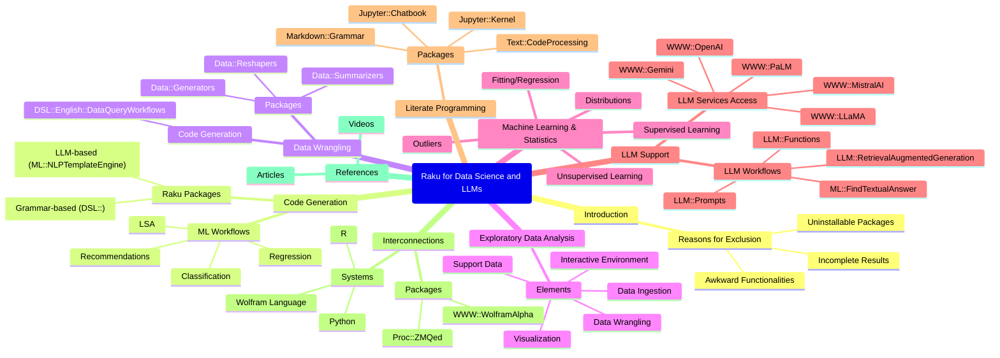

# Raku for Data Science and Large Language Models

Anton Antonov   
[RakuForPrediction at WordPress](https://rakuforprediction.wordpress.com)  
October 2024

## Introduction 


This document contains overlapping lists of Raku packages that are used for 
performing various types of workflows in Data Science (DS) and the utilization 
of Large Language Models (LLM).

At least half a dozen packages for performing machine learning or data wrangling 
in Raku have not been included for three reasons:

1. Those packages cannot be installed.
   - Mostly, because of external (third party) dependencies.
2. When tried or experimented with, the packages do not provide faithful or complete results.
   - I.e. precision and recall are not good.
3. The functionalities in those packages are two awkward to use in computational workflows.
   - It is understandable to have ecosystem packages with incomplete or narrow development state.
   - But many of those packages are permanently in those states.
   - Additionally, the authors have not shown or documented how the functionalities are used in longer computational chains or real-world use cases.
   
The examples given below are only for illustration purposes, and by no mean exhaustive.
We refer to related blog posts, videos, and package READMEs for more details.

------

## Code generation

We can say that the most frequently used Machine Learning (ML) workflows are in:
- Classification
- Latent Semantic Analysis (LSA),
- Regression
- Recommendations

In the broader field of Data Science (DS) we also add Data Wrangling.

Each of these ML or DS sub-fields has it own Domain Specific Language (DSL).

There is a set of Raku packages for facilitate the creation of Data Science workflows in _other_ programming languages.
(Julia, Python, R, Wolfram Language.)

The grammar-based ones have the "DSL::" prefix -- see, for example, ["DSL::English::*"](https://raku.land/?q=DSL%3A%3AEnglish) at [raku.land](https://raku.land/).

The LLM based one is ["ML::NLPTemplateEngine"](https://raku.land/zef:antononcube/ML::NLPTemplateEngine).

### Examples 

Here is an example of using the Command Line Interface (CLI) script of "ML::NLPTemplateEngine":

```
concretize --l=Python make a quantile regression pipeline over dfTemperature using 24 knots an interpolation order 2
```

```
# qrObj = (Regressionizer(dfTemperature)
# .echo_data_summary()
# .quantile_regression(knots = 24, probs = [{0.25, 0.5, 0.75}], order = 2)
# .plot(date_plot = False)
# .errors_plot(relative_errors = False, date_plot = False))
```

------

## Data wrangling 

Data wrangling, summarization, and generation:

- ["Data::Reshapers"](https://raku.land/zef:antononcube/Data::Reshapers)
- ["Data::Summarizers"](https://raku.land/zef:antononcube/Data::Summarizers)
- ["Data::Generators"](https://raku.land/zef:antononcube/Data::Generators)

Generation of data wrangling workflows code:

- ["DSL::English::DataQueryWorkflows"](https://raku.land/zef:antononcube/DSL::English::DataQueryWorkflows)

### Examples

Data wrangling with "Data::Reshapers":

```raku
use Data::Reshapers;
my @dsTitanic = get-titanic-dataset();
cross-tabulate(@dsTitanic, <passengerSex>, <passengerSurvival>)
```

```
# {female => {died => 127, survived => 339}, male => {died => 682, survived => 161}}
```

Data wrangling code generation via CLI:

```shell
dsl-translation -l=Raku "use @dsTitanic; group by passengerSex; show the counts"
```

```
# $obj = @dsTitanic ;
# $obj = group-by($obj, "passengerSex") ;
# say "counts: ", $obj>>.elems
```

------

## Exploratory Data Analysis

At this point Raku is fully equipped to Exploratory Data Analysis (EDA) over small to moderate size datasets.
(E.g. less than 100,000 rows.)

Here are the elements for EDA:

- Easy data ingestion 
  - Of files of different types and different kinds of locations
  - See ["Data::Importers"](https://raku.land/zef:antononcube/Data::Importers)
- Data wrangling
  - See the previous section
- Visualization
  - ["JavaScript::D3"](https://raku.land/zef:antononcube/JavaScript::D3), [AAv4]
  - ["JavaScript::Google::Charts"](https://raku.land/zef:antononcube/JavaScript::Google::Charts), [AAv5]
- Extensive support data
  - Data ready to do computations with
  - ["Data::ExampleDatasets"](https://raku.land/zef:antononcube/Data::ExampleDatasets)
  - ["Data::Geographics"](https://raku.land/zef:antononcube/Data::Geographics), [AAv5]
- Interactive development environment(s)
  - These are "notebook solutions" 
  - ["Jupyter::Kernel"](https://raku.land/zef:bduggan/Jupyter::Kernel)
  - ["Jupyter::Chatbook"](https://raku.land/zef:antononcube/Jupyter::Chatbook)
  - ["RakuMode"](https://resources.wolframcloud.com/PacletRepository/resources/AntonAntonov/RakuMode/)

------

## Machine Learning & Statistics

- Unsupervised learning
  - ["ML::Clustering"](https://raku.land/zef:antononcube/ML::Clustering)
  - ["ML::TriesWithFrequencies"](https://raku.land/zef:antononcube/ML::TriesWithFrequencies)
  - ["ML::AssociationRuleLearning"](https://raku.land/zef:antononcube/ML::AssociationRuleLearning)
  - ["Math::Nearest"](https://raku.land/zef:antononcube/Math::Nearest)
- Supervised learning
  - ["ML::ROCFunctions"](https://raku.land/zef:antononcube/ML::ROCFunctions)
- Fitting / regression
  - ["Math::Fitting"](https://raku.land/zef:antononcube/Math::Fitting)
- Distributions 
  - ["Statistics::Distributions"](https://raku.land/zef:antononcube/Statistics::Distributions)
- Outliers
  - ["Statistics::OutlierIdentifiers"](https://raku.land/cpan:ANTONOV/Statistics::OutlierIdentifiers)

-----

## LLM support

### LLM services access

Main or well known LLM-services providers (OpenAI, Google) have dedicated LLM packages:

- ["WWW::OpenAI"](https://raku.land/zef:antononcube/WWW::OpeanAI)
- ["WWW::PaLM"](https://raku.land/zef:antononcube/WWW::PaLM)
- ["WWW::Gemini"](https://raku.land/zef:antononcube/WWW::Gemini)
- ["WWW::MistralAI"](https://raku.land/zef:antononcube/WWW::MistralAI)
- ["WWW::LLaMA"](https://raku.land/zef:antononcube/WWW::LLaMA)

All these LLM packages are loaded, ready to use in Raku chatbooks, (notebooks of ["Jupyter::Chatbook"](https://raku.land/zef:antononcube/Jupyter::Chatbook).)

### LLM workflows

There is a set of packages that facilitates the creation of workflows that are "provider independent":

- ["LLM::Functions"](https://raku.land/zef:antononcube/LLM::Functions)
- ["LLM::Prompts"](https://raku.land/zef:antononcube/LLM::Prompts)
- ["LLM::RetrievalAugmentedGeneration"](https://raku.land/zef:antononcube/LLM::RetrievalAugmentedGeneration)
- ["ML::FindTextualAnswer"](https://raku.land/zef:antononcube/ML::FindTextualAnswer)

"LLM::Functions" and "LLM::Prompts" are loaded, ready to use in Raku chatbooks.

Currently, "ML::FindTextualAnswer" uses only LLMs to find answers to given text and questions.
But the plans for it is to use non-LLM methods.

Furthermore, "ML::FindTextualAnswer" utilizes "ML::NLPTemplateEngine" to retrieve parameter values that are then inserted into the templates.

### Examples

Here is an example of an LLM workflow that:
- Ingests the content of this file from GitHub
- Gives an HTML table that with breakdown of the discussed functionalities 

```raku
use LLM::Functions;
use LLM::Prompts;
use Data::Importers;
use Text::Subparsers;

my $url = 'https://raw.githubusercontent.com/antononcube/RakuForPrediction-blog/refs/heads/main/Articles/Raku-for-Data-Science-and-LLMs.md';
my $txt = data-import($url);

my $mm =
        llm-synthesize([
            "Make a mind-map for the following text:",
            $txt,
            llm-prompt('NothingElse')('Mermaid-JS')
        ],
        e => llm-configuration('ChatGPT', model=> 'gpt-4o', max-tokens => 2048, temperature => 0.4)
);
```



----

## Literate programming

The Raku package 
["Text::CodeProcessing"](https://raku.land/zef:antononcube/Text::CodeProcessing) 
can be used to "execute" computational documents in 
the formats Markdown, Org-mode, Pod6.

The Jupyter Raku-kernel packages
["Jupyter::Kernel"](https://raku.land/zef:bduggan/Jupyter::Kernel) and
["Jupyter::Chatbook"](https://raku.land/zef:antononcube/Jupyter::Chatbook)
provide cells for rendering the output of LaTeX, HTML, Markdown, or Mermaid-JS code or specifications;
see [AAv2].

The package 
["Markdown::Grammar"](https://raku.land/zef:antononcube/Markdown::Grammar)
can be used in notebook conversion workflows; see [AA1, AAv1].

**Remark:** This document itself is a "computational document" -- it has executable Raku and Shell code cells.
The published version of this document was obtained by "executing it" with the command:

```
file-code-chunks-eval Raku-for-Data-Science-and-LLMs.md
```

------

## Interconnections

A nice complement to the Raku's DS and LLM functionalities is the ability to easily connect
to other computational systems like Python, R, or Wolfram Language (WL).

The package ["Proc::ZMQed"](https://raku.land/zef:antononcube/Proc::ZMQed) allows the connection
to Python, R, and WL via [ZeroMQ](https://zeromq.org); see [AAv3].

The package ["WWW::WolframAlpha"](https://raku.land/zef:antononcube/WWW::WolframAlpha) 
can be used to get query answers from [WolframAlpha (W|A)](https://www.wolframalpha.com).
Raku chatbooks have also magic cells for accessing W|A; see [AA3].

------

## References

### Articles, blog posts

[AA1] Anton Antonov,
["Notebook transformations"](https://rakuforprediction.wordpress.com/2024/02/17/notebook-transformations/),
(2024),
[RakuForPrediction at WordPress](https://rakuforprediction.wordpress.com).

[AA2] Anton Antonov,
["Omni-slurping with LLMing"](https://rakuforprediction.wordpress.com/2024/03/26/omni-slurping-with-llming/),
(2024),
[RakuForPrediction at WordPress](https://rakuforprediction.wordpress.com).

[AA3] Anton Antonov,
["Chatbook New Magic Cells"](https://rakuforprediction.wordpress.com/2024/05/18/chatbook-new-magic-cells/),
(2024),
[RakuForPrediction at WordPress](https://rakuforprediction.wordpress.com).

[AA4] Anton Antonov,
["Age at creation for programming languages stats"](https://rakuforprediction.wordpress.com/2024/05/25/age-at-creation-for-programming-languages-stats/),
(2024),
[RakuForPrediction at WordPress](https://rakuforprediction.wordpress.com).


### Videos

[AAv1] Anton Antonov,
["Markdown to Mathematica converter (Jupyter notebook example)"](https://www.youtube.com/watch?v=Htmiu3ZI05w),
(2022),
[YouTube/AAA4prediction](https://www.youtube.com/@AAA4prediction).

[AAv2] Anton Antonov,
["Conversion and evaluation of Raku files"](https://www.youtube.com/watch?v=GJO7YqjGn6o),
(2022),
[YouTube/AAA4prediction](https://www.youtube.com/@AAA4prediction).

[AAv3] Anton Antonov,
["Using Wolfram Engine in Raku sessions"](https://www.youtube.com/watch?v=nWeGkJU3wdM),
(2022),
[YouTube/AAA4prediction](https://www.youtube.com/@AAA4prediction).

[AAv4] Anton Antonov,
["LLaMA models running guide (Raku)"](https://www.youtube.com/watch?v=zVX-SqRfFPA),
(2024),
[YouTube/AAA4prediction](https://www.youtube.com/@AAA4prediction).

[AAv5] Anton Antonov,
["Exploratory Data Analysis with Raku"](https://www.youtube.com/watch?v=YCnjMVSfT8w),
(2024),
[YouTube/AAA4prediction](https://www.youtube.com/@AAA4prediction).

[AAv6] Anton Antonov,
["Geographics data in Raku demo"](https://www.youtube.com/watch?v=Rkk_MeqLj_k),
(2024),
[YouTube/AAA4prediction](https://www.youtube.com/@AAA4prediction).

[AAv7] Anton Antonov,
["Raku RAG demo"](https://www.youtube.com/watch?v=JHO2Wk1b-Og),
(2024),
[YouTube/AAA4prediction](https://www.youtube.com/@AAA4prediction). 

[AAv8] Anton Antonov,
["Robust LLM pipelines (Mathematica, Python, Raku)"](https://www.youtube.com/watch?v=QOsVTCQZq_s),
(2024),
[YouTube/AAA4prediction](https://www.youtube.com/@AAA4prediction).