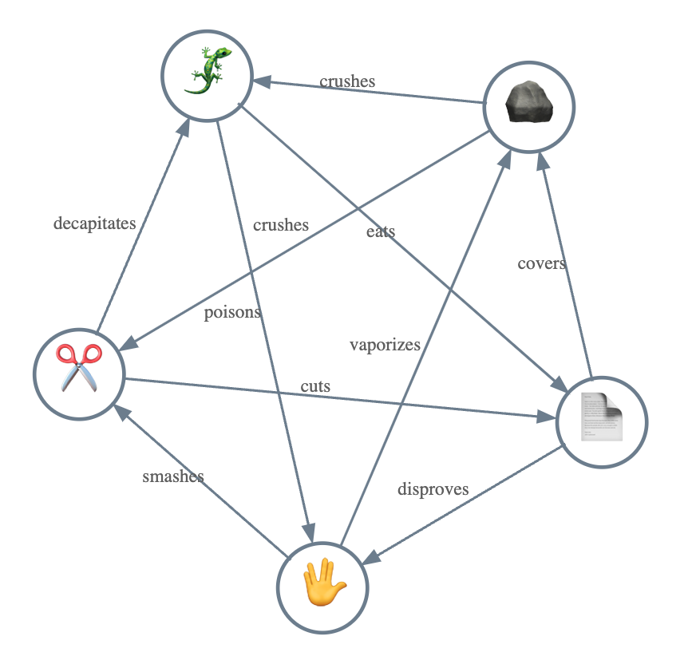
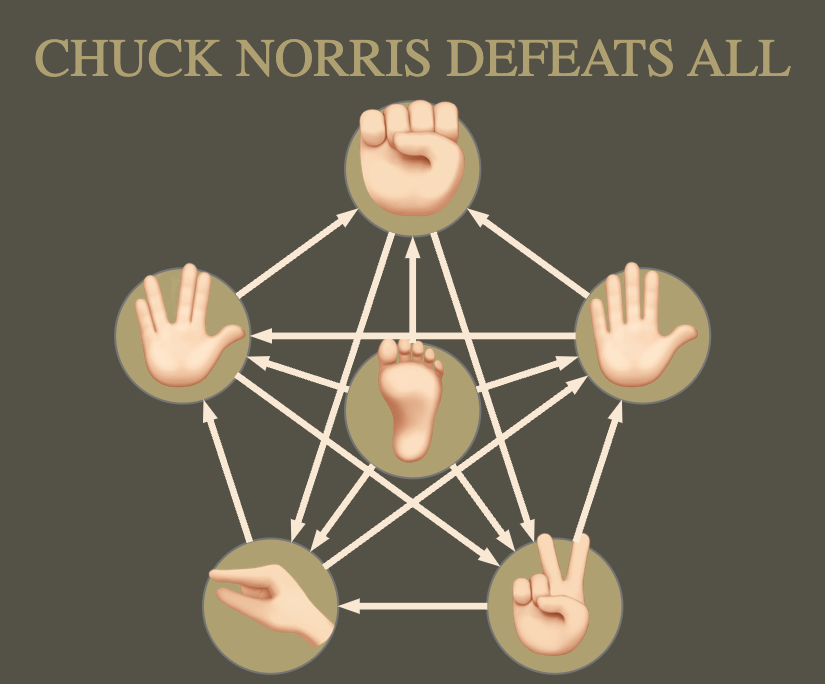

# Rock-Paper-Scissors Extensions

Anton Antonov   
[RakuForPrediction at WordPress](https://rakuforprediction.wordpress.com)   
February 2025   
March 2025  

------

## Introduction

It is easy to make a simple [Rock-Paper-Scissors](https://en.wikipedia.org/wiki/Rock_paper_scissors) (RPS) game graph using the Raku package ["Graph"](https://raku.land/zef:antononcube/Graph), [AAp1]. Here is such a graph in which the arrow directions indicate which item (vertex) wins:


```raku
#%html
my $g0 = Graph.new(<🪨 ✂️ ✂️ 📄 📄 🪨>.Hash):d;
$g0.dot(:3graph-size, engine => 'neato'):svg
```


Easy, but now we want to:
- Add labels to the edges 
    - Like "🪨 crushes ✂️"
- Change the items/weapons
    - [Snake-Centipede-Snail](https://en.wikipedia.org/wiki/Sansukumi-ken)
- Make graphs for game _upgrades_
    - [Rock-Paper-Scissors-Lizard-Spock](https://www.youtube.com/watch?v=x5Q6-wMx-K8)
    - [Rock-Paper-Scissors-Fire-Water](https://en.wikipedia.org/wiki/Rock_paper_scissors#Additional_weapons)
- Utilize Large Language Models (LLMs) 
    - In order to simplify the graph making

In this notebook (document) we show how to do all of the above points.

**Remark:** Interesting analogies of the presented graphs can be made with warfare graphs, [AAv1]. For example, the graph tanks-infantry-guerillas is analogous to RPS.

### TL;DR

- LLMs "know" the RPS game and its upgrades. 
- LLMs know how to (mostly, reliably) translate to emojis.
- The package "Graph" (via [Graphviz DOT](https://graphviz.org/doc/info/lang.html)) can produce SVG plots that are readily rendered in different environments.
  - And the graphs of hand-games like RPS look good.
- The class `Graph` have handy methods and attributes that make the creation and modification of graphs smooth(er).

------

## Setup

This notebook is a Raku-chatbook, hence, its Jupyter session pre-loads certain packages and LLM-personas.


```raku
# Preloaded in any chatbook
# use LLM::Functions;
# use LLM::Prompts;

# Preloaded in a user init file
# use Graph;

# For this concrete session
use Text::Emoji;
```

LLM configurations:


```raku
my $conf4o = llm-configuration('chat-gpt', model => 'gpt-4o', :4096max-tokens, temperature => 0.4);
my $conf4o-mini = llm-configuration('chat-gpt', model => 'gpt-4o-mini', :4096max-tokens, temperature => 0.4);

($conf4o, $conf4o-mini)».Hash».elems
```

Default options for `Graph.dot`:

```raku
my $background = '#1F1F1F';
my $engine = 'neato';

my %opts =
    :$background,     
    :6graph-size, 
    :1edge-width,
    :3edge-font-size,
    edge-color => 'LightSlateGray',
    node-width => 0.2, node-height => 0.2, 
    node-shape => 'circle', 
    :node-labels, 
    :8node-font-size,
    node-fill-color => '#1F1F1F',
    node-color => 'LightSlateGray',
    node-stroke-width => 0.6,
    arrow-size => 0.25,
    :$engine;

my %opts-plain = merge-hash(%opts, {:5node-font-size, node-shape => 'ellipse', node-width => 0.27, node-height => 0.15});

(%opts, %opts-plain)».elems
```

### Additional

Used to show game tables.

```raku
sub game-table(Graph:D $g, Str:D :$link-value = '+', Str:D :$missing-value = '-') {
    cross-tabulate($g.edges(:dataset), <from>, <to>)
    ==> -> %h { %h.map({ $_.key => ($g.vertex-list Z=> $_.value{$g.vertex-list}).Hash }).Hash }()
    ==> to-dataset(:$missing-value)
    ==> -> %h { for $g.vertex-list { %h{$_}{$_} = ''}; %h }()
    ==> -> %h { $g.vertex-list.map({ [|%h{$_}, "" => $_].Hash }) }()
    ==> to-html(field-names => ["", |$g.vertex-list])
    ==> { .Str.subst('1', $link-value, :g).subst('(Any)', $missing-value, :g) }()
}
```

-------

## LLM request

Raku-chatbooks, [AAp4], can have initialization Raku code and specified preloaded LLM-personas. One such LLM-persona is ["raku"](https://github.com/antononcube/Raku-Jupyter-Chatbook/blob/master/resources/llm-personas.json). 
Here we use the "raku" chat object to get Raku code for the edges of the RPS extension [Rock-Paper-Scissors-Lizard-Spock](https://bigbangtheory.fandom.com/wiki/Sam_Kass), [Wv1].


```raku
#% chat raku
Make an array the edges of a graph for the game Rock-Paper-Scissors-Lizard-Spock.
Each edges is represented with a hash with the keys "from", "to", "label".
The label corresponds to the action taken with the edge, like, "Paper covers Rock", "Paper disproves Spock".
```


```raku
my @edges = (
    { from => 'Rock',     to => 'Scissors', label => 'Rock crushes Scissors' },
    { from => 'Rock',     to => 'Lizard',   label => 'Rock crushes Lizard' },
    { from => 'Paper',    to => 'Rock',     label => 'Paper covers Rock' },
    { from => 'Paper',    to => 'Spock',    label => 'Paper disproves Spock' },
    { from => 'Scissors', to => 'Paper',    label => 'Scissors cuts Paper' },
    { from => 'Scissors', to => 'Lizard',   label => 'Scissors decapitates Lizard' },
    { from => 'Lizard',   to => 'Spock',    label => 'Lizard poisons Spock' },
    { from => 'Lizard',   to => 'Paper',    label => 'Lizard eats Paper' },
    { from => 'Spock',    to => 'Scissors', label => 'Spock smashes Scissors' },
    { from => 'Spock',    to => 'Rock',     label => 'Spock vaporizes Rock' },
);
```


We use the generated code in the next section.

----

## Plain text graph

Here we create the Rock-Paper-Scissors-Lizard-Spock graph generated with the LLM-magic cell above:


```raku
my @edges =
    { from => 'Rock',     to => 'Scissors',  label => 'Rock crushes Scissors' },
    { from => 'Scissors', to => 'Paper',     label => 'Scissors cuts Paper' },
    { from => 'Paper',    to => 'Rock',      label => 'Paper covers Rock' },
    { from => 'Rock',     to => 'Lizard',    label => 'Rock crushes Lizard' },
    { from => 'Lizard',   to => 'Spock',     label => 'Lizard poisons Spock' },
    { from => 'Spock',    to => 'Scissors',  label => 'Spock smashes Scissors' },
    { from => 'Scissors', to => 'Lizard',    label => 'Scissors decapitates Lizard' },
    { from => 'Lizard',   to => 'Paper',     label => 'Lizard eats Paper' },
    { from => 'Paper',    to => 'Spock',     label => 'Paper disproves Spock' },
    { from => 'Spock',    to => 'Rock',      label => 'Spock vaporizes Rock' }
;

my $g = Graph.new(@edges, :directed);
```

```
Graph(vertexes => 5, edges => 10, directed => True)
```

Here we make the edge labels:


```raku
my %edge-labels;
@edges.map({ %edge-labels{$_<from>}{$_<to>} = $_<label>.words[1] });

deduce-type(%edge-labels)
```

```
Assoc(Atom((Str)), Assoc(Atom((Str)), Atom((Str)), 2), 5)
```


Here we plot the graph:


```raku
#% html
$g.dot(|%opts-plain, :%edge-labels):svg
```


**Remark:** Currently the class `Graph` does not "deal" with edge labels, but some of its methods (like, `dot`) do.

-----

## Convenient LLM functions

### Graph edges

Instead of using chat-cells, we can define an LLM function that provides the graph edges dataset for different RPS variants. Here is such an LLM function using "LLM::Functions", [AAp1], and "LLM::Prompts", [AAv2]:


```raku
my sub rps-edge-dataset($description, Str:D $game-name = 'Rock-Paper-Scissors', *%args) {
    llm-synthesize([
        "Give the edges the graph for this $game-name variant description",
        'Give the edges as an array of dictionaries. Each dictionary with keys "from", "to", "label",',
        'where "label" has the action of "from" over "to".',
        $description,
        llm-prompt('NothingElse')('JSON')
        ], 
        e => %args<llm-evaluator> // %args<e> // %args<conf> // $conf4o-mini,
        form => sub-parser('JSON'):drop
    )
}
```

**Remark::** Both "LLM::Functions" and "LLM::Prompts" are pre-loaded in Raku chatbooks.

### Emoji translations

We can translate to emojis the plain-text vertex labels of RPS graphs in several ways:

1. Manually
2. Using `to-emoji` of ["Text::Emoji"](https://raku.land/zef:lizmat/Text::Emoji), [EMp1]
3. Via LLMs

Here we take option 2:


```raku
my %additional = spock => to-emoji(':vulcan-salute:'), paper => to-emoji(":page-with-curl:");
say (:%additional);
@edges.map(*<from>).map({ $_ => to-emoji(":$_:", %additional) })
```

```
additional => {paper => 📃, spock => 🖖}
(Rock => 🪨 Scissors => ✂️ Paper => 📃 Rock => 🪨 Lizard => 🦎 Spock => 🖖 Scissors => ✂️ Lizard => 🦎 Paper => 📃 Spock => 🖖)
```


Again, let us define an LLM function for that does emojification. (I.e. for option 3.)

One ways is to do a simple application of the prompt "Emojify" and process its result into a dictionary:

```raku
my $res = llm-synthesize( llm-prompt("Emojify")($g.vertex-list), e => $conf4o-mini  );
$res.split(/\s+/, :skip-empty)».trim.Hash
```

It is better to have a function that provides a more "immediate" result:


```raku
my sub emoji-rules($words, *%args) {
    llm-synthesize( [
        llm-prompt("Emojify")($words), 
        'Make a JSON dictionary of the original words as keys and the emojis as values', 
        llm-prompt('NothingElse')('JSON') 
        ], 
        e => %args<llm-evaluator> // %args<e> // %args<conf> // $conf4o-mini,
        form => sub-parser('JSON'):drop
    )
}
```

------

## Emoji graph

Let us remake game graph using suitable emojis. Here are the corresponding egdes:


```raku
my @edges-emo =
    { from => '🪨', to => '✂️',   label => 'crushes' },
    { from => '✂️',  to => '📄',  label => 'cuts' },
    { from => '📄', to => '🪨',  label => 'covers' },
    { from => '🪨', to => '🦎',  label => 'crushes' },
    { from => '🦎', to => '🖖',  label => 'poisons' },
    { from => '🖖', to => '✂️',   label => 'smashes' },
    { from => '✂️',  to => '🦎',  label => 'decapitates' },
    { from => '🦎', to => '📄',  label => 'eats' },
    { from => '📄', to => '🖖',  label => 'disproves' },
    { from => '🖖', to => '🪨',  label => 'vaporizes' }
;

my $g-emo = Graph.new(@edges-emo, :directed);
```
```
Graph(vertexes => 5, edges => 10, directed => True)
```


Here is a table of upgraded game that shows the interaction between the different roles (hand plays):


```raku
#% html
game-table($g-emo)
```

<table border="+"><thead><tr><th></th><th>✂️</th><th>📄</th><th>🖖</th><th>🦎</th><th>🪨</th></tr></thead><tbody><tr><td>✂️</td><td></td><td>+</td><td>-</td><td>+</td><td>-</td></tr><tr><td>📄</td><td>-</td><td></td><td>+</td><td>-</td><td>+</td></tr><tr><td>🖖</td><td>+</td><td>-</td><td></td><td>-</td><td>+</td></tr><tr><td>🦎</td><td>-</td><td>+</td><td>+</td><td></td><td>-</td></tr><tr><td>🪨</td><td>+</td><td>-</td><td>-</td><td>+</td><td></td></tr></tbody></table>

Here we make the edge labels:


```raku
my %edge-labels-emo;
@edges-emo.map({ %edge-labels-emo{$_<from>}{$_<to>} = $_<label> });

deduce-type(%edge-labels-emo)
```

```
Assoc(Atom((Str)), Assoc(Atom((Str)), Atom((Str)), 2), 5)
```


Here we plot the graph (using a variety of setup options):


```raku
#% html
$g-emo.dot(|%opts, edge-labels => %edge-labels-emo):svg
```



-----

## Chuck Norris defeats them all!

Consider the [image](https://www.merchandisingplaza.us/40488/2/T-shirts-Chuck-Norris-Chuck-Norris-Rock-Paper-Scissors-Lizard-Spock-TShirt-l.jpg) (from [www.merchandisingplaza.us](https://www.merchandisingplaza.us/Chuck-Norris/Chuck-Norris-Rock-Paper-Scissors-Lizard-Spock-TShirt-40488)):


Let us try to remake it with a graph plot. At this point we simply add a "foot to connection" to all five vertices in the graph(s) above:


```raku
my $chuck = "🦶🏻";
my $g-chuck = $g.clone.edge-add( ($chuck X=> $g.vertex-list).Array, :directed);
```


    Graph(vertexes => 6, edges => 15, directed => True)


But we also have to rename the vertices to be hand-gestures:


```raku
$g-chuck .= vertex-replace( { Scissors => '✌🏻', Rock => '✊🏻', Lizard => '🤏🏻', Spock => '🖖🏻', 'Paper' => '✋🏻' } )
```


    Graph(vertexes => 6, edges => 15, directed => True)


Here is the interactions table of upgraded game:


```raku
#% html
game-table($g-chuck)
```


<table border="+"><thead><tr><th></th><th>✊🏻</th><th>✋🏻</th><th>✌🏻</th><th>🖖🏻</th><th>🤏🏻</th><th>🦶🏻</th></tr></thead><tbody><tr><td>✊🏻</td><td></td><td>-</td><td>+</td><td>-</td><td>+</td><td>-</td></tr><tr><td>✋🏻</td><td>+</td><td></td><td>-</td><td>+</td><td>-</td><td>-</td></tr><tr><td>✌🏻</td><td>-</td><td>+</td><td></td><td>-</td><td>+</td><td>-</td></tr><tr><td>🖖🏻</td><td>+</td><td>-</td><td>+</td><td></td><td>-</td><td>-</td></tr><tr><td>🤏🏻</td><td>-</td><td>+</td><td>-</td><td>+</td><td></td><td>-</td></tr><tr><td>🦶🏻</td><td>+</td><td>+</td><td>+</td><td>+</td><td>+</td><td></td></tr></tbody></table>


In order to ensure that we get an "expected" graph plot, we take the vertex coordinates of a [wheel graph](https://en.wikipedia.org/wiki/Wheel_graph) or compute them by hand. Here we do the latter:


```raku
my @vs = <✊🏻 🖖🏻 🤏🏻 ✌🏻 ✋🏻>;
my %vertex-coordinates = @vs.kv.map( -> $i, $v { $v => [cos(π/2 + $i * 2 * π / 5), sin(π/2 + $i * 2 * π / 5)] });
%vertex-coordinates<🦶🏻> = [0, 0];
$g-chuck.vertex-coordinates = %vertex-coordinates;

deduce-type(%vertex-coordinates)
```

```
Struct([✊🏻, ✋🏻, ✌🏻, 🖖🏻, 🤏🏻, 🦶🏻], [Array, Array, Array, Array, Array, Array])
```


Here we plot the graph:


```raku
#% html
$g-chuck.dot(
    background => '#5f5b4f',
    graph-label => 'Chuck Norris Defeats All'.uc,
    font-color => '#b8aa79',
    :6graph-size, 
    :2edge-width,
    :4edge-font-size,
    edge-color => 'AntiqueWhite',
    node-width => 0.56, node-height => 0.56, 
    node-shape => 'circle', 
    :node-labels, 
    :38node-font-size,
    node-fill-color => '#b8aa79',
    node-color => 'Gray',
    node-stroke-width => 0.6,
    arrow-size => 0.26,
    engine => 'neato',
    :svg
)
```



------

## Using LLMs

### Matching the colors

We can use "LLM vision" to get the colors of the original image:


```raku
my $url = 'https://www.merchandisingplaza.us/40488/2/T-shirts-Chuck-Norris-Chuck-Norris-Rock-Paper-Scissors-Lizard-Spock-TShirt-l.jpg';
llm-vision-synthesize('What are the dominant colors in this image? Give them in hex code.', $url)
```

```
The dominant colors in the image are:

- Olive Green: #5B5D4A
- Beige: #D0C28A
- White: #FFFFFF
- Black: #000000
```


### Graph generating with LLMs

Instead of specifying the graph edges by hand, we can use LLM-vision and suitable prompting. The results are not that good, but YMMV.


```raku
my $res2 =
llm-vision-synthesize([
    'Give the edges the graph for this image of Rock-Paper-Scissors-Lizard-Spock-Chuck -- use relevant emojis.',
    'Give the edges as an array of dictionaries. Each dictionary with keys "from" and "to".',
    llm-prompt('NothingElse')('JSON')
    ], 
    $url,
    e => $conf4o,
    form => sub-parser('JSON'):drop
    )
```

```
[{from => ✋, to => ✌️} {from => ✌️, to => ✊} {from => ✊, to => 🦎} {from => 🦎, to => 🖖} {from => 🖖, to => ✋} {from => ✋, to => ✊} {from => ✊, to => ✋} {from => ✌️, to => 🦎} {from => 🦎, to => ✋} {from => 🖖, to => ✌️} {from => ✌️, to => 🖖} {from => 🖖, to => ✊}]
```


```raku
#% html
Graph.new($res2, :directed).dot(:5graph-size, engine => 'neato', arrow-size => 0.5):svg
```


------

## Rock-Paper-Scissors-Fire-Water

One notable variant is Rock-Paper-Scissors-Fire-Water. Here is its game table:


```raku
#% html
my @edges = |('🔥' X=> $g0.vertex-list), |($g0.vertex-list X=> '💦'), '💦' => '🔥';
my $g-fire-water = $g0.clone.edge-add(@edges, :directed);

game-table($g-fire-water)
```


<table border="+"><thead><tr><th></th><th>✂️</th><th>💦</th><th>📄</th><th>🔥</th><th>🪨</th></tr></thead><tbody><tr><td>✂️</td><td></td><td>+</td><td>+</td><td>-</td><td>-</td></tr><tr><td>💦</td><td>-</td><td></td><td>-</td><td>+</td><td>-</td></tr><tr><td>📄</td><td>-</td><td>+</td><td></td><td>-</td><td>+</td></tr><tr><td>🔥</td><td>+</td><td>-</td><td>+</td><td></td><td>+</td></tr><tr><td>🪨</td><td>+</td><td>+</td><td>-</td><td>-</td><td></td></tr></tbody></table>


Here is the graph:


```raku
#% html
$g-fire-water.dot(|%opts, engine => 'neato'):svg
```


-----

## Complete RPS upgrade via LLMs

Consider the [game RPS-9](https://www.umop.com/rps9.htm):


```raku
my $txt = data-import('https://www.umop.com/rps9.htm', 'plaintext');
text-stats($txt)
```


    (chars => 2143 words => 355 lines => 46)


Extract the game description:


```raku
my ($start, $end) = 'relationships in RPS-9:', 'Each gesture beats out';
my $txt-rps9 = $txt.substr( $txt.index($start) + $start.chars .. $txt.index($end) - 1 ) 
```

```
ROCK POUNDS OUT
FIRE, CRUSHES SCISSORS, HUMAN &
SPONGE.
FIRE MELTS SCISSORS, 
BURNS PAPER, HUMAN & SPONGE.
SCISSORS SWISH THROUGH AIR,
CUT PAPER, HUMAN & SPONGE.
HUMAN CLEANS WITH SPONGE,
WRITES PAPER, BREATHES
AIR, DRINKS WATER.
SPONGE SOAKS PAPER, USES
AIR POCKETS, ABSORBS WATER,
CLEANS GUN.
PAPER FANS AIR,
COVERS ROCK, FLOATS ON WATER,
OUTLAWS GUN.
AIR BLOWS OUT FIRE,
ERODES ROCK, EVAPORATES WATER,
TARNISHES GUN.
WATER ERODES ROCK, PUTS OUT
FIRE, RUSTS SCISSORS & GUN.
GUN TARGETS ROCK,
FIRES, OUTCLASSES SCISSORS, SHOOTS HUMAN.
```


Here we invoke the defined LLM function to get the edges of the corresponding graph:


```raku
my @rps-edges = |rps-edge-dataset($txt-rps9)
```

```
[{from => ROCK, label => POUNDS OUT, to => FIRE} {from => ROCK, label => CRUSHES, to => SCISSORS} {from => ROCK, label => CRUSHES, to => HUMAN} {from => ROCK, label => CRUSHES, to => SPONGE} {from => FIRE, label => MELTS, to => SCISSORS} {from => FIRE, label => BURNS, to => PAPER} {from => FIRE, label => BURNS, to => HUMAN} {from => FIRE, label => BURNS, to => SPONGE} {from => SCISSORS, label => CUT, to => PAPER} {from => SCISSORS, label => CUT, to => HUMAN} {from => SCISSORS, label => CUT, to => SPONGE} {from => HUMAN, label => CLEANS, to => SPONGE} {from => HUMAN, label => WRITES, to => PAPER} {from => HUMAN, label => BREATHES, to => AIR} {from => HUMAN, label => DRINKS, to => WATER} {from => SPONGE, label => SOAKS, to => PAPER} {from => SPONGE, label => USES, to => AIR} {from => SPONGE, label => ABSORBS, to => WATER} {from => SPONGE, label => CLEANS, to => GUN} {from => PAPER, label => FANS, to => AIR} {from => PAPER, label => COVERS, to => ROCK} {from => PAPER, label => FLOATS ON, to => WATER} {from => PAPER, label => OUTLAWS, to => GUN} {from => AIR, label => BLOWS OUT, to => FIRE} {from => AIR, label => ERODES, to => ROCK} {from => AIR, label => EVAPORATES, to => WATER} {from => AIR, label => TARNISHES, to => GUN} {from => WATER, label => ERODES, to => ROCK} {from => WATER, label => PUTS OUT, to => FIRE} {from => WATER, label => RUSTS, to => SCISSORS} {from => WATER, label => RUSTS, to => GUN} {from => GUN, label => TARGETS, to => ROCK} {from => GUN, label => OUTCLASSES, to => SCISSORS} {from => GUN, label => SHOOTS, to => HUMAN} {from => GUN, label => FIRES, to => FIRE}]
```


Here we translate the plaintext vertices into emojis:


```raku
my %emojied = emoji-rules(@rps-edges.map(*<from to>).flat.unique.sort)
```

```
{AIR => 🌬️, FIRE => 🔥, GUN => 🔫, HUMAN => 👤, PAPER => 📄, ROCK => 🪨, SCISSORS => ✂️, SPONGE => 🧽, WATER => 💧}
```


Here is the graph plot:


```raku
#% html
my $g-rps9 = Graph.new(@rps-edges, :directed).vertex-replace(%emojied);
$g-rps9.vertex-coordinates = $g-rps9.vertex-list Z=> Graph::Cycle(9).vertex-coordinates.values;

my %edge-labels = Empty;
$res3.map({ %edge-labels{%emojied{$_<from>}}{%emojied{$_<to>}} = "\"$_<label>\"" });

my %opts2 = %opts , %(:14node-font-size, node-shape => 'circle', node-width => 0.3, edge-width => 0.4);
$g-rps9.dot(|%opts2, :!edge-labels, engine => 'neato', :svg)
```


Here is the game table:


```raku
#% html
game-table($g-rps9)
```


<table border="+"><thead><tr><th></th><th>✂️</th><th>🌬️</th><th>👤</th><th>💧</th><th>📄</th><th>🔥</th><th>🔫</th><th>🧽</th><th>🪨</th></tr></thead><tbody><tr><td>✂️</td><td></td><td>-</td><td>+</td><td>-</td><td>+</td><td>-</td><td>-</td><td>+</td><td>-</td></tr><tr><td>🌬️</td><td>-</td><td></td><td>-</td><td>+</td><td>-</td><td>+</td><td>+</td><td>-</td><td>+</td></tr><tr><td>👤</td><td>-</td><td>+</td><td></td><td>+</td><td>+</td><td>-</td><td>-</td><td>+</td><td>-</td></tr><tr><td>💧</td><td>+</td><td>-</td><td>-</td><td></td><td>-</td><td>+</td><td>+</td><td>-</td><td>+</td></tr><tr><td>📄</td><td>-</td><td>+</td><td>-</td><td>+</td><td></td><td>-</td><td>+</td><td>-</td><td>+</td></tr><tr><td>🔥</td><td>+</td><td>-</td><td>+</td><td>-</td><td>+</td><td></td><td>-</td><td>+</td><td>-</td></tr><tr><td>🔫</td><td>+</td><td>-</td><td>+</td><td>-</td><td>-</td><td>-</td><td></td><td>-</td><td>+</td></tr><tr><td>🧽</td><td>-</td><td>+</td><td>-</td><td>+</td><td>+</td><td>-</td><td>+</td><td></td><td>-</td></tr><tr><td>🪨</td><td>+</td><td>-</td><td>+</td><td>-</td><td>-</td><td>+</td><td>-</td><td>+</td><td></td></tr></tbody></table>


----

## Future plans

In the (very near) future I plan to use built-up RPS graph making know-how to make military forces interaction graphs. (Discussed in [AJ1, SM1, NM1, AAv1].)

-----

## References

### Articles, books, theses

[AJ1] Archer Jones,
["The Art of War in Western World"](https://www.press.uillinois.edu/books/?id=p069666),
(2000),
[University of Illinois Press](https://www.press.uillinois.edu).
768 pages, ISBN-10: 0252069668, ISBN-13: 978-0252069666.

[SM1] Sergei Makarenko et al., 
["Обобщенная модель Ланчестера, формализующая конфликт нескольких сторон"](https://www.researchgate.net/publication/356424971_Obobsennaa_model_Lancestera_formalizuusaa_konflikt_neskolkih_storon_The_General_Lanchester_Model_Defining_Multilateral_Conflicts), 
[Eng. "The General Lanchester Model Defining Multilateral Conflicts"], 
(2021),
Automation of Control Processes № 2 (64), doi: 10.35752/1991-2927-2021-2-64-66-76.

[NM1] Николай В. Митюков,
["Математические модели и программные средства для реконструкции военно-исторических данных"](https://www.dissercat.com/content/matematicheskie-modeli-i-programmnye-sredstva-dlya-rekonstruktsii-voenno-istoricheskikh-dann),
(2009),
[disserCat](https://www.dissercat.com).

### Packages

[AAp1] Anton Antonov, 
[Graph Raku package](https://github.com/antononcube/Raku-Graph),
(2024-2025),
[GitHub/antononcube](https://github.com/antononcube).

[AAp2] Anton Antonov, 
[LLM::Functions Raku package](https://github.com/antononcube/Raku-LLM-Functions),
(2023-2024),
[GitHub/antononcube](https://github.com/antononcube).

[AAp3] Anton Antonov, 
[LLM::Prompts Raku package](https://github.com/antononcube/Raku-LLM-Prompts),
(2023-2024),
[GitHub/antononcube](https://github.com/antononcube).

[AAp4] Anton Antonov, 
[Jupyter::Chatbook Raku package](https://github.com/antononcube/Raku-Jupyter-Chatbook),
(2023-2024),
[GitHub/antononcube](https://github.com/antononcube).

[EMp1] Elizabeth Mattijsen,
[Text::Emoji Raku package](https://github.com/lizmat/Text-Emoji),
(2024-2025),
[GitHub/lizmat](https://github.com/lizmat).

### Videos

[AAv1] Anton Antonov,
["Upgrading Epidemiological Models into War Models"](https://www.youtube.com/watch?v=852vMS_6Qaw),
(2024),
[YouTube/@WolframResearch](https://www.youtube.com/@WolframResearch).

[Wv1] Wozamil
["Rock Paper Scissors Lizard Spock (Extended Cut) ~ The Big Bang Theory ~"](https://www.youtube.com/watch?v=x5Q6-wMx-K8),
(2012),
[YouTube@Wozamil](https://www.youtube.com/@Wozamil).
