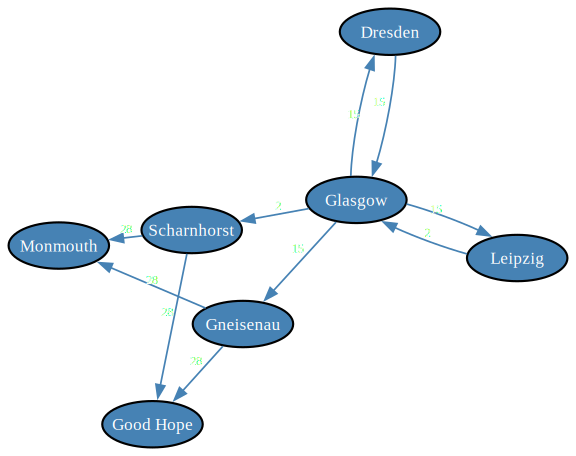

# Salvo Combat Modeling: Battle of Coronel

### Introduction

In this document ([notebook](https://github.com/antononcube/Raku-Math-SalvoCombatModeling/blob/main/docs/Battle-of-Coronel.ipynb)) we calibrate the Heterogeneous Salvo Combat Model (HSCM), [MJ1, AAp1, AAp2], to the First World War [Battle of Coronel](https://en.wikipedia.org/wiki/Battle_of_Coronel), [Wk1]. Our goal is to exemplify the usage of the functionalities of the package [Math::SalvoCombatModeling](https://raku.land/zef:antononcube/Math::SalvoCombatModeling), [AAp1]. We closely follow the Section B of Chapter III of [MJ1]. The calibration data used in [MJ1] is taken from [TB1].

**Remark:** The implementation of the Raku package ["Math::SalvoCombatModeling"](https://raku.land/zef:antononcube/Math::SalvoCombatModeling), [AAp1], closely follows the implementation of the Wolfram Language (WL) paclet ["SalvoCombatModeling"](https://resources.wolframcloud.com/PacletRepository/resources/AntonAntonov/SalvoCombatModeling), [AAp2]. Since WL has (i) symbolic builtin computations and (ii) a mature notebook system the salvo models computation, representation, and study with WL is much more convenient.

----

## Setup

Here we load the package:

```raku
use Math::SalvoCombatModeling;
use Graph;
```

----

## The battle

[The Battle of Coronel](https://en.wikipedia.org/wiki/Battle_of_Coronel) is a First World War naval engagement between three British ships {Good Hope, Monmouth, and Glasgow) and four German ships (Scharnhorst, Gneisenau, Leipzig, and Dresden).  The battle happened on 1 November 1914, off the coast of central Chile near the city of Coronel.

The Scharnhorst and Gneisenau are the first ships to open fire at Good Hope and Monmouth; the three British ships soon afterwards return fire. Dresden and Leipzig open fire on Glasgow, driving her out of the engagement. At the end of the battle, both Good Hope and Monmouth are sunk, while Glasgow, Scharnhorst, and Gneisenau were damaged.

| Ship        | Duration of fire |
|-------------|------------------|
| Good Hope   | 0                |
| Monmouth    | 0                |
| Glasgow     | 15               |
| Scharnhorst | 28               |
| Gneisenau   | 28               |
| Leipzig     | 2                |
| Dresden     | 2                |


The following graph shows which ship shot at which ships and total fire duration (in minutes):

```raku
#% html

my @edges = 
{ from =>'Scharnhorst', to =>'Good Hope',   weight => 28 },
{ from =>'Scharnhorst', to =>'Monmouth',    weight => 28 },
{ from =>'Gneisenau',   to =>'Good Hope',   weight => 28 },
{ from =>'Gneisenau',   to =>'Monmouth',    weight => 28 },
{ from =>'Leipzig',     to =>'Glasgow',     weight => 2 },
{ from =>'Glasgow',     to =>'Scharnhorst', weight => 2 },
{ from =>'Glasgow',     to =>'Gneisenau',   weight => 15 },
{ from =>'Glasgow',     to =>'Leipzig',     weight => 15 },
{ from =>'Glasgow',     to =>'Dresden',     weight => 15 },
{ from =>'Dresden',     to =>'Glasgow',     weight => 15 };

my $g = Graph.new(@edges):directed;

$g.dot(
    engine => 'neato', 
    vertex-shape => 'ellipse', 
    vertex-width => 0.65,
    :5size, 
    :8vertex-font-size, 
    :weights, 
    :6edge-font-size,
    edge-thickness => 0.8,
    arrow-size => 0.6
):svg;

```



----

### Salvo combat modeling definitions

Before going with building the model here is table that provides definitions of the fundamental notions of salvo combat modeling:

```raku
#% html
salvo-notion-definitions('English')
==> to-html(field-names => <notion definition>, align => 'left')
```

<table border="1"><thead><tr><th>notion</th><th>definition</th></tr></thead><tbody><tr><td align=left>Force</td><td align=left>A group of naval ships that operate and fight together.</td></tr><tr><td align=left>Unit</td><td align=left>A unit is an individual ship in a force.</td></tr><tr><td align=left>Salvo</td><td align=left>A salvo is the number of shots fired as a unit of force in a discrete period of time.</td></tr><tr><td align=left>Combat Potential</td><td align=left>Combat Potential is a force&#39;s total stored offensive capability of an element or force measured in number of total shots available.</td></tr><tr><td align=left>Combat Power</td><td align=left>Also called Striking Power, is the maximum offensive capability of an element or force per salvo, measured in the number of hitting shots that would be achieved in the absence of degrading factors.</td></tr><tr><td align=left>Scouting Effectiveness</td><td align=left>Scouting Effectiveness is a dimensionless degradation factor applied to a force&#39;s combat power as a result of imperfect information. It is a number between zero and one that describes the difference between the shots delivered based on perfect knowledge of enemy composition and position and shots based on existing information [Ref. 7].</td></tr><tr><td align=left>Training Effectiveness</td><td align=left>Training effectiveness is a fraction that indicates the degradation in combat power due the lack of training, motivation, or readiness.</td></tr><tr><td align=left>Distraction Factor</td><td align=left>Also called chaff effectiveness or seduction, is a multiplier that describes the effectiveness of an offensive weapon in the presence of distraction or other soft kill. This multiplier is a fraction, where one indicates no susceptibility/complete effectiveness and zero indicates complete susceptibility/no effectiveness.</td></tr><tr><td align=left>Offensive Effectiveness</td><td align=left>Offensive effectiveness is a composite term made of the product of scouting effectiveness, training effectiveness, distraction, or any other factor which represents the probability of a single salvo hitting its target. Offensive effectiveness transforms a unit&#39;s combat potential parameter into combat power.</td></tr><tr><td align=left>Defensive Potential</td><td align=left>Defensive potential is a force&#39;s total defensive capability measured in units of enemy hits eliminated independent of weapon system or operator accuracy or any other multiplicative factor.</td></tr><tr><td align=left>Defensive Power</td><td align=left>Defensive power is the number of missiles in an enemy salvo that a defending element or force can eliminate.</td></tr><tr><td align=left>Defender Alertness</td><td align=left>Defender alertness is the extent to which a defender fails to take proper defensive actions against enemy fire. This may be the result of any inattentiveness due to improper emission control procedures, readiness, or other similar factors. This multiplier is a fraction, where one indicates complete alertness and zero indicates no alertness.</td></tr><tr><td align=left>Defensive Effectiveness</td><td align=left>Defensive effectiveness is a composite term made of the product of training effectiveness and defender alertness. This term also applies to any value that represents the overall degradation of a force&#39;s defensive power.</td></tr><tr><td align=left>Staying Power</td><td align=left>Staying power is the number of hits that a unit or force can absorb before being placed out of action.</td></tr></tbody></table>

----

## Model

The British ships are in *Good Hope*, *Monmouth*, and *Glasgow*. They correspond to the indices 1, ,2, and 3 respectively.

```raku
["Good Hope", "Monmouth", "Glasgow"] Z=> 1..3
```

```
# (Good Hope => 1 Monmouth => 2 Glasgow => 3)
```

The German ships are *Scharnhorst*, *Gneisenau*, *Leipzig*, and *Dresden*:

```raku
["Scharnhorst", "Gneisenau", "Leipzig",  "Dresden"] Z=> 1..4
```

```
# (Scharnhorst => 1 Gneisenau => 2 Leipzig => 3 Dresden => 4)
```

**Remark:** The [Battle of Coronel](https://en.wikipedia.org/wiki/Battle_of_Coronel) is modeled with a "typical" salvo model -- the ships use "continuous fire." Hence, there are no interceptors and or, in model terms, defense terms or matrices.

Here is the model (for 3 **B**ritish ships and 4 **G**erman ships):

```raku
sink my $m = heterogeneous-salvo-model(['B', 3], ['G', 4]):latex;
```

Remove the defense matrices (i.e. make them zero):

```raku
sink $m<B><defense-matrix> = ((0 xx $m<B><defense-matrix>.head.elems).Array xx $m<B><defense-matrix>.elems).Array;
sink $m<G><defense-matrix> = ((0 xx $m<G><defense-matrix>.head.elems).Array xx $m<G><defense-matrix>.elems).Array;
```

Converting the obtained model data structure to LaTeX we get:

$$
\newcommand{\MB}{\mathcal{M}(B)}
\newcommand{\MG}{\mathcal{M}(G)}
$$

$$
\MB = (D_B, O_B, u_B), \qquad
\MG = (D_G, O_G, u_G).
$$

$$
D_B =
\begin{bmatrix}
0 & 0 & 0\\
0 & 0 & 0\\
0 & 0 & 0
\end{bmatrix},
\qquad
u_B =
\begin{bmatrix}
B_{1}\\
B_{2}\\
B_{3}
\end{bmatrix}.
$$

$$
O_B =
\begin{bmatrix}
\dfrac{\beta(G,B,1,1)\times \sigma(G,B,1,1)\times \tau(G,B,1,1)\times \rho(B,G,1,1)\times \Psi(G,B,1,1)}{\zeta(B,1)} &
\dfrac{\beta(G,B,2,1)\times \sigma(G,B,2,1)\times \tau(G,B,2,1)\times \rho(B,G,1,2)\times \Psi(G,B,2,1)}{\zeta(B,1)} &
\dfrac{\beta(G,B,3,1)\times \sigma(G,B,3,1)\times \tau(G,B,3,1)\times \rho(B,G,1,3)\times \Psi(G,B,3,1)}{\zeta(B,1)} &
\dfrac{\beta(G,B,4,1)\times \sigma(G,B,4,1)\times \tau(G,B,4,1)\times \rho(B,G,1,4)\times \Psi(G,B,4,1)}{\zeta(B,1)}
\\[4pt]
\dfrac{\beta(G,B,1,2)\times \sigma(G,B,1,2)\times \tau(G,B,1,2)\times \rho(B,G,2,1)\times \Psi(G,B,1,2)}{\zeta(B,2)} &
\dfrac{\beta(G,B,2,2)\times \sigma(G,B,2,2)\times \tau(G,B,2,2)\times \rho(B,G,2,2)\times \Psi(G,B,2,2)}{\zeta(B,2)} &
\dfrac{\beta(G,B,3,2)\times \sigma(G,B,3,2)\times \tau(G,B,3,2)\times \rho(B,G,2,3)\times \Psi(G,B,3,2)}{\zeta(B,2)} &
\dfrac{\beta(G,B,4,2)\times \sigma(G,B,4,2)\times \tau(G,B,4,2)\times \rho(B,G,2,4)\times \Psi(G,B,4,2)}{\zeta(B,2)}
\\[4pt]
\dfrac{\beta(G,B,1,3)\times \sigma(G,B,1,3)\times \tau(G,B,1,3)\times \rho(B,G,3,1)\times \Psi(G,B,1,3)}{\zeta(B,3)} &
\dfrac{\beta(G,B,2,3)\times \sigma(G,B,2,3)\times \tau(G,B,2,3)\times \rho(B,G,3,2)\times \Psi(G,B,2,3)}{\zeta(B,3)} &
\dfrac{\beta(G,B,3,3)\times \sigma(G,B,3,3)\times \tau(G,B,3,3)\times \rho(B,G,3,3)\times \Psi(G,B,3,3)}{\zeta(B,3)} &
\dfrac{\beta(G,B,4,3)\times \sigma(G,B,4,3)\times \tau(G,B,4,3)\times \rho(B,G,3,4)\times \Psi(G,B,4,3)}{\zeta(B,3)}
\end{bmatrix}.
$$

$$
D_G =
\begin{bmatrix}
0 & 0 & 0 & 0\\
0 & 0 & 0 & 0\\
0 & 0 & 0 & 0\\
0 & 0 & 0 & 0
\end{bmatrix},
\qquad
u_G =
\begin{bmatrix}
G_{1}\\
G_{2}\\
G_{3}\\
G_{4}
\end{bmatrix}.
$$

$$
O_G =
\begin{bmatrix}
\dfrac{\beta(B,G,1,1)\times \sigma(B,G,1,1)\times \tau(B,G,1,1)\times \rho(G,B,1,1)\times \Psi(B,G,1,1)}{\zeta(G,1)} &
\dfrac{\beta(B,G,2,1)\times \sigma(B,G,2,1)\times \tau(B,G,2,1)\times \rho(G,B,1,2)\times \Psi(B,G,2,1)}{\zeta(G,1)} &
\dfrac{\beta(B,G,3,1)\times \sigma(B,G,3,1)\times \tau(B,G,3,1)\times \rho(G,B,1,3)\times \Psi(B,G,3,1)}{\zeta(G,1)}
\\[4pt]
\dfrac{\beta(B,G,1,2)\times \sigma(B,G,1,2)\times \tau(B,G,1,2)\times \rho(G,B,2,1)\times \Psi(B,G,1,2)}{\zeta(G,2)} &
\dfrac{\beta(B,G,2,2)\times \sigma(B,G,2,2)\times \tau(B,G,2,2)\times \rho(G,B,2,2)\times \Psi(B,G,2,2)}{\zeta(G,2)} &
\dfrac{\beta(B,G,3,2)\times \sigma(B,G,3,2)\times \tau(B,G,3,2)\times \rho(G,B,2,3)\times \Psi(B,G,3,2)}{\zeta(G,2)}
\\[4pt]
\dfrac{\beta(B,G,1,3)\times \sigma(B,G,1,3)\times \tau(B,G,1,3)\times \rho(G,B,3,1)\times \Psi(B,G,1,3)}{\zeta(G,3)} &
\dfrac{\beta(B,G,2,3)\times \sigma(B,G,2,3)\times \tau(B,G,2,3)\times \rho(G,B,3,2)\times \Psi(B,G,2,3)}{\zeta(G,3)} &
\dfrac{\beta(B,G,3,3)\times \sigma(B,G,3,3)\times \tau(B,G,3,3)\times \rho(G,B,3,3)\times \Psi(B,G,3,3)}{\zeta(G,3)}
\\[4pt]
\dfrac{\beta(B,G,1,4)\times \sigma(B,G,1,4)\times \tau(B,G,1,4)\times \rho(G,B,4,1)\times \Psi(B,G,1,4)}{\zeta(G,4)} &
\dfrac{\beta(B,G,2,4)\times \sigma(B,G,2,4)\times \tau(B,G,2,4)\times \rho(G,B,4,2)\times \Psi(B,G,2,4)}{\zeta(G,4)} &
\dfrac{\beta(B,G,3,4)\times \sigma(B,G,3,4)\times \tau(B,G,3,4)\times \rho(G,B,4,3)\times \Psi(B,G,3,4)}{\zeta(G,4)}
\end{bmatrix}.
$$

#### Concrete parameter values

Setting the parameter values as in [MJ1] defining the sub `param` (to be passed `heterogeneous-salvo-model`):

```raku
multi sub param(Str:D $name, Str:D $a where * eq 'B', Str:D $b where * eq 'G', UInt:D $i, UInt:D $j) { 0 }

multi sub param(Str:D $name, Str:D $a where * eq 'G', Str:D $b where * eq 'B', UInt:D $i, UInt:D $j) {
    given $name {
        when 'beta' {
            given ($i, $j) {
                when (1, 1) { 2.16 }
                when (1, 2) { 2.16 }
                when (1, 3) { 2.16 }

                when (2, 1) { 2.16 }
                when (2, 2) { 2.16 }
                when (2, 3) { 2.16 }

                when (3, 1) { 2.165 }
                when (3, 2) { 2.165 }
                when (3, 3) { 2.165 }

                when (4, 1) { 2.165 }
                when (4, 2) { 2.165 }
                when (4, 3) { 2.165 }
            }
        }

        when 'curlyepsilon' {
            given ($i, $j) {
                when (1, 1) { 0.028 }
                when (1, 2) { 0.028 }
                when (1, 3) { 0.028 }
                when (2, 1) { 0.028 }
                when (2, 2) { 0.028 }
                when (2, 3) { 0.028 }

                when (3, 1) { 0.012 }
                when (3, 2) { 0.012 }
                when (3, 3) { 0.012 }
                when (4, 1) { 0.012 }
                when (4, 2) { 0.012 }
                when (4, 3) { 0.012 }
            }
        }

        when 'capitalpsi' {
            given ($i, $j) {
                when (1, 1) { 0.5 }
                when (1, 2) { 0.5 }
                when (2, 1) { 0.5 }
                when (2, 2) { 0.5 }

                when (3, 1) { 0 }
                when (3, 2) { 0 }
                when (4, 1) { 0 }
                when (4, 2) { 0 }

                when (1, 3) { 0 }
                when (2, 3) { 0 }
                when (3, 3) { 1 }
                when (4, 3) { 1 }
            }
        }
    }
}

multi sub param(Str:D $name, Str:D $a where * eq 'G', UInt:D $i) { 1 }

multi sub param(Str:D $name, Str:D $a where * eq 'B', UInt:D $i) {
    given $name {
        when 'zeta' {
            given $i {
                when 1 { 1.605 }
                when 2 { 1.605 }
                when 3 { 1.23 }
            }
        }
    }
}

multi sub param(Str:D $name where $name eq 'units', Str:D $a where * eq 'B', UInt:D $i) { $i }
multi sub param(Str:D $name where $name eq 'units', Str:D $a where * eq 'G', UInt:D $i) { $i }

```

```
# &param
```

### Damage calculations

```raku
my $m = heterogeneous-salvo-model(['B', 3], ['G', 4], :offensive-effectiveness-terms, :&param)
```

```
# {B => {defense-matrix => [[0 0 0] [0 0 0] [0 0 0]], offense-matrix => [[0.018841 0.018841 0 0] [0.018841 0.018841 0 0] [0 0 0.021122 0.021122]], units => [1 2 3]}, G => {defense-matrix => [[0 0 0 0] [0 0 0 0] [0 0 0 0] [0 0 0 0]], offense-matrix => [[0 0 0] [0 0 0] [0 0 0] [0 0 0]], units => [1 2 3 4]}}
```

```raku
$m<B><offense-matrix>
```

```
# [[0.018841 0.018841 0 0] [0.018841 0.018841 0 0] [0 0 0.021122 0.021122]]
```

```raku
my $ΔB = $m<B><offense-matrix>».sum
```

```
# (0.037682 0.037682 0.042244)
```

How many salvos to achieve total damage of Good Hope and Monmouth:

```raku
1 / $ΔB.head
```

```
# 26.537698
```

That is close to the 28 min of fire by Scharnhorst and Gneisenau at Good Hope and Monmouth.

Total damage of on Glasgow -- Leipzig and Dresden fire for 2 min at Glasgow:

```raku
$ΔB.tail * 2
```

```
# 0.084488
```

----

## References

#### Articles, theses

[MJ1] Michael D. Johns, Steven E. Pilnick, Wayne P. Hughes, ["Heterogeneous Salvo Model for the Navy After Next"](https://apps.dtic.mil/sti/citations/ADA386434), (2000), Defense Technical Information Center.

[TB1] Thomas R. Beall, ["The Development of a Naval Battle Model and Its Validation Using Historical Data"](https://apps.dtic.mil/sti/citations/ADA226615), (1990),  Defense Technical Information Center.

[Wk1] Wikipedia entry, [Salvo combat model](https://en.wikipedia.org/wiki/Salvo_combat_model).

#### Packages, paclets

[AAp1] Anton Antonov, [Math::SalvoCombatModeling, Raku package](https://raku.land/zef:antononcube/Math::SalvoCombatModeling), (2026), [GitHib/antononcube](https://github.com/antononcube).

[AAp2] Anton Antonov, [SalvoCombatModeling, Wolfram Language paclet](https://resources.wolframcloud.com/PacletRepository/resources/AntonAntonov/SalvoCombatModeling/), (2024), Wolfram Language Paclet Repository.