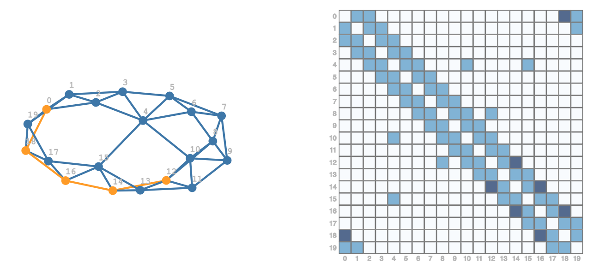

# Sparse Matrix Neat Examples in Raku

Anton Antonov  
[RakuForPrediction at WordPress](https://rakuforprediction.wordpress.com)  
[RakuForPrediction-book at GitHub](https://github.com/antononcube/RakuForPrediction-book)  
October 2024  

---

## Introduction

Sparse matrices are an essential tool in computational mathematics, allowing us to efficiently represent and manipulate large matrices that are predominantly composed of zero elements. In this blog post, we will delve into a few intriguing examples of sparse matrix utilization, specifically in the Raku programming language.

[](https://youtu.be/kQo3wpiUu6w)

### Examples Covered:

1. **Random Graph:**
   - We will explore the adjacency matrix of a random graph generated from a model of social interactions.
   - Additionally, we will overlay adjacency matrices with a shortest path within the graph.

2. **Movie-Actor Bipartite Graph:**
   - This example involves ingesting data about relationships between actors and movies.
   - We will demonstrate how sparse matrix algebra can facilitate certain information retrieval tasks.

3. **Sparse Matrices Visualization:**
   - We will discuss techniques for visualizing sparse matrices.

Support for sparse matrix linear algebra is a hallmark of a mature computational system. Here's a brief timeline of when some popular systems introduced sparse matrices:

| Language                  | Initial Introduction      | Confirmed Update          |
|---------------------------|---------------------------|---------------------------|
| MATLAB                    | 1992                      | ~                         |
| Mathematica / Wolfram Language | 2003                 | updated 2007              |
| Python                    | maybe since 2004          | updated 2006              |
| R                         | maybe since 2011          | updated 2014              |

---

## Setup

(*This setup is similar to the one used in the [Graph neat examples](https://rakuforprediction.wordpress.com/2024/12/01/graph-neat-examples-in-raku-set-1/).*)

---

## Random Graph Matrix

Let's begin by examining a random graph generated using the Watts-Strogatz model. This model is particularly useful for simulating social networks.

```raku
#% js
my $gl = Graph::Random.new: Graph::Distribution::WattsStrogatz.new(20,0.06);

my $gp = Graph::Path.new: $gl.find-shortest-path('0','12'), :directed;

my $grPlot = 
js-d3-graph-plot(
    $gl.edges(:dataset),
    highlight => [|$gp.vertex-list, |$gp.edge-list],
    background => '1F1F1F', 
    title-color => 'Silver', 
    edge-thickness => 3,
    vertex-size => 6,
    width => 600,
    force => {charge => {strength => -260, iterations => 2}, y => {strength => 0.2}, collision => {radius => 6, iterations => 10}, link => {distance => 4}}
    )
```


In the code above, we create a random graph with 20 vertices and a connection probability of 0.06. We also find the shortest path between vertices '0' and '12'.

### Corresponding Matrix

The adjacency matrix of this graph is a sparse matrix, where non-zero elements indicate the presence of an edge between vertices.

```raku
#% js
my $m = Math::SparseMatrix.new(edge-dataset => $gl.edges(:dataset), row-names => $gl.vertex-list.sort(*.Int));
say $m;
$m.Array ==> js-d3-matrix-plot(width => 400, margins => 15, :$tick-labels-font-size)
```

```
# Math::SparseMatrix(:specified-elements(86), :dimensions((20, 20)), :density(0.215))
```


Here, we visualize the graph matrix, the shortest path matrix, and the sum of these matrices:

```raku
#% js
my $m2 = Math::SparseMatrix.new(edge-dataset => $gp.edges(:dataset), row-names => $m.row-names);

my $m3 = $m.add($m2.multiply(0.75));

# Visualize
 my %opts = width => 350, margins => {top => 30, left => 16, right => 16, bottom => 16}, :$tick-labels-font-size, :$tick-labels-color, :$title-color, :!tooltip, color-palette => 'Inferno';
 [
   js-d3-matrix-plot($m.Array, |%opts, title => 'Graph'),
   js-d3-matrix-plot($m2.Array, |%opts, title => 'Shortest path graph'),
   js-d3-matrix-plot($m3.Array, |%opts, title => 'Sum')
 ].join("\n")
```


The sum matrix is printed in a "plain" format:

```raku
$m3.print
```


By comparing the graph and the sum matrix side-by-side, we can better understand the structure and relationships within the graph:

```raku
#% js
[
    $grPlot,
    js-d3-matrix-plot($m3.Array, margins => 16, :$tick-labels-font-size, :$tick-labels-color, width => 400, color-palette => 'Inferno')
].join("\n")
```



---

## Ingest Movie-Actor Data

Next, we will ingest a CSV file containing data about movies and actors. This data will be used to create a bipartite graph.

```raku
my $file = $*CWD ~ '/Sparse-matrices/dsMovieRecords.csv';
my @dsMovieRecords = data-import($file, 'csv', headers => 'auto');

deduce-type(@dsMovieRecords)
```

```
# Vector(Assoc(Atom((Str)), Atom((Str)), 6), 40)
```

### Movie Data Table

Here is a tabular representation of the movie data:

```raku
#% html
my @field-names = <Movie Actor Genre1 Genre2 Genre3 BoxOffice>;
@dsMovieRecords ==> to-html(:@field-names)
```


A summary of the data:

```raku
#% html
records-summary(@dsMovieRecords, :8max-tallies, :!say) 
==> to-html(:@field-names)
```


---

## Bipartite Graph

We construct a bipartite graph based on the movie-actor relationships.

```raku
my @rules = @dsMovieRecords.map({ $_<Movie> => $_<Actor> });
my $g = Graph.new(@rules) 
```

```
# Graph(vertexes => 27, edges => 40, directed => False)
```

The graph is confirmed to be bipartite:

```raku
$g.is-bipartite
```

```
# True
```

Here is the coloring of the graph:

```raku
.say for $g.bipartite-coloring.classify(*.value)
```

```
# 1 => [X2 => 1 The Lord of the Rings: The Fellowship of the Ring => 1 Pirates of the Caribbean: The Curse of the Black Pearl => 1 The Lord of the Rings: The Return of the King => 1 Pirates of the Caribbean: At World's End => 1 X-Men: The Last Stand => 1 The Lord of the Rings: The Two Towers => 1 Pirates of the Caribbean: Dead Man's Chest => 1]
# 0 => [Sean Astin => 0 Patrick Stewart => 0 Elijah Wood => 0 Rebecca Romijn => 0 Ian McKellen => 0 Keira Knightley => 0 Orlando Bloom => 0 Famke Janssen => 0 Bill Nighy => 0 Johnny Depp => 0 Jack Davenport => 0 Hugh Jackman => 0 Liv Tyler => 0 Halle Berry => 0 Andy Serkis => 0 Geoffrey Rush => 0 Stellan Skarsgård => 0 Anna Paquin => 0 Viggo Mortensen => 0]

```

```raku
#% js

$g.edges(:dataset) 
==> js-d3-graph-plot(
        highlight => @dsMovieRecords.map(*<Actor>).List,
        :$background, 
        title-color => 'silver',  
        width => 1000, 
        :$edge-thickness,
        :$vertex-size,
        vertex-color => 'Red',
        vertex-label-font-size => 12,
        vertex-label-color => 'Grey',
        vertex-label-font-family => 'Helvetica',
        :!directed,
        force => {charge => {strength => -680, iterations => 2}, collision => {radius => 10, iterations => 1}, link => {minDistance => 10}}
    )
```


---

## Sparse Matrix

We create a sparse matrix representing the movie-actor relationships:

```raku
my @allVertexNames = [|@dsMovieRecords.map(*<Movie>).unique.sort, |@dsMovieRecords.map(*<Actor>).unique.sort];
my %h = @allVertexNames Z=> ^@allVertexNames.elems;
```

```
# {Andy Serkis => 8, Anna Paquin => 9, Bill Nighy => 10, Elijah Wood => 11, Famke Janssen => 12, Geoffrey Rush => 13, Halle Berry => 14, Hugh Jackman => 15, Ian McKellen => 16, Jack Davenport => 17, Johnny Depp => 18, Keira Knightley => 19, Liv Tyler => 20, Orlando Bloom => 21, Patrick Stewart => 22, Pirates of the Caribbean: At World's End => 0, Pirates of the Caribbean: Dead Man's Chest => 1, Pirates of the Caribbean: The Curse of the Black Pearl => 2, Rebecca Romijn => 23, Sean Astin => 24, Stellan Skarsgård => 25, The Lord of the Rings: The Fellowship of the Ring => 3, The Lord of the Rings: The Return of the King => 4, The Lord of the Rings: The Two Towers => 5, Viggo Mortensen => 26, X-Men: The Last Stand => 6, X2 => 7}
```

The row and column names are sorted, with movie titles first, followed by actor names:

```raku
.say for @allVertexNames
```

```
# Pirates of the Caribbean: At World's End
# Pirates of the Caribbean: Dead Man's Chest
# Pirates of the Caribbean: The Curse of the Black Pearl
# The Lord of the Rings: The Fellowship of the Ring
# The Lord of the Rings: The Return of the King
# The Lord of the Rings: The Two Towers
# X-Men: The Last Stand
# X2
# Andy Serkis
# Anna Paquin
# Bill Nighy
# Elijah Wood
# Famke Janssen
# Geoffrey Rush
# Halle Berry
# Hugh Jackman
# Ian McKellen
# Jack Davenport
# Johnny Depp
# Keira Knightley
# Liv Tyler
# Orlando Bloom
# Patrick Stewart
# Rebecca Romijn
# Sean Astin
# Stellan Skarsgård
# Viggo Mortensen
```

The sparse matrix of the bipartite graph is constructed:

```raku
my $m = Math::SparseMatrix.new(edge-dataset => $g.edges(:dataset))
```

```
# Math::SparseMatrix(:specified-elements(80), :dimensions((27, 27)), :density(<80/729>))
```

```raku
#%js
$m.Array ==> js-d3-matrix-plot(width=>400)
```


To clearly show the bipartite nature of the matrix, we restructure it using pre-arranged row and column names:

```raku
$m = $m[@allVertexNames; @allVertexNames]
```

```
# Math::SparseMatrix(:specified-elements(80), :dimensions((27, 27)), :density(<80/729>))
```

The matrix plot now clearly indicates a bipartite graph:

```raku
#%js
$m.Array ==> js-d3-matrix-plot(width=>400)
```


For an alternative visualization, we can create an HTML "pretty print" of the sparse matrix:

```raku
#% html

$m
.to-html(:v)
.subst('<td>1</td>', '<td><b>●</b></td>', :g)
```


---

## Fundamental Information Retrieval Operation

Sparse matrices are particularly useful for information retrieval operations. Here, we demonstrate how to retrieve data about an actor, such as Orlando Bloom.

- Retrieve the row/vector corresponding to the actor and transpose it:

```raku
#%html
my $m-actor = $m['Orlando Bloom'].transpose;
$m-actor.to-html.subst('<td>0</td>','<td> </td>'):g
```


- Multiply the incidence matrix with the actor-vector to find other actors who starred in the same movies:

```raku
#% html
$m.dot($m-actor).to-html
```


---

## Matrix Plot (*Details*)

There are two primary methods for plotting sparse matrices.

### Via Tuples

This method uses a heatmap plot specification:

```raku
#% js
my @ds3D = $m.tuples.map({ <x y z tooltip>.Array Z=> [|$_.Array, "⎡{$m.row-names[$_[0]]}⎦ : ⎡{$m.column-names[$_[1]]}⎦ : {$_.tail}"] })».Hash;
js-d3-matrix-plot(
    @ds3D, 
    :$tooltip-background-color, 
    :$tooltip-color, 
    :$background, 
    width => 400)
```


Here is the corresponding ("coordinates") list plot:

```raku
#%js
$m.tuples
==> js-d3-list-plot(:$background, width => 400, :!grid-lines)
```


### As Dense Matrix

This method visualizes the matrix as a dense array:

```raku
#%js
$m.Array
==> js-d3-matrix-plot(width => 400)
```


### Larger Sparse Matrix

For larger matrices, a list plot might be more useful, especially if the matrix has a relatively high density.

```raku
my $gLarge = Graph::Random.new: Graph::Distribution::WattsStrogatz.new(100,0.1);
my $mLarge = Math::SparseMatrix.new(edge-dataset => $gLarge.edges(:dataset));
```

```
# Math::SparseMatrix(:specified-elements(444), :dimensions((100, 100)), :density(0.0444))
```

The corresponding graph:

```raku
#% js
$mLarge.tuples
==> js-d3-list-plot( :$background, width => 600, height => 600, :!grid-lines)
```


**Remark:** The list plot might be much more useful for large matrices with (relatively) high density.

Tuples dataset:

```raku
#%js
$mLarge.tuples(:dataset)
==> {rename-columns($_, (<i j x> Z=> <x y z>).Hash)}()
==> js-d3-matrix-plot(:$background, width => 600)
```


### Random Dense Matrix

Lastly, we explore a dense matrix example:

```raku
#%js
my @a = random-real(10, 48) xx 12;
@a = rand > 0.5 ?? @a.map(*.sort) !! @a.&transpose.map(*.sort.Array).&transpose;
say "dimensions : ", dimensions(@a);
js-d3-matrix-plot(@a, width => 1600, margins => 1, :$tick-labels-font-size, color-palette => <Turbo Plasma Warm Inferno Oranges>.pick, :$background)
```


---

## Reference

### Articles

[AA1] Anton Antonov,  
["RSparseMatrix for sparse matrices with named rows and columns"](https://mathematicaforprediction.wordpress.com/2015/10/08/rsparsematrix-for-sparse-matrices-with-named-rows-and-columns/),  
(2015),  
[MathematicaForPrediction at WordPress](https://mathematicaforprediction.wordpress.com).

### Packages

[AAp1] Anton Antonov,  
[Math::SparseMatrix Raku package](https://github.com/antononcube/Raku-Math-SparseMatrix),  
(2024),  
[GitHub/antononcube](https://github.com/antononcube).

[AAp2] Anton Antonov,  
[Math::SparseMatrix::Native Raku package](https://github.com/antononcube/Raku-Math-SparseMatrix-Native),  
(2024),  
[GitHub/antononcube](https://github.com/antononcube).

[AAp3] Anton Antonov,  
[Graph Raku package](https://github.com/antononcube/Raku-Graph),  
(2024),  
[GitHub/antononcube](https://github.com/antononcube).

[AAp4] Anton Antonov,  
[JavaScript::D3 Raku package](https://github.com/antononcube/Raku-JavaScript-D3),  
(2022-2024),  
[GitHub/antononcube](https://github.com/antononcube).
