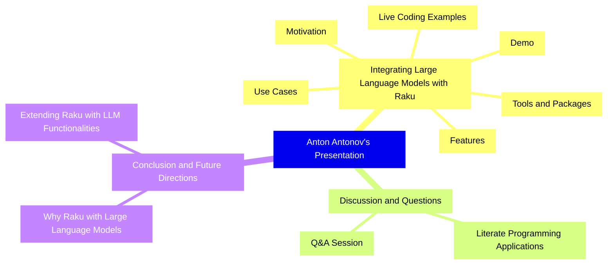
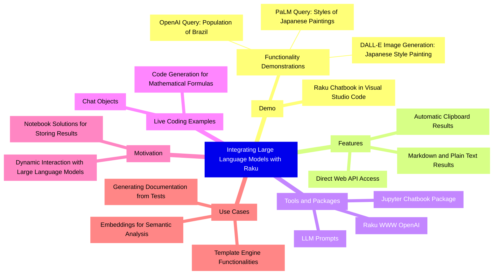

# Wisdom of "Integrating Large Language Models with Raku"

Anton Antonov   
[RakuForPrediction at WordPress](https://rakuforprediction.wordpress.com)   
2024-04-06

-----

## Introduction

This post applies various Large Language Model (LLM) summarization prompts to the transcript of 
The Raku Conference 2023 (TRC-2023) presentation
["Integrating Large Language Models with Raku"](https://www.youtube.com/watch?v=-OxKqRrQvh0) 
hosted by the YouTube channel [The Raku Conference](https://www.youtube.com/@therakuconference6823). 

In the presentation, Anton Antonov presents "Integrating Large Language Models with Raku," demonstrating functionalities in Visual Studio Code using a 
[Raku Chatbook](https://raku.land/zef:antononcube/Jupyter::Chatbook).
The presentation explores using OpenAI, PaLM (Google's large language model), and DALL-E (image generation service) through Raku, showcasing dynamic interaction with large language models, embedding them in notebooks, and generating code and markdown outputs.

**Remark:** The LLM results below were obtained from the "raw" transcript, which did not have punctuation.

**Remark:** The transcription software had problems parsing the names of the participants. Some of the names were manually corrected.

**Remark:** The applied "main" LLM prompt — "ExtractingArticleWisdom" —
is a modified version of a prompt (or pattern) with a similar name from
["fabric"](https://github.com/danielmiessler/fabric/), [DMr1].

**Remark:** The themes table was LLM obtained (with a prompt named "ThemeTableJSON".)

**Remark:** The content of this post was generated with the computational Markdown file 
["LLM-content-breakdown-template.md"](https://github.com/antononcube/RakuForPrediction-blog/blob/main/Articles/LLM-content-breakdown-template.md), 
which was executed (or woven) by the CLI script `file-code-chunks-eval` of 
["Text::CodeProcessing"](https://raku.land/zef:antononcube/Text::CodeProcessing), [AAp7].

Post’s structure:

1. **Themes**    
   Instead of a summary.
2. **Mind-maps**   
   An even better summary replacement!
3. **Summary, ideas, and recommendations**     
   The main course.

-----

## Themes

Instead of a summary consider this table of themes:

<table border="1"><thead><tr><th>theme</th><th>content</th></tr></thead><tbody><tr><td>Introduction</td><td>Anton Antonov introduces the presentation on integrating large language models with Raku and begins with a demonstration in Visual Studio Code.</td></tr><tr><td>Demonstration</td><td>Demonstrates using Raku chatbook in Jupyter Notebook to interact with OpenAI, PaLM, and DALL-E services for various tasks like querying information and generating images.</td></tr><tr><td>Direct Access vs. Chat Objects</td><td>Discusses the difference between direct access to web APIs and using chat objects for dynamic interaction with large language models.</td></tr><tr><td>Translation and Code Generation</td><td>Shows how to translate text and generate Raku code for solving mathematical problems using chat objects.</td></tr><tr><td>Motivation for Integrating Raku with Large Language Models</td><td>Explains the need for dynamic interaction between Raku and large language models, including notebook solutions and facilitating interaction.</td></tr><tr><td>Technical Details and Packages</td><td>Details the packages developed for interacting with large language models and the functionalities required for the integration.</td></tr><tr><td>Use Cases</td><td>Describes various use cases like template engine functionalities, embeddings, and generating documentation from tests using large language models.</td></tr><tr><td>Literate Programming and Markdown Templates</td><td>Introduces computational markdown for generating documentation and the use of Markdown templates for creating structured documents.</td></tr><tr><td>Generating Tests and Documentation</td><td>Discusses generating package documentation from tests and conversing between chat objects for training purposes.</td></tr><tr><td>Large Language Model Workflows</td><td>Covers workflows for utilizing large language models, including &#39;Too Long Didn&#39;t Read&#39; documentation utilization.</td></tr><tr><td>Comparison with Python and Mathematica</td><td>Compares the implementation of functionalities in Raku with Python and Mathematica, highlighting the ease of extending the Jupyter framework for Python.</td></tr><tr><td>Q&amp;A Session</td><td>Anton answers questions about extending the Jupyter kernel and other potential limitations or features that could be integrated.</td></tr></tbody></table>

------

## Mind-map

Here is a mind-map showing presentation's structure:

Here is a mind-map summarizing the main LLMs part of the talk:

-------

## Summary, ideas, and recommendations

#### SUMMARY

Anton Antonov presents "Integrating Large Language Models with Raku," demonstrating functionalities in Visual Studio Code using a Raku chatbook. 
The presentation explores using OpenAI, PaLM (Google's large language model), and DALL-E (image generation service) through Raku, showcasing dynamic interaction with large language models, embedding them in notebooks, and generating code and markdown outputs.

#### IDEAS:

- Integrating large language models with programming languages can enhance dynamic interaction and facilitate complex tasks.
- Utilizing Jupiter notebooks with Raku chatbook kernels allows for versatile programming and data analysis.
- Direct access to web APIs like OpenAI and PaLM can streamline the use of large language models in software development.
- The ability to automatically format outputs into markdown or plain text enhances the readability and usability of generated content.
- Embedding image generation services within programming notebooks can enrich content and aid in visual learning.
- Creating chat objects within notebooks can simulate interactive dialogues, providing a unique approach to user input and command execution.
- The use of prompt expansion and a database of prompts can significantly improve the efficiency of generating content with large language models.
- Implementing literate programming techniques can facilitate the generation of comprehensive documentation and tutorials.
- The development of computational markdown allows for the seamless integration of code and narrative, enhancing the learning experience.
- Utilizing large language models for generating test descriptions and documentation can streamline the development process.
- The concept of "few-shot learning" with large language models can be applied to generate specific outputs based on minimal input examples.
- Leveraging large language models for semantic analysis and recommendation systems can offer significant advancements in text analysis.
- The ability to translate natural language commands into programming commands can simplify complex tasks for developers.
- Integrating language models for entity recognition and data extraction from text can enhance data analysis and information retrieval.
- The development of frameworks for extending programming languages with large language model functionalities can foster innovation.
- The use of large language models in generating code for solving mathematical equations demonstrates the potential for automating complex problem-solving.
- The exploration of generating dialogues between chat objects presents new possibilities for creating interactive and dynamic content.
- The application of large language models in generating package documentation from tests highlights the potential for improving software documentation practices.
- The integration of language models with programming languages like Raku showcases the potential for enhancing programming environments with AI capabilities.
- The demonstration of embedding services like image generation and language translation within programming notebooks opens new avenues for creative and technical content creation.
- The discussion on the limitations and challenges of integrating large language models with programming environments provides insights into future development directions.

#### QUOTES:

- "Integrating large language models with Raku allows for dynamic interaction and enhanced functionalities within notebooks."
- "Direct access to web APIs streamlines the use of large language models in software development."
- "Automatically formatting outputs into markdown or plain text enhances the readability and usability of generated content."
- "Creating chat objects within notebooks provides a unique approach to interactive dialogues and command execution."
- "The use of prompt expansion and a database of prompts can significantly improve efficiency in content generation."
- "Literate programming techniques facilitate the generation of comprehensive documentation and tutorials."
- "Computational markdown allows for seamless integration of code and narrative, enhancing the learning experience."
- "Few-shot learning with large language models can generate specific outputs based on minimal input examples."
- "Leveraging large language models for semantic analysis and recommendation systems offers significant advancements in text analysis."
- "Translating natural language commands into programming commands simplifies complex tasks for developers."

#### HABITS:

- Utilizing Visual Studio Code for programming and data analysis.
- Embedding large language models within programming notebooks for dynamic interaction.
- Automatically formatting outputs to enhance readability and usability.
- Creating and utilizing chat objects for interactive programming.
- Employing prompt expansion and maintaining a database of prompts for efficient content generation.
- Implementing literate programming techniques for documentation and tutorials.
- Developing and using computational markdown for integrated code and narrative.
- Applying few-shot learning techniques with large language models for specific outputs.
- Leveraging large language models for semantic analysis and recommendation systems.
- Translating natural language commands into programming commands to simplify tasks.

#### FACTS:

- Raku chatbook kernels in Jupiter notebooks allow for versatile programming and data analysis.
- OpenAI, PaLM, and DALL-E are utilized for accessing large language models and image generation services.
- Large language models can automatically format outputs into markdown or plain text.
- Chat objects within notebooks can simulate interactive dialogues and command execution.
- A database of prompts improves the efficiency of generating content with large language models.
- Computational markdown integrates code and narrative, enhancing the learning experience.
- Large language models can generate code for solving mathematical equations and other complex tasks.
- The integration of large language models with programming languages like Raku enhances programming environments.
- Embedding services like image generation and language translation within programming notebooks is possible.
- The presentation explores the potential for automating complex problem-solving with AI.

#### REFERENCES:

- [Visual Studio Code](https://code.visualstudio.com/)
- [Raku Chatbook](https://raku.land/zef:antononcube/Jupyter::Chatbook)
- [OpenAI](https://openai.com/)
- [PaLM (Google's large language model)](https://ai.google/discover/palm2/)
- [DALL-E (image generation service)](https://openai.com/research/dall-e/)
- [Jupiter notebooks](https://jupyter.org/)
- [Mermaid diagrams](https://mermaid-js.github.io/mermaid/)
- [DeepL language translation service](https://www.deepl.com/translator)
- [`FindTextualAnswer` functionality in Mathematica](https://reference.wolfram.com/language/ref/FindTextualAnswer.html)

#### RECOMMENDATIONS:

- Explore integrating large language models with programming languages for enhanced functionalities.
- Utilize Jupiter notebooks with Raku chatbook kernels for versatile programming tasks.
- Take advantage of direct access to web APIs for streamlined software development.
- Employ automatic formatting of outputs for improved readability and usability.
- Create and utilize chat objects within notebooks for interactive programming experiences.
- Implement literate programming techniques for comprehensive documentation and tutorials.
- Develop computational markdown for an integrated code and narrative learning experience.
- Apply few-shot learning techniques with large language models for generating specific outputs.
- Leverage large language models for advanced text analysis and recommendation systems.
- Translate natural language commands into programming commands to simplify complex tasks.

-----

## References

### Articles

[AA1] Anton Antonov,
["Workflows with LLM functions"](https://rakuforprediction.wordpress.com/2023/08/01/workflows-with-llm-functions/),
(2023),
[RakuForPrediction at WordPress](https://rakuforprediction.wordpress.com).

[AA2] Anton Antonov,
["Day 21 – Using DALL-E models in Raku"](https://raku-advent.blog/2023/12/21/day-22-using-dall-e-models-in-raku/),
(2023),
[Raku Advent Calendar at WordPress](https://raku-advent.blog).

### Packages, repositories

[AAp1] Anton Antonov,
[Jupyter::Chatbook Raku package](https://github.com/antononcube/Raku-Jupyter-Chatbook),
(2023-2024),
[GitHub/antononcube](https://github.com/antononcube).

[AAp2] Anton Antonov,
[LLM::Functions Raku package](https://github.com/antononcube/Raku-LLM-Functions),
(2023-2024),
[GitHub/antononcube](https://github.com/antononcube).

[AAp3] Anton Antonov,
[LLM::Prompts Raku package](https://github.com/antononcube/Raku-LLM-Prompts),
(2023-2024),
[GitHub/antononcube](https://github.com/antononcube).

[AAp4] Anton Antonov,
[WWW::OpenAI Raku package](https://github.com/antononcube/Raku-WWW-OpenAI),
(2023-2024),
[GitHub/antononcube](https://github.com/antononcube).

[AAp5] Anton Antonov,
[WWW::PaLM Raku package](https://github.com/antononcube/Raku-WWW-PaLM),
(2023-2024),
[GitHub/antononcube](https://github.com/antononcube).

[AAp6] Anton Antonov,
[WWW::Gemini Raku package](https://github.com/antononcube/Raku-WWW-Gemini),
(2024),
[GitHub/antononcube](https://github.com/antononcube).

[AAp7] Anton Antonov,
[Text::CodeProcessing Raku package](https://github.com/antononcube/Raku-Text-CodeProcessing),
(2021-2023),
[GitHub/antononcube](https://github.com/antononcube).

[DMr1] Daniel Miessler,
["fabric"](https://github.com/danielmiessler/fabric/),
(2023-2024),
[GitHub/danielmiessler](https://github.com/danielmiessler).

### Videos

[AAv1] Anton Antonov,
["Integrating Large Language Models with Raku"](https://www.youtube.com/watch?v=-OxKqRrQvh0)
(2023),
[The Raku Conference at YouTube](https://www.youtube.com/@therakuconference6823). 
