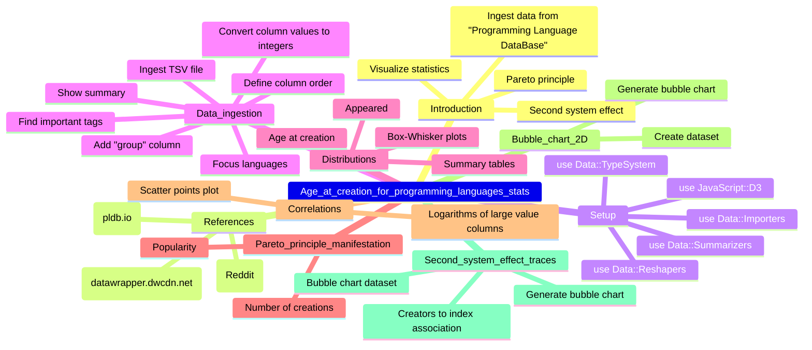

# [LLM] over «Age at creation for programming languages stats»

### *Tabular, visual, and textual breakdowns and summaries*

[Anton Antonov](https://rakuforprediction.wordpress.com/about/)

2024-06-16


***Text statistics:***


```
# [chars => 15420 words => 1932 lines => 304 totalTokens => 4680]
# Geographics-data-in-Raku-demo
```

-----

## Introduction


This post applies various Large Language Model (LLM) summarization prompts to the post
[«Age at creation for programming languages stats»](https://rakuforprediction.wordpress.com/2024/05/25/age-at-creation-for-programming-languages-stats/)
by [Anton Antonov](https://rakuforprediction.wordpress.com).


Here is a table of themes discussed in the text:


<table border="1"><thead><tr><th>theme</th><th>content</th></tr></thead><tbody><tr><td>Header</td><td>This section contains the title of the article, the blog menu, and links to related content.</td></tr><tr><td>Introduction</td><td>This section introduces the topic of the article, which is analyzing data about the age of programming language creators.</td></tr><tr><td>Data Sources</td><td>This section lists and briefly describes the data sources used in the analysis, including links to the datasets.</td></tr><tr><td>Data Ingestion and Preparation</td><td>This section details the steps taken to import, clean, and prepare the data for analysis using the Raku programming language.</td></tr><tr><td>Data Distributions</td><td>This section visualizes and summarizes the distributions of key variables like &#39;age at creation&#39; and &#39;year the language appeared&#39;.</td></tr><tr><td>Pareto Principle Analysis</td><td>This section explores the Pareto principle in the context of programming language creation, analyzing the distribution of language creation per creator and language popularity.</td></tr><tr><td>Correlation Analysis</td><td>This section investigates correlations between different variables in the dataset using scatter plots and logarithmic transformations.</td></tr><tr><td>Bubble Chart Visualization (2D)</td><td>This section presents a 2D bubble chart visualizing the relationship between language creation year, rank, and creator age.</td></tr><tr><td>Second System Effect Analysis</td><td>This section explores the &#39;second system effect&#39; by analyzing the relative popularity of languages created by the same team over time.</td></tr><tr><td>References</td><td>This section provides links to related articles, notebooks, packages, and videos relevant to the analysis.</td></tr><tr><td>Sharing and Discussion</td><td>This section includes social media sharing buttons, related posts, and a comment section for reader engagement.</td></tr><tr><td>Footer</td><td>This section contains the blog&#39;s name, subscription options, login information, and copyright details.</td></tr></tbody></table>


Post’s structure:

1. **Most important or provocative statements**    
   Extending the summary.
2. **Mind-map**   
   For orientation.
3. **Summary, ideas, and recommendations**     
   The main course.
4. **Sophisticated feedback**        
   While wearing hats of different colors.

-----

## Most important or provocative statements

Here is a table of the most important or provocative statements in the text:


<table border="1"><thead><tr><th>subject</th><th>statement</th></tr></thead><tbody><tr><td>Pareto principle in language creation</td><td>Pareto holds, as usual. Language creators tend to do it more than once.</td></tr><tr><td>Potential pitfall for experienced language creators</td><td>Beware the Second system effect.</td></tr><tr><td>Observation about the programming language &#39;J&#39;</td><td>The programming language J is a clear outlier because of creators&#39; ages.</td></tr></tbody></table>


------

## Mind-map

Here is a mind-map summarizing the text:





-------

## Summary, ideas, and recommendations


#### SUMMARY

This article, written by Anton Antonov, analyzes a dataset from the "Programming Language Database" to uncover insights about the ages of programming language creators and the success of their creations. It uses Raku programming language for data visualization and statistical analysis.

#### IDEAS:
- The Pareto principle applies to the number of programming languages created by individuals, with a small percentage of creators responsible for a large percentage of languages.
- There's a potential correlation between the number of languages a team creates and the success of those languages, hinting at a possible "Second system effect."
- The article uses data visualization to explore the relationship between a programming language's appearance year, the creator's age, and its popularity.
- Programming language "J" stands out in the dataset due to the unusually high age of its creators.
- The analysis considers the "First mover advantage," acknowledging that older languages have a head start in gaining popularity.
- Despite using a limited dataset, the article attempts to draw connections between creator behavior and language success.

#### QUOTES:
- "Language creators tend to do it more than once."
- "Beware the Second system effect."
- "Remark: We can see that ≈30% of the creators correspond to ≈50% of the languages."
- "Remark: Again, the plot above is 'wrong' -- programmers use more than one programming language."
- "Remark: Given the names of the data columns and the corresponding obvious interpretations we can say that the stronger correlations make sense."
- "Remark: The programming language J is a clear outlier because of creators' ages."
- "Remark: This section is mostly made 'for fun.'" 

#### HABITS:
- Uses Raku programming language for data analysis and visualization.
- Employs data visualization tools like bubble charts and histograms to represent data.
-  Investigates and applies statistical concepts like the Pareto principle to analyze trends.
-  Critically evaluates the limitations of the dataset and the conclusions drawn.
-  Provides references to other articles, notebooks, packages, and videos for further exploration.

#### FACTS:
- Programmers often use more than one programming language.
- The "Programming Language Database" contains information about programming languages and their creators.
- The article visualizes data using bubble charts, histograms, and scatter plots.

#### REFERENCES:
- "Programming Language Database"
- Raku programming language
- Pareto principle
- Second system effect
- First mover advantage
- Data::Importers Raku package
- Data::Reshapers Raku package
- Data::Summarizers Raku package
- JavaScript::D3 Raku package
- Jupyter::Chatbook Raku package
- The Ages of Programming Language Creators (pldb.io)
- The Ages of Programming Language Creators (datawrapper.dwcdn.net)
- The Ages of Programming Language Creators (Reddit)

#### RECOMMENDATIONS:
- Explore the relationship between the complexity of a programming language and its popularity.
- Investigate the impact of corporate backing on the success of a programming language.
- Analyze the evolution of programming languages over time, considering factors like paradigm shifts and technological advancements.


-------

## Sophisticated feedback 

In this section we try to give feedback and ideas while wearing different hats.
Like "black hat", "white hat", etc.

The LLM result is rendered below.

<hr width="65%">


## Idea Summary

The idea presents an analysis of programming language creators' age at the time of creation using data from the "Programming Language Database". The analysis explores various statistics, including the distribution of creators' ages, the relationship between creation year and age, and the potential influence of experience on language popularity (touching upon the Pareto principle and the Second System Effect). The analysis is presented in a blog post format, incorporating visualizations and code snippets.

## Feedback Table

<table>
  <thead>
    <tr>
      <th>Hat</th>
      <th>Perspective</th>
      <th>Feedback</th>
    </tr>
  </thead>
  <tbody>
    <tr>
      <td>White ⚪</td>
      <td>Information and Facts</td>
      <td>The analysis uses data from a specific source ("Programming Language Database") and focuses on the age of creators at the time of language creation.  It employs statistical methods like Pareto principle analysis and visualizes the data through histograms, scatter plots, and bubble charts. The blog post format includes code snippets, presumably in Raku. 
      </td>
    </tr>
    <tr>
      <td>Black ⚫</td>
      <td>Judgement and Caution</td>
      <td>The analysis relies heavily on the accuracy and completeness of the "Programming Language Database." There's a risk of bias in the data, potentially skewed towards more popular or well-documented languages.  The correlation analysis, while interesting, might be over-interpreting weak relationships. The Second System Effect analysis seems like a stretch, as it doesn't account for numerous confounding factors in language success.
      </td>
    </tr>
    <tr>
      <td>Gray 🐀</td>
      <td>Cynicism and Skepticism</td>
      <td>Oh, another "correlation equals causation" party with programming languages.  Let's be real, this is just a thinly veiled attempt to prove that programmers peak at 25 and everything after is downhill. And that Second System Effect analysis? Pure conjecture.  Someone's trying to justify their pet language's obscurity.
      </td>
    </tr>
    <tr>
      <td>Red ❤️</td>
      <td>Feelings and Emotion</td>
      <td>The visual presentation of the analysis is appealing and engaging. The use of bubble charts, in particular, makes the data exploration fun and intriguing.  However, the attempt to draw conclusions about the Second System Effect feels forced and detracts from the overall impact.
      </td>
    </tr>
    <tr>
      <td>Yellow 💛</td>
      <td>Benefits and Creativity</td>
      <td>The blog post idea is interesting and could be a great way to engage the programming community in discussions about language design and the evolution of programming paradigms. The visualizations are well-chosen and could be further enhanced with interactive elements.  Exploring alternative factors influencing language success beyond age, such as industry trends or corporate backing, could add depth to the analysis.
      </td>
    </tr>
    <tr>
      <td>Green 💰</td>
      <td>Profitability and Potential</td>
      <td>The blog post itself might not have direct monetization potential, but it can be leveraged to build a following and establish the author as a thought leader in the programming language space. This can lead to opportunities such as speaking engagements, consulting, or even book deals. Additionally, the data analysis skills demonstrated could be valuable for companies involved in developer marketing or technology forecasting. 
      </td>
    </tr>
    <tr>
      <td>Blue 💙</td>
      <td>Usefulness and Opportunities</td>
      <td>The analysis could be made more useful by making the data and code publicly available, allowing others to replicate and build upon the findings.  Additionally, creating interactive visualizations that allow users to explore the data themselves would significantly enhance engagement and learning.  The blog post could also be expanded into a series, delving deeper into specific aspects of programming language history and evolution.
      </td>
    </tr>
    <tr>
      <td>Purple 💜</td>
      <td>Assessment and Direction</td>
      <td>The core idea of analyzing programming language creator age is intriguing and well-presented.  However, the analysis should focus on robust statistical exploration and visualization, avoiding speculative conclusions, particularly regarding the Second System Effect.  Prioritize clarity and objectivity, emphasizing data-driven insights.  Leverage the blog post format to foster community engagement and explore potential future research directions.  
      </td>
    </tr>
  </tbody>
</table>

