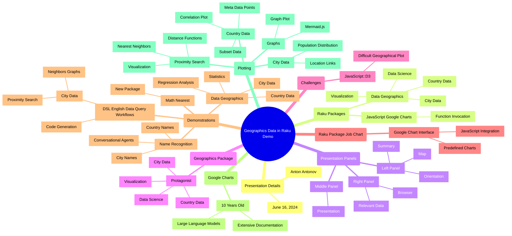

# [LLM] over "Geographics data in Raku demo"

### *Tabular, visual, and textual breakdowns and summaries*

[Anton Antonov](https://rakuforprediction.wordpress.com/about/)

2024-06-16


***Text statistics:***


```
# [chars => 25979 words => 4966 lines => 1 totalTokens => 5678]
# Geographics-data-in-Raku-demo
```

-----

## Introduction


This post applies various Large Language Model (LLM) summarization prompts to the transcript of the program
[«Geographics data in Raku demo»](https://www.youtube.com/watch?v=Rkk_MeqLj_k)
by the YouTube channel [Anton Antonov](https://www.youtube.com/@AAA4Prediction).


Here is a table of themes discussed in the text:


<table border="1"><thead><tr><th>theme</th><th>content</th></tr></thead><tbody><tr><td>Introduction</td><td>Hello, this presentation is titled geographics data in Raku demo. My name is Anton Antonov today&#39;s June 16, 2024.</td></tr><tr><td>Presentation Overview</td><td>This presentation is mostly about Raku packages data geographics and JavaScript google charts.</td></tr><tr><td>Tools and Panels</td><td>The left panel is with a might, the middle is the presentation itself, and the right is a browser.</td></tr><tr><td>Geographics Package</td><td>The geographics package has country and city data visualization. It is essential for data science.</td></tr><tr><td>"JavaScript::D3" Challenges</td><td>Initially, I wrote this presentation with "JavaScript::D3", but it was difficult to make a geographical plot.</td></tr><tr><td>Google Charts</td><td>Google Charts is a relatively older framework for making pre-canned types of charts.</td></tr><tr><td>Presentation Structure</td><td>The presentation uses Google charts package DSL to geographics and demonstrates name recognition and conversational agents.</td></tr><tr><td>Data Geographics Package</td><td>The package data geographics also has city data, and I will show some related statistics.</td></tr><tr><td>City Data Analysis</td><td>With city data, we will do some neighbor graphs and proximity search using the new package math nearest.</td></tr><tr><td>Geographics Package Size</td><td>Geographics is currently around 30 MB. I need to figure out how to make it smaller and more shareable.</td></tr><tr><td>Country Data</td><td>We will see country data and perform rudimentary analysis with linear regression over GDP and electricity production.</td></tr><tr><td>Data Visualization</td><td>Using Google charts, we will visualize data with scatter plots, regression lines, and logarithmic scales.</td></tr><tr><td>City Data Details</td><td>City data includes locations, populations, and links for visualization.</td></tr><tr><td>Proximity Search</td><td>We will use the nearest neighbor function to find cities within a certain distance.</td></tr><tr><td>Name Recognition</td><td>Name recognition is provided by DSL entity geographics for identifying city and country names.</td></tr><tr><td>Graphs and Visualizations</td><td>We will create neighbor graphs and visualize them using "WWW::MermaidInk" and graph plot.</td></tr><tr><td>Future Plans</td><td>Future plans include upgrading the packages and exploring more functionalities with "JavaScript::D3".</td></tr><tr><td>Conclusion</td><td>In summary, geographics and related packages allow for informative statistical analysis and visualizations.</td></tr><tr><td>Thank You</td><td>Thank you for your attention.</td></tr></tbody></table>


**Remark:** The LLM results below were obtained from the "raw" transcript, which did not have punctuation.

**Remark:** The transcription software had problems parsing the names of mentioned people and locations. Some of the names were manually corrected.


Post’s structure:

1. **Most important or provocative statements**    
   Extending the summary.
2. **Mind-map**   
   For orientation.
3. **Summary, ideas, and recommendations**     
   The main course.
4. **Sophisticated feedback**        
   While wearing hats of different colors.

-----

## Most important or provocative statements

Here is a table of the most important or provocative statements in the text:


<table border="1"><thead><tr><th>subject</th><th>statement</th></tr></thead><tbody><tr><td>Presentation Overview</td><td>This presentation is mostly about two Raku packages: data geographics and JavaScript google charts.</td></tr><tr><td>Geographics Package</td><td>The geographics package is the protagonist of this presentation. It has country data and city data visualization.</td></tr><tr><td>JavaScript Google Charts</td><td>It was much easier to program this Raku package job chart which interfaces to chart google chart.</td></tr><tr><td>Panels Used</td><td>The left panel is with a map, the middle is the presentation itself, and the rightmost part is a browser with which I&#39;m going to show some relevant data.</td></tr><tr><td>Data Geographics Package</td><td>Data geographics also includes city data and related statistics.</td></tr><tr><td>DSL English Data Query Workflows</td><td>I&#39;m also going to use this package DSL English data query workflows, which allows for generation of code.</td></tr><tr><td>Math Nearest Package</td><td>I&#39;m going to be using another new package called math nearest.</td></tr><tr><td>Large Language Models</td><td>Large language models should be extensively trained with discussions or documents over Google chart.</td></tr><tr><td>Geographics Package Size</td><td>The package data geographics is a little bit too large right now; it&#39;s around 30 MB with all of the data for countries and cities.</td></tr><tr><td>Country Data</td><td>I&#39;m going to show some country data and do some rudimentary analysis with linear regression over the gross domestic product and electricity production.</td></tr><tr><td>City Data</td><td>City data includes locations, populations, and links, which can be visualized with Google.</td></tr><tr><td>Proximity Search</td><td>With the city data, we&#39;re going to do some neighbors graphs and proximity search.</td></tr><tr><td>Graph Visualization</td><td>I&#39;m using the package "WWW::MermaidInk" to visualize graphs.</td></tr><tr><td>Future Plans</td><td>I have future plans to upgrade many aspects of these packages and functionalities.</td></tr></tbody></table>


------

## Mind-map

Here is a mind-map summarizing the text:





-------

## Summary, ideas, and recommendations


### SUMMARY
Anton Antonov presents a demonstration of using Raku packages, Data::Geographics and JavaScript Google Charts, to visualize geographic data. The presentation covers country and city data visualization, statistical analysis, and proximity searches. Anton also discusses the ease of using Google Charts over other frameworks for creating informative plots.

### IDEAS
- Data::Geographics package specializes in country and city data visualization.
- JavaScript Google Charts is used for creating a variety of chart types.
- The presentation uses three panels: a map for orientation, the main presentation, and a browser for relevant data.
- Data visualization is crucial in data science for understanding geographic distributions.
- Programming geographic plots is easier with Google Charts compared to other JavaScript libraries.
- Google Charts has extensive documentation and is well-suited for large language models.
- The presentation demonstrates name and entity recognition for conversational agents.
- Data::Geographics package is large and needs optimization for better data sharing.
- Statistical analysis is performed using city and country data, including regression over GDP and electricity production.
- Proximity searches and nearest neighbor graphs are created using the Math::Nearest package.
- The presentation includes practical examples of generating code for data queries.
- Visualization of city data includes population and location links for easy access in a browser.
- Aggregation of city data by state allows for analysis of population distributions.
- The use of logarithmic scales helps in visualizing exponential dependencies in data.
- Principal verification plots illustrate the 80/20 rule in population distributions.
- The presentation shows the creation of custom fitting lines using linear regression.
- Graph plots are created using the Graph::Plot package in Raku.
- The presentation highlights the flexibility of combining Raku with Google Charts for data visualization.
- Future plans include enhancing "JavaScript::D3" functionalities for better graph plotting.
- Visualization includes using both static and interactive charts for better data interpretation.
- The presentation demonstrates the integration of various Raku packages for comprehensive data analysis.

### QUOTES
- "The geographics package is the protagonist of this presentation."
- "In data science, visualization is very important."
- "Programming geographic plots with Google Charts is relatively easier."
- "Large language models should be extensively trained with discussions over Google Charts."
- "The Data::Geographics package is a little bit too large right now."
- "We can make very informative plots over this geographic data using both of these packages."
- "I can still plot it, which is not necessarily allowed by Google Charts."
- "I am designing my own type of interface which should be appealing to generic users."
- "The nearest neighbor function uses the distance function from Data::Geographics."
- "Principal verification plots illustrate the 80/20 rule in population distributions."
- "Visualization of city data includes population and location links for easy access in a browser."
- "The presentation demonstrates the integration of various Raku packages for comprehensive data analysis."
- "Statistical analysis is performed using city and country data, including regression over GDP and electricity production."
- "Aggregation of city data by state allows for analysis of population distributions."
- "The presentation shows the creation of custom fitting lines using linear regression."
- "Graph plots are created using the Graph::Plot package in Raku."
- "Future plans include enhancing "JavaScript::D3" functionalities for better graph plotting."
- "Visualization includes using both static and interactive charts for better data interpretation."

### HABITS
- Using three panels for better orientation and presentation flow.
- Performing statistical analysis on geographic data for deeper insights.
- Utilizing extensive documentation to enhance understanding and usage of tools.
- Aggregating data by relevant categories (e.g., state) for more meaningful analysis.
- Applying logarithmic scales to better visualize exponential dependencies.
- Customizing fitting lines in data plots for improved accuracy.
- Integrating multiple Raku packages for comprehensive data analysis.
- Creating interactive charts for more dynamic data visualization.
- Continuously optimizing data packages for better performance and shareability.
- Using browser links for easy access and verification of data points.

### FACTS
- Data::Geographics package specializes in country and city data visualization.
- JavaScript Google Charts is well-documented and suitable for large language models.
- The presentation demonstrates statistical analysis using regression over GDP and electricity production.
- Proximity searches and nearest neighbor graphs are created using the Math::Nearest package.
- Principal verification plots illustrate the 80/20 rule in population distributions.
- Graph plots can be created using the Graph::Plot package in Raku.
- The Data::Geographics package is around 30 MB with country and city data.
- The presentation uses both static and interactive charts for data visualization.
- The nearest neighbor function uses the distance function from Data::Geographics.
- Future plans include enhancing "JavaScript::D3" functionalities for better graph plotting.

### REFERENCES
- Data::Geographics package
- JavaScript Google Charts
- Math::Nearest package
- Graph::Plot package in Raku
- Principal verification plots
- DSL::Entity::Geographics package
- WW::Mermaid::Ink package

### RECOMMENDATIONS
- Use Google Charts for easier and more flexible geographic data visualization.
- Optimize large data packages for better performance and shareability.
- Aggregate data by relevant categories for more meaningful analysis.
- Apply logarithmic scales to better visualize exponential dependencies.
- Customize fitting lines in data plots for improved accuracy.
- Integrate multiple Raku packages for comprehensive data analysis.
- Create interactive charts for more dynamic data visualization.
- Use browser links for easy access and verification of data points.
- Enhance "JavaScript::D3" functionalities for better graph plotting.
- Utilize extensive documentation to enhance understanding and usage of tools.


-------

## Sophisticated feedback 

In this section we try to give feedback and ideas while wearing different hats.
Like "black hat", "white hat", etc.

The LLM result is rendered below.

<hr width="65%">


### Summary of the Idea

Anton Antonov's presentation demonstrates the use of two Raku packages, `Data::Geographics` and `JavaScript::Google::Charts`, to visualize geographical data. 
The presentation includes a detailed explanation of the functionalities offered by these packages, including data visualization, nearest neighbor searches, and statistical analysis. 
Anton also discusses the challenges faced while using these packages and the solutions implemented to overcome them, such as switching from "JavaScript::D3" to "JavaScript::Google::Charts". 
The presentation is structured with a left panel for orientation, a middle panel for the main content, and a right panel for relevant data browsing. 
Anton showcases various plots, statistical analyses, and visualizations, emphasizing the flexibility and utility of these Raku packages in data science applications.


<table border="1">
  <tr>
    <th>Hat Name</th>
    <th>Perspective</th>
    <th>Feedback</th>
  </tr>
  <tr>
    <td>White Hat</td>
    <td>Information and Facts</td>
    <td>The presentation provides a comprehensive look at the capabilities of the Raku packages `data-geographics` and `JavaScript Google Charts`. It includes detailed explanations of how to use these packages for data visualization, statistical analysis, and nearest neighbor searches. The data presented is factual, with specific examples and code snippets demonstrating the functionalities.</td>
  </tr>
  <tr>
    <td>Black Hat</td>
    <td>Judgement and Caution</td>
    <td>While the presentation is thorough, it may be overwhelming due to its length and complexity. The transition from "JavaScript::D3" to "JavaScript::Google::Charts" is mentioned, but the reasons for this switch could be elaborated further. Additionally, the presentation assumes a high level of familiarity with Raku, which might alienate beginners.</td>
  </tr>
  <tr>
    <td>Gray Hat</td>
    <td>Cynicism and Skepticism</td>
    <td>Is this presentation a genuine attempt to educate, or is it just a showcase of Anton's technical prowess? The frequent mention of Raku and its packages might be seen as a subtle way to promote the language. Also, the complexity of the examples might be more about showing off than actually helping the audience understand.</td>
  </tr>
  <tr>
    <td>Red Hat</td>
    <td>Feelings and Emotion</td>
    <td>The presentation feels detailed and passionate, reflecting Anton's deep understanding and enthusiasm for the subject. However, it might come off as intimidating to those not well-versed in Raku or data science. The emotional tone is one of expertise and confidence, which can be inspiring but also daunting.</td>
  </tr>
  <tr>
    <td>Yellow Hat</td>
    <td>Benefits and Creativity</td>
    <td>This presentation is a goldmine for anyone looking to delve into geographical data visualization using Raku. The detailed examples and explanations provide a clear path for replicating and building upon Anton's work. The use of Google Charts adds a layer of accessibility and flexibility, making it easier for users to create sophisticated visualizations.</td>
  </tr>
  <tr>
    <td>Green Hat</td>
    <td>Profitability and Potential</td>
    <td>The potential for monetizing this work is significant. By packaging these tools and examples into a comprehensive course or workshop, Anton could attract data scientists and developers looking to enhance their skills. Additionally, the techniques demonstrated could be applied to real-world data analysis projects, providing valuable insights for businesses and researchers.</td>
  </tr>
  <tr>
    <td>Blue Hat</td>
    <td>Usefulness and Opportunities</td>
    <td>The presentation is highly useful for anyone interested in geographical data analysis and visualization. Opportunities for further exploration include integrating more data sources, enhancing the user interface for easier interaction, and possibly creating a dedicated platform or application that leverages these Raku packages for broader use.</td>
  </tr>
  <tr>
    <td>Purple Hat</td>
    <td>Assessment and Direction</td>
    <td>Summarizing the feedback from all perspectives, the presentation is a robust and detailed exploration of using Raku for geographical data visualization. While it excels in technical depth and potential applications, it may benefit from simplification and better accessibility for beginners. Moving forward, focusing on user-friendly documentation, tutorials, and possibly commercializing the knowledge through courses or software could be valuable steps.</td>
  </tr>
</table>

