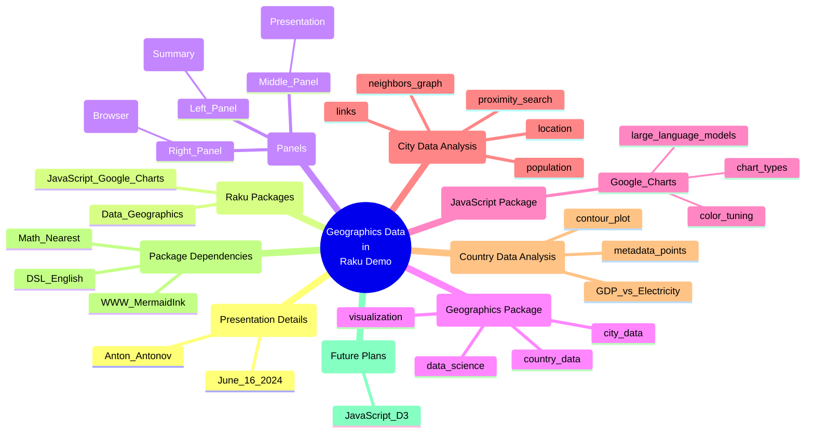

# [LLM] over "Geographics data in Raku demo"

### *Tabular, visual, and textual breakdowns and summaries*

[Anton Antonov](https://rakuforprediction.wordpress.com/about/)

2024-06-16


***Text statistics:***


```
# [chars => 26003 words => 4951 lines => 1 totalTokens => 5712]
# Geographics-data-in-Raku-demo
```

-----

## Introduction


This post applies various Large Language Model (LLM) summarization prompts to the transcript of the program
[«Geographics data in Raku demo»](https://www.youtube.com/watch?v=Rkk_MeqLj_k)
by the YouTube channel [Anton Antonov](https://www.youtube.com/@AAA4Prediction).


Here is a table of themes discussed in the text:


<table border="1"><thead><tr><th>theme</th><th>content</th></tr></thead><tbody><tr><td>Introduction</td><td>Hello, this presentation is titled geographics data in Raku demo. My name is Anton Antonov today&#39;s June 16, 2024.</td></tr><tr><td>Overview</td><td>This presentation is mostly about two Raku packages &#39;Data::Geographics&#39; and &#39;JavaScript::Google::Charts&#39;.</td></tr><tr><td>Presentation Panels</td><td>The left panel is a map, the middle is the presentation, and the rightmost part is a browser for data.</td></tr><tr><td>Geographics Package</td><td>The geographics package is the protagonist. It has country and city data visualization, important in geographics and data science.</td></tr><tr><td>JavaScript Package</td><td>JavaScript::Google::Charts interfaces with Google Charts for making pre-canned types of charts.</td></tr><tr><td>Data::Geographics Package</td><td>Data::Geographics has country and city data. It can recognize city and country names, useful for conversational agents.</td></tr><tr><td>Data Size</td><td>Data::Geographics is currently too large. Efforts are being made to make it smaller and more shareable.</td></tr><tr><td>Country Data Analysis</td><td>We&#39;ll see country data analysis, including regression over GDP and electricity production.</td></tr><tr><td>City Data Analysis</td><td>City data includes locations, populations, and links. We&#39;ll do some neighbor graphs and proximity search.</td></tr><tr><td>Comparison with JavaScript</td><td>Discussing differences between using Google Charts and JavaScript::D3 for plotting.</td></tr><tr><td>Large Language Models</td><td>Large language models should be trained with discussions or documents about Google Charts.</td></tr><tr><td>Plot Customization</td><td>How to tune plot colors and other elements using Google Charts.</td></tr><tr><td>Why Raku?</td><td>Demonstrating the advantages of using Raku for generating and customizing plots.</td></tr><tr><td>Table Data</td><td>Showing a table with country names, native names, area, population, GDP, and electricity production.</td></tr><tr><td>Correlation Plot</td><td>Plotting GDP vs. electricity production, showing trends and regression lines.</td></tr><tr><td>Contour Plot</td><td>Creating contour plots for country boundaries using Data::Geographics.</td></tr><tr><td>City Data Visualization</td><td>Visualizing city data from the USA, including population and location links.</td></tr><tr><td>State Aggregation</td><td>Aggregating city data by state to analyze population and number of cities.</td></tr><tr><td>Principal Plot</td><td>Creating a principal plot to show the distribution of cities and populations across states.</td></tr><tr><td>Proximity Search</td><td>Using the nearest package for proximity search to find neighbors within a certain distance.</td></tr><tr><td>Name Recognition</td><td>Using DSL entity geographics for name recognition of cities and countries.</td></tr><tr><td>Neighbor Graphs</td><td>Creating neighbor graphs using the nearest package and visualizing them with MermaidInk.</td></tr><tr><td>Future Plans</td><td>Discussing future plans for enhancing the packages and functionalities.</td></tr><tr><td>Specialized Plots</td><td>Demonstrating specialized plots like random Mandel plots using JavaScript::D3.</td></tr><tr><td>Conclusion</td><td>Summarizing the capabilities of Data::Geographics and JavaScript::Google::Charts for geographic data visualization.</td></tr><tr><td>Thank You</td><td>Thank you for your attention.</td></tr></tbody></table>


**Remark:** The LLM results below were obtained from the "raw" transcript, which did not have punctuation.

**Remark:** The transcription software had problems parsing the names of mentioned people and locations. Some of the names were manually corrected.


Post’s structure:

1. **Most important or provocative statements**    
   Extending the summary.
2. **Mind-map**   
   For orientation.
3. **Summary, ideas, and recommendations**     
   The main course.
4. **Sophisticated feedback**        
   While wearing hats of different colors.

-----

## Most important or provocative statements

Here is a table of the most important or provocative statements in the text:


<table border="1"><thead><tr><th>subject</th><th>statement</th></tr></thead><tbody><tr><td>Introduction</td><td>Hello, this presentation is titled geographics data in Raku demo. My name is Anton Antonov today&#39;s June 16, 2024.</td></tr><tr><td>Packages</td><td>This presentation is mostly about this to Raku packages &#39;Data::Geographics&#39; and &#39;JavaScript::Google::Charts&#39;.</td></tr><tr><td>Plotting</td><td>You can see here in the plot some the data from the first has been used and I have invoke the function from the second package to make this geographical plot.</td></tr><tr><td>Panels</td><td>The left panel is with a map, the middle is the presentation itself, and the rightmost part is a browser with which I&#39;m going to show some relevant data.</td></tr><tr><td>Geographics Package</td><td>The geographics package is the protagonist of this presentation. It has country data and city data visualization.</td></tr><tr><td>Programming</td><td>Initially I wrote this presentation with JavaScript D3, but it was difficult for me to make a geographical plot with it.</td></tr><tr><td>Google Charts</td><td>Google chart is relatively alter framework for making pre-can Types of charts.</td></tr><tr><td>JavaScript</td><td>JavaScript is another JavaScript for graphics but it&#39;s lower level and it&#39;s much more flexible.</td></tr><tr><td>Name Recognition</td><td>We can do name interior recognition with it and see if you make conversational agents and you want to recognize some recognize city names or country names you can use this package.</td></tr><tr><td>Data Size</td><td>Geography is a little bit too big. I&#39;m going to explain that and I need to figure out how to make it smaller.</td></tr><tr><td>Country Data</td><td>We&#39;re going to see country data, some kind of rudimentary analysis with sailing regression over the gross domestic product and electricity production.</td></tr><tr><td>City Data</td><td>The package &#39;Data::Geographics&#39; also has cities data and I&#39;m going to be showing some related statistics.</td></tr><tr><td>DSL English</td><td>I&#39;m also going to use this package DSL English data query workflows, which allows for generation of code.</td></tr><tr><td>Neighbors Graphs</td><td>With the city data we&#39;re going to do some neighbors graphs. We&#39;re going to do some proximity search and I&#39;m going to be using another new package called math nearest.</td></tr><tr><td>Google Charts Documentation</td><td>Google charts is well-documented and makes it very good for large language models.</td></tr><tr><td>Plot Customization</td><td>How exactly do you tune those colors right so figuring out is it background is it just background color right so it&#39;s like for example, the data less regions which gray right so these are the ones which the package doesn&#39;t know about.</td></tr><tr><td>Raku and Google Charts</td><td>Raku though is just a conduit so to speak to Google charts, I&#39;m not trying to put my own options.</td></tr><tr><td>Geographical Data</td><td>This data here I&#39;m going to use some this to last column and make a correlation plot.</td></tr><tr><td>Linear Regression</td><td>Let&#39;s use that as a motivation to make our own fitting so here I&#39;m using this new package math fitting, which can do at this point it can do linear regression only into dimensions.</td></tr><tr><td>Combination Chart</td><td>This is what you see. We are basically plotting the fit and we have this kind of nice nice kind of looking fit.</td></tr><tr><td>Contour Plot</td><td>What you see here it&#39;s basically to us right contour, which is a contour plot is being made for the coordinates of the boundary of a certain country United States.</td></tr><tr><td>City Data</td><td>City data it&#39;s not that populated with different types of data points it has locations populations actually has also links and this is something fun too to show.</td></tr><tr><td>City Visualization</td><td>The location link is kind of nice because we can visualize it with Google right so we can if I click on this location links I can go to the browser and see where this is.</td></tr><tr><td>Population Distribution</td><td>We&#39;re going to look into the distributions of form or across the states of population and number of cities.</td></tr><tr><td>Data Aggregation</td><td>I need to do something like this right I&#39;m basically taking the city. I am grouping by states and I am finding the number of the cities in each state and the sum the population.</td></tr><tr><td>Logarithmic Plot</td><td>If I log out of the populations then we start to have something cool something like I mean it&#39;s not exactly linear, but it is somewhat over rectangular shapes so it is a linear dependence.</td></tr><tr><td>Proximity Searches</td><td>We&#39;re going to move to actually doing proximity searches and using this new package nearest.</td></tr><tr><td>Nearest Neighbors</td><td>I&#39;m finding the actual neighbors within hundred kilometers so the distance function this one here by default uses meters distance is a function which comes from &#39;Data::Geographics&#39;.</td></tr><tr><td>Name Recognition</td><td>The function is provided by DSL entity geographics and ETS has some nice properties.</td></tr><tr><td>Graphs</td><td>This is very very interesting application of course to the nearest functionalist in my nearest.</td></tr><tr><td>Mermaid Graphs</td><td>I&#39;m calling the function neighbor and I&#39;m asking the format to be given into mermaids.</td></tr><tr><td>Graph Plot</td><td>This is graph plot, visual plot type of visualization this graph plot is in right so it comes with the I don&#39;t need to go to an external service for it.</td></tr><tr><td>Distance Function</td><td>I can say what I want the distance function to be within miles.</td></tr><tr><td>Future Plans</td><td>I do have some future plans for this quite a lot of this needs to be upgraded in someway.</td></tr><tr><td>Google Charts Limitations</td><td>Some of the things I can do here which are more specialized and they don&#39;t necessarily come from the fridge right but I have done it so I&#39;m going to demonstrate this kind of one of my favorite things examples so to be honest so actually it&#39;s not plopped.</td></tr><tr><td>Summary</td><td>We can make informative plots over this geographic data using both of this packages group free and just group chat.</td></tr></tbody></table>


------

## Mind-map

Here is a mind-map summarizing the text:





-------

## Summary, ideas, and recommendations


### SUMMARY
Anton Antonov demonstrates the use of two Raku packages, "Data::Geographics" and "JavaScript::Google::Charts," for visualizing geographic data. He showcases functionalities such as country and city data visualization, regression analysis, proximity searches, and nearest neighbor graphs.

### IDEAS
- Using Raku packages to visualize geographic data.
- Combining "Data::Geographics" and "JavaScript::Google::Charts" for enhanced visualization.
- Name and entity recognition using geographic data.
- Reducing the size of geographic datasets for better shareability.
- Performing regression analysis on GDP and electricity production data.
- Creating scatter plots and fitting regression lines using Google Charts.
- Utilizing DSL workflows for generating code for city data analysis.
- Proximity searches and nearest neighbor graphs using geographic data.
- Using the Haversine formula for distance calculations.
- Visualizing geographic data in different formats, such as contour plots and combination charts.
- Aggregating and analyzing city data by states.
- Plotting population distributions and number of cities across states.
- Exploring principal component analysis for city data.
- Using "WWW::MermaidInk" for visualizing nearest neighbor graphs.
- Customizing tooltips and chart appearances in Google Charts.
- Utilizing logarithmic scales for better data representation.
- Implementing linear regression for multi-dimensional data.
- Creating interactive visualizations with Raku and Google Charts.
- Exploring the limitations and capabilities of different charting libraries.
- Future plans for enhancing the functionality of "JavaScript::D3" in Raku.

### QUOTES
- "The geographics package is the protagonist of this presentation."
- "Geography is a little bit too big. I'm going to explain that and I need to figure out how to make it smaller."
- "Large language models should be extensively trained with discussions or documents over right about Google chat."
- "This package this silence geographics is very closer related to 'Data::Geographics' but they independent right now."
- "I want to figure out how to make it small and what kind of ways we can make the data in smaller."
- "I can show tread Trent lines I can fit this regression line."
- "This book is using the drip of framework. The drip of framework is based on browser technology."
- "This object also knows the residual of the approximation and I plot the residual if you follow here."
- "I'm actually making a combination chart and I'm saying that my plot is a scatterplot but treat treat them."
- "We can see if if I find this I can do that but actually doing geographical plot like the one I was showing kinda opening here."
- "The grass themselves I can actually use the GG Graphs so cold for graphs it's very nice very interesting."
- "This is just not easy to do Just not easy to do with with chats right and but you know I I could figure out how to use the fridges to make this kind of plots."
- "So we can see Jelic girl if I put her here if I disable the scale this plot becomes some very informative because China and USA dominate the whole."
- "This is like yeah Like 40 40% of the states have 803010044500f the populations right."
- "What happens here is what I have sorted the cities according to the states according to the number of cities we have then I accumulate those number here progressively, and I normalize by the total."

### HABITS
- Utilizing Raku packages for data visualization.
- Continuously exploring new functionalities and packages in Raku.
- Generating code workflows for efficient data analysis.
- Customizing chart appearances and tooltips for better data representation.
- Aggregating and analyzing data by different entities.
- Regularly updating and enhancing the functionality of existing packages.
- Using different charting libraries to explore their capabilities and limitations.
- Visualizing data in multiple formats to gain better insights.
- Performing regression analysis and fitting lines to data.
- Conducting proximity searches and nearest neighbor analysis.

### FACTS
- The "Data::Geographics" package includes country and city data visualization.
- The "JavaScript::Google::Charts" package is used for creating various types of charts.
- The Haversine formula is used for distance calculations in geographic data.
- The "Data::Geographics" package currently contains around 30 MB of data.
- The presentation includes data for 29 countries with approximately 200 metadata points per country.
- The city data includes information for around 42,000 cities in the United States.
- The presentation demonstrates the use of logarithmic scales for better data representation.
- The "WWW::MermaidInk" package is used for visualizing nearest neighbor graphs.
- The "JavaScript::D3" package is planned to be further enhanced in the future.
- The presentation showcases the use of linear regression for multi-dimensional data.

### REFERENCES
- "Data::Geographics" Raku package
- "JavaScript::Google::Charts" Raku package
- "DSL::Entity::Geographics" Raku package
- "Math::Nearest" Raku package
- "WWW::MermaidInk" Raku package
- Haversine formula
- Google Charts documentation
- "JavaScript::D3" Raku package

### RECOMMENDATIONS
- Explore the use of Raku packages for geographic data visualization.
- Combine different charting libraries to enhance data representation.
- Utilize name and entity recognition for better data analysis.
- Consider reducing the size of datasets for easier sharing and processing.
- Perform regression analysis to uncover trends in data.
- Customize chart appearances and tooltips for clearer insights.
- Aggregate data by different entities to explore various distributions.
- Use logarithmic scales to better represent data with large ranges.
- Implement proximity searches and nearest neighbor analysis for geographic data.
- Regularly update and enhance the functionality of existing packages.
- Explore the capabilities and limitations of different charting libraries.
- Visualize data in multiple formats to gain comprehensive insights.
- Use the Haversine formula for accurate distance calculations.
- Perform linear regression for multi-dimensional data analysis.
- Utilize web services like "WWW::MermaidInk" for graph visualization.


-------

## Sophisticated feedback 

In this section we try to give feedback and ideas while wearing different hats.
Like "black hat", "white hat", etc.

The LLM result is rendered below.

<hr width="65%">


### Summary of the Idea

Anton Antonov presents a demonstration of using two Raku packages, "Data::Geographics" and "JavaScript::Google::Charts," to visualize geographic data. The presentation includes various techniques for plotting country and city data, performing statistical analysis, and creating proximity searches and neighbor graphs. Anton also discusses the challenges and benefits of using these packages and explores potential improvements and future plans for the project.


<table>
  <tr>
    <th>Hat</th>
    <th>Perspective</th>
    <th>Feedback</th>
  </tr>
  <tr>
    <td>White Hat</td>
    <td>Information and Facts</td>
    <td>The presentation covers the use of two Raku packages for geographic data visualization. "Data::Geographics" provides country and city data, while "JavaScript::Google::Charts" is used for plotting. The demonstration includes statistical analysis, proximity searches, and neighbor graphs. Anton discusses the ease of use, challenges, and potential improvements of these packages.</td>
  </tr>
  <tr>
    <td>Black Hat</td>
    <td>Judgement and Caution</td>
    <td>There are several challenges and potential issues with the idea. The "Data::Geographics" package is currently too large and needs optimization. The integration with "JavaScript::Google::Charts" might not be straightforward for all users, and there are limitations in terms of flexibility and customization. Additionally, relying on external services like Google Charts may raise concerns about data privacy and dependency.</td>
  </tr>
  <tr>
    <td>Gray Hat</td>
    <td>Cynicism and Skepticism</td>
    <td>While the idea sounds promising, one must question the real utility of these visualizations. Is this just another way to show off some coding skills? The reliance on Google Charts and the need for extensive documentation suggest that this might be more of a demonstration of technical prowess rather than a practical solution for real-world problems. Also, the mention of future plans seems like a way to cover up the current limitations.</td>
  </tr>
  <tr>
    <td>Red Hat</td>
    <td>Feelings and Emotion</td>
    <td>The idea feels exciting and innovative, especially for those passionate about data science and geographic data visualization. The ability to visualize complex data in an intuitive manner can be very satisfying. However, there are concerns about the complexity and potential frustration in setting up and using these packages effectively.</td>
  </tr>
  <tr>
    <td>Yellow Hat</td>
    <td>Benefits and Creativity</td>
    <td>This idea has several potential benefits. It simplifies the process of geographic data visualization and makes it accessible to a broader audience. The integration with Raku packages can lead to more creative and diverse visualizations. The ability to perform statistical analysis and proximity searches adds significant value, making it a powerful tool for data scientists and researchers.</td>
  </tr>
  <tr>
    <td>Green Hat</td>
    <td>Profitability and Potential</td>
    <td>The idea has strong potential for profitability. It can be marketed as a comprehensive tool for geographic data visualization and analysis. There is a growing demand for such tools in various industries, including urban planning, logistics, and market research. By further developing and optimizing the packages, there is potential for creating a subscription-based service or licensing the technology to other companies.</td>
  </tr>
  <tr>
    <td>Blue Hat</td>
    <td>Usefulness and Opportunities</td>
    <td>The idea is highly useful for data scientists, researchers, and anyone working with geographic data. It opens up opportunities for more detailed and accurate data analysis. There are also opportunities to expand the functionality of the packages, such as adding more types of visualizations and improving the user interface. Collaboration with other developers and organizations could further enhance the capabilities and reach of the project.</td>
  </tr>
  <tr>
    <td>Purple Hat</td>
    <td>Assessment and Direction</td>
    <td>Considering all perspectives, the idea has a solid foundation but requires further refinement and optimization. The primary focus should be on reducing the size of the "Data::Geographics" package and improving the integration with "JavaScript::Google::Charts." Addressing the current limitations and expanding the functionality will make it a more robust and appealing tool. Collaboration and feedback from the community will be crucial in driving the project forward.</td>
  </tr>
</table>

