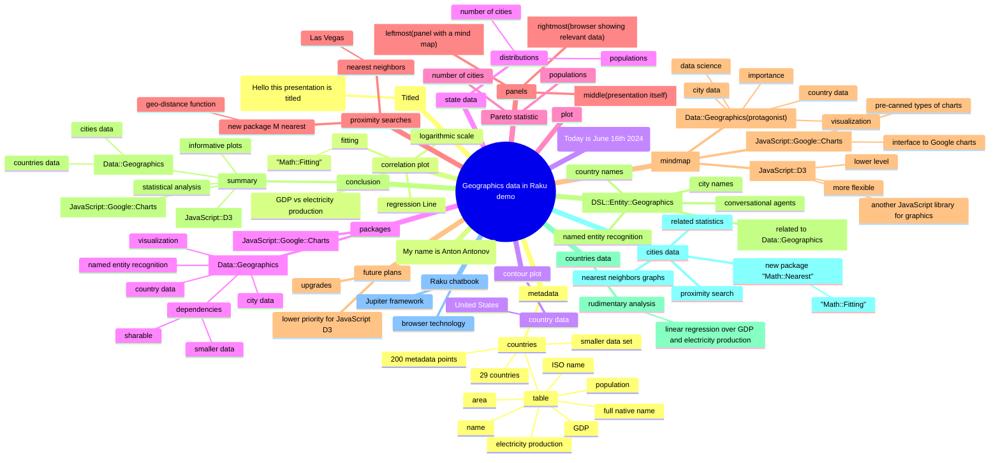

# [LLM] over "Geographics data in Raku demo"

### *Tabular, visual, and textual breakdowns and summaries*

[Anton Antonov](https://rakuforprediction.wordpress.com/about/)

2024-06-16


***Text statistics:***


```
# [chars => 28325 words => 5407 lines => 772 totalTokens => 7024]
# Geographics-data-in-Raku-demo
```

-----

## Introduction


This post applies various Large Language Model (LLM) summarization prompts to the transcript of the program
[«Geographics data in Raku demo»](https://www.youtube.com/watch?v=Rkk_MeqLj_k)
by the YouTube channel [Anton Antonov](https://www.youtube.com/@AAA4Prediction).


Here is a table of themes discussed in the text:


<table border="1"><thead><tr><th>theme</th><th>content</th></tr></thead><tbody><tr><td>Introduction</td><td>Introduction of the presentation about using Raku packages for geographical data visualization.</td></tr><tr><td>Raku Packages</td><td>Overview of Raku packages used: &quot;Data::Geographics&quot;, &quot;JavaScript::Google::Charts&quot;, &quot;DSL::Entity::Geographics&quot;.</td></tr><tr><td>Google Charts vs. D3.js</td><td>Comparison of Google Charts and D3.js for geographical plotting, highlighting Google Charts&#39; ease of use.</td></tr><tr><td>LLM Integration</td><td>Demonstrating the use of Large Language Models (LLMs) to generate Google Charts code from natural language prompts.</td></tr><tr><td>Country Data Analysis</td><td>Exploring country-level data, including GDP and electricity production, with correlation plots and linear regression.</td></tr><tr><td>City Data and Visualization</td><td>Working with city-level data, visualizing locations on a map, and exploring population distributions across states.</td></tr><tr><td>Proximity Search and Nearest Neighbors</td><td>Using the &quot;MAF::Nearest&quot; package to perform proximity searches and visualize nearest neighbors of cities.</td></tr><tr><td>Nearest Neighbor Graphs</td><td>Generating and visualizing nearest neighbor graphs using both &quot;MAF::Nearest&quot; and D3.js force graphs.</td></tr><tr><td>Future Plans and Conclusion</td><td>Briefly discussing future plans for package development and concluding the presentation.</td></tr></tbody></table>


**Remark:** The LLM results below were obtained from the "raw" transcript, which did not have punctuation.

**Remark:** The transcription software had problems parsing the names of mentioned people and locations. Some of the names were manually corrected.


Post’s structure:

1. **Most important or provocative statements**    
   Extending the summary.
2. **Mind-map**   
   For orientation.
3. **Summary, ideas, and recommendations**     
   The main course.
4. **Sophisticated feedback**        
   While wearing hats of different colors.

-----

## Most important or provocative statements

Here is a table of the most important or provocative statements in the text:


<table border="1"><thead><tr><th>subject</th><th>statement</th></tr></thead><tbody><tr><td>Data::Geographics package</td><td>The &quot;Data::Geographics&quot; package is the focus of this presentation, containing country and city data and enabling visualization in geographics and data science.</td></tr><tr><td>Visualization tools</td><td>While initially written with JavaScript D3, creating geographic plots proved easier using the Raku package &quot;JavaScript::Google::Charts&quot;, which interfaces with the well-documented and pre-canned chart framework Google Charts.</td></tr><tr><td>Google Charts and Large Language Models</td><td>Google Charts&#39; extensive documentation and maturity make it an ideal target for large language models (LLMs) to understand and generate code for, as demonstrated by the ability to request specific chart elements and receive Raku code snippets.</td></tr><tr><td>Data::Geographics size</td><td>The &quot;Data::Geographics&quot; package is currently large (around 30MB) due to the extensive country and city data, and the presenter is exploring ways to reduce its size for better sharability.</td></tr><tr><td>Country data analysis</td><td>The presentation demonstrates rudimentary analysis, like linear regression on GDP and electricity production, using the country data available in &quot;Data::Geographics&quot;.</td></tr><tr><td>City data and nearest neighbors</td><td>The city data, including location links visualizable on Google Maps, is used to demonstrate proximity searches and nearest neighbor graph generation using the new Raku package &quot;MAF::Nearest&quot;.</td></tr><tr><td>State-level analysis</td><td>Due to the data structure, state-level analysis, such as distributions of populations and the number of cities per state, requires data aggregation from the city data.</td></tr><tr><td>Pareto principle</td><td>The presentation explores the Pareto principle (80/20 rule) by analyzing the distribution of cities and populations across states, revealing that a small percentage of states often hold a large proportion of cities and population.</td></tr><tr><td>Nearest neighbor graphs</td><td>The &quot;MAF::Nearest&quot; package enables the creation of nearest neighbor graphs, visualized using the Mermaid-ink service, to display relationships between cities based on proximity.</td></tr><tr><td>Future plans</td><td>Future plans include exploring more specialized visualizations and potentially leveraging Google Maps API for enhanced geographical plotting, though this would require an API key.</td></tr></tbody></table>


------

## Mind-map

Here is a mind-map summarizing the text:





-------

## Summary, ideas, and recommendations


#### SUMMARY

Anton Antonov presents a demo of the Raku packages "Data::Geographics" and "JavaScript::Google::Charts", showcasing their capabilities in visualizing and analyzing geographical data, including country statistics, city distributions, and nearest neighbor graphs.

#### IDEAS:

- Geographic data visualization is crucial in data science.
- Raku package "Data::Geographics" provides country and city data.
- JavaScript::Google::Charts offers a simpler approach to geographic plotting than D3.js.
- Google Charts is a well-documented and mature framework, making it suitable for large language models.
- Large language models can assist in generating Raku code for Google Charts visualizations.
- Raku's "Data::Geographics" package is currently large (30MB) and requires optimization for size and shareability.
- The presentation uses camel case for data attributes, aligning with Google Charts conventions.
- Logarithmic scales can enhance the visualization of data with large disparities.
- The "Math::Fitting" package enables linear regression analysis on geographical data.
- Residual analysis helps assess the goodness of fit for regression models.
- City data analysis reveals interesting insights into population distributions and the Pareto principle.
- The Pareto principle (80/20 rule) can be observed in the distribution of cities and population across states.
- The "DSL::Entity::Geographics" package provides named entity recognition for geographical entities.
- Nearest neighbor searches can be performed efficiently using the "Math::Nearest" package.
- Geographic distance calculations can be performed using either meters or miles.
- Visualizing nearest neighbor graphs helps understand spatial relationships between cities.
- Mermaid.js provides a formalism for specifying graphs and diagrams.
- D3.js offers alternative visualization options, such as force-directed graphs.
- Google Charts requires an API key for advanced features like Google Maps integration.
- Raku enables the creation of custom visualizations, such as random mandalas, that may not be readily available in pre-built charting libraries.

#### QUOTES:

- "Visualization in Geographics and in data science in particular is very important."
- "Google Charts is a relatively old framework for making pre-canned types of charts."
- "Large language models should be extensively trained in a sense with discussions or documents or whatever right about Google charts."
- "The package DSL entity Geographics is um going to be demonstrated very briefly actually we can do named entity recognition with it"
- "This means that um the population it has some exponential dependency when it comes to the number of cities and makes sense"
- "I mean the 80/20 rule is actually in a different manner displayed here so this is more this is like yeah like 40% 40% of the states have 80% of the populations"
- "I do have some future plans for this quite a lot of this probably needs to be needs to be upgraded in some way"

#### HABITS:

- Utilizes mind maps for presentation structure and summarization.
- Employs camel case for data attributes.
- Leverages logarithmic scales for improved data visualization.
- Performs residual analysis to evaluate regression model fit.
- Uses a consistent coding style and comments for clarity.

#### FACTS:

- Google Charts is at least 10 years old.
- The "Data::Geographics" package contains data for 29 countries.
- Each country in the dataset has approximately 200 metadata points.
- The Raku and Perl conference was scheduled to take place in Las Vegas.
- The dataset contains data for 33,000 cities in the United States.

#### REFERENCES:

- Raku package: "Data::Geographics"
- Raku package: "JavaScript::Google::Charts"
- JavaScript library: D3.js
- JavaScript library: Google Charts
- Raku package: "DSL::Entity::Geographics"
- Raku package: "Math::Nearest"
- Raku package: "Geo::Basic"
- JavaScript library: Mermaid.js
- Raku package: ww mermaid Inc
- Service: Google Maps API

#### RECOMMENDATIONS:

- Explore the capabilities of Raku packages for geographic data visualization.
- Consider using Google Charts for its simplicity and extensive documentation.
- Leverage large language models for generating code and exploring visualization options.
- Optimize data storage and retrieval for large geographical datasets.
- Utilize logarithmic scales and residual analysis for improved data analysis.
- Explore the use of Mermaid.js and D3.js for alternative graph visualizations.


-------

## Sophisticated feedback 

In this section we try to give feedback and ideas while wearing different hats.
Like "black hat", "white hat", etc.

The LLM result is rendered below.

<hr width="65%">


## Summary:

This presentation showcases the capabilities of two Raku packages, "Data::Geographics" and "JavaScript::Google::Charts", for visualizing geographic data. The presenter demonstrates various functionalities like plotting country and city data, performing basic statistical analysis, and generating interactive maps. They also highlight the potential of using Raku for tasks like named entity recognition and proximity searches in geographic contexts. While acknowledging the limitations of the current packages, the presenter outlines future plans for improvement and expansion.

## Feedback Table:

<table>
  <thead>
    <tr>
      <th>Hat</th>
      <th>Perspective</th>
      <th>Feedback</th>
    </tr>
  </thead>
  <tbody>
    <tr>
      <td>White ⚪</td>
      <td>Information and Facts</td>
      <td>The presentation showcases the use of "Data::Geographics" and "JavaScript::Google::Charts" Raku packages for visualizing geographic data. It demonstrates functionalities like plotting country and city data, basic statistical analysis (like linear regression), and generating interactive maps. The presenter also highlights the potential of using Raku for tasks like named entity recognition and proximity searches in geographic contexts. </td>
    </tr>
    <tr>
      <td>Black ⚫</td>
      <td>Judgement and Caution</td>
      <td>The presentation heavily relies on external libraries and frameworks, particularly Google Charts and D3.js. This dependency could pose challenges in terms of long-term maintainability and potential compatibility issues in the future. Additionally, the reliance on external web services for certain visualizations, like Mermaid.ink for graphs, introduces a dependency on internet connectivity and potential service disruptions. The presenter acknowledges the large size of the "Data::Geographics" package and the need for optimization, which remains an unresolved issue. The lack of a dedicated "state" entity in the data structure might limit certain types of analysis.</td>
    </tr>
    <tr>
      <td>Gray 👹</td>
      <td>Cynicism and Skepticism</td>
      <td>Oh, another package that claims to make data visualization "easy". Let's see how long it takes before you're drowning in obscure Google Charts API options. And don't even get me started on the "rudimentary" statistical analysis. It's cute that you're fitting lines through data points, but let's not kid ourselves – this is barely scratching the surface. The whole "Raku for geographic data" pitch feels a bit niche. Is there really a demand for this, or are we just trying to find a use case for a language that's struggling to find its place? </td>
    </tr>
    <tr>
      <td>Red ❤️</td>
      <td>Feelings and Emotion</td>
      <td>The enthusiasm for Raku and its potential for geographic data visualization is contagious! The presenter's passion for the subject shines through, making the presentation engaging despite its technical nature. The use of real-world examples, like analyzing city data in the context of the Raku conference in Las Vegas, adds a personal touch and makes the information more relatable. </td>
    </tr>
    <tr>
      <td>Yellow 💛</td>
      <td>Benefits and Creativity</td>
      <td>The integration of Raku with powerful JavaScript libraries like D3.js and Google Charts opens up exciting possibilities for creating interactive and visually appealing geographic data visualizations. The ability to perform named entity recognition within Raku using "DSL::Entity::Geographics" is a powerful feature that could be leveraged for building intelligent location-aware applications. The development of new packages like "MAF::Nearest" specifically for geographic data analysis in Raku demonstrates the growing potential of the language in this domain. </td>
    </tr>
    <tr>
      <td>Green 🤑</td>
      <td>Profitability and Potential</td>
      <td>The niche focus on geographic data visualization in Raku could be leveraged to target specific industries or research fields that heavily rely on such analysis, such as urban planning, environmental science, and logistics. Developing specialized tools and packages catering to these domains could create a competitive advantage and attract paying customers. Additionally, offering consulting services or workshops on utilizing Raku for geographic data analysis could be a lucrative avenue to explore. </td>
    </tr>
    <tr>
      <td>Blue 💙</td>
      <td>Usefulness and Opportunities</td>
      <td>The presented Raku packages could be valuable tools for researchers and developers working with geographic data. The ability to perform proximity searches, generate nearest neighbor graphs, and visualize geographic distributions can be particularly useful for tasks like location-based services, spatial analysis, and network optimization. Integrating these functionalities into existing Raku frameworks or developing new domain-specific libraries could further enhance their usability and appeal to a wider audience. </td>
    </tr>
    <tr>
      <td>Purple 💜</td>
      <td>Assessment and Direction</td>
      <td>The presentation effectively showcases the capabilities of Raku for geographic data visualization, highlighting its strengths and acknowledging its limitations. The project demonstrates a clear vision and passion for leveraging Raku in this domain. Moving forward, the focus should be on addressing the identified challenges, such as optimizing the package size, reducing reliance on external services, and expanding the functionality to handle more complex geospatial operations. Additionally, actively engaging with potential users in relevant industries and research fields will be crucial for driving adoption and maximizing the impact of this work. 
      </td>
    </tr>
  </tbody>
</table>

