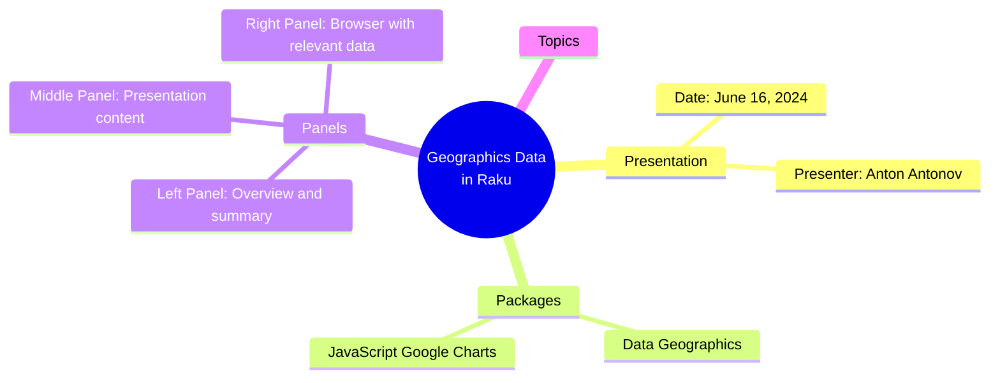
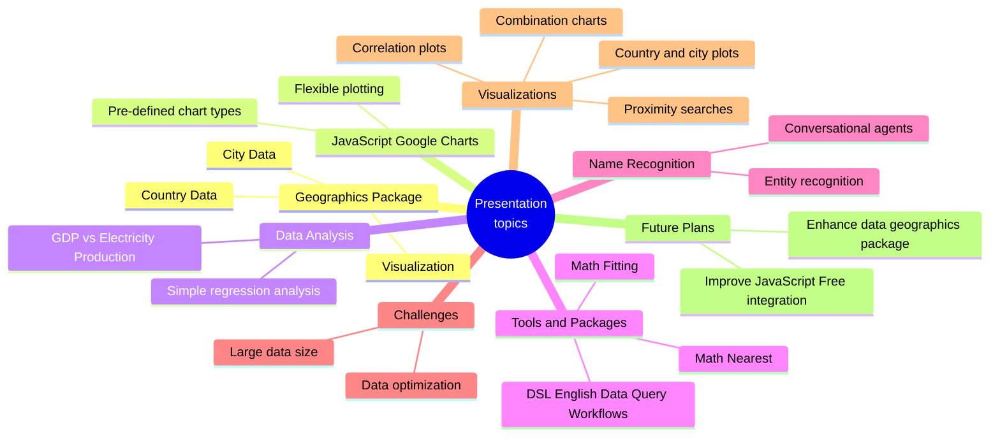

# [LLM] over "Geographics data in Raku demo"

### *Tabular, visual, and textual breakdowns and summaries*

[Anton Antonov](https://rakuforprediction.wordpress.com/about/)

2024-06-16


***Text statistics:***


```
# [chars => 25979 words => 4966 lines => 1 totalTokens => 5678]
# Geographics-data-in-Raku-demo
```

-----

## Introduction


This post applies various Large Language Model (LLM) summarization prompts to the transcript of the program
[«Geographics data in Raku demo»](https://www.youtube.com/watch?v=Rkk_MeqLj_k)
by the YouTube channel [Anton Antonov](https://www.youtube.com/@AAA4Prediction).


Here is a table of themes discussed in the text:


<table border="1"><thead><tr><th>theme</th><th>content</th></tr></thead><tbody><tr><td>Introduction</td><td>Introduction of the presentation and the packages used: Data::Geographics, JavaScript::GoogleCharts, DSL::English::DataQueryWorkflows, and Math::Nearest.</td></tr><tr><td>Data::Geographics Package</td><td>Overview of the Data::Geographics package, including its country and city data, and its use in data visualization and analysis.</td></tr><tr><td>Google Charts vs. JavaScript::Free</td><td>Comparison of Google Charts and JavaScript::Free for geographical plotting, highlighting the advantages of Google Charts.</td></tr><tr><td>Country Data Analysis</td><td>Analysis of country data, including correlation plots of GDP and electricity production, and fitting regression lines using Math::Fitting.</td></tr><tr><td>City Data Analysis</td><td>Exploration of city data, including visualization of city locations, analysis of population and city count distributions across US states, and Pareto analysis.</td></tr><tr><td>Proximity Search and Nearest Neighbors</td><td>Using the Math::Nearest package for proximity search, finding nearest neighbors of a given city, and visualizing the results.</td></tr><tr><td>Nearest Neighbor Graphs</td><td>Creating and visualizing nearest neighbor graphs using the Mermaid formalism and the WW::Mermaid::Ink package.</td></tr><tr><td>Name Recognition and Future Plans</td><td>Briefly discussing name recognition functionality and outlining future plans for the packages.</td></tr><tr><td>Conclusion</td><td>Summary of the presentation, highlighting the key takeaways and the capabilities of the presented packages.</td></tr></tbody></table>


**Remark:** The LLM results below were obtained from the "raw" transcript, which did not have punctuation.

**Remark:** The transcription software had problems parsing the names of mentioned people and locations. Some of the names were manually corrected.


Post’s structure:

1. **Most important or provocative statements**    
   Extending the summary.
2. **Mind-map**   
   For orientation.
3. **Summary, ideas, and recommendations**     
   The main course.
4. **Sophisticated feedback**        
   While wearing hats of different colors.

-----

## Most important or provocative statements

Here is a table of the most important or provocative statements in the text:


<table border="1"><thead><tr><th>subject</th><th>statement</th></tr></thead><tbody><tr><td>Package Focus</td><td>The geographics package is the protagonist of this presentation, containing country and city data and enabling visualization in geographics and data science.</td></tr><tr><td>Visualization Tools</td><td>While the presentation was initially written with JavaScript-free tools, it proved challenging to create geographical plots, leading to the adoption of the Raku package &#39;Chart::GoogleCharts&#39; which interfaces with the Google Charts framework for easier chart creation.</td></tr><tr><td>Data Geographics Package Size</td><td>The &#39;Data::Geographics&#39; package, containing both country and city data, is currently considered too large (around 30 MB) and requires optimization for better shareability.</td></tr><tr><td>Country Data Analysis</td><td>The presentation demonstrates rudimentary analysis using linear regression on gross domestic product and electricity production data from the &#39;Data::Geographics&#39; package.</td></tr><tr><td>City Data and Nearest Neighbors</td><td>The &#39;Data::Geographics&#39; package also includes city data, and the presentation showcases statistics, proximity searches, and neighbor graphs using this data and the new &#39;Math::Nearest&#39; package.</td></tr><tr><td>Raku for Google Charts</td><td>Raku acts as a conduit to Google Charts, providing a convenient interface for generating charts without requiring extensive knowledge of Google Charts&#39; API.</td></tr><tr><td>Large Language Models and Google Charts</td><td>Large language models, extensively trained on Google Charts documentation, can be used to generate code snippets for specific chart customizations, as demonstrated in the presentation using a chatbot-like interface.</td></tr><tr><td>US City Data Exploration</td><td>The presentation explores US city data, analyzing the distribution of population and number of cities across states, revealing an exponential relationship between population and city count.</td></tr><tr><td>Nearest Neighbor Analysis</td><td>Using Las Vegas as an example, the presentation demonstrates finding nearest neighbors within a specified radius (100 kilometers) using the &#39;Math::Nearest&#39; package and visualizing the results on a map.</td></tr><tr><td>Geographical Visualization</td><td>The presentation showcases various geographical visualization techniques, including contour plots for country boundaries, scatter plots for city locations, and network graphs for nearest neighbor relationships.</td></tr><tr><td>Future Plans</td><td>Future plans for the presented tools and packages include prioritizing D3.js approaches, improving data management in &#39;Data::Geographics&#39;, and exploring more advanced visualization techniques.</td></tr></tbody></table>


------

## Mind-map

Here is a mind-map summarizing the text:







-------

## Summary, ideas, and recommendations


#### SUMMARY

Anton Antonov presents a demo of the Raku packages "Data::Geographics" and "JavaScript::Google::Charts," showcasing their use in visualizing geographic data. He explores country and city data, performs basic statistical analysis, and demonstrates proximity searches and nearest neighbor graph generation.

#### IDEAS:

- Geographic data visualization is crucial in data science.
- JavaScript libraries like Google Charts offer powerful and accessible charting capabilities.
- Raku packages can leverage these libraries to provide convenient interfaces for geographic data analysis.
- The "Data::Geographics" package provides access to country and city data, including boundaries, populations, and economic indicators.
- Visualizing data distributions, correlations, and trends can reveal insights into geographic patterns.
- Fitting regression lines to data can help identify relationships and make predictions.
- Proximity searches and nearest neighbor graphs are valuable tools for analyzing spatial relationships between locations.
- Name entity recognition can be used to identify and disambiguate geographic entities in text.
- Raku's integration with JavaScript libraries allows for interactive and visually appealing data exploration.
- Large language models (LLMs) can assist with code generation and documentation lookup, streamlining the data visualization process.
- Data visualization can be used to communicate complex geographic information effectively.
- Open-source packages like those demonstrated in the presentation contribute to the accessibility and advancement of geographic data analysis.
- The use of camel case in variable names can improve code readability and consistency.
- Exploring different chart types and customization options is essential for creating informative and visually appealing visualizations.
- The choice of appropriate data aggregation and transformation techniques is crucial for extracting meaningful insights from geographic data.
- The "Data::Geographics" package can be further developed to include more data points and functionalities.
- The presentation highlights the potential of Raku as a language for data science and visualization.
- The use of real-world examples, such as analyzing city populations and generating nearest neighbor graphs, makes the presentation engaging and relatable.
- The speaker's passion for data visualization and the Raku programming language is evident throughout the presentation.
- The presentation encourages further exploration and experimentation with geographic data analysis in Raku.

#### QUOTES:

- "Visualization in geographics and data science in particular, which I kind of specialize, is very important."
- "Large language models should be extensively trained with discussions or documents over right about Google chat and it is the case."
- "I am kind of designing my own type of interface which I think should be at least point appealing to generic generic users."
- "This means that the population has some exponential dependency when it comes to the number of cities and makes sense."
- "The 80/20 rule is actually in a different manner displayed here."

#### HABITS:

- Utilizes camel case for variable names.
- Emphasizes clear and concise code comments.
- Leverages large language models for code generation and documentation.
- Prioritizes visually appealing and informative data visualizations.
- Continuously explores and experiments with new Raku packages and functionalities.

#### FACTS:

- The package "Data::Geographics" is approximately 30 MB in size.
- The package contains data for 29 countries and approximately 200 data points per country.
- The city data includes locations, populations, and links to Google Maps.
- The presentation was created using the Raku programming language.
- The speaker specializes in data science and geographic data visualization.

#### REFERENCES:

- Raku programming language
- Data::Geographics package
- JavaScript::Google::Charts package
- DSL::English::Data::Query::Workflows package
- Math::Nearest package
- Google Charts
- D3.js
- Geo::Basic package
- Geo::JSON package
- Mermaid.js
- GG Graph

#### RECOMMENDATIONS:

- Explore the "Data::Geographics" and "JavaScript::Google::Charts" Raku packages for geographic data visualization.
- Utilize large language models like ChatGPT for code generation and documentation lookup.
- Experiment with different chart types and customization options in Google Charts to create informative visualizations.
- Consider using the "Math::Nearest" package for proximity searches and nearest neighbor graph generation.
- Explore the use of Raku for data science and visualization tasks beyond geographic data.


-------

## Sophisticated feedback 

In this section we try to give feedback and ideas while wearing different hats.
Like "black hat", "white hat", etc.

The LLM result is rendered below.

<hr width="65%">


## Idea Summary:

This presentation showcases the capabilities of the "Data Geographics" Raku package for working with geographical data. It demonstrates how to visualize country and city data using both the "GeoGraphics" package directly and by integrating it with the "JavaScript Google Charts" package for more interactive and visually appealing plots. The presentation also highlights the use of other related Raku packages like "DSL::English::Data::Query::Workflows" for code generation, "Math::Nearest" for proximity searches, and "WWW::Mermaid::Ink" for graph visualization. The presenter emphasizes the potential of these tools for data analysis, visualization, and even tasks like name entity recognition in conversational agents. 

## Hat Feedback Table:

| Hat  | Perspective | Feedback |
|---|---|---|
| **White Hat** | **Information and Facts** | The presentation provides a comprehensive overview of the "Data Geographics" Raku package and its capabilities. It showcases various functionalities, including accessing country and city data, performing basic statistical analysis, and generating different types of visualizations. The use of practical examples, like analyzing GDP and electricity production correlation and visualizing city proximity, helps illustrate the package's potential. The integration with other Raku packages like "JavaScript Google Charts" and "Math::Nearest" further expands its functionalities.  |
| **Black Hat** | **Judgement and Caution** | While the presentation demonstrates the potential of the "Data Geographics" package, it also highlights some limitations. The package size is mentioned as a concern, requiring optimization for better shareability. The reliance on external services like Google Charts for certain visualizations introduces dependencies and potential limitations if those services become unavailable. The presentation's flow could benefit from a clearer structure and more concise explanations of certain concepts. Additionally, the lack of detailed code explanations might hinder understanding for those unfamiliar with Raku. |
| **Gray Hat** | **Cynicism and Skepticism** |  So, another Raku package promising to revolutionize geographic data analysis? Color me *shocked*. Let's be real, how many people are actually clamoring to do linear regression on GDP data in Raku? And the reliance on Google Charts? Sure, it's convenient until Google decides to pull the plug or slap a paywall on it. And don't even get me started on the "name entity recognition" for conversational agents. Is that supposed to be a selling point? Sounds like a recipe for hilarious, yet wildly inaccurate, chatbot interactions.  |
| **Red Hat** | **Feelings and Emotion** |  I'm excited about the potential of this package! Visualizing geographic data is powerful, and the examples shown, especially the proximity search and the interactive maps, are really cool. The presenter's enthusiasm for Raku and these tools is contagious, and it makes me want to dive in and start exploring these capabilities myself. I appreciate the emphasis on making the package more accessible and user-friendly.  |
| **Yellow Hat** | **Benefits and Creativity** | The "Data Geographics" package, combined with other Raku tools, has the potential to empower developers and researchers to analyze and visualize geographic data in novel ways. Imagine using this package to create interactive maps for urban planning, visualize disease spread patterns, or even build educational tools for geography. The integration with Google Charts opens up a world of possibilities for creating visually appealing and informative dashboards. The package's flexibility allows for customization and integration with other tools, further expanding its potential applications. |
| **Green Hat** | **Profitability and Potential** |  This package, while currently focused on functionality, has significant untapped commercial potential. Imagine offering it as a paid API service for businesses needing geographic data analysis, like logistics companies optimizing delivery routes or marketing agencies targeting specific demographics. The interactive visualization capabilities could be packaged into a user-friendly software solution for researchers or data analysts working with geographic data. Additionally, developing educational materials and workshops around this package could generate revenue and attract a wider user base. | 
| **Blue Hat** | **Usefulness and Opportunities** | The "Data Geographics" package addresses a clear need for a dedicated tool to work with geographic data in Raku. Its integration with other packages like "JavaScript Google Charts" and "Math::Nearest" enhances its practicality and broadens its application scope. However, there are opportunities for improvement. Developing a more user-friendly interface, potentially web-based, could attract a wider audience beyond Raku enthusiasts. Creating comprehensive documentation and tutorials would make the package more accessible to beginners. Exploring partnerships with organizations working with geographic data could lead to new applications and collaborations. |
| **Purple Hat** | **Assessment and Direction** |  The "Data Geographics" Raku package shows promise as a valuable tool for working with geographic data. While it faces challenges like package size and reliance on external services, its strengths lie in its functionality, integration capabilities, and potential for diverse applications. To move forward, the developers should prioritize: (1) **Optimization:** Reduce the package size for better shareability and explore alternatives to external dependencies. (2) **Usability:** Develop a more user-friendly interface and comprehensive documentation to attract a wider audience. (3) **Marketing:** Highlight the package's unique capabilities and potential applications to attract users and potential commercial partners. By addressing these areas, the "Data Geographics" package can become a powerful and widely adopted tool in the Raku ecosystem and beyond.  |

