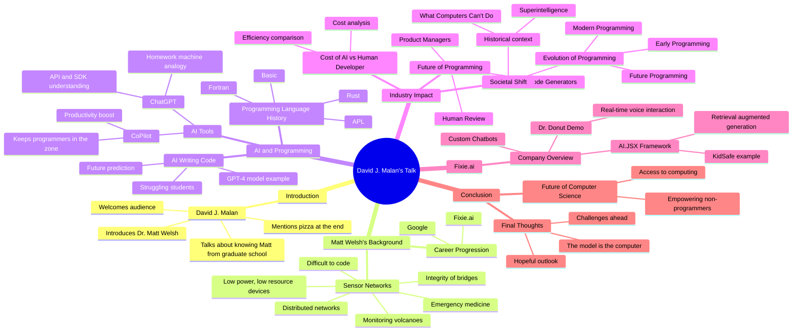

# [LLM] over "Large Language Models and The End of Programming - CS50 Tech Talk with Dr. Matt Welsh"

#### *Tabular, visual, and textual breakdowns and summaries*

[Anton Antonov](https://rakuforprediction.wordpress.com/about/)

2024-08-16


***Text statistics:***


```
# [chars => 57508 words => 10542 lines => 1988 totalTokens => 15360]
# Large-Language-Models-and-The-End-of-Programming-CS50-Tech-Talk-with-Dr-Matt-Welsh
```

-----

## Introduction


This post applies various Large Language Model (LLM) summarization prompts to the transcript of the program
[«Large Language Models and The End of Programming - CS50 Tech Talk with Dr. Matt Welsh»](https://www.youtube.com/watch?v=JhCl-GeT4jw)
by the YouTube channel [CS50](https://www.youtube.com/cs50).


Here is a table of themes discussed in the text:


<table border="1"><thead><tr><th>theme</th><th>content</th></tr></thead><tbody><tr><td>Introduction and Welcome</td><td>David J. Malan introduces Dr. Matt Welsh, mentions pizza, and provides background on their acquaintance and Matt&#39;s work history.</td></tr><tr><td>Matt Welsh&#39;s Background</td><td>Welsh&#39;s work in sensor networks, monitoring volcanoes, bridges, emergency medicine, and his career progression to Google and fixie.ai.</td></tr><tr><td>Future of Programming with AI</td><td>Welsh discusses the concept that AI will eventually write code, making traditional human programming obsolete.</td></tr><tr><td>Challenges in Human Programming</td><td>Humans struggle with writing, maintaining, and understanding code. 50 years of programming language research hasn&#39;t solved these issues.</td></tr><tr><td>Historical Programming Languages</td><td>Examples of Fortran, Basic, APL, and Rust to illustrate the complexity and challenges in understanding and maintaining code.</td></tr><tr><td>AI in Modern Programming</td><td>Welsh shows how he uses GPT-4 for coding tasks, emphasizing the shift from traditional programming to AI-assisted programming.</td></tr><tr><td>Impact of AI Tools like CoPilot</td><td>Welsh explains how tools like CoPilot have revolutionized coding by keeping programmers in the zone and increasing productivity.</td></tr><tr><td>Economic Implications</td><td>Cost analysis showing how AI can replace human developers at a fraction of the cost, potentially transforming the industry.</td></tr><tr><td>Future Workforce and AI</td><td>Speculation on how AI will change the roles of product managers and developers, emphasizing the shift from coding to instructing AI.</td></tr><tr><td>AI&#39;s Rapid Evolution</td><td>Comparison of AI&#39;s rapid progress to the gradual improvement in computer graphics, highlighting the sudden impact of AI advancements.</td></tr><tr><td>Societal Dialogue on AI</td><td>Shift from skepticism in the 1970s to serious consideration of AI&#39;s societal impact today, referencing key literature.</td></tr><tr><td>Evolution of Programming</td><td>Historical context of programming evolution, predicting a future where natural language replaces traditional programming.</td></tr><tr><td>Natural Language Computing</td><td>Introduction of the concept of a natural language computer, where AI models autonomously execute tasks based on natural language instructions.</td></tr><tr><td>Fixie.ai Overview</td><td>Brief pitch for Welsh&#39;s startup, Fixie.ai, which focuses on creating custom chatbots and integrating AI with applications.</td></tr><tr><td>AI.JSX Framework</td><td>Explanation of AI.JSX, a React-like framework for building LLM-based applications, streamlining the integration of AI into software.</td></tr><tr><td>Dr. Donut Demo</td><td>Video demo of an AI-driven voice interaction system for a fictional donut shop, showcasing real-time AI capabilities.</td></tr><tr><td>Future of Computer Science Education</td><td>Discussion on how AI advancements should influence computer science education, emphasizing the need for new teaching approaches.</td></tr><tr><td>Q&amp;A Session</td><td>Welsh answers audience questions on various topics, including testing AI-generated code, data limitations, and future SWE roles.</td></tr><tr><td>Closing Remarks</td><td>Welsh concludes the talk, expressing optimism about AI&#39;s potential and inviting attendees for pizza and further discussion.</td></tr></tbody></table>


**Remark:** The LLM results below were obtained from the "raw" transcript, which did not have punctuation.

**Remark:** The transcription software had problems parsing the names of mentioned people and locations. Some of the names were manually corrected.


Post’s structure:

1. **Most important or provocative statements**    
   Extending the summary.
2. **Mind-map**   
   For orientation.
3. **Summary, ideas, and recommendations**     
   The main course.
4. **Sophisticated feedback**        
   While wearing hats of different colors.

-----

## Most important or provocative statements

Here is a table of the most important or provocative statements in the text:


<table border="1"><thead><tr><th>subject</th><th>statement</th></tr></thead><tbody><tr><td>Introduction</td><td>We&#39;re joined today by Dr. Matt Welsh. And we&#39;ll be joined toward the end of the talk by pizza as well.</td></tr><tr><td>Background</td><td>Matt went on since then to work full-time at Google, and most recently at fixie.ai.</td></tr><tr><td>AI and Coding</td><td>He portends a future in which computers will do the writing of code for us.</td></tr><tr><td>Field of Computer Science</td><td>The field of computer science is doomed.</td></tr><tr><td>Human Limitations</td><td>Humans suck at all three of these things. We&#39;re terrible at writing programs. We&#39;re terrible at maintaining them. And we&#39;re absolutely terrible at understanding them.</td></tr><tr><td>Programming Languages</td><td>50 years of research into programming languages has done effectively nothing to solve this problem.</td></tr><tr><td>Future of Programming</td><td>We are now in an era where we have machines that can take natural language in and produce results, algorithmic results, computational results, but for which no human has written a program in anything resembling a conventional programming language.</td></tr><tr><td>CoPilot</td><td>CoPilot is incredible for a few reasons. I think one of the things that people don&#39;t fully appreciate is that it keeps you in the zone of writing code.</td></tr><tr><td>AI Cost Efficiency</td><td>The total cost for the output of one human software developer on GPT-3 is $0.12.</td></tr><tr><td>AI in Industry</td><td>This suggests, potentially, a very large shift in our industry.</td></tr><tr><td>Product Management</td><td>Have a product manager--this is probably still a human--taking the business and the product requirements, the user requirements, and translating them into some form, probably English, maybe a little bit technical English, that you then can provide to the army of AI code generators.</td></tr><tr><td>Future of Programming</td><td>Our whole concept of programming computers is going to get replaced over time with instructing language models to do things for us.</td></tr><tr><td>Fixie.ai</td><td>What we&#39;re doing at Fixie is effectively making it super easy for developer teams to go from a pile of data that they&#39;ve got to a live chat bot embedded on a website that understands all of that data and can answer questions and take action, call APIs, do all the fancy things you want.</td></tr><tr><td>Prompt Engineering</td><td>Prompt engineering is not really a thing yet. But it may well be in the future if we do this right.</td></tr><tr><td>Model Understanding</td><td>We don&#39;t really know what&#39;s going on inside these models.</td></tr><tr><td>Future of CS Education</td><td>Maybe over time, the field of computer science looks a little bit like the field of EE does with respect to computer science today.</td></tr><tr><td>Empowering Computing Access</td><td>Possibly, this greatly expands access to computing to the entirety of human population.</td></tr><tr><td>The Model is the Computer</td><td>The model is the computer.</td></tr><tr><td>Challenges</td><td>The biggest dirty secret in the entire field is no one understands how language models work, not one person on this planet.</td></tr><tr><td>Programming Frustrations</td><td>Maybe we can get to a place where we just let the robots do it and then spend our time doing something else.</td></tr></tbody></table>


------

## Mind-map

Here is a mind-map summarizing the text:





-------

## Summary, ideas, and recommendations


#### SUMMARY

David J. Malan and Dr. Matt Welsh discuss the future of computer science, focusing on AI's role in programming. Welsh argues that traditional programming is becoming obsolete as AI models like GPT-4 can handle coding tasks more efficiently, predicting a future where natural language instructions replace conventional coding.

#### IDEAS

- AI models will replace traditional programming by understanding and executing natural language instructions.
- 50 years of programming language research has failed to make coding significantly easier for humans.
- Humans are inherently poor at writing, maintaining, and understanding code.
- Tools like CoPilot have already revolutionized coding by keeping programmers in the zone.
- AI-generated code may not need to be maintainable by humans, shifting focus to functionality over readability.
- Programming might evolve to focus on teaching AI models new skills rather than writing code.
- The industry might see a shift where product managers write detailed natural language specifications for AI to execute.
- The cost of using AI for coding is drastically lower than employing human developers.
- AI models can understand APIs, SDKs, and best practices, making them highly effective in coding tasks.
- The future of programming could eliminate the need for conventional coding, focusing instead on instructing AI models.
- AI models can perform computations and logical reasoning when prompted correctly.
- The dialogue around AI has shifted from skepticism to serious consideration of its societal impact.
- AI models have latent abilities that are discovered empirically, not through explicit training.
- The field of computer science might evolve similarly to how EE evolved, becoming more specialized.
- AI could democratize access to computing, allowing non-experts to leverage its power.
- The natural language computer architecture could replace the Von Neumann architecture.
- AI models might eventually handle complex tasks like developing algorithms.
- The societal and ethical implications of AI replacing human programmers need careful consideration.
- Prompt engineering could become a formal discipline in the future.
- AI's ability to generate and understand code will continue to improve with more data and compute power.
- The current state of AI is akin to the early stages of computer graphics, with rapid advancements expected.

#### QUOTES

- "Humans suck at all three of these things. We're terrible at writing programs. We're terrible at maintaining them. And we're absolutely terrible at understanding them."
- "50 years of research into programming languages has done effectively nothing to solve this problem."
- "This is now how I am actually writing code."
- "CoPilot is incredible for a few reasons."
- "The only thing that is stopping CoPilot from getting really, really good at this is just more data and more compute."
- "How much does it cost to replace one human developer with AI?"
- "This suggests, potentially, a very large shift in our industry."
- "The industry is going to change."
- "The model is the computer."
- "No one understands how language models work, not one person on this planet."
- "Programming kind of sucks, right? It's kind of a pain. It's frustrating. It's slow. It's mentally tiring."
- "The future of this really is skipping the programming step entirely."
- "AI might actually destroy society."
- "This is a new computational architecture that we see emerging right now."
- "Our concept of computer science is also going to be seen as a relic of the past at some point."
- "Maybe like that, our concept of computer science, this image here, is also going to be seen as a relic of the past at some point."
- "The model is the computer."
- "We don't really know the logical reasoning limits of these models."
- "The future of programming could eliminate the need for conventional coding."
- "AI's ability to generate and understand code will continue to improve with more data and compute power."
- "AI could democratize access to computing, allowing non-experts to leverage its power."

#### HABITS

- Using AI tools like CoPilot to assist in coding.
- Experimenting with AI prompts to achieve desired outcomes.
- Maintaining a focus on productivity by minimizing distractions.
- Leveraging AI to stay in the zone while coding.
- Regularly updating knowledge about AI advancements and tools.
- Emphasizing the importance of specifying clear instructions for AI models.
- Encouraging team members to use AI tools for efficiency.
- Continuously iterating and experimenting with AI-generated code.
- Embracing trial and error in both traditional and AI-assisted coding.
- Staying informed about the latest research and developments in AI.

#### FACTS

- The cost of using GPT-3 for coding tasks is a fraction of employing human developers.
- Programming languages have evolved from Fortran to Rust, but human comprehension remains a challenge.
- AI tools like CoPilot can significantly boost productivity by keeping programmers focused.
- AI models like GPT-4 can understand and execute natural language instructions.
- The concept of programming might shift to teaching AI models rather than writing code.
- AI-generated code may not need to be maintainable by humans, focusing on functionality.
- The field of computer science might evolve similarly to how EE evolved, becoming more specialized.
- AI could democratize access to computing, allowing non-experts to leverage its power.
- The natural language computer architecture could replace the Von Neumann architecture.
- AI models can perform computations and logical reasoning when prompted correctly.
- The societal and ethical implications of AI replacing human programmers need careful consideration.
- The current state of AI is akin to the early stages of computer graphics, with rapid advancements expected.
- AI's ability to generate and understand code will continue to improve with more data and compute power.
- The dialogue around AI has shifted from skepticism to serious consideration of its societal impact.
- The industry might see a shift where product managers write detailed natural language specifications for AI to execute.

#### REFERENCES

- [CoPilot](https://copilot.github.com/)
- [GPT-4](https://www.openai.com/)
- [ChatGPT](https://openai.com/research/chatgpt)
- [Shel Silverstein's "A Light in the Attic"](https://www.shelsilverstein.com/books/light-attic/)
- [Nick Bostrom's "Superintelligence"](https://www.nickbostrom.com/superintelligence.html)
- [The Von Neumann architecture](https://www.britannica.com/technology/Von-Neumann-machine)
- [AI.JSX](https://github.com/ai-jsx)
- [React](https://reactjs.org/)
- [Fixie.ai](https://www.fixie.ai/)
- [Conway's Game of Life](https://www.conwaylife.com/)
- [Fortran](https://fortran-lang.org/)
- [Basic](https://en.wikipedia.org/wiki/BASIC)
- [APL](https://www.dyalog.com/)
- [Rust](https://www.rust-lang.org/)
- [INTERCAL](https://en.wikipedia.org/wiki/INTERCAL)
- [PDP 11](https://en.wikipedia.org/wiki/PDP-11)
- [Apple 1](https://www.computerhistory.org/atchm/apple-1-at-40/)
- [Sun Microsystems' "The network is the computer"](https://web.archive.org/web/20080213033927/http://research.sun.com/features/tenyears/volcd/papers/vonneuma.htm)
- [The Greatest American Hero (TV show)](https://www.imdb.com/title/tt0081871/)
- [WarGames (Movie)](https://www.imdb.com/title/tt0086567/)

#### RECOMMENDATIONS

- Embrace AI tools like CoPilot to boost productivity and stay in the coding zone.
- Experiment with AI prompts to achieve desired outcomes in coding tasks.
- Focus on specifying clear instructions for AI models to improve accuracy.
- Encourage team members to use AI tools for efficiency and consistency.
- Continuously iterate and experiment with AI-generated code to refine results.
- Stay informed about the latest research and developments in AI and machine learning.
- Consider the ethical and societal implications of AI in programming and other fields.
- Explore the potential of AI to democratize access to computing and empower non-experts.
- Think about the future of programming as teaching AI models new skills rather than writing code.
- Leverage AI models to handle complex tasks and logical reasoning.
- Consider the natural language computer architecture as a new computational paradigm.
- Use AI to assist in developing and understanding algorithms in specialized fields.
- Recognize the potential for AI to replace traditional programming and focus on higher-level tasks.
- Adopt a mindset of continuous improvement and adaptation to new AI technologies.
- Encourage collaboration between humans and AI models to achieve better results in programming and other tasks.


-------

## Sophisticated feedback 

In this section we try to give feedback and ideas while wearing different hats.
Like "black hat", "white hat", etc.

The LLM result is rendered below.

<hr width="65%">


#### Summary of the Idea:
Dr. Matt Welsh, a former Harvard faculty member and current AI expert, delivered a talk discussing the evolution and future of computer science, particularly focusing on the impact of AI on programming. He argued that traditional programming languages and methods are becoming obsolete, as AI models like ChatGPT can now generate code and perform tasks more efficiently than human programmers. Welsh posits that this shift will lead to a new era where natural language instructions replace conventional coding, potentially transforming the field of computer science and expanding access to computing globally. He also highlighted the challenges and opportunities this transformation presents, including the need for new educational approaches and the ethical implications of AI.


<table border="1">
  <tr>
    <th>Hat Name</th>
    <th>Perspective</th>
    <th>Feedback</th>
  </tr>
  <tr>
    <td>White Hat</td>
    <td>Information and Facts</td>
    <td>Dr. Matt Welsh's talk focuses on the paradigm shift in computer science due to AI advancements. He highlights the inefficiencies of traditional programming languages and emphasizes the potential of AI models like ChatGPT in automating code generation. Welsh also discusses the historical context, current applications, and future implications of this shift, including the need for new educational frameworks and ethical considerations.</td>
  </tr>
  <tr>
    <td>Black Hat</td>
    <td>Judgement and Caution</td>
    <td>While Welsh's vision is compelling, there are significant risks and challenges. The reliance on AI for coding could lead to a loss of deep technical skills among future programmers. The ethical implications of AI-generated code are also concerning, especially in terms of accountability and transparency. Additionally, the potential for job displacement in the software industry cannot be overlooked.</td>
  </tr>
  <tr>
    <td>Gray Hat</td>
    <td>Cynicism and Skepticism</td>
    <td>Welsh's talk sounds like a lot of tech utopia rhetoric. Sure, AI can write code, but can it truly understand the complexities and nuances of human requirements? And let's not forget the hidden agenda of pushing AI products and services. This whole narrative might just be a way to sell more AI tools while downplaying the real-world limitations and risks.</td>
  </tr>
  <tr>
    <td>Red Hat</td>
    <td>Feelings and Emotion</td>
    <td>This talk is both exciting and unsettling. The idea of AI taking over programming feels revolutionary but also evokes a sense of loss for the artistry and skill of traditional coding. There's a mix of hope for the future and fear of the unknown, especially regarding job security and the ethical use of AI.</td>
  </tr>
  <tr>
    <td>Yellow Hat</td>
    <td>Benefits and Creativity</td>
    <td>Welsh's vision opens up incredible possibilities. AI-driven coding could democratize access to technology, allowing more people to harness computing power without deep technical knowledge. This could lead to unprecedented levels of innovation and efficiency, freeing up human creativity for higher-level problem-solving and strategic thinking.</td>
  </tr>
  <tr>
    <td>Green Hat</td>
    <td>Profitability and Potential</td>
    <td>The potential for profitability in this AI-driven future is immense. Companies could significantly reduce costs by relying on AI for coding, increasing productivity and accelerating time-to-market. There's also a huge market for AI tools and platforms that facilitate this new way of programming, offering numerous business opportunities.</td>
  </tr>
  <tr>
    <td>Blue Hat</td>
    <td>Usefulness and Opportunities</td>
    <td>The usefulness of AI in programming is clear, with opportunities to streamline development processes and reduce errors. Educational institutions could revamp curricula to focus on AI literacy and prompt engineering. There's also a chance to develop new standards and frameworks for AI-generated code, ensuring quality and ethical compliance.</td>
  </tr>
  <tr>
    <td>Purple Hat</td>
    <td>Assessment and Direction</td>
    <td>Combining all perspectives, it's evident that AI's role in programming is both promising and complex. While there are risks and ethical concerns, the potential benefits and opportunities cannot be ignored. The direction should be towards integrating AI into educational frameworks, developing robust ethical standards, and preparing the workforce for this transition. A balanced approach will be crucial to harness the full potential of this technological shift while mitigating its drawbacks.</td>
  </tr>
</table>

