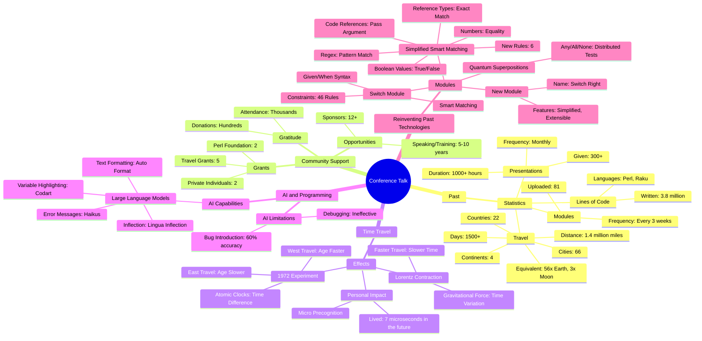

# [LLM] over "The Once and Future Perl - Damian Conway - TPRC 2024"

### *Tabular, visual, and textual breakdowns and summaries*

[Anton Antonov](https://rakuforprediction.wordpress.com/about/)

2024-07-01


***Text statistics:***


```
# [chars => 82693 words => 15649 lines => 2276 totalTokens => 19449]
# The-Once-and-Future-Perl-Damian-Conway-TPRC-2024
```

-----

## Introduction


This post applies various Large Language Model (LLM) summarization prompts to the transcript of the program
[«The Once and Future Perl - Damian Conway - TPRC 2024»](https://www.youtube.com/watch?v=0x9LD8oOmv0)
by the YouTube channel [MISSING CHANNEL NAME](MISSING CHANNEL).

In the program, the speaker, Damian Conway, reflects on their contributions to open-source programming, focusing on Perl and Raku, 
and explores the implications of AI and multiple dispatch in programming.


Here is a table of themes discussed in the text:


<table border="1"><thead><tr><th>theme</th><th>content</th></tr></thead><tbody><tr><td>Introduction</td><td>The speaker is asked to present on past accomplishments but finds it challenging due to a focus on the future.</td></tr><tr><td>Statistics and Achievements</td><td>Detailed statistics on the speaker&#39;s contributions to open source, presentations, travel, and community support.</td></tr><tr><td>Community Support</td><td>Acknowledgement of the international Perl community and various grants and sponsorships received.</td></tr><tr><td>Time Travel and Physics</td><td>Discussion on the effects of extensive travel on time perception using Lorentz contraction and gravitational time dilation.</td></tr><tr><td>AI and Programming</td><td>Exploration of AI&#39;s capabilities in programming, comparing past module functionalities with current AI capabilities.</td></tr><tr><td>Multisub and Dispatch Mechanisms</td><td>Introduction to multiple dispatch mechanisms and their advantages in programming.</td></tr><tr><td>Reinventing the Past</td><td>Discussion on applying past technologies to improve Perl&#39;s future, including the revival of switch and smart matching.</td></tr><tr><td>Conclusion and Gratitude</td><td>Reflection on the speaker&#39;s journey, contributions to the Perl community, and gratitude for support received.</td></tr><tr><td>Humorous Ending</td><td>A playful and humorous conclusion referencing popular culture and the speaker&#39;s resilience.</td></tr></tbody></table>


**Remark:** The LLM results below were obtained from the "raw" transcript, which did not have punctuation.

**Remark:** The transcription software had problems parsing the names of mentioned people and locations. Some of the names were manually corrected.


Post’s structure:

1. **Most important or provocative statements**    
   Extending the summary.
2. **Mind-map**   
   For orientation.
3. **Summary, ideas, and recommendations**     
   The main course.
4. **Sophisticated feedback**        
   While wearing hats of different colors.

-----

## Most important or provocative statements

Here is a table of the most important or provocative statements in the text:


<table border="1"><thead><tr><th>subject</th><th>statement</th></tr></thead><tbody><tr><td>Focus on the Future</td><td>I&#39;m simply so focused on what&#39;s coming next that I&#39;m more or less just comfortably indifferent to what&#39;s gone before.</td></tr><tr><td>Contribution Statistics</td><td>In the past quarter Century I&#39;ve written about 3.8 million lines of Open Source Pearl and Raku and uploaded something to the cpan about once every 3 weeks in the form of 81 separate modules.</td></tr><tr><td>Travel and Speaking</td><td>In the same time I&#39;ve given over 300 presentations on average about one every month for a total of just in excess of a thousand hours of speaking and I gave those presentations in 66 cities in 22 countries across four continents.</td></tr><tr><td>Community Support</td><td>All of that work all of that development all of that travel all of that speaking was made possible by people just like you the international Pearl community.</td></tr><tr><td>Lorentz Contraction</td><td>When you do a large amount of traveling you&#39;re also doing a very small amount of time traveling because of Lorent contraction.</td></tr><tr><td>AI in Programming</td><td>So it turns out that the last 25 years of advanced programming that I&#39;ve been trying to do can now effectively be completely replaced by glorified autocomplete.</td></tr><tr><td>AI Debugging</td><td>It turns out that large language models can in buug code now at near human levels of performance.</td></tr><tr><td>Future of Coding Jobs</td><td>My next job probably won&#39;t be writing code to solve someone&#39;s problem but I don&#39;t think it&#39;s going to be telling an AI to write code to solve the problem either.</td></tr><tr><td>Module Creation</td><td>Whenever I see something like this where I&#39;m doing the same thing over and over and over again then I immediately jump in the DeLorean go back to 2 15 when I released keyword declare.</td></tr><tr><td>Source Code Filters</td><td>A source code filter that understands Pearl syntax I think that&#39;s actually worthy of exclamation marks rather than question marks.</td></tr><tr><td>Multiple Dispatch</td><td>Multiple dispatch is the ability to declare two or more versions of the same named method which have different signatures and then you select based on the number of arguments that are actually passed.</td></tr><tr><td>Module: multi-dispatch</td><td>The module is called multi- dispatch it&#39;s on the cpan now.</td></tr><tr><td>Switch and Smart Match</td><td>Switch and smart match are going away next year for very good reasons and those very good reasons are simply this enormous table these 23 rules that no sane person can actually remember.</td></tr><tr><td>Module: switch-back</td><td>The switch module is back baby and the module is going to be called switch back.</td></tr><tr><td>Improvement of Smart Matching</td><td>What if smart matching hadn&#39;t required 46 rules to work what if it had required maybe just six rules maybe it wouldn&#39;t have to die.</td></tr><tr><td>Module: switch-right</td><td>It&#39;s called switch right it&#39;s on the cpan now.</td></tr><tr><td>Gratitude</td><td>I am profoundly grateful to every one of you for your friendship for your encouragement and for the very practical kinds of support that you&#39;ve given me that made that possible.</td></tr><tr><td>Final Statement</td><td>So now after 25 years the only thing I have left to say is the thing that I always say from the bottom of my heart thank you.</td></tr></tbody></table>


------

## Mind-map

Here is a mind-map summarizing the text:





-------

## Summary, ideas, and recommendations

### SUMMARY

The speaker reflects on their contributions to open-source programming, focusing on Perl and Raku, and explores the implications of AI and multiple dispatch in programming.

### IDEAS:
- The speaker has written 3.8 million lines of open-source Perl and Raku.
- They have given over 300 presentations in 66 cities across 22 countries.
- AI could potentially replace many advanced programming tasks.
- Multiple dispatch allows for more flexible and readable code.
- The speaker's work has been supported by community grants and private sponsorships.
- AI models can generate grammatically correct text and format emails.
- AI struggles with debugging and fixing code.
- Smart matching and switch statements are being phased out in Perl 5.42.
- The speaker developed a new module, "switch back," to reintroduce switch functionality.
- The speaker proposes simplifying smart matching to six core rules.
- They emphasize the importance of community and support in their work.
- Quantum superpositions can be used for more intuitive smart matching.
- The speaker uses humor and pop culture references to engage the audience.
- The new module "switch right" aims to improve smart matching with fewer rules.
- The speaker reflects on their journey and contributions to the Perl community.
- They acknowledge the challenges and complexities of programming languages.
- The talk includes technical explanations of code and algorithms.
- The speaker values continuous improvement and adapting to new technologies.
- The speaker's work has been a mix of serious contributions and playful experimentation.
- They highlight the importance of adaptability in programming.

### QUOTES:
- "In the past quarter Century I've written about 3.8 million lines of Open Source Pearl and Raku."
- "I've given over 300 presentations on average about one every month for a total of just in excess of a thousand hours of speaking."
- "AI could potentially replace many advanced programming tasks."
- "Multiple dispatch allows for more flexible and readable code."
- "AI models can generate grammatically correct text and format emails."
- "AI struggles with debugging and fixing code."
- "Smart matching and switch statements are being phased out in Perl 5.42."
- "The speaker developed a new module, 'switch back,' to reintroduce switch functionality."
- "The speaker proposes simplifying smart matching to six core rules."
- "Quantum superpositions can be used for more intuitive smart matching."
- "The new module 'switch right' aims to improve smart matching with fewer rules."
- "The speaker reflects on their journey and contributions to the Perl community."
- "They acknowledge the challenges and complexities of programming languages."
- "The speaker values continuous improvement and adapting to new technologies."
- "The speaker's work has been a mix of serious contributions and playful experimentation."
- "They highlight the importance of adaptability in programming."
- "The only problem here of course is because it's a keyword and because keywords can only appear at the start of a statement."
- "You can create your own Auto inflection sub routine which takes some text and hooks into in this case chat GTP."
- "You can also just say I want to match this by using an infix operator."
- "Multisubs so you can say I still expect to receive a reference to a array but I want you to Alias that array reference to at data."

### HABITS:
- Regularly contributes to open-source projects.
- Delivers frequent presentations to share knowledge.
- Travels extensively for conferences and speaking engagements.
- Continuously learns and adapts to new technologies.
- Engages with the community for support and collaboration.
- Experiments with new ideas and technologies.
- Reflects on past work to identify improvements.
- Uses humor and creativity in presentations.
- Seeks practical solutions to complex problems.
- Develops modules to simplify and enhance programming tasks.

### FACTS:
- The speaker has written 3.8 million lines of Perl and Raku.
- They have given over 300 presentations in 66 cities across 22 countries.
- They have spent about 4 years and 4 months traveling.
- AI can generate grammatically correct text and format emails.
- AI struggles with debugging and fixing code.
- Smart matching and switch statements are being phased out in Perl 5.42.
- The new module "switch back" reintroduces switch functionality.
- Simplifying smart matching to six core rules can make it more manageable.
- Quantum superpositions can be used for intuitive smart matching.
- The new module "switch right" aims to improve smart matching with fewer rules.
- The speaker's work has been supported by community grants and private sponsorships.
- They have traveled 1.4 million miles, equivalent to going around the Earth 56 times.
- Time dilation effects from traveling at high speeds have a measurable impact.
- The speaker has developed modules that can interface with large language models.
- Perl has built-in support for multiple dispatch and keyword declarations.

### REFERENCES:
- Perl and Raku programming languages.
- CPAN (Comprehensive Perl Archive Network).
- AI models like ChatGPT and Google's Gemini.
- Modules developed by the speaker: "koi," "text Auto format," "lingua n inflection," "codart," "switch back," "switch right."
- Quantum superpositions.
- Hunt and Thomas's end bugging concept.
- Kernigan's debugging principle.
- Filter::Simple and PPR modules.
- Class::MultiMethods module.
- Raku language's multiple dispatch feature.
- Haskell programming language.

### RECOMMENDATIONS:
- Regularly contribute to open-source projects to stay engaged with the community.
- Continuously learn and adapt to new technologies and methodologies.
- Use multiple dispatch to create more flexible and readable code.
- Simplify complex features like smart matching to make them more manageable.
- Develop modules to enhance and simplify programming tasks.
- Engage with the community for support and collaboration.
- Reflect on past work to identify areas for improvement.
- Use humor and creativity in presentations to engage the audience.
- Experiment with new ideas and technologies to find innovative solutions.
- Seek practical solutions to complex problems.
- Travel and attend conferences to share knowledge and learn from others.
- Develop tools and modules that can interface with large language models.
- Embrace adaptability and continuous improvement in programming.
- Use quantum superpositions for intuitive smart matching.
- Implement features incrementally to allow for future extensions.


-------

## Sophisticated feedback 

In this section we try to give feedback and ideas while wearing different hats.
Like "black hat", "white hat", etc.

The LLM result is rendered below.

<hr width="65%">


### Summary of the Idea

The speaker reflects on their 25-year journey in the Perl community, highlighting significant contributions such as writing millions of lines of code, creating numerous modules, and delivering hundreds of presentations globally. They discuss the evolution of their work, the impact of AI on programming, and the future of Perl. The speaker also introduces new Perl modules that integrate AI and multiple dispatch techniques, aiming to enhance the language's capabilities. They emphasize the importance of community support and express gratitude for the opportunities and adventures experienced over the years.


<table>
  <tr>
    <th>Hat Name</th>
    <th>Perspective</th>
    <th>Feedback</th>
  </tr>
  <tr>
    <td>White Hat</td>
    <td>Information and Facts</td>
    <td>The speaker has written 3.8 million lines of code, created 86 modules, and given 306 presentations in 66 cities across 22 countries. They have traveled 1.4 million miles, equivalent to 56 times around the Earth. The work has been supported by the Perl community through grants and sponsorships. The speaker introduces new Perl modules that leverage AI and multiple dispatch techniques.</td>
  </tr>
  <tr>
    <td>Black Hat</td>
    <td>Judgement and Caution</td>
    <td>While the speaker's accomplishments are impressive, relying heavily on AI for programming tasks could introduce new risks, such as bugs that AI cannot debug effectively. The complexity of multiple dispatch and source code filters might make the code harder to maintain and understand, potentially leading to subtle bugs. Additionally, the removal of smart matching and switch features in Perl 5.42 could break existing codebases.</td>
  </tr>
  <tr>
    <td>Gray Hat</td>
    <td>Cynicism and Skepticism</td>
    <td>AI and multiple dispatch sound great, but are they just buzzwords to make the speaker's work seem more advanced? The idea of "micro precognition" and time travel feels like a gimmick rather than a practical advantage. The nostalgia for Perl's past might be clouding judgment about what truly needs to be done to keep the language relevant. Is the community support as strong as it once was, or is this a desperate attempt to revive a fading technology?</td>
  </tr>
  <tr>
    <td>Red Hat</td>
    <td>Feelings and Emotion</td>
    <td>The speaker's passion for Perl and gratitude towards the community are palpable. It's inspiring to see someone so dedicated and thankful for the opportunities they've had. The idea of enhancing Perl with modern technologies like AI and multiple dispatch is exciting and shows a forward-thinking approach. The emotional connection to the community and the adventures experienced over the years add a heartfelt touch to the technical achievements.</td>
  </tr>
  <tr>
    <td>Yellow Hat</td>
    <td>Benefits and Creativity</td>
    <td>The integration of AI and multiple dispatch in Perl could revolutionize programming by automating complex tasks and making code more efficient. The new modules provide a creative solution to modernize Perl, ensuring its relevance in the future. This forward-thinking approach could attract new developers to the Perl community and inspire innovative uses of the language. The speaker's journey and contributions serve as a testament to the potential of combining past experiences with future technologies.</td>
  </tr>
  <tr>
    <td>Green Hat</td>
    <td>Profitability and Potential</td>
    <td>The new Perl modules leveraging AI and multiple dispatch could open up commercial opportunities for Perl developers. Automating complex programming tasks can save time and reduce costs, making Perl an attractive option for businesses. The speaker's extensive experience and global reach provide a strong foundation for promoting these advancements. By modernizing Perl, there's potential to tap into new markets and applications, increasing the language's adoption and profitability.</td>
  </tr>
  <tr>
    <td>Blue Hat</td>
    <td>Usefulness and Opportunities</td>
    <td>The new modules introduced by the speaker are highly useful for modernizing Perl and making it more efficient. The integration of AI can automate repetitive tasks, while multiple dispatch simplifies complex coding scenarios. These advancements create opportunities for Perl to remain relevant and competitive in the evolving programming landscape. The speaker's extensive travel and presentations highlight the global impact and potential for further community engagement and collaboration.</td>
  </tr>
  <tr>
    <td>Purple Hat</td>
    <td>Assessment and Direction</td>
    <td>Combining the perspectives, the speaker's journey showcases significant contributions to the Perl community and highlights the potential of integrating modern technologies like AI and multiple dispatch. While there are risks and challenges, the benefits and opportunities for innovation and profitability are substantial. The speaker's passion and gratitude towards the community are commendable, and their forward-thinking approach provides a clear direction for the future of Perl. Moving forward, it is essential to balance the excitement of new technologies with caution to ensure stability and maintainability.</td>
  </tr>
</table>

