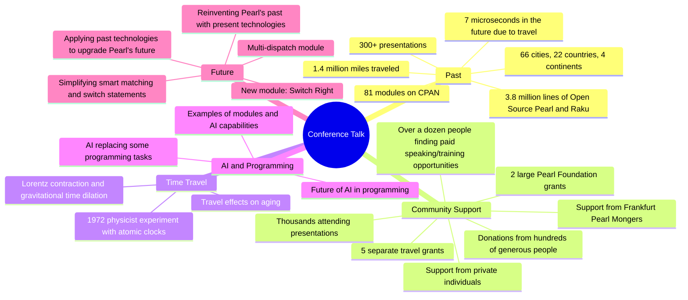

# [LLM] over "The Once and Future Perl - Damian Conway - TPRC 2024"

### *Tabular, visual, and textual breakdowns and summaries*

[Anton Antonov](https://rakuforprediction.wordpress.com/about/)

2024-07-01


***Text statistics:***


```
# [chars => 82693 words => 15649 lines => 2276 totalTokens => 19449]
# The-Once-and-Future-Perl-Damian-Conway-TPRC-2024
```

-----

## Introduction


This post applies various Large Language Model (LLM) summarization prompts to the transcript of the program
[«The Once and Future Perl - Damian Conway - TPRC 2024»](https://www.youtube.com/watch?v=0x9LD8oOmv0)
by the YouTube channel [MISSING CHANNEL NAME](MISSING CHANNEL).

In the program, Damian Conway, a prominent Perl programmer, reflects on his 25 years of contributions to the Perl community.
He explores the impact of AI on programming, revisits past projects, and introduces his new "multi-dispatch" module, which enhances Perl's capabilities.


Here is a table of themes discussed in the text:


<table border="1"><thead><tr><th>theme</th><th>content</th></tr></thead><tbody><tr><td>Introduction</td><td>The speaker reflects on their past work, noting a focus on the future. They share statistics about their contributions to Perl and Raku, including lines of code written, modules uploaded, and presentations given.</td></tr><tr><td>AI Replacing Past Programming Efforts</td><td>The speaker explores how AI, particularly large language models, can now accomplish tasks that previously required complex programming. Examples include error message haiku generation, text formatting, and code analysis.</td></tr><tr><td>Limitations of Current AI in Programming</td><td>Despite advancements, AI still struggles with certain programming aspects. The speaker highlights AI&#39;s difficulty in debugging its own code and its tendency to introduce bugs, comparing it to human programmers.</td></tr><tr><td>Using Past Technologies to Improve Perl&#39;s Future</td><td>The speaker shifts focus to using older programming concepts to enhance Perl&#39;s future capabilities. They delve into multiple dispatch, a feature allowing multiple versions of a method with different behaviors.</td></tr><tr><td>Benefits and Implementation of Multiple Dispatch</td><td>The speaker explains the advantages of multiple dispatch, such as code clarity and extensibility. They detail a module they created that implements multiple dispatch in Perl, including its complex algorithm for selecting the correct method variant.</td></tr><tr><td>Resurrecting Switch and Smart Matching with Multiple Dispatch</td><td>The speaker discusses the removal of the &#39;switch&#39; statement and smart matching in future Perl versions. They demonstrate how multiple dispatch can replicate their functionality, creating a module called &#39;switch back&#39;.</td></tr><tr><td>Redesigning Smart Matching for Simplicity</td><td>The speaker criticizes the complexity of smart matching&#39;s 46 rules. They propose a simplified version with only six rules, making it easier to understand and use.</td></tr><tr><td>Introducing &#39;switch right&#39; Module</td><td>The speaker unveils their final iteration, the &#39;switch right&#39; module, which implements the redesigned smart matching with enhanced clarity and functionality. They emphasize the adaptability and extensibility of multiple dispatch.</td></tr><tr><td>Conclusion</td><td>The speaker concludes by expressing gratitude for the Perl community and their support over the past 25 years. They reiterate their commitment to Perl&#39;s future, hinting at potential future endeavors.</td></tr></tbody></table>


**Remark:** The LLM results below were obtained from the "raw" transcript, which did not have punctuation.

**Remark:** The transcription software had problems parsing the names of mentioned people and locations. Some of the names were manually corrected.


Post’s structure:

1. **Most important or provocative statements**    
   Extending the summary.
2. **Mind-map**   
   For orientation.
3. **Summary, ideas, and recommendations**     
   The main course.
4. **Sophisticated feedback**        
   While wearing hats of different colors.

-----

## Most important or provocative statements

Here is a table of the most important or provocative statements in the text:


------

## Mind-map

Here is a mind-map summarizing the text:





-------

## Summary, ideas, and recommendations


#### SUMMARY

Damian Conway, a prominent Perl programmer, reflects on his 25 years of contributions to the Perl community. 
He explores the impact of AI on programming, revisits past projects, and introduces his new "multi-dispatch" module, which enhances Perl's capabilities.

#### IDEAS:
- The past is less interesting than the future.
- Time travel is possible, even if only in microseconds.
- AI can now accomplish many programming tasks previously done by humans.
- Large language models can introduce bugs into code at near-human levels.
- The future of programming might involve instructing AI to solve problems directly.
- Source code filters are powerful but dangerous tools.
- Perl's syntax can be safely extended with the right tools.
- Multiple dispatch offers a flexible and readable way to handle different function or method variations.
- Type-based multiple dispatch can simplify complex conditional logic.
- Signature literals provide concise syntax for handling specific values in multiple dispatch.
- Destructuring allows for pattern matching on the internal structure of data structures.
- Choosing the most relevant function variant based on arguments is a complex but solvable problem.
- Good dispatch algorithms should be comprehensive, unambiguous, predictable, stable, fast, and understandable.
- Multiple dispatch allows for incremental improvement and extensibility of code.
- Smart matching in Perl is overly complex and difficult to remember.
- A simpler, more intuitive approach to smart matching is possible.
- Canonical true and false values can simplify conditional logic.
- Explicit conjunctions and disjunctions improve code readability.
- Multiple dispatch enables the creation of adaptable interfaces that can accommodate future needs.

#### QUOTES:
- "I wasn't in fact the mad scientist of Perl, I was merely the large language model of Perl version 1.0."
- "What they really are is an incredibly powerful tool for putting in very subtle and hard to find bugs into the Perl language."
- "I think that's actually worthy of exclamation marks rather than question marks."
- "The real treasure was not that, but it was the modules that we made along the way."
- "But of course, as usual, the real treasure was not that but it was the modules that we made along the way."
- "But you know what, I really wasn't."
- "The point here is switch and smart match are going away next year for very good reasons."
- "There are 46 incredibly good reasons for that."
- "Memorize them, and it's even worse if you're using given and when because in addition to using the 23 rules of smart matching, given and when have an extra 23 special case rules for when."
- "If you design a feature as cleverly as possible, then by definition you and no one else is going to be able to use it."
- "But like most people, I actually also have the opposite superpower, that of macro post-cognition, of slow hindsight, of being able to recognize, about 25 years later, just how stupid you were at the time."

#### HABITS:
- Consistently contributes to open-source projects.
- Regularly presents at conferences and shares knowledge.
- Seeks out opportunities for learning and growth.
- Embraces new technologies and explores their potential.
- Reflects on past experiences to improve future outcomes.

#### FACTS:
- The speaker has written 3.8 million lines of code.
- They have released 86 Perl modules on CPAN.
- They have given over 300 presentations in 22 countries.
- Time travel is theoretically possible due to Lorentz contraction and gravitational time dilation.
- Atomic clocks were used to experimentally verify time dilation effects.
- The speaker spent approximately four months of their life in flight.
- The distance traveled by the speaker is equivalent to 56 trips around the Earth or three round trips to the moon.
- The speaker claims to live 7 microseconds in the future due to time dilation.
- The first paper to seriously address multiple dispatch in a programming language was published in 1982.
- The Common Lisp Object System was the first language to implement multiple dispatch.
- The Raku programming language has built-in support for multiple dispatch.

#### REFERENCES:
- Open Source Perl and Raku
- CPAN
- Perl Foundation
- Frankfurt Pearl Mongers
- Koi module
- Text::Autoformat module
- Lingua::EN::Inflect module
- Codart module
- Llama 3
- Google's Gemini model
- ChatGPT
- Hunt Thomas version of the cheering test
- Kernigan version of the touring test
- Keyword::Declare module
- Filter::Simple module
- PPI module
- Karina project
- Damian Conway's blog
- Class::Multi::Methods module
- Raku programming language
- Moose object-oriented framework
- Type::Tiny module
- Merge sort algorithm
- Haskell programming language
- Switch module
- Perl 5.42
- Switch::Back module
- Quantum::Superpositions module

#### RECOMMENDATIONS:
- Embrace new technologies like AI and explore their potential in programming.
- Use source code filters cautiously and be aware of potential pitfalls.
- Consider using multiple dispatch for handling different function or method variations.
- Simplify complex conditional logic with type-based multiple dispatch.
- Leverage signature literals and destructuring for concise and expressive code.
- Explore the "multi-dispatch" module for enhanced functionality in Perl.
- Consider using "switch-right" module for a more intuitive and robust switch statement.
- Reflect on past experiences and use hindsight to improve future outcomes.
- Embrace continuous learning and improvement in your programming journey.


-------

## Sophisticated feedback 

In this section we try to give feedback and ideas while wearing different hats.
Like "black hat", "white hat", etc.

The LLM result is rendered below.

<hr width="65%">


## Summary:

This presentation reflects on 25 years of the speaker's journey with the Perl programming language. It highlights key module creations, explores the impact of AI on programming, and delves into the potential of multiple dispatch, particularly for features like smart matching. The speaker advocates for embracing new technologies while learning from past experiences to shape a brighter future for Perl.

## Hat Feedback Table:

| Hat  | Perspective | Feedback |
|---|---|---|
| **White Hat** | **Information and Facts** | The speaker presents a detailed account of their contributions to the Perl community over 25 years, including specific modules, presentations, and travel statistics. They also provide a technical deep dive into multiple dispatch, its benefits, and implementation details. |
| **Black Hat** | **Judgement and Caution** | The reliance on complex techniques like source code filters and metaprogramming might make the code difficult to maintain and debug for others. The multiple dispatch algorithm, while comprehensive, seems overly complex and potentially difficult for the average Perl programmer to grasp.  |
| **Gray Hat** | **Cynicism and Skepticism** | All this talk about "doing what I mean" sounds suspiciously like someone trying to make Perl even more arcane and impenetrable for the uninitiated. And let's be honest, resurrecting smart matching? Is that *really* what Perl needs right now?  |
| **Red Hat** | **Feelings and Emotion** | There's a palpable sense of passion and dedication to Perl throughout the presentation. The speaker's love for the language and its community shines through, even when discussing complex technical details. However, the constant references to time travel and "the dark side" come across as a bit forced and detract from the overall message. |
| **Yellow Hat** | **Benefits and Creativity** | Multiple dispatch, as presented, offers a powerful and flexible way to extend Perl's capabilities. The potential for simplifying complex code structures and enabling incremental improvements is exciting. The "switch right" concept, if implemented well, could address the shortcomings of smart matching and provide a valuable tool for Perl programmers. |
| **Green Hat** | **Profitability and Potential** |  While the presentation focuses on technical aspects, the emphasis on code clarity, maintainability, and extensibility indirectly contributes to developer productivity and potentially reduces development costs. The improved smart matching, if adopted widely, could lead to more robust and efficient Perl applications. |
| **Blue Hat** | **Usefulness and Opportunities** | The multiple dispatch module, with its ability to handle complex dispatching logic, could be valuable for building frameworks and libraries. The concept of "destructuring" within signatures has potential applications beyond just multiple dispatch, potentially simplifying data handling in other areas of Perl programming. |
| **Purple Hat** | **Assessment and Direction** |  The speaker's passion for Perl is evident, and their technical expertise is undeniable. However, the complexity of the proposed solutions, particularly multiple dispatch, raises concerns about accessibility and adoption.  **Direction:** Focus on refining the multiple dispatch implementation to be more user-friendly and intuitive. Explore ways to simplify the algorithm and provide clear documentation and examples. Emphasize practical use cases and benefits for everyday Perl programming.  |

